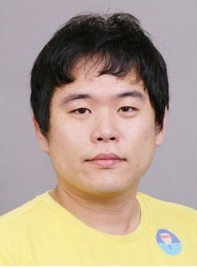

# 네이버 번역이 구글 못따라가는 이유

## 데이터·신경망 구조 조밀한 구글 `번역품질`이 타사 압도 사회·문화적 맥락 집중 학습…인공지능, 곧 인간번역 추월

* 신현규 기자
* 입력 : 2017.04.04 17:03:59   수정 : 2017.04.05 10:08:21

■ **'신경망번역' 탄생시킨 조경현 뉴욕대 교수**

최근 세종대에서 벌어진 인간 대 인공지능 번역 대결은 피조물의 패배로 끝났다. 판정 시비 논란이 있긴 했지만 번역은 아직 인간의 영역이라는 공감대가 형성된 이벤트였다. 글에 담긴 사회적 의미와 문화적 차이 등을 인공지능이 인간만큼 번역하기엔 한계가 있다는 지적이 이어졌다. 기사가 아니라 문학작품 번역에서 그 차이는 더욱 두드러졌다.

지난해 바둑에서 인공지능에 완패 당한 기억 탓인지 '인간의 승리'는 더 값져 보였다. 하지만 상대는 점점 더 강해진다.   
  
인공신경망 번역 분야에서 주목받는 연구 성과를 내고 있는 조경현 미국 뉴욕대 교수(33·사진)는 "지금은 문장 단위 번역이지만, 앞으로는 이를 보완하는 사회·문화적 맥락 단위 번역이 이뤄질 것"이라며 "현재 딥러닝 연구자들이 그런 방향의 리서치를 진행하고 있다"고 말했다. 전문 번역가처럼 사회·문화적 맥락과 작가 스타일을 살려 번역할 수 있도록 하는 연구들이 진행되고 있다는 얘기다.   
  
조 교수는 '신경망 번역(Neural Machine Translation)'이라는 학술용어를 처음으로 탄생시킨 인물이다. 공저자로 참여해 2014년 머신러닝 관련 콘퍼런스(ICLR)에서 발표한 논문 '배치작업과 번역작업을 동시에 학습시키는 신경망 번역'은 현재 대부분 번역엔진에 채택돼 있다. 조 교수가 요슈아 벤지오 몬트리올대 교수와 함께 쓴 논문이다. 벤지오 교수는 앤드루 응 전 바이두 인공지능연구소장, 얀 르쿤 뉴욕대 교수, 제프리 힌턴 토론토대 교수 등과 함께 현존 최고 딥러닝 학자 4인방으로 불리는 인공지능 대가다.   
  
조 교수는 "예를 들어 이미지를 문장과 함께 인공지능 신경망에 포함해 번역시키면 결과물 품질이 더욱 높아질 수 있다"며 "이미지뿐만 아니라 다양한 보조 정보를 인공지능 신경망에 포함시켜 번역 품질을 향상시킬 수 있다"고 했다. 그의 설명대로라면 웃는 이모티콘을 사용하면서 '죽을래?'라고 쓴 문장을 번역하면 'Wanna die?' 대신 'Are you messing with me?' 정도로 번역될 수 있을 것이다. 웃고 있는 이모티콘을 통해 살의를 갖고 협박하는 말이 아니라 장난치는 말이라는 것을 알아채는 것이다. 장기적으로는 저자의 국적, 성별, 스타일까지 반영한 인공신경망 번역이 나올 수도 있다.   
  
인공신경망 번역은 문장 하나를 그 의미와 구조에 따라 가상공간 점에 위치시킨 후 해당 점을 번역해 문장으로 풀어내는 기술이다. 변수들로 구성된 벡터 공간에 문장을 배치하기 때문에 그 공간에 이미지, 이모티콘, 저자 특성 등을 변수로 추가하면 이 같은 사회·문화적 맥락을 가미한 번역이 가능해진다. 이전 통계기반 번역에서는 어구 하나하나를 대입시켜 번역했기 때문에 변수를 추가하기 힘든 구조였다.조 교수는 "기존 통계기반 번역기술에서는 이런 게 불가능했지만, 인공지능 신경망 번역이 나오면서 가능성이 새롭게 열렸다"고 했다.   
  
그렇다면 왜 구글, 바이두, 네이버, 마이크로소프트 등이 내놓은 신경망 번역 엔진들 품질이 다른 걸까. 조 교수는 "사실 모든 회사의 기반기술 자체는 같다"며 "다만 개별 회사가 갖고 있는 데이터 양과 질, 신경망 모델의 크기, 학습 시간, 어떤 특성화된 알고리즘을 사용했느냐에 따라 차이가 난다"고 말했다. 그는 "동물 중에서 고등동물 뇌에 훨씬 많은 신경세포가 연결돼 있고, 그 연결이 많을수록 지능이 높다"며 "인공신경망 번역도 마찬가지"라고 말했다. 훨씬 범위가 넓고 조밀한 신경망을 구성하는 설계 구조가 번역 품질의 차이점이라는 것이다.   
  
[신현규 기자]  
[ⓒ 매일경제 & mk.co.kr, 무단전재 및 재배포 금지]

[#인공지능](http://news.mk.co.kr/v4/list_kword.php?kword=%C0%CE%B0%F8%C1%F6%B4%C9)[#신경망](http://news.mk.co.kr/v4/list_kword.php?kword=%BD%C5%B0%E6%B8%C1)

공유하기

게시글 관리

**백규서옥\_Blog ver.**

[저작자표시 비영리 변경금지
(새창열림)](https://creativecommons.org/licenses/by-nc-nd/4.0/deed.ko)