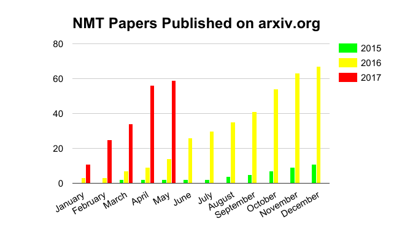

# Neural Machine Translation Research Accelerates Dramatically

by [Eden Estopace](https://slator.com/author/edenestopace/) on May 12, 2017

2 days ago

Share

Academia continues to ramp up its research into neural machine translation (NMT). Five months into the year, the number of papers published in the open-access science archive, arXiv.org, nearly equals the research output for the entire year 2016. The spike confirms a trend Slator reported in late 2016, when we pointed out [how NMT steamrolls SMT](https://slator.com/academia/research-neural-steamrolls-statistical-machine-translation/).

As of May 7, 2017, the Cornell University-run arXiv.org had a total of 137 papers in its repository, which had NMT either in their titles or abstracts. From only seven documents published in 2014, output went up to 11 in 2015. But the breakthrough year was 2016, with research output hitting 67 contributions.

Advertisement

NMT, or an approach to machine translation based on neural networks, is seen as the next evolution after phrase-based statistical machine translation (SMT) and the previous rules-based approach.

While many studies and comparative evaluations have pointed to NMT’s advantages in achieving more fluent translations, the technology is still in its nascent stage and interesting developments in the research space continue to unfold.

### Most Prolific

At press time, NMT papers submitted in 2017 were authored by 173 researchers from across the world, majority of them (63 researchers) being affiliated with universities and research institutes in the US.

The most prolific contributor is Kyunghyun Cho, Assistant Professor at the Department of Computer Science, Courant Institute of Mathematical Sciences Center for Data Science, New York University. Cho logged 14 citations last year.

He has, so far, co-authored three papers this year —  “[Nematus: a Toolkit for Neural Machine Translation](https://arxiv.org/abs/1703.04357),” “[Learning to Parse and Translate Improves Neural Machine Translation](https://arxiv.org/abs/1702.03525),” and “[Trainable Greedy Decoding for Neural Machine Translation](https://arxiv.org/abs/1702.02429)” — in collaboration with researchers from the University of Edinburgh, Heidelberg University, and the University of Zurich in Europe; the University of Tokyo and the University of Hong Kong in Asia; and the Middle East Technical University in Turkey.

Aside from Cho, 62 other researchers with interest in NMT have published their work on arXiv under the auspices of eight American universities: UC Berkeley, Carnegie Mellon, NYU, MIT Computer Science and Artificial Intelligence Laboratory, Cambridge, Stanford, Georgia Institute of Technology Atlanta, Johns Hopkins University, and Harvard.

Sixty-one researchers from Europe have also substantially contributed to the collection, with authors from the UK (18), Germany (11), Ireland (13), and the Netherlands (7) submitting the most papers.

There were also 58 NMT academic papers from Asia, authored by researchers mostly from China, Hong Kong and Taiwan (31), Japan (22), South Korea (3), and Singapore (2).

### Tech Firms in the Mix

Research teams from US tech giants such as Facebook Research, Google Brain, IBM Watson, NVIDIA (on whose GPU chips NMT runs), and translation technology pioneer SYSTRAN have also been increasingly contributing their research to arXiv. 

A paper from a team of researchers from Google Brain, for example, offers insights on building and [extending NMT architectures](https://arxiv.org/abs/1703.03906) and includes an open-source NMT framework to experiment with results.

Researchers from Harvard and SYSTRAN [introduced](https://arxiv.org/abs/1701.02810) an open-source NMT toolkit — [OpenMT](https://slator.com/academia/4000-lines-code-harvard-hopes-will-change-translation/) — which provides a library for training and deploying neural machine translation models. They said the toolkit will be further developed “to maintain strong MT results at the research frontier” and provide a stable framework for production use.

NMT, where math meets language

Facebook, which announced on May 9, 2017 that it is [outsourcing its NMT model](https://slator.com/technology/facebook-open-source-neural-machine-translation-zuckerberg-announces/), has one other paper on arXiv. Entitled “[Learning Joint Multilingual Sentence Representations with Neural Machine Translation](https://arxiv.org/abs/1704.04154),” it is authored by two members of its AI research team in collaboration with two other researchers from the Informatics Institute – University of Amsterdam and the Middle East Technical University.  
  
In Asia, China’s Internet provider, Tencent, has two contributions this year. One is from its AI Lab in Shenzhen (“[Modeling Source Syntax for Neural Machine Translation](https://arxiv.org/abs/1705.01020)”); the other, from its Mobile Internet Group (“[Deep Neural Machine Translation with Linear Associative Unit](https://arxiv.org/abs/1705.00861)”), done in collaboration with researchers from Soochow University, Chinese Academy of Sciences, and Dublin University.

The Beijing-based Microsoft Research Asia has also started to contribute its own studies on NMT this year. Two papers (“[Adversarial Neural Machine Translation](https://arxiv.org/abs/1704.06933)” and “[MAT: A Multimodal Attentive Translator for Image Captioning](https://arxiv.org/abs/1702.05658)”) were uploaded just this month.

The company’s own researchers have collaborated with other scientists from the University of Science and Technology of China, Sun Yat-sen University (Taiwan), Guangdong Key Laboratory of Information Security Technology, Tsinghua University, UESTC, and Johns Hopkins University.

### Surge Will Last

As early as February 2016, an informal survey conducted by Cho indicated that the NMT research boom would have legs.

In a [blog post](http://www.kyunghyuncho.me/home/blog/toarxivornottoarxiv) dated February 13, 2016, Cho said he conducted the informal (he admits highly biased) poll mainly to determine researchers’ opinion about contributing to arXiv. Rather than being a peer-reviewed journal or online platform, arXiv is an automated online distribution system for research papers (e-prints).

“In total, 203 people participated, and they were either machine learning or natural language processing researchers. Among them, 64.5% said their major area of research is machine learning, and the rest natural language processing,” Cho wrote.

It is a big number of scholars and scientists who could feed the NMT research funnel for years — whether, as Cho calls it, they choose “to arXiv” or “not to arXiv” their works right away.

Tags 

* [arXiv](https://slator.com/tag/arxiv/)
* [Google Brain](https://slator.com/tag/google-brain/)
* [Kyunghyun Cho](https://slator.com/tag/kyunghyun-cho/)
* [Microsoft Research Asia](https://slator.com/tag/microsoft-research-asia/)
* [neural machine translation](https://slator.com/tag/neural-machine-translation/)
* [Systran](https://slator.com/tag/systran/)
* [Tencent](https://slator.com/tag/tencent/)

by [Eden Estopace](https://slator.com/author/edenestopace/) on May 12, 2017

An IT journalist for the past 17 years, Eden has written for the top publications in the Philippines and Asia, covering consumer and enterprise IT. Offline, her interests are creative writing, photography, and film.

공유하기

게시글 관리

**백규서옥\_Blog ver.**

[저작자표시 비영리 변경금지
(새창열림)](https://creativecommons.org/licenses/by-nc-nd/4.0/deed.ko)