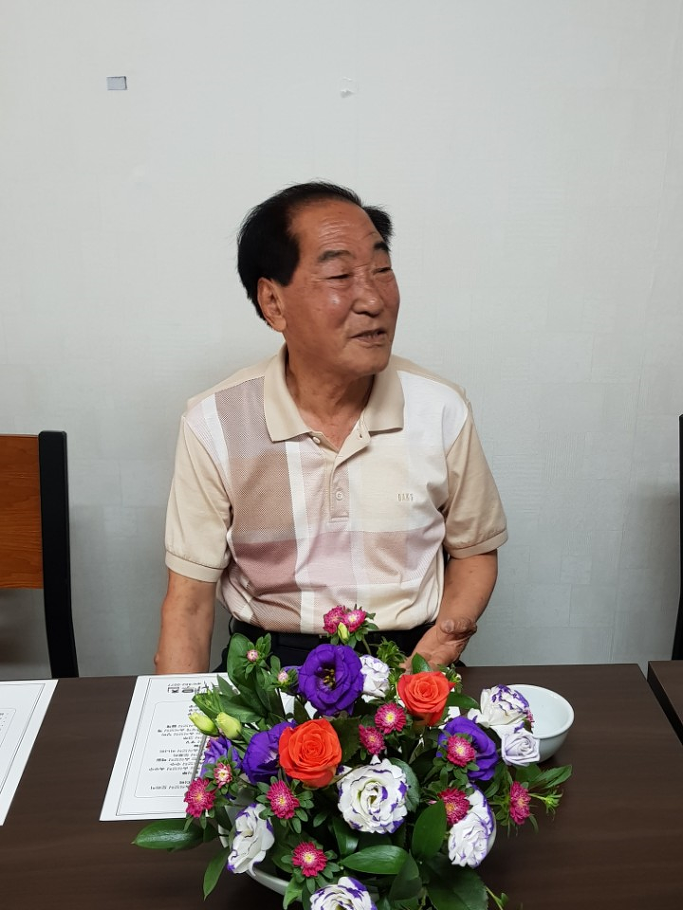
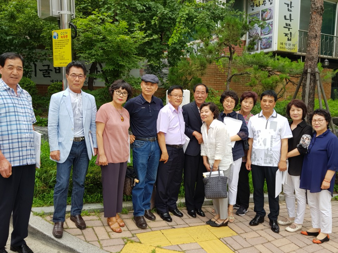
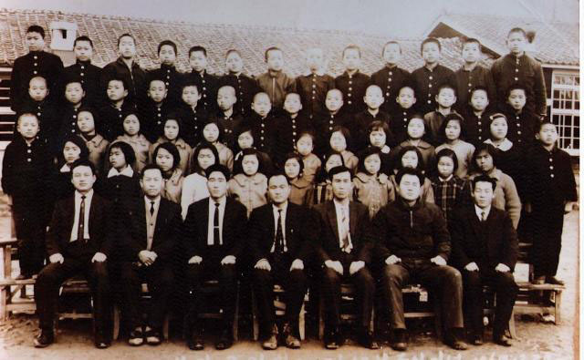
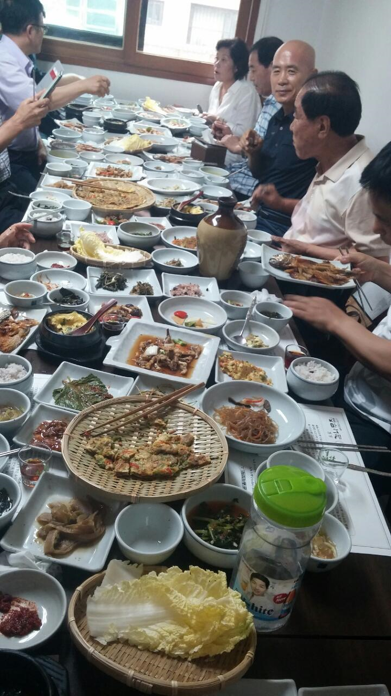
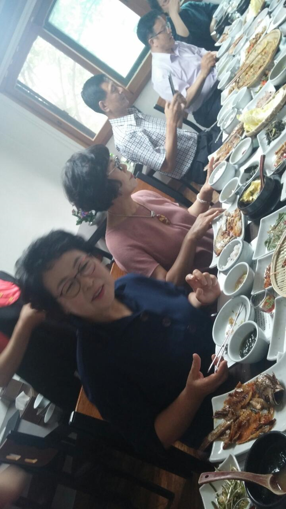
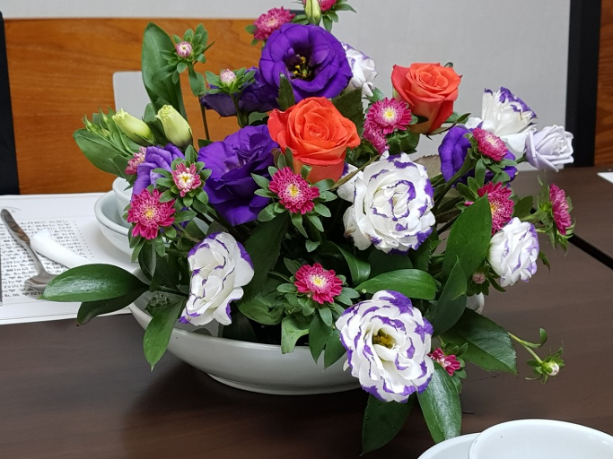

은사님과 번개를!

 

<맨 앞줄 왼쪽에서 세번 째 분이 이신평 선생님>

 

은사님(이신평 선생님)을 근 반세기만에 만나 뵈었다. 벌써 팔순. 그러나 몸은 꼿꼿하셨고, 눈은 밝으셨으며, 말씀은 더 다듬어지신 모습이셨다. 늙어가는 제자들을 앞에 두신 은사님은 만감이 교차하셨을까. 연신 잔을 기울이셨다.

 

하교 종이 땡땡땡 울리면, 우리는 선생님을 따라 갈머리, 민어도로 낚시하러 나가곤 했다. 낚시와 바둑을 좋아하셨던 선생님. 우리를 늘 친구처럼 대해주신 20대 후반의 청춘이셨다. 고기는 잘 잡히지 않아 어깨에 멘 다람치는 늘 텅 비어 있었지만, 그래도 마음만은 풍요롭던 어린 시절이었다. 선생님 곁을 떠난 것은 우리의 10대 초•중반이었다. 중학교 진학도 쉽지 않았고 돈벌이도 마땅치 않았던 베이비 부머들의 현실을, 입만 열면 ‘헬조선’을 외치는 ‘포스트 베이비 부머들’은 알 턱이 없으리라. 그 추운 겨울날 ‘새끼 망둥이들 어미 곁 떠나듯’ 뿔뿔이 흩어진 우리는 모진 세파를 온몸으로 견뎌야 했다. 가진 것 없이, 기댈 언덕도 없이, 물결에 밀리고 발길에 차이면서 오늘까지 견뎌 온 것 아닌가. 말 그대로 ‘어찌어찌 살다보니’ 여기까지 오게 되었다. 그나마 입 벌리고 달려드는 아귀나 범치, 가물치 없는 이 웅덩이에까지 성체가 된 망둥이들이 모여든 것이다.

 

친구들은 거울이다. 늙어가는 얼굴들을 서로 바라보며 제 모습을 깨달으니, 거울이다. 거기에 ‘새끼 망둥이 시절’의 선생님까지 모셔다 놓았으니, 큰 거울 작은 거울들이 서로 반사하여 ‘번개의 공간’이 번쩍이는 ‘거울 방’으로 바뀐 건 당연한 일 아닌가. 큰 거울인 선생님의 모습에서 조만간 도래할 우리의 미래를 훔쳐보고, 작은 거울인 친구들의 얼굴에서 과거와 현재로의 시간여행을 위해 타고 갈 타임머신을 발견한다. 그래, 멋진 타임머신이었다. 우리가 언제 참하게 앉아 대가들의 역사책을 읽을 기회가, 여유가 있었던가. 적어도 6, 70년대부터는 우리 자체가 역사책이다. 그 이전의 역사책은 우리 부모였고, 부모 이전의 역사책은 우리의 조부모였으며, 그 이전의 역사도 마찬가지였다. 그러니 우리는 역사를 DNA로 물려받았을 뿐, 허접한 책 나부랭이는 별 의미가 없었다. 진짜 역사는 몸과 마음에 새겨지는 ‘마음의 역사’다. 반세기도 안 되어 두서너 번의 산업혁명, 정치혁명을 경험한 우리다. 그래서 한국의 베이비부머들은 화석화된 현대사의 교과서들이다. 가벼운 입과 머리로 역사를 농(弄)하고, 근대를 논(論)하는 얼치기 사학도들을 만날 때마다 허무감을 느끼는 것도 그 때문이다. 그 가벼운 논리를 끌어다 정치를 하겠노라 편을 갈라 싸우는 이 땅의 ‘정치 모리배’들이 불쌍하고 가소로울 뿐이다.

 

막잔을 비우고 헤어지지만, 우리의 시간은 기약할 수 없다. 오늘의 우리가 내일의 우리는 아니고, 지금의 이 시간과 내일의 저 시간이 같을 수 없기 때문이다. 번쩍번쩍 튀어 달아나는 광음(光陰)의 질주 속에서 ‘나의 정체성(正體性)’을 어떻게 유지할 수 있단 말인가. 그래서 ‘담에 한 번 만나자’라는 말보다 ‘그래 바로 지금 만나자’가 더 진실하고 정직한 말이다. 그래서 인생의 허무를 깨달은 사람들은 오늘도 저잣거리의 주막에서 막걸리 잔을 기울이며 이렇게 외치는 것이다. “자, 우리의 건강과 행복을 위하여! 위하여! 위하여!”

 

그렇게 날은 어두워졌고, 선생님은 열차를 놓치실 세라 종종걸음으로 달리셨으며, 헤어지기 아쉬운 병철이와 영도는 ‘9월의 번개’를 두 번 세 번 확인 또 확인했다.^^

<2017. 7. 21.>

공유하기

게시글 관리

**백규서옥\_Blog ver.**

[저작자표시 비영리 변경금지
(새창열림)](https://creativecommons.org/licenses/by-nc-nd/4.0/deed.ko)