연해주에 찍힌 고려인들의 발자국

-고려인들의 한이 서린 산하를 지나며.../1

 

                                                                                         조규익                               

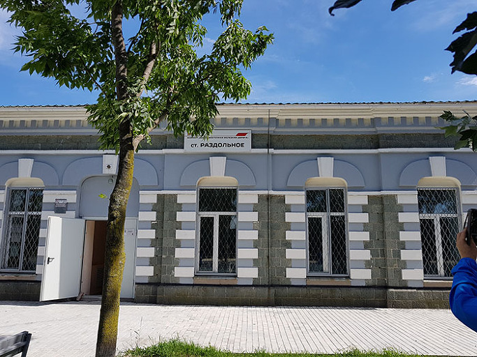  
라즈돌노에 역사(정면)

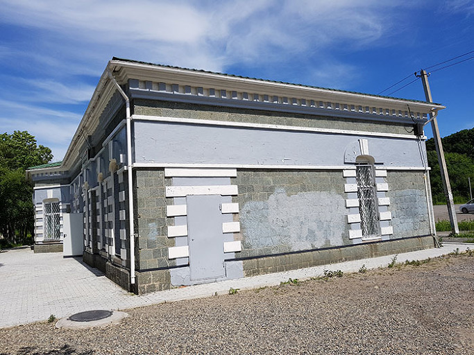  
라즈돌노에 역사(측면)

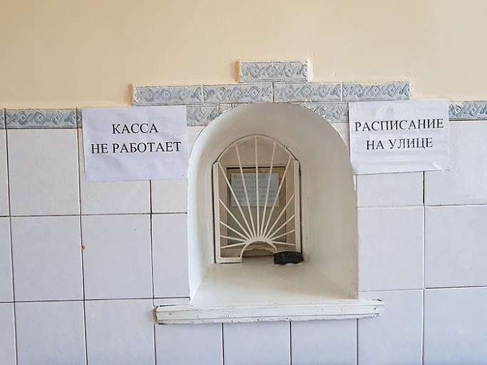  
라즈돌노에 역사 내부(매표구)

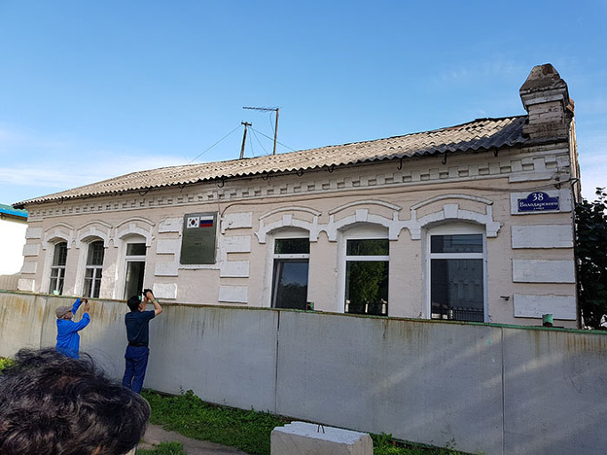  
최재형 선생이 마지막 1년간 거주했던 집

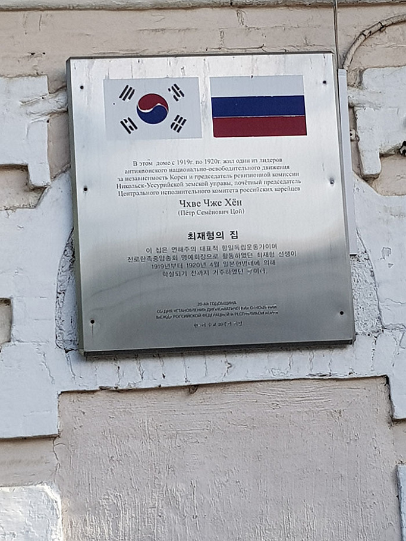  
표지판

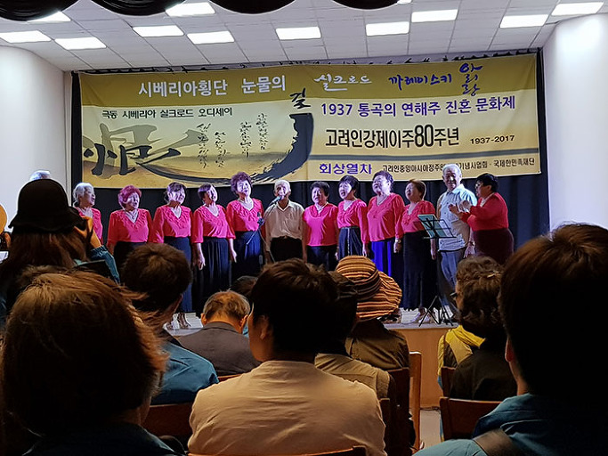  
고려인문화센터에서의 진혼문화제

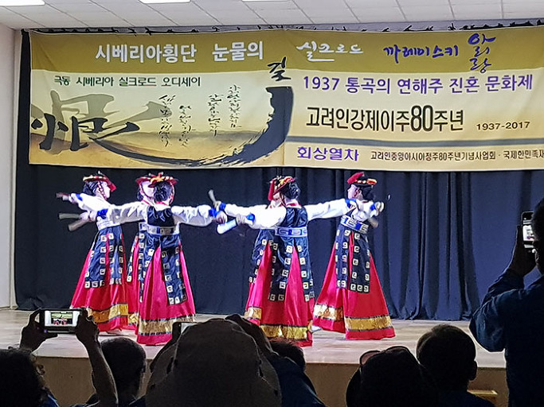  
고려인문화센터에서의 진혼문화제

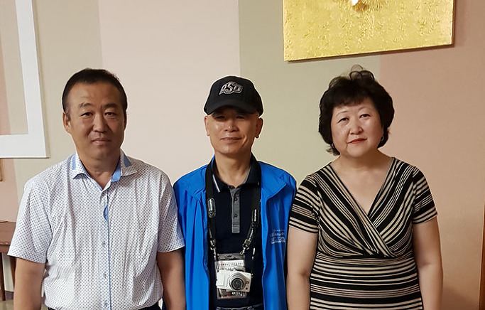  
아리랑가무단 단장 발레리아(오른쪽), 발렌찐

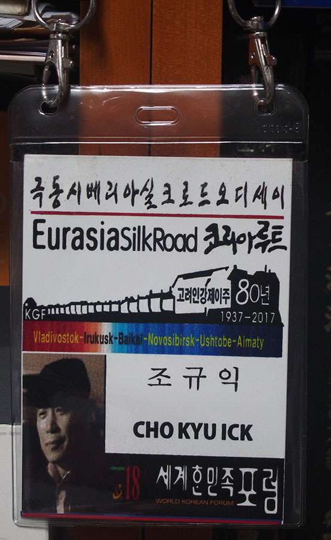  
오딧세이 참가 명찰

 

고려인들 아니 ‘고려인들의 문학’을 학문적 대상으로 만난 지 10년. 중국의 개방과 동시에 조선족과 그들의 문학을 만났고, 미국에 체류하는 기회에 재미한인들과 그들의 문학을 만났으며, 정말 우연한 기회에 구소련의 고려인들과 그들의 문학을 만났다. 세상사 대부분은 필연을 내포한 우연의 소산이라고 하는데, 내가 고려인들과 그들의 문학을 만난 것도 어떤 필연적인 힘의 시킴이라 할 수 있을까. 고대로부터 중세를 거쳐 근대이전까지를 주로 ‘더듬는’ 고전문학도로 살아오면서 잘못된 역사의 파생물이나 식민주의의 희생자들로만 생각하던 재외동포들을 만나면서 내 시야는 급격하게 넓어지기 시작했다. 왜 제 나라 땅에서 살지 못하고 뿌리 뽑힌 잡초 신세로 황량한 세상을 떠돌아 다녀야 했는지, 비록 황무지라 해도 뿌리 내리기가 어찌 그리도 어려웠으며, 이제 할아버지의 나라가 제법 먹고 살만하게 되었음에도 왜 그들의 디아스포라(diaspora)는 끝날 줄 모르는지 등등. 그간 품고 있던 여러 문제들을 풀어볼 기회를 잡게 된 것이다. 1937년 9월부터 12월까지 자행된 고려인 강제이주 80주년을 맞아 ‘고려인강제이주80주년기념사업회와 국제한민족재단’이 마련한 ‘고려인 강제이주 80주년 회상열차’에 동승하게 된 것이다. 고려인에 대하여 관심을 갖고 있는 각계각층의 인사들이 주축을 이루고, 현지 고려인들 몇 분도 합류하게 되었다.

 

\*\*\*

 

2017년 7월 23일 아침 7시. 인천공항 출국장에는 푸른 색 유니폼을 입은 80여명의 ‘각계각층 희망 대장정’ 대원들이 상기된 얼굴로 모여 있었다. 대한항공 KE981편으로 블라디보스톡 공항에 도착한 것은 오후 2시경. 7월 하순의 뜨거운 태양이 러시아 동진의 상징적 공간인 연해주의 주도 블라디보스톡을 달구고 있었다. ‘동방을 지배하라’는 뜻을 지닌, 태평양 쪽 유일의 부동항(不凍港) 블라디보스톡은 식민시대 고려인들의 집거지 ‘신한촌’을 품고 있었다. 악랄한 식민통치를 피해 몰려든 공간. 그 분들이 이곳에서 독립의 의지를 불태운 것은 당연한 귀결이었다. 자신들의 고국, 자신들의 고향에서 가장 가까우면서도 비교적 안전한 이곳에서 일제와 싸울 수 있다고 믿었던 그들이었다.

 블라디보스톡에 여장을 풀기 전 우리는 먼저 연해주 독립운동의 중심이자 고려인들이 가장 많이 거주하는 공간 우수리스크로 달렸다. 항일운동의 별 최재형 선생의 유택이 남아 있고, 고려인문화센터가 살아 움직이는 곳이 우수리스크였다. 가는 길에 강제이주 첫 출발역인 라즈돌노에(Razdol’noe)역을 잠시 보기로 했다. 블라디보스톡역과 함께 수만의 고려인들이 짐짝처럼 열차에 실린 곳. 지금은 역사(驛舍)만 덩그러니 남은 그곳엔 겁에 질린 고려인들의 한숨과 비명의 흔적만 남아 있었다. 빙 둘러 수이푼(綏芬河, Suifun)강의 지류가 흐르고, 그 앞으로 끝이 보이지 않는 철로가 놓여 있었으며, 그 철로를 짓누르며 엄청난 길이의 열차들이 오가고 있었다. 그러나 역사(驛舍)는 텅 비어 있었고, 매표소도 굳게 닫혀 그 날의 일을 말해주려 하지 않았다. 1869년 4월, 처음으로 이주민 10가구가 정착하면서 이룩한 육성촌(六城村). 이제 살만하게 되었다고 안도하던 이들이 날 벼락같은 명령서 한 장에 마을 앞의 역사로 끌려나온 것이다.  1937년

9월 하순에 시작되어 12월까지 계속된 고려인 강제이주. 유대인에 대한 히틀러의 홀로코스트(holocaust)를 떠올리게 하는 정치적 폭행이자 인류사의 기록적인 만행이었다. '고려인들이 일본 제국주의에 부역하여 간첩행위를 벌일 가능성이 크다'는 점이 그러한 만행의 명분이었지만, 이면적으로는 일본에 대한 스탈린의 공포감과 함께 자신들과 현격한 차이를 보이는 외모의 고려인에 대한 복합심리가 작용한 정치적 편견의 소산이었다. 탈식민 시대에 지향해야 할 노선을 식민시대의 유적으로부터 확인하고자 한 것이 함께 대장정에 나선 지식인들의 일치된 인식이었다. 역사 근처에 김정일의 생가가 있다거나, 1928년 7월 소련으로 망명한 포석 조명희(趙明熙, 1894~1938)가 교사로 활동하던 학교가 남아 있다는 등의 말도 들려 왔지만, 이번엔 중앙아시아로 끌려간 무명의 고려인들만 생각하기로 했다. 

 라즈돌노에 역으로부터 한참을 달려 우수리스크에 도착했고, 항일투사 최재형 선생이 1919년부터 1920년 4월까지 거주하던 주택에 들렀다. 몇 년 전 왔을 때와 달리, 리모델링 공사 중인 건물 자체는 물론 앞 뒤 진입로와 하수도 등 대대적인 토목공사가 진행 중이었다. 일제에 의해 원통하게 죽음을 당한 최재형 선생의 혼이 편안하게 머물 만큼 제대로 집을 다듬고 있는지 의심될 정도로 장대 같은 러시아 인부들의 손놀림이 미덥지 않았다. 무엇보다 최재형 선생의 뜻이 살아날 수 있을지 의문이어서 걱정스러웠다. 공사 중인 집안으로 들어서자 특이한 페치카를 비롯 넓지 않은 방들이 당시의 삶을 증언하듯 우리를 맞았다. 성공한 사업가로서 이 지역 독립운동의 대부였던 선생의 유택은 거사 지역 하얼빈으로 떠나기 전 안중근 의사가 머물던 공간이기도 했다. 내년쯤이면 우선 선생의 유품과 자료들을 품은 의미있는 공간으로 재탄생될 것으로 보였다. 우리나라 정부에서 신경을 쓴 흔적은 외벽에 부착된 팻말("최재형의 집")이 유일했다. 과연 이 집이 외국인의 손에 넘어가지 않고 독립운동가의 혼을 보존하고 후세들에게 우리의 민족혼을 깨우치는 표본으로 오롯이 남을 것인가. 

 

서둘러 그곳을 떠난 우리가 도착한 곳은 ‘우수리스크 고려인 문화센터’. 최재형 선생의 유택을 떠나 문화센터에 도착하기까지 버스로 채 5분이 걸리지 않았다.  큰 공연장과 유물 전시실 등이 새로 생겨 전체적으로 짜임새와 규모를 갖춘 것은 몇 년 전과 달라진 점이었다. 그곳에 '고려인을 위한 진혼'의 무대가 마련되어 있었다. 진혼제는 여러 예술장르들로 짜인 의식이었다. 김 발레리아 부부가 이끄는 아리랑가무단이 무대예술을 통해 러시아에 뿌리 내린 민족미학을 보여주었다. 꽃 같은 소녀들의 노래와 춤, 나이 지긋하신 어른들의 흘러간 노래들이 우리 시대 민족문화운동의 새로운 패러다임을 보여주었다. 고려인들이 이 사회에서 식민시대 타자(他者)의 입장을 아직은 벗어나지 못하고 있지만, 재현된 과거의 예술은 조만간 그런 굴레를 극복하게 하는 신비의 명약일 수도 있으리라. 고려인 남녀 노인들의 합창과 젊은 아리랑 가무단의 춤과 노래는 풍성한 내용을 갖추고 있었다. 우리네 전통 춤사위가 북국의 빠른 율동 속에서도 소멸되지 않고 끈질기게 유지되는 모습이 눈물겨웠다. 아리랑 가무단의 발레리아 단장과 그 남편 발렌찐, 그리고 그들의 예쁜 딸이자 리드싱어인 악사나가 여전한 모습으로 고려인 공동체의 문화를 지탱해나가는 모습 또한 아름다웠다. 독립운동에 나선 의병들의 활동 공간이었고, 후에 임시정부로 변신한 대한국민회의 건물이 살아 있으며, 헤이그 만국평화회의의 대표로 파견되었던 독립운동가 이상설의 유허(遺墟)가 있는 곳, 우수리스크. 전통예술 같은 소프트 문화를 통해 민족 정체성의 유지가 가능할 수도 있음을 느끼게 해준 공간이었다. 

\*\*\*

 

우수리스크로부터 2시간 가까이 걸려 블라디보스톡의 현대호텔에 도착했다. 갓 수인사를 끝낸 룸메이트 손진홍 선생과 함께 김병학 선생의 호출에 이끌려 두 분의 블라디미르 김 선생들을 만났다. 우즈베키스탄에서 온 블라디미르 선생은 이미 10년 가까이 교분을 유지해오고 있으며, 광주의 고려인마을에서 오신 또 다른 블라디미르 선생은 초면이었으나, 모두 고려인 디아스포라의 표본으로 삼을만한 인물들이었다. 그들은 열차 여행 내내 한국인 참가자들에게 고려인들의 삶과 역사를 들려주기로 되어 있었다. 우즈벡 블라디미르 선생의 톤 높은 입담에는 자신의 부모가 겪은 강제이주의 참상을 간접적으로나마 체험하게 된 흥분이 가득 배어 있었다. 이렇게 대장정의 첫날 밤, 원동의 중심 블라디보스톡에서 우리는 보드카 한 잔으로 결의를 다지게 되었던 것이다.

7월 24일, 시베리아 횡단열차에 오르기 전 강제 이주된 고려인들의 자취를 찾는 일이 급했다. 최초의 재외동포 집거지이자 애국계몽운동과 독립운동의 중심이었던 신한촌은 우거진 나무숲과 잡초, 풍상에 낡아가는 러시아인들의 나지막한 아파트들로 휩싸여 물리적 자취가 묘연했다. 1920년 신한촌 사건과 4월 참변으로 대량학살을 당한 고려인들의 숨결이 살아 있는 곳이었지만, 우뚝 솟은 세 개의 돌기둥과 작은 돌들로 구성된 기념비만이 그곳의 역사성을 간신히 보여주고 있었다. 누군가는 큰 돌기둥들이 하늘•땅•바람 혹은 남한•북한•해외동포를 상징한다 하나, 해석은 자유이리라. 무엇보다 아무것도 쓰지 않고 그리지 않은 비석이 특이하고 의미심장했다. 졸지에 수만리 타국으로 쫓겨난 고려인들의 심정을 문장으로 쓴들 제대로 쓸 수 있을 것이며, 그림으로 그린들 제대로 그려낼 수 있을 것인가. 차라리 흰 돌 그대로 놓아두는 것이 나으리라. 그것만이 그 시절 고려인들을 제대로 대접하는 일이 될 수 있으리라.

관리들의 착취로 농민반란이 빈발하고, 살기 어려워진 백성들이 유리걸식하며 떠돌던 조선 왕조 말기, 한반도의 지근 블라디보스톡에 한인들이 들어오면서 신한촌은 형성되기 시작했다. 한인들의 이주가 시작된 1863년부터였다. 그로부터 삶을 이어가던 고려인들이 전대미문의 시련에 말려든 것이 1937년 스탈린의 강제이주정책이었다. 강제이주에 따라 이곳의 신한촌도 고려인들의 자취도 사라지게 된 것이다. 그러다가 소련이 붕괴되고 난 1999년 8월, 3•1 독립선언 80주년을 맞아 이 기념비는 건립되었다.

 

기념비로부터 샛길을 따라 내려가니, 러시아인들의 아파트가 나타났고, 그로부터 바다 쪽으로 이어진 경사면에서는 옛 주택들이 막 철거되고 있었다. 때마침 고려인 거주 지역의 마지막 증거인 철제 도로 표지판이 젊은 인부의 손에 의해 떨어져 나가는 순간이었다. ‘서울 거리’라는 선명한 글자들이 우리의 가슴을 뛰게 했다. 모르는 척 기다리다가, 쓰레기로 버리거든 주어올 것을. 갈 길이 바쁜 우리가 그것을 얻을 수 있을까 하여 주인에게 요청하니, 일언지하에 거절한다. 우리가 갖고 싶어 하는 것으로 미루어 ‘값나가는 물건’으로 생각한 것이었을까. 젊디젊은 주인 녀석의 약삭빠른 계산속이 얄미웠다. 나동그라진 표지판과 함께 그 공간에서 이루어졌을 우리 민족의 역사는 이제 송두리째 사라져 버린 셈이었다. 그 일로 인해 강제이주 고려인들의 고통을 추체험하겠노라 나선 우리의 노정 또한 알량한 역사지식이나 선입견을 모두 버린 상태에서 시작하는 것이 좋겠다는 내 나름의 결론에 도달하게 되었다.<계속>

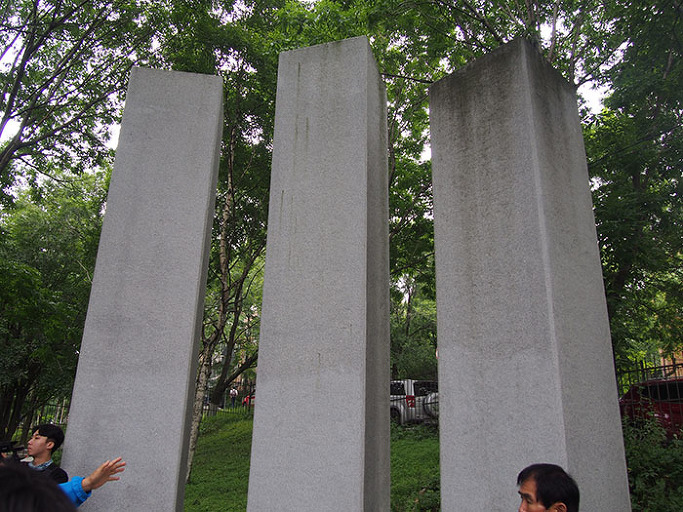  
신한촌 기념비

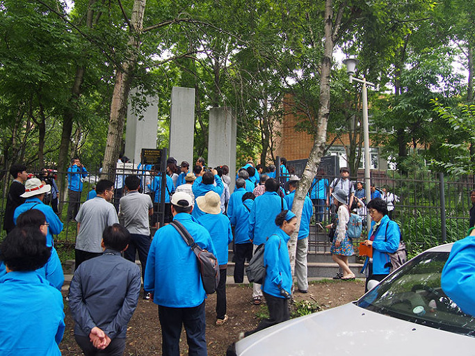  
신한촌 기념비 앞에서, 대원들

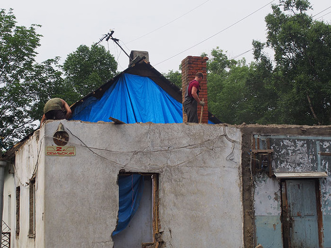  
서울의 거리 철거 광경

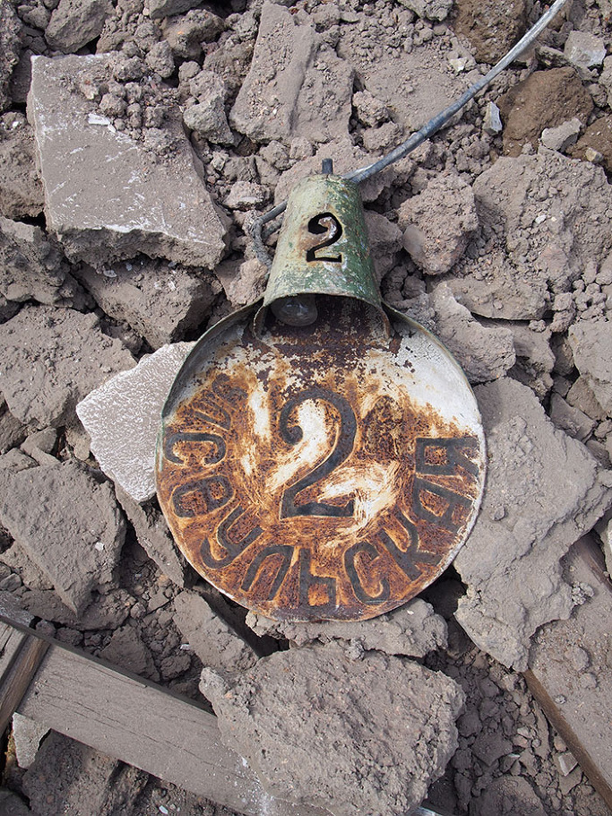  
'서울스카야(서울의 거리)' 표지판

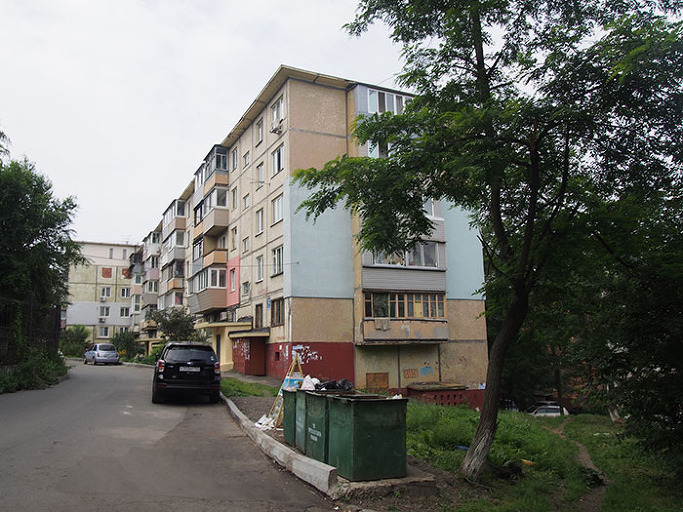  
신한촌 주변의 러시아인들의 아파트

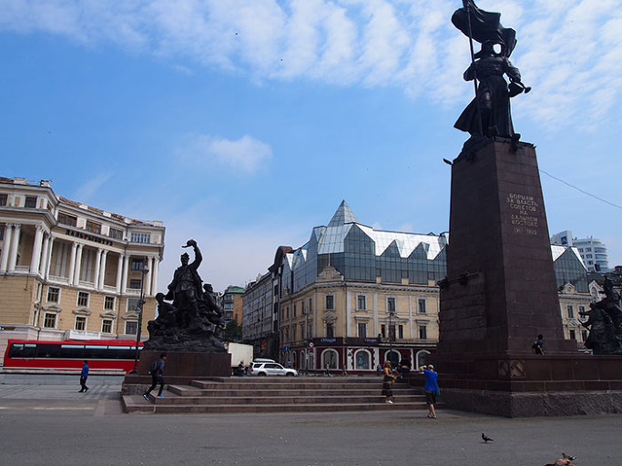  
블라디보스톡 혁명의 광장

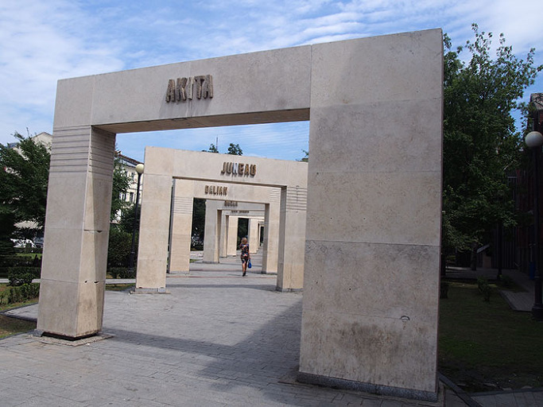  
고려인마을 기념물

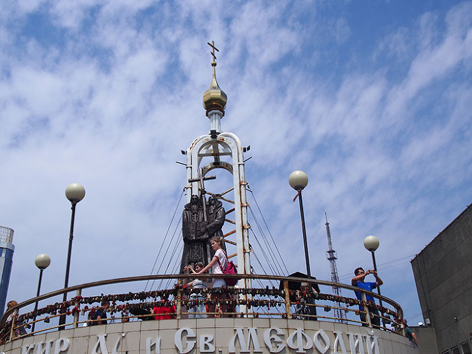  
블라디보스톡 전망대, 끼릴문자를 만든 선교사 상

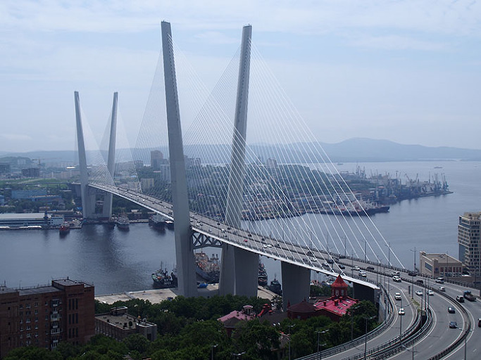  
전망대에서 바라보는 금각만

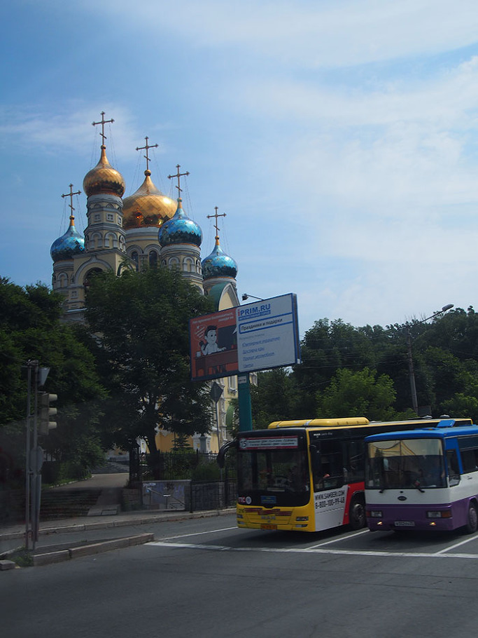  
현대호텔 근처의 러시아정교회 성당

공유하기

게시글 관리

**백규서옥\_Blog ver.**

[저작자표시 비영리 변경금지
(새창열림)](https://creativecommons.org/licenses/by-nc-nd/4.0/deed.ko)