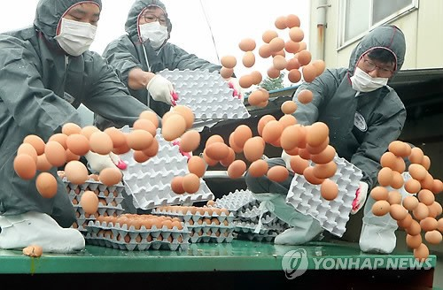
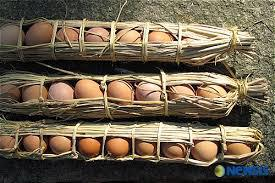

달걀의 추억

                                            조규익

  
폐기되는 달걀들(사진은 연합뉴스)

   

이름도 생소한 살충제들로 닭띠 해인 올해 달걀이 수난이다. 지난해엔 조류독감으로 닭들이 살 처분되어 달걀과 닭고기가 동시에 품귀현상을 보이더니, 올해는 달걀 자체가 문제로 떠올랐다.

작년엔 산채로 비닐봉지에 담겨 구덩이에 매몰되는 닭들을 보며 한동안 밥맛을 잃기도 했다. 그런데 올해엔 달걀이 무더기로 깨어지며 땅에 묻히고 있다. A4용지 한 장 크기의 공간에서 제대로 앉거나 눕지도 못하며 먹고 알 낳는 일만 반복하는 닭들을 보라. 달걀 생산이 시원치 않은 노계(老鷄)나 폐계(廢鷄) 등은 헐값으로 삼계탕집이나 치킨 집으로 팔려나간다니! 생명을 대하는 인간의 잔인함. 그 끝이 어디인지 몰라 몹시 불편한 나날이다.

 

5, 60년대 시골에서 자란 사람들 대부분은 닭에 대하여 비슷한 경험들을 갖고 있을 것이다. 우리 집도 제법 많은 닭들을 키웠다. 닭들은 대개 새벽에 일어나 큰 소리로 집안 식구들을 깨워놓곤 밖으로 나가 먹이활동을 했다. 오늘날의 우리는 스마트폰의 알람을 맞추고 잠이 들지만, 당시의 우리는 장닭의 우렁찬 소리에 잠자리를 박차고 일어났다.

동구 밖이 훤해지면 일단 우렁차게 소리를 지르는 게 장닭의 소임이다. 그러나 그 소리에 따라 일어나 보면 땅 위는 아직 어둠이 걷히기 전이었다. 그래도 몇 발짝 걷다보면 희끄무레 날이 밝기 시작한다. 그 때서야 뒷산의 참새들도 짹짹거리며 집 근처로 날아드는 것이었다. ‘새벽 형 인간’으로 번역되는 ‘얼리버드(early bird)’란 말이 어쩌면 닭의 부지런함에서 나온 말인지도 모르겠다.

밖에서 이슬에 젖어 꼼지락대는 벌레도 쪼아 먹고, 배추밭에 잠입하여 싱싱한 야채도 먹고, 익어가는 벼 알도 슬쩍슬쩍 훔쳐 먹는 게 그들의 오전 일과이고, 점심 무렵부터 오후 2~3시까지는 각자가 찜해 놓은 장소에서 알을 낳곤 했다. 학교에서 돌아와 점심을 먹고 나면 으레 바가지를 들고 집 주변 풀밭이나 짚 누리를 헤집고 다니며 달걀들을 수거해야 했다. 하루 수확물이 몇 개 안될 경우는 그냥 쌀독에 묻어두기도 하지만, 꽤 많은 날엔 왕겨를 담아놓은 섬에 차곡차곡 넣어 두었다.

학교에서 쓸 연필이나 도화지를 사기 위해 우리는 달걀 1~2개를 소중하게 들고 등교하기 일쑤였다. 학교 앞 ‘송방’(그 때는 학교 앞 가게를 그렇게 불렀는데, 그 이유는 지금도 모른다)에서 돈 대신 달걀을 내는데, 달걀 시세에 따라 연필이나 도화지의 수량이 달라지곤 했다. 어른들은 매달 1자 들어가는 날(1일/11일/21일/31일)과 6자 들어가는 날(6일/16일/26일)마다 면소재지에 서는 5일장으로 달걀 대여섯 줄(한 줄에 10개씩)을 꾸러미에 담아 장에 갖고 나가셨다. 달걀 값이 물건의 양과 질을 결정하는 건 아이들이나 어른들의 경우가 매 한가지였다.

 

그러니 계란을 먹는 것은 큰 호사였다. 계란은 특별한 경우에만 먹을 수 있는 특식이었다. 간혹 몸살이라도 앓고 나면 어머니는 으레 계란 하나를 깨서 내 밥 속에 숨겨주시곤 했다. 다른 식구들 눈치가 보여 미안하긴 했지만, 어머니의 사랑을 느껴서 그랬는지, 금방 몸이 좋아지곤 했다. 닭을 잡거나 달걀을 먹는 건 잘해야 1년에 한두 번. 그만큼 닭과 달걀은 귀했다. 나는 그런 세월을 살았다. 요즘 아이들 젖 떨어지자마자 치킨을 달고 사는데, 참으로 격세지감을 갖게 하는 광경일 수밖에 없다.

 

오늘도 TV 화면에는 판을 뒤집어 계란을 쏟아내고 짓이기는 광경이 생생하게 방영되고 있다. 깨지는 계란보다 계란을 쏟아내는 사람들의 무표정함이 나를 더 답답하게 한다. 어떻게 해야 닭도 행복하고 사람도 건강하게 살 수 있을까. 마트의 계란 코너를 흡사 오물 피하듯 에둘러 가는 주부들을 보노라니, 먹거리로 행복해질 날이 언제쯤일지 눈앞이 캄캄하기만 하다.

  
달걀 꾸러미(사진은 Newsis)

공유하기

게시글 관리

**백규서옥\_Blog ver.**

[저작자표시 비영리 변경금지
(새창열림)](https://creativecommons.org/licenses/by-nc-nd/4.0/deed.ko)