가도 가도 끝이 없는 나무들의 바다, 타이가(taiga)를 보았네!

   -고려인들의 한이 서린 산하를 지나며.../2 

                                                                                              

                                                                                                                조규익

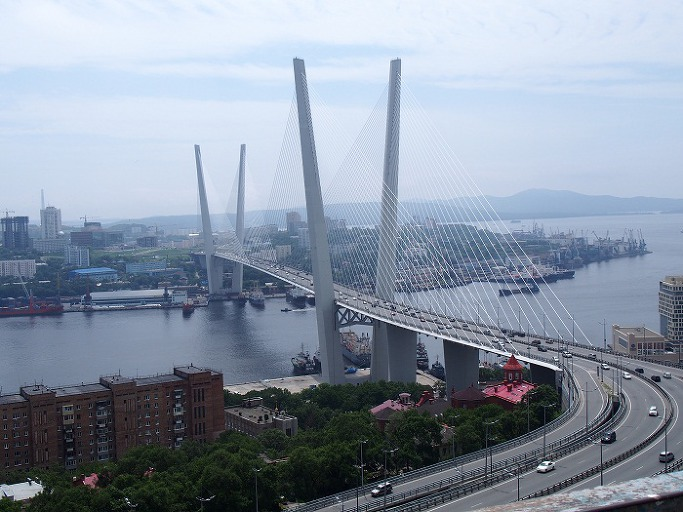  
전망대에서 내려다 본 블라디보스톡의 금각만

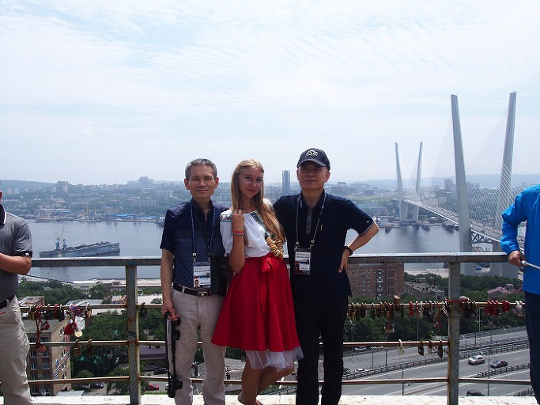  
전망대에서 러시아 모델 아가씨와

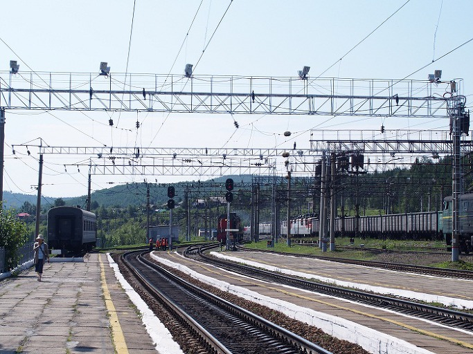  
역사에서 바라본 철길

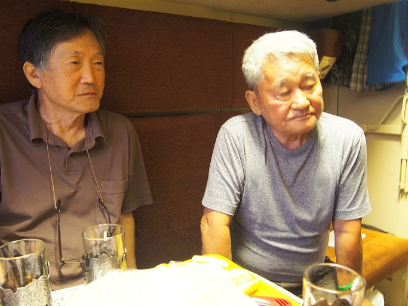  
열차 침대칸에서 조갑상, 블라디미르 김

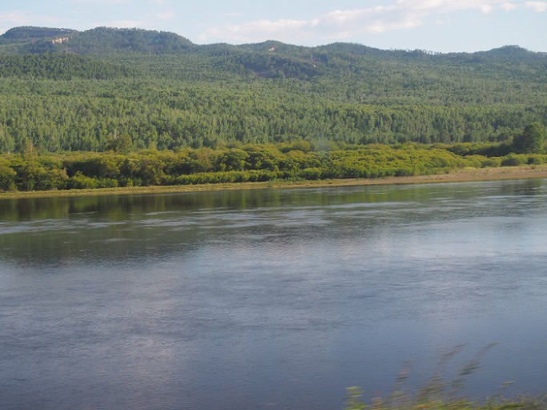  
차창으로 내다 본 시베리아 산하

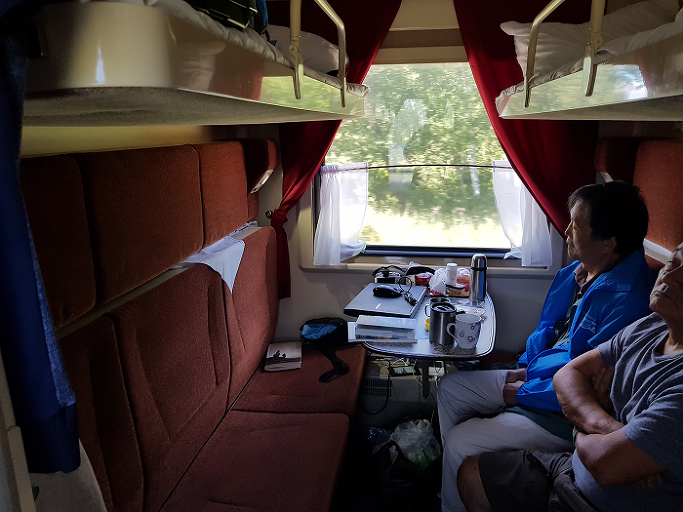  
열차 객실에서

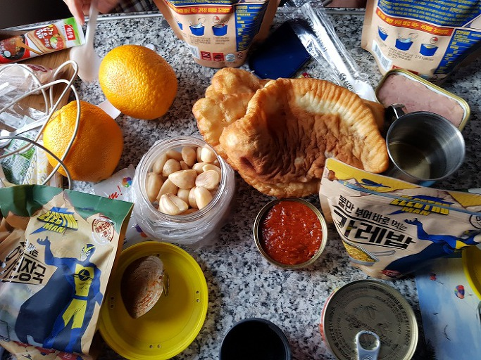  
객실에서의 첫 파티

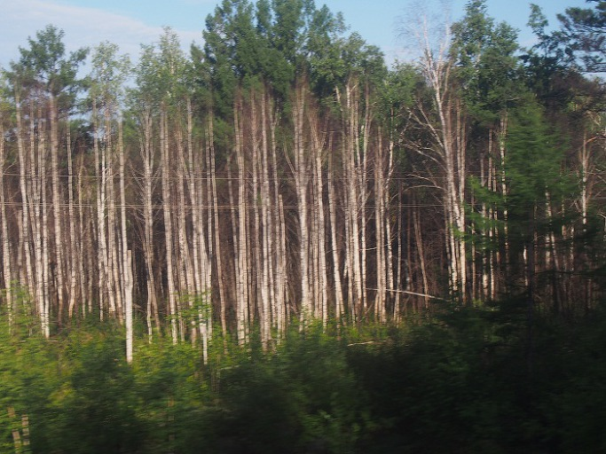  
달리는 차창으로 내다 본 시베리아의 자작나무 숲

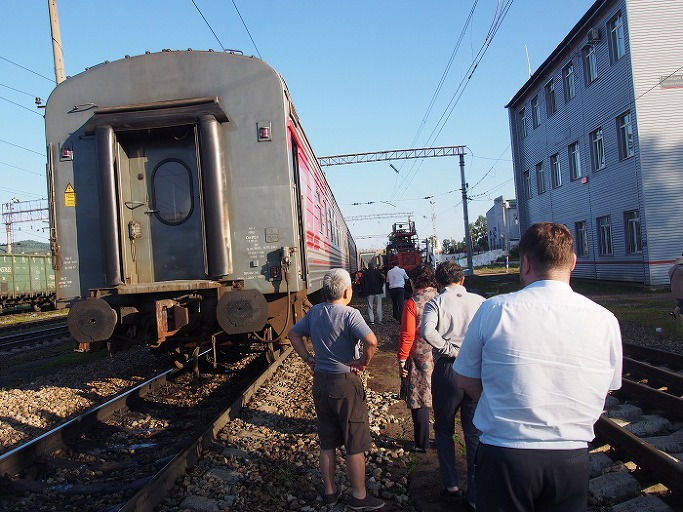  
잠시 열차에서 내려

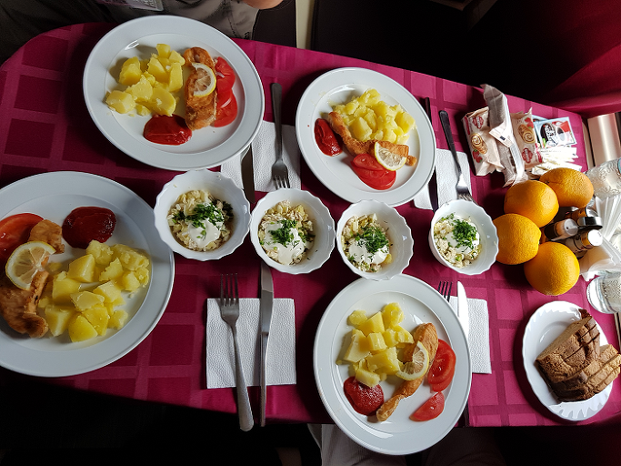  
열차 식당 칸에서의 점심상

7월 24일 저녁 7시. 블라디보스톡 역에서 출발하는 시베리아 횡단열차에 몸을 실었다. 바리바리 채워 넣은 캐리어가 몸에 겨웠다. 때마침 퍼부어대는 소나기와, 바짝 닥쳐온 열차 출발시각에 온몸은 땀과 비로 흥건해졌다. 시간만 되면 무정하게 떠나버릴 것 같은 러시아 승무원들의 무표정한 얼굴이 우리를 겁먹게 했다.

사람들의 아우성 속에 드높은 승차대를 올라서니 날씬한 아가씨 하나 조심조심 지날만한 통로가 몹시 비좁아 놀라웠고, 가까스로 찾아 들어간 4인용 객실의 협소함은 더욱 놀라웠다. 땀과 비에 흠뻑 젖은 옷이 온몸에 달라붙은 것도 모르고 가까스로 침대에 엉덩이를 붙이니, ‘뺑~!’ 소리를 내며 열차가 움직였다. 출발 뒤 30분이나 지나야 에어컨이 가동된다는 말에 땀은 더 흘렀다.

비새고 바람 통하는 화물열차에 짐짝처럼 부려졌을 80년 전 고려인들의 고통을 맛보라는 하늘의 뜻이었을까. 때마침 퍼부은 소나기의 의미를 해석하기가 쉽지 않았다. 

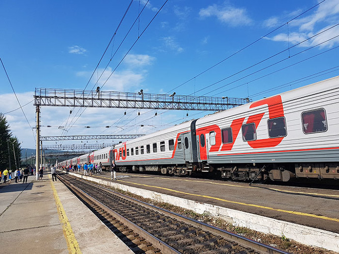  
과연 우린 뭘 회상했어야 하는 걸까?

비와 땀으로 축축해진 옷가지들을 대충 벗어 침상 밑 작은 공간에 숨기고 나니, 이 속에서 열흘을 견뎌야 할 일이 현실로 다가왔다. 누거(陋居)이긴 하나 ‘자유자재로 몸을 펼 수 있고, 옷을 벗어 빨래 바구니에 함부로 내던질 수 있으며, 땀 흐를 새 없이 씻어낼 수 있는 공간 속에 살아가는 것’이 얼마나 큰 행복인지를 비로소 깨닫게 되었다.

고행의 공간을 함께 할 ‘블라지미르 김(우즈베키스탄 거주/소설가•레닌기치 전 편집국장), 조갑상(소설가/경성대학교 명예교수), 김병학(시인/전남대 연구원)’ 등 저마다 탁월한 스토리와 히스토리를 지닌 방원(房員)들의 얼굴에도 잠시 걱정이 흘렀다. 정말로 출발 후 30분이나 되어서야 에어컨이 가동되었고, 에어컨이 가동되고 십여 분이 지나서야 축축함이 가시기 시작했다.

사전 교육에서 누차 공지된 바와 같이 무엇보다 화장실과 씻을 물, 끼니 등에 관한 두려움이 엄습해왔다. 모든 걸 ‘그러려니!’하고 넘기라는 블라디보스톡 가이드 담양 댁의 말이 잊어서는 안 될 금과옥조였다. 그렇게 생각하니 방원들이 정들기 시작했고, 오고 가는 보드카와 사마르칸트 꼬냑의 향기 속에 열차 안의 삶이 익숙해지기 시작했다.

참, 넓은 땅이다. ‘유럽과 극동’ 두 대륙에 걸치는 광활한 땅덩어리가 부러운 러시아였다. 1860년 북경조약으로 러시아가 차지하게 된 대초원 연해주. 태평양에 연하여 ‘동방의 진주’로 불려 온 천혜의 미항 블라디보스톡이 그 주도(州都)였다. 연해주를 벗어나면서 펼쳐지는 타이가(taiga)의 자작나무와 편백의 수해(樹海)가 심안(心眼)에 낀 티끌을 청소해주고, 몇 시간 만에 한 번씩 볼까말까 한 인가(人家)와 작은 마을들이 마음 한 구석에 작은 모닥불을 피워 올렸다. 이토록 드넓은 땅에 인구는 적으니, 무궁한 가능성을 지니고 있는 나라가 바로 러시아 아닌가.

블라디보스톡에서 모스크바까지 9,288km! 우리가 카자흐스탄 열차로 갈아타야 하는 노보시비르스크까지 50개에 육박하는 수의 역들을 지나야 한다. 그 가운데 규모가 비교적 크거나 일정시간 정차하는 역들은 블라디보스톡(Vladivostok), 우글로바야(Uglovaya), 우스리스크(Ussuriysk), 시비르쩨보(Sibirtsevo), 무치나야(Muchnaya), 스빠스크-다이니(Spassk-Dalny), 루지노(Ruzhino), 다이녜레젠스크(Dalnerechensk), 루쳬고르스크(Luchegorsk), 비낀(Bikin), 베아젬스카야(Vyazemskaya), 하바로프스크(Khabarovsk), 비레비잔(Birobidzhan), 오블루치에(Obluchye), 아르하라(Arkhara), 부레야(Bureya), 자빗따야(Zavitaya), 벨로고르스크(Belogorsk), 스바보드니(Svobodny), 레자나야(Ledyanaya), 슈마노브스까야(Shimanovskaya), 뜨그다(Tigda), 마다가치(Magdagachi), 스카보로지나(Skovorodino), 예로페이 파블로비치(Yerofei Pavlovich), 아마자르(Amazar), 모고차(Mogocha), 쳬르니셰브스키-자바이깔스키(Chernyshevsky-Zabaikalski), 까림스카야(Karaymskaya), 치따(Chita), 힐노크(Khilok), 페트로브스크 자바이칼스키(Petrovsk-Zabaykalsky), 울란우데(Ulan-Ude), 바이칼스크(Baykalsk), 슬루잔까(Slyudyanka), 이르쿠츠크(Irkutsk), 앙가르스크(Angarsk), 지마(Zima), 뚤른(Tulun), 니즈녜우진스크(Nizhneudinsk), 타이셰트(Tayshet), 레쇼티(Reshoti), 일란스카야(Ilanskaya), 깐스크-예니셰이스키(Kansk-Yeniseiski), 크라스노야르스크(Krasnoyarsk), 아친스크(Achinsk), 보고똘(Bogotol), 타이가(Taiga), 유르가(Yurga), 노보시비르스크(Novosibirsk) 등 일일이 기억할 수 없을 정도였는데, 무엇보다 끼릴 문자로 빽빽하게 적혀 있는 역명들의 생소함이 기를 질리게 했다.

10~20분씩 잠시 쉬어가는 역들의 앞마당엔 동네 아줌마들의 벼룩시장이 형성되어 있었다. 하루 두 끼씩이나 각자 해결해야 할 승객들에게 싱싱한 먹거리를 제공하는 아줌마들의 눈빛과 손놀림이 예사롭지 않았다. 빵과 물고기, 야채와 과일, 꿀과 화분 등 다종 다량의 음식물들이 좌판에 제법 쌓여 있기도 하고 팔에 걸고 다니는 바구니에 그들먹하게 들어 있기도 했다. 아주 가끔씩은 잠시 정차되어 있는 열차 안으로 들어와 물건을 팔기도 하고, 중앙아시아로 넘어가는 길목에서는 환전상도 찾아와 돈을 바꾸라고 채근했다.

차창 밖으로 끝없이 펼쳐지는 나무숲이 지나고, 약간 험한 산세가 나타나는가 했더니 큰 바다 같은 호수가 눈앞에 닥친다. 바이칼(Baykal)이었다!<계속>

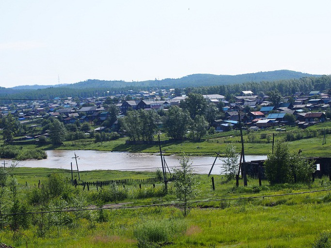  
열차에서 내다 본 시베리아 산간의 소도시

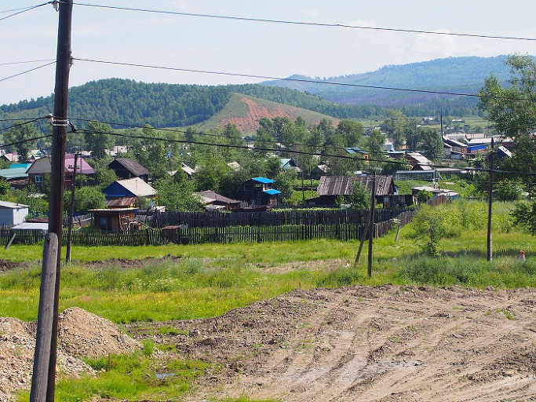  
시베리아의 산간 마을

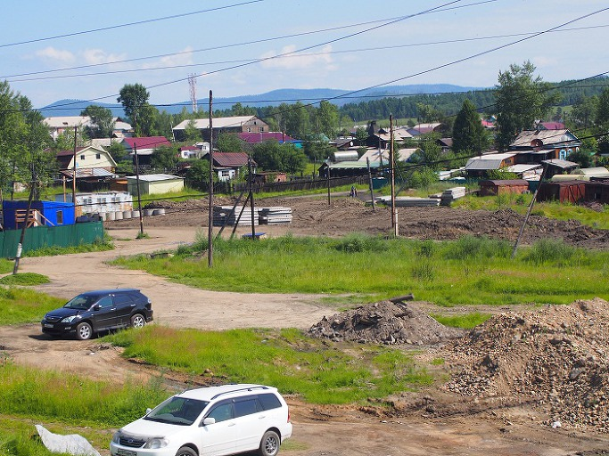  
시베리아의 작은 마을

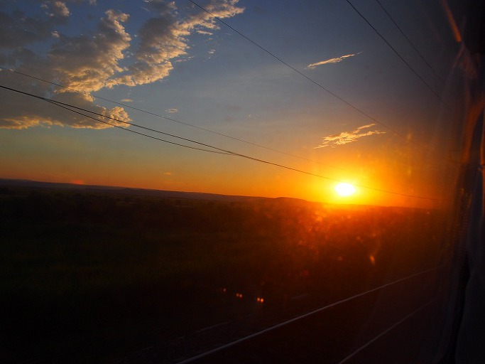  
달리는 열차에서 내다 본 시베리아의 일몰

  
작은 역에서 내려 차장과 함께

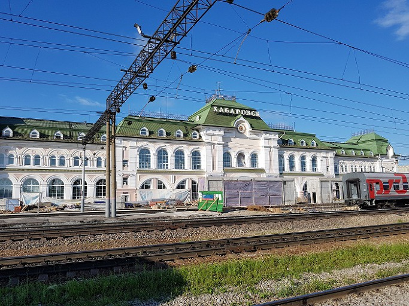  
하바로프스크 역

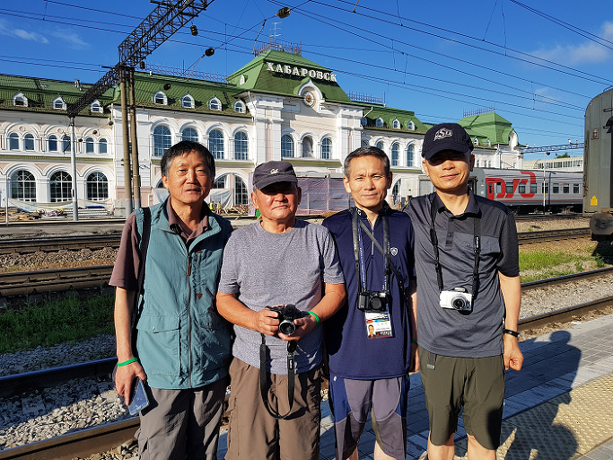  
하바로프스크 역에서

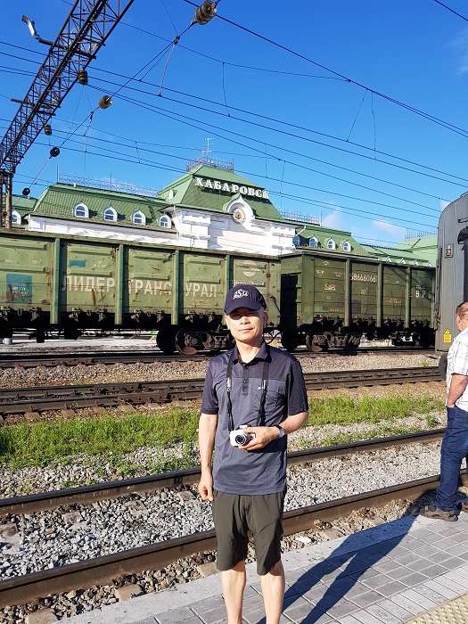  
하바로프스크 역에서 백규

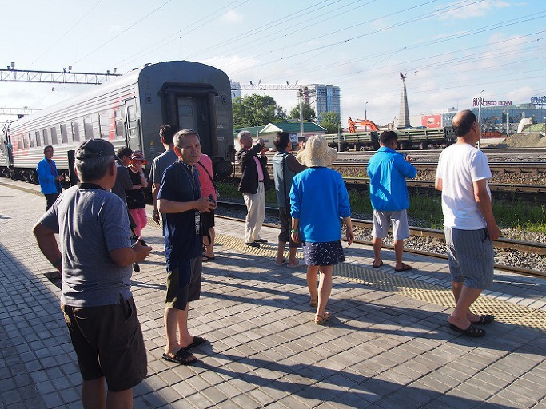  
하바로프스크 역에 내린 일행들

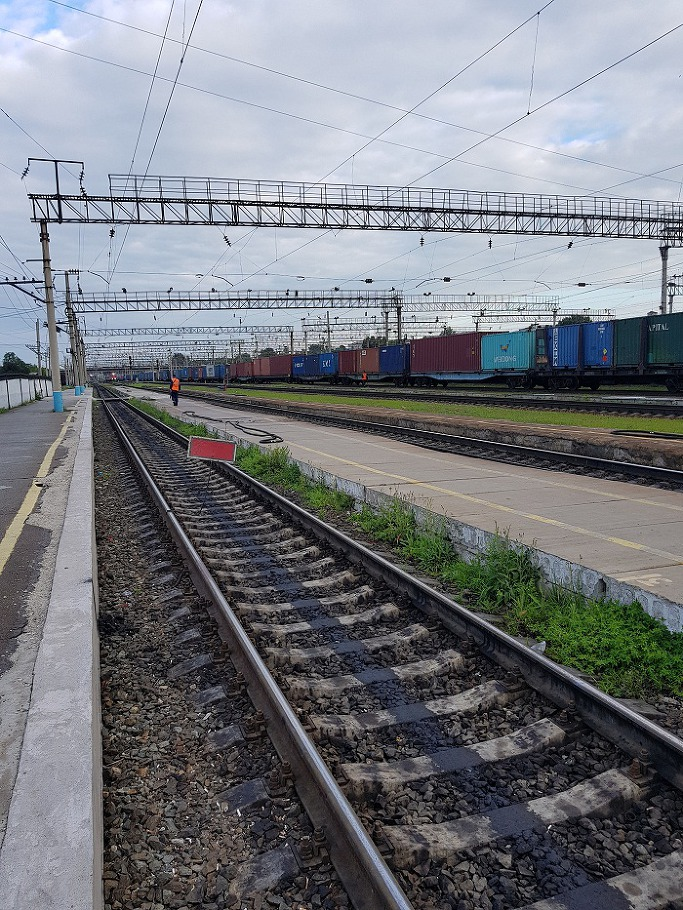  
끝없는 길

공유하기

게시글 관리

**백규서옥\_Blog ver.**

[저작자표시 비영리 변경금지
(새창열림)](https://creativecommons.org/licenses/by-nc-nd/4.0/deed.ko)