시베리아에서 사람들을 보았네!

-고려인들의 한이 서린 산하를 지나며.../3 

                                                                                                                             조규익

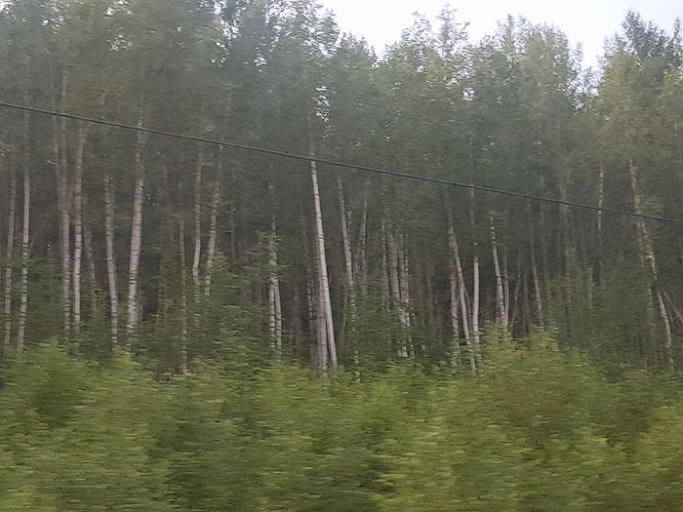  
차창 밖의 자작나무들

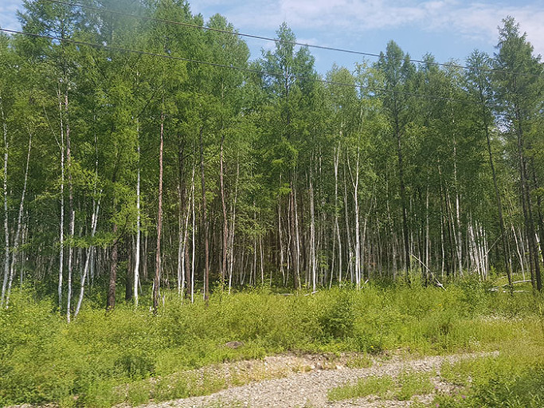  
차창 밖의 자작나무들

  
차창 밖의 자작나무들

  
차창 밖으로부터 웅얼웅얼 자작나무들의 천년 넘게 이어져 온 대화가 들려왔다 

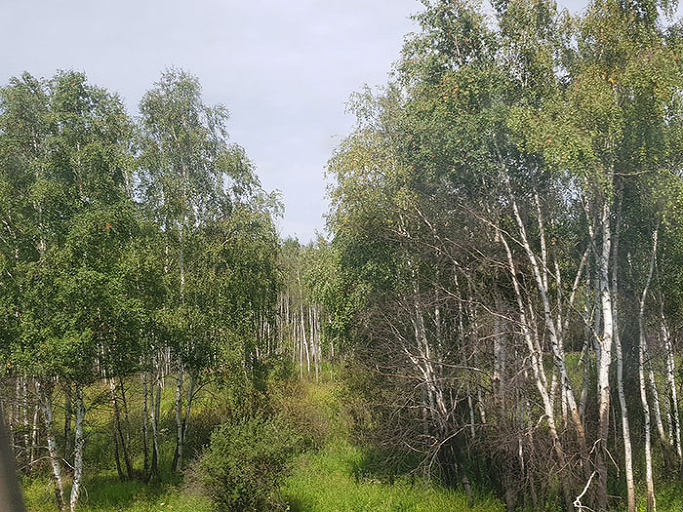  
차창 밖엔 무료에 지친 자작나무들도 있었다

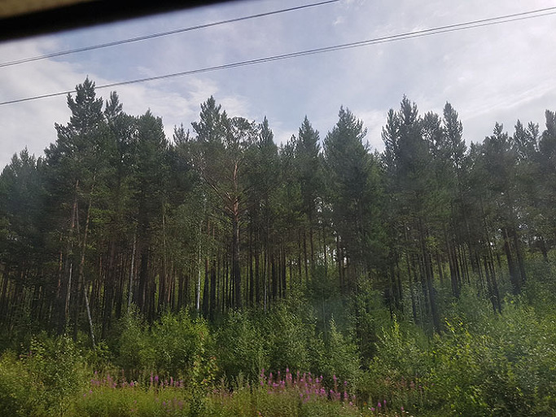  
차창 밖의 잣나무들

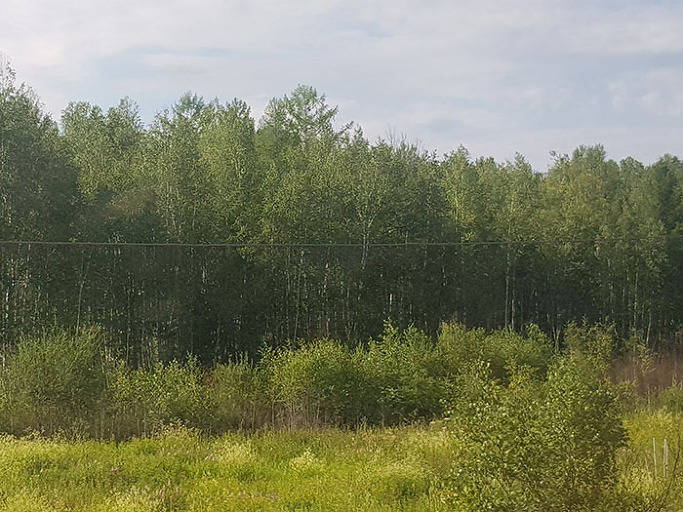  
간혹 잡목들이 공존하는 곳도 있었다

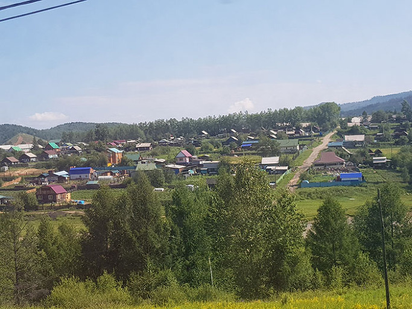  
가까이 보이는 마을

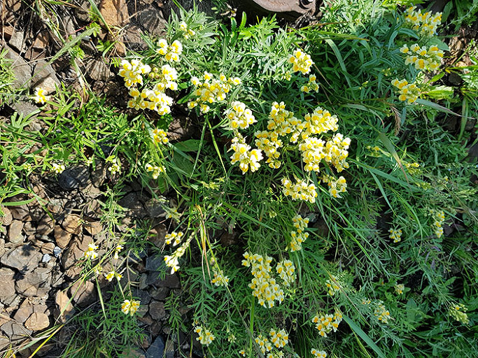  
들꽃

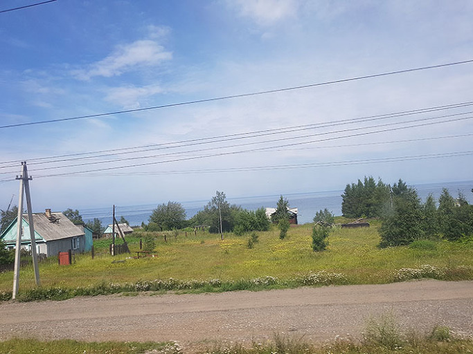  
호숫가의 작은 집들

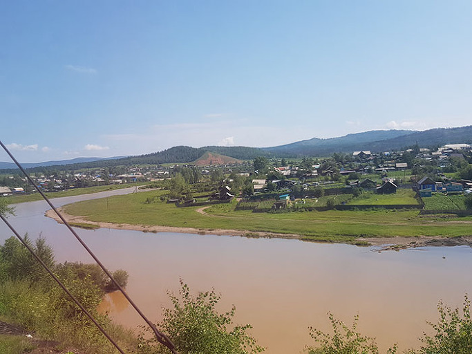  
마을을 빙 둘러 흐르는 강

시베리아에서 사람들을 보았네!

 

                                                                                                                             조규익

횡단열차는 수 없이 많은 작은 역들을 거쳐간다. 우리는 간혹 10~30분간 정차하는 경우 내려서 스트레칭도 하고, 맑은 공기를 허파 가득 들이마시기도 하며, 산 밑으로 옹기종기 모여 있는 집들을 보기도 했다. 어느 나라나 산간 마을들에 윤기가 흐를 수는 없는 법. 러시아도 마찬가지인 듯 했다. 무얼 해먹고 사는지 알 수가 없었다. 사방을 둘러보아도 논뙈기 밭이랑 하나 보이지 않았고, 온통 한대성(寒帶性) 수림(樹林) 뿐이었다. 그래도 간혹 만나는 노점상들의 좌판에 각종 과일들과 빵들이 수북하게 쌓여 있는 걸 보면, 아마 이곳에도 농업이란 게 있는 건 분명했다.

 

여행자에게 ‘열차의 시간’과 ‘도보의 시간’은 다르다. 도보의 시간이 절망과 체념의 시간이라면 열차의 시간은 희망과 구원의 시간이기 때문이다. 걷다가 보면 그 길의 끝없음에 절망하고, 그냥 ‘얼마간 살다가 이곳에서 죽을 수밖에 없다’고 포기하는 공간이 시베리아임을, 나는 열차에 오르는 순간 깨달았다. 절망의 소련인들이 마지막으로 잡은 끈이 횡단열차였고, 그 횡단열차가 생김으로써 산간벽지에 절망과 체념의 터를 닦고 죽을 날만 기다리던 사람들에게 한 줄기 희망의 빛을 비춰준 건 아닐까. 물론 그 희망이 구원으로 이어지느냐는 별개의 문제이긴 하지만.

 

맞다, 탈출이다! 내가 그랬다. 손바닥만한 한반도의 한 모퉁이에서 태어나 어려서부터 탈출을 꿈꾼 나였다. 십대 중후반, 이를 악물고 탈향(脫鄕)했다고 생각했는데 다리에 힘이 빠져 더 이상 탈출할 수 없는 지금, 깨달았다. 그 절망의 고향 언저리에서 아직도 서성대고 있음을. 아니 오히려 그 어린 시절의 절망을 한 톨도 깨부수지 못한 채 그 고향의 자장(磁場) 안으로 다시 빨려 들어가고 있음을. 그래서 어쩌면 그 고향의 절망 속에 늙은 몸을 잠근 채 가뭇없이 사라질지도 모른다는 것을.

 

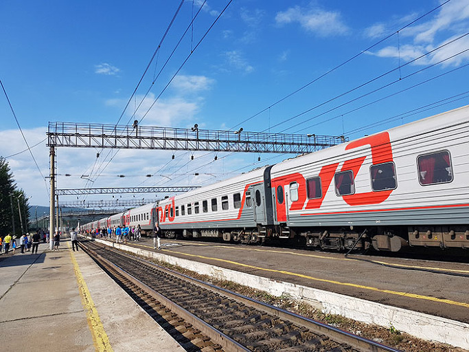  
사람들은 왜 먼 길을 가는 걸까?

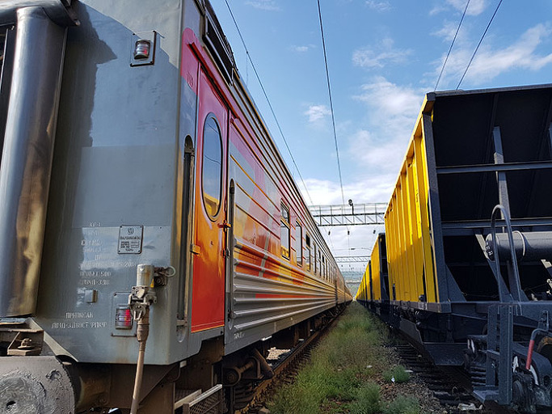  
미움과 사랑을 한 그릇에 싣고

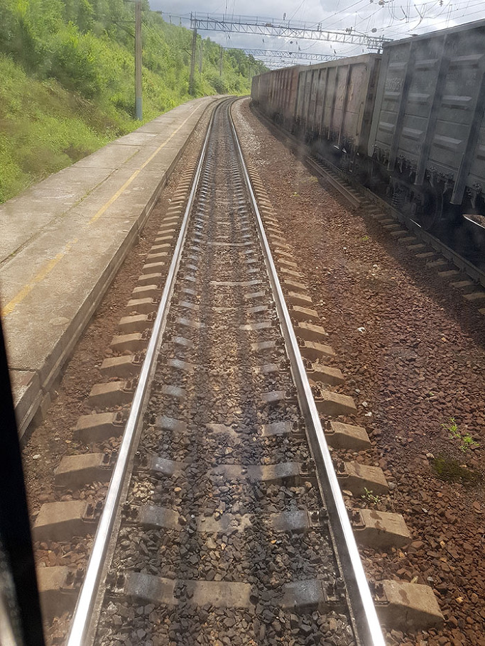  
끝없는 길

누구나 짊어지고 가는 그 천형(天刑) 같은 운명의 짐을 이곳 시베리아를 횡단하며 멀리 보이는 시베리아 인들의 얼굴에서 보았다. 좌판에 늘어놓은 오이나 수세미들처럼 얼굴에 굵은 주름을 잔뜩 얹은 아줌마들이 알 수 없는 러시아말을 ‘뚜르르~’ 굴리며, 깜짝할 사이에 떠나버릴 이국 손님들의 눈치를 살피는 곳이 시베리아였다. 가본 적도 없는 원동에서 모스크바까지, 아니 유럽, 중국까지 몸만 실으면 데려다 줄 횡단열차 역의 바로 앞마을에 살고 있지만, 그런 곳들을 여행할 생심이나 낼 수 있으랴! 그래서 그 옛날 유형(流刑)의 최종 공간이 바로 여기 아니던가? 검푸른 타이가에 한 발만 들여 놓으면 호랑이, 불곰, 늑대 등 온갖 맹수들이 들끓던 곳. 그러니 사람의 법보다 자연의 법이 우선하던 곳이었고, 지금도 거기서 그리 멀지 않으리라.

 

횡단열차를 타고 가며 고려인의 고통보다 시베리아 인들의 우수(憂愁)와 운명을 먼저 읽었다. 그리고 그것이 그들만의 것은 아니고, 내 것이기도 함을 깨달았다. 저 검푸른 타이가에서 태어나 졸졸 흐르는 샘물과 자연이 주는 양식을 먹으며 살다가 다시 저 속으로 스며드는 것이 인간의 운명임을 확인하게 되었다. 저 광대한 타이가의 한 복판에 문명을 대입해 보아야 우리네 도회(都會)의 삶이 얼마나 하찮은 것인지 알 수 있으리라.<계속)

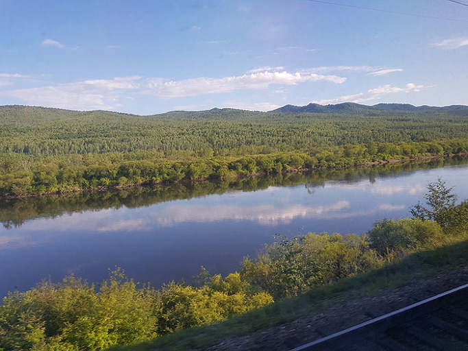  
끝없는 숲, 그리고 강

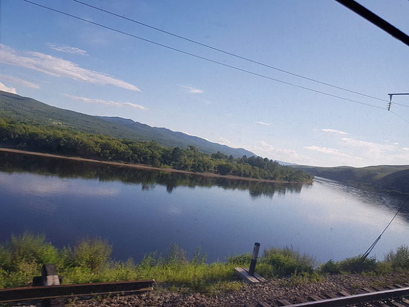  
무료한 강과 숲

  
가끔 구름도 비춰주는 강

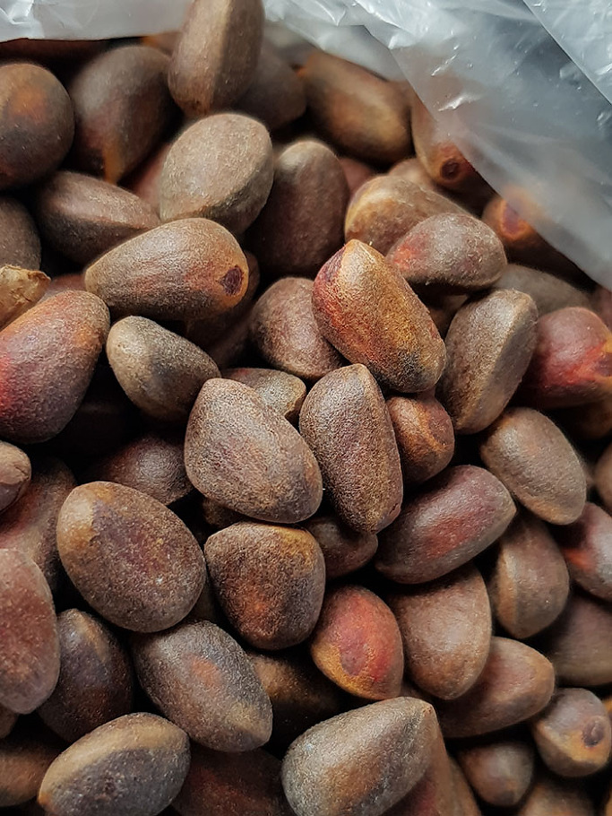  
지천으로 널린 시베리아의 잣

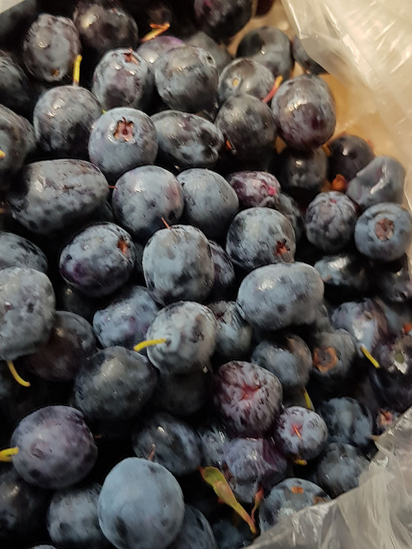  
숲속의 흑진주, 블루베리

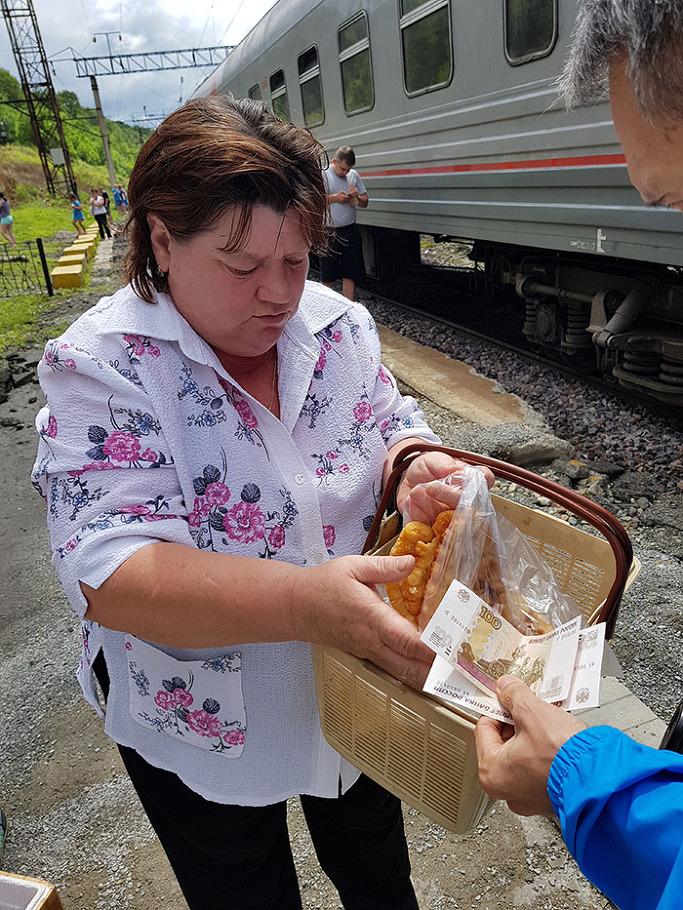  
억척스런 러시아 아줌마

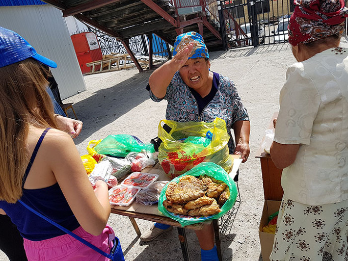  
이 아주머니는 왜 이렇게 화가 난 것일까?

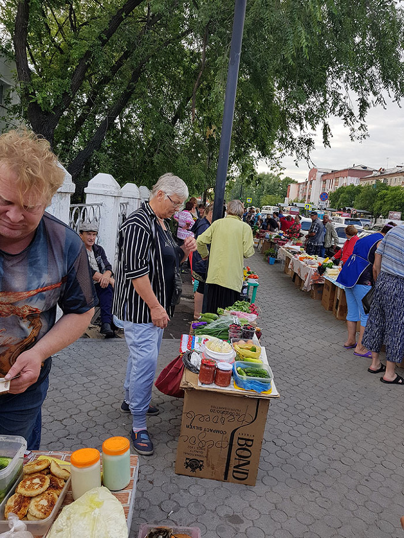  
노점상들의 소박함

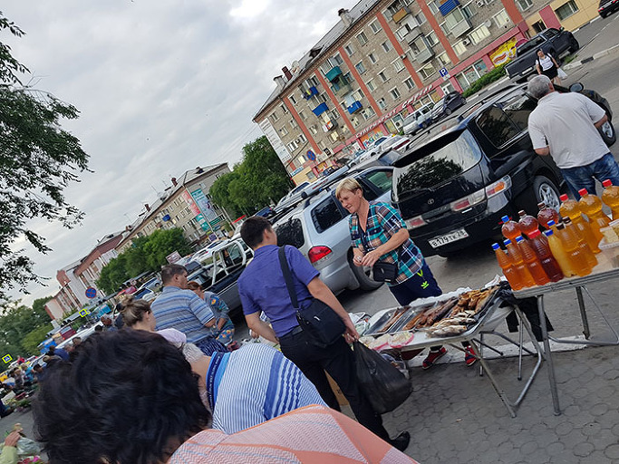  
젊은 노점상

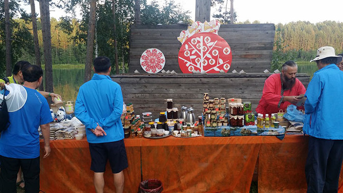  
시베리아의 꿀, 술, 차...

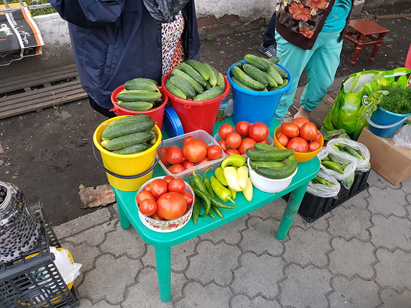  
잃어버린 우리의 오이 맛이 그곳에 있었네!

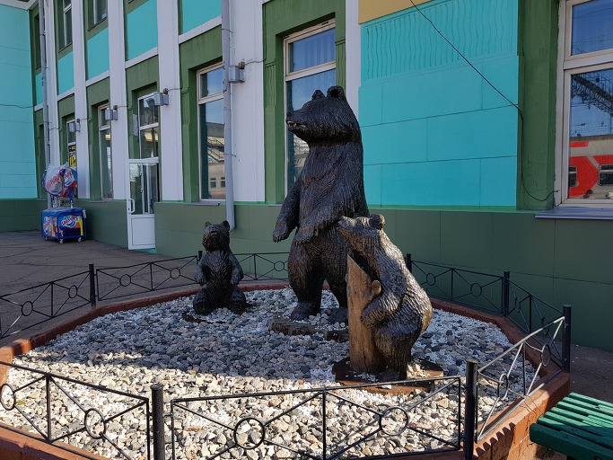  
이들이 타이가에 서식하는 곰들이렷다!

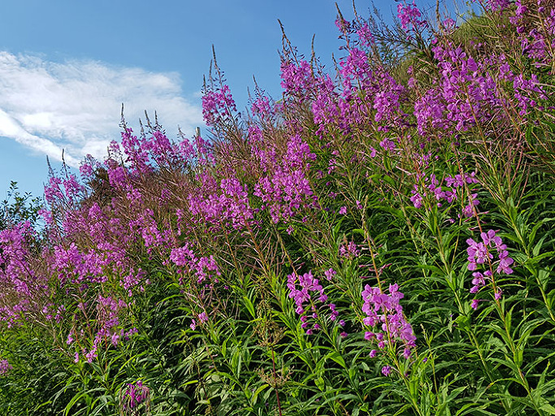  
시베리아의 이반차이를 만드는 꽃풀이랍니다!

공유하기

게시글 관리

**백규서옥\_Blog ver.**

[저작자표시 비영리 변경금지
(새창열림)](https://creativecommons.org/licenses/by-nc-nd/4.0/deed.ko)