이르쿠츠크의 꿈, 러시아의 꿈  
-[고려인들의 한이 서린 산하를 지나며.../4](http://kicho.tistory.com/552)

 

 

                                                                                                            조규익

 

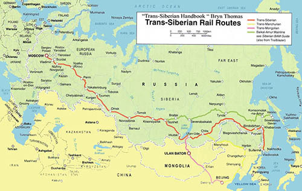  
우리는 바이칼 인근의 이르쿠츠크에 도착했다

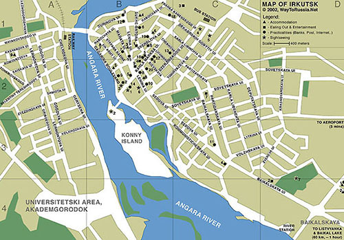  
앙가라강과 이르쿠츠크 시가 개념도

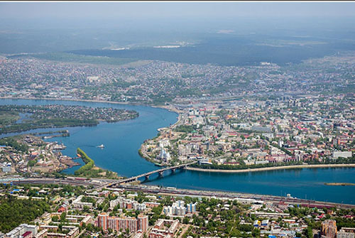  
아름다운 이르쿠츠크

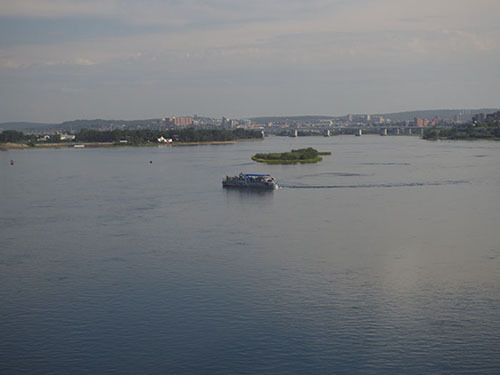  
앙가라강

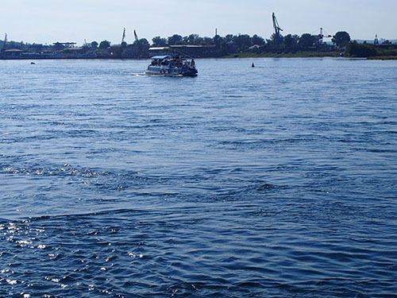  
이르쿠츠크 강

  
사진 찍으러 강가에 나온 한 쌍

 

7월 25일(화) 아침 무렵 단잠을 깬 우리는 하바로프스크 역에 잠시 내려 고려인협회장을 비롯 인사차 나온 여러 명의 고려인들을 만났다. 조선 볼셰비키 여성 혁명가인 김 알렉산드라, 1918년 4월 한인사회당을 조직한 임정 초대 국무총리 이동휘 선생 등이 활약한 역사적 공간이자 극동 최대의 도시가 바로 하바로프스크였다. 횡단열차를 탈 경우 모스크바로부터는 약 8,500km 지점으로, 7시간의 시차가 생기는 곳이다. 시의 중심부분은 우수리강과 아무르강이 합류하는 부분의 우안(右岸)에 있었고, 철도역사 뒤로 부요한 시의 모습이 조금씩 보이는데, 역사와 문화가 살아 있는 듯 했다. 원래 러시아의 극동진출을 위한 거점이었으나, 1918년 일본군에 의해 점령되었던 곳이기도 하다.

하바로프스크 역에서 만난 고려인들과 헤어진 뒤 다시 열차에 올랐다. 그로부터 또 한밤을 새워 만주횡단철도(TMR: Trans-Manchurian Railway)와 시베리아 횡단철도(TSR)가 연결되는 카림스카야를 지나 울란우데를 만났다. 그 지역부터 환바이칼 코스가 전개되는데, 천변만화(千變萬化)의 바이칼 호수와 시베리아의 밀림이 만화경처럼 차창을 스쳐 지나갔다. 울란우데는 시베리아 횡단 열차 구간 최고의 백미로 일컬어지는 코스이자 몽골 횡단철도 분기점이었다. 그로부터 한참을 더 달려 바이칼 인근의 이르쿠츠크에 도착했다. 블라디보스톡 출발 사흘째인 27일(목) 오후 4시경. 72시간 만에 드디어 땅에 발을 디디게 된 것이다.

 

참 아름다운 도시, 이르쿠츠크(Irkutsk)였다. 앙가라(Angara) 강과 이르쿠츠크 강이 합류하는 곳에 위치하여 그 풍광이 기가 막혔다. 러시아 정교회 성당과 수도원들을 비롯 제정 러시아 시대의 전통 건축물들이 즐비하게 늘어서 있었다. 그 가운데 돋보이는 것들은 예수공현 성당(Epiphany Cathedral), 즈나멘스키 수도원과 보고야블렌스키 성당(The Znamensky Monastery and the Bogoyavlensky Cathedral). 전자는 1718년 건축을 시작하여 1746년 완성된 성당이었고, 성모 마리아와 예수에게 봉헌된 후자 즈나멘스키는 시베리아를 대표하는 수도원들 가운데 하나였으며, 보고야블렌스키 성당은 이르쿠츠크 최대의 종교적 기념비이자 시베리아에서 가장 뛰어난 건축물로 평가되고 있었다. 즈나멘스키 수도원은 1689년 건립되었고, 보고야블렌스키 성당은 1693년에 건립되었으니, 300여년이 넘은 건축물들이었다! 그럼에도 지금 막 완공한 듯 선명한 빛을 발하고 있었다.

 

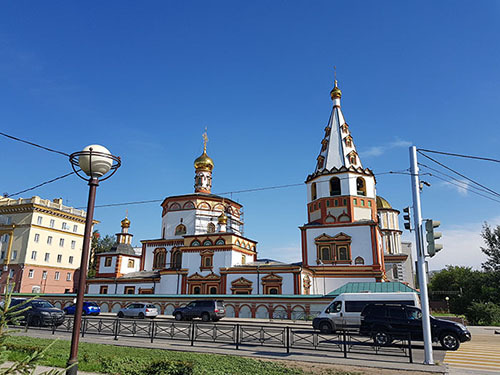  
예수공현 성당

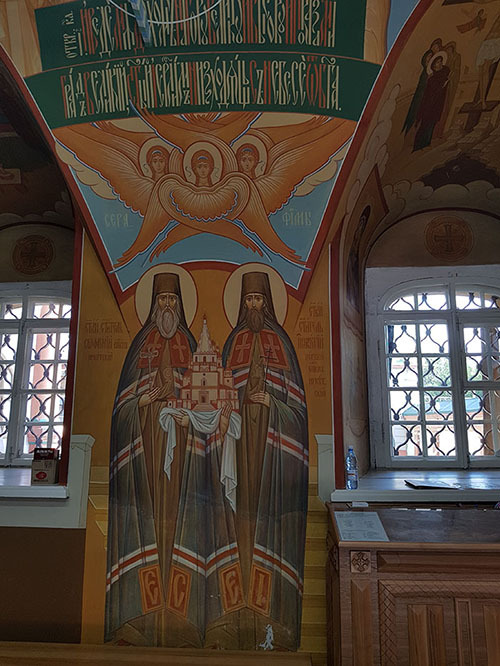  
성당내부

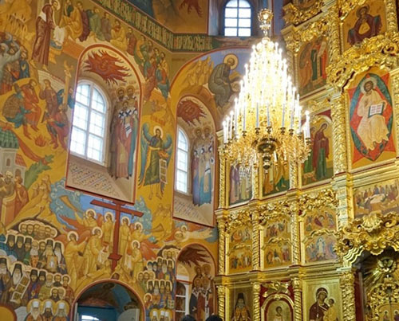  
성당 내부

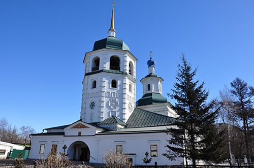  
즈나멘스키 수도원

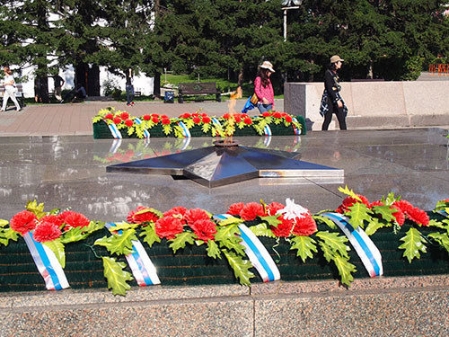  
시청 앞 영혼의 불꽃

‘러시아의 파리’로 불리는 이르쿠츠크. 동 시베리아 경제와 문화의 중심지이자 바이칼 호 서쪽 65km 지점에 위치하여 차분하게 정돈된 모습을 보여주는 여름 휴양지였다. 앙가라강을 통해 흘러드는 바이칼호수의 깨끗한 물이 한낮의 햇살에 반사되어 도시 전체를 청결하게 만들었다. 약 65만 명이 모여 사는 곳. 바이칼 호수 관광의 기점으로 모스크바와 블라디보스토크 철도의 중간 지점이었다.

 

그러나 우리의 관심은 이곳이 1920년 한인공산당이, 1921년 고려공산당이 창립된 공간이라는 점이었다. 버스는 칼 마르크스 거리를 지나 벨릐 돔 부근의 앙가라 강가에 우리를 내려놓았다. 칼 마르크스 거리는 앙가라강변에서 도심 북쪽까지 연결된 중심대로로서, 길을 따라 박물관과 극장, 대학교 등이 늘어서 있었다. 우리의 관심은 우뚝한 동상으로 남아 있는 알렉상드로 3세와 현재는 이르쿠츠크 국립대 도서관으로 쓰이고 있는 벨릐 돔. 알렉상드로 3세는 시베리아 횡단열차를 건설한 장본인이었으나, 정작 그 아들 니콜라이 2세에 이르러 제정러시아는 종말을 고했으니, 위대한 황제가 이룬 역사(役事)와 역사(歷史)의 아이러니를 생생하게 보여주는 현장이었다. 그 철도 덕에 개발의 시대가 개막됨으로써 버려졌던 시베리아에 온기가 돌았는데, 그럼에도 제정 러시아는 막을 내리지 않았는가. 그 동상에서 대각선으로 보이는 건물이 우리로서는 몸서리쳐지는 조선공산당 선언식이 있던 벨릐 돔이었다. 천만리 머나먼 곳에까지 와서 자신들의 정치적 결사체의 선언을 한 것은 이곳이 바로 공산주의의 종주국 소련의 핵심부들 가운데 하나라는 점에 그 이유가 있었다. 식민 치하의 조국에서 불가능하기도 했지만, 무엇보다 소련의 지원을 받으려는 목적의식이 앞섰기 때문일 것이다.

\*\*\*

 

호텔에서 1박을 하고 바이칼로 떠나기 전 찾은 곳은 데카브리스트(Dekabrist) 박물관. 데카브리스트의 정신적 지주 세르게이 발콘스키(Sergey Volkonsky) 공작의 집을 개조한 건물이었다. 1825년 12월 러시아 최초의 근대적 혁명을 시도한 데카브리스트. ‘데카브리’는 러시아어로 ‘12월’이니, 데카브리스트란 ‘12월 당원’을 뜻한다. 1825년 12월, 인간의 존엄성이 짓밟히고 정치•경제•문화적으로 낙후된 러시아를 살리기 위해 짜르 체제를 전복하려는 목적을 갖고 청년 장교들 100여명이 봉기했으나, 실패한 혁명이었다.

6백여명이 체포되고 121명이 재판을 받았다. 그 결과 주모자 5명은 교수형, 116명은 시베리아 유배형에 처해졌는데, 그 가운데 31명은 종신유배, 85명은 장기유배였다. 형이 끝난 뒤 이들의 상당수가 이르쿠츠크에 정착한 것이다. 실패로 끝난 혁명이었지만, 친 유럽적인 이들의 삶이 이르쿠츠크에 자유로운 유럽문화를 이식하고, 농노제의 폐지와 입헌정치의 실시 등 민주주의의 기풍을 불어넣은 계기가 되는 등 이 사건의 반향은 매우 컸다. 이들 모두 귀족의 신분이었다는 점에서 ‘노블리스 오블리쥬’의 상징적 사건이기도 했다.

그들은 시대에 저항한 혁명가들이었고, 그 정신을 대표한 사람이 바로 발콘스키 공작이었다. 발콘스키는 데카브리스트의 난으로 20년 유형의 판결을 받아 1826년부터 네르친스크 탄광에서 강제노동에 시달렸고, 1835년부터 1851년까지 이르쿠츠크에서 유배 생활을 했다. 1847년부터 이 집에서 살았고, 1851년 형기 만료와 함께 떠났으며, 이 집은 1985년 박물관으로 개관되었다고 한다.

수많은 방들에는 피아노, 침대, 의자, 식탁 등 당시의 삶을 보여주는 생활 집기들이 가지런히 진열되어 있었고, 이곳에서 생활하던 사람들의 사진도 잘 정돈되어 있어, 어디선가 금방이라도 푸쉬킨의 시 낭송 소리가 들려올 것 같고, 피아노에서는 무도곡이 흘러나올 것만 같았다. 비록 뜻은 꺾였으나, 출중했던 이상주의자 데카브리스트들이 시국을 담론하면서 잔을 기울이던 기개가 살아 움직이는 공간이었다. 비록 볼셰비키 혁명으로 마무리되어 오늘날의 우리를 괴롭히는 비극의 단초가 되긴 했으나, 러시아 청년장교들의 꿈은 누구나 본받아야 할 보편 이상으로 그곳에 자리 잡고 있었다.

 

따갑지만 시원한 동시베리아의 이르쿠츠쿠에서 자유혼을 크게 호흡한 우리는 다음 여정 바이칼호로 내쳐 달렸다.<계속>

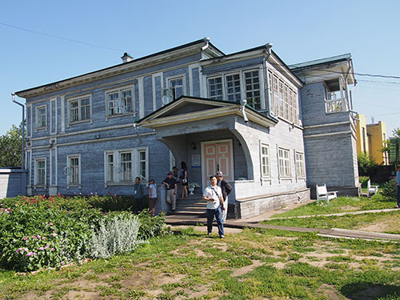  
데카브리스트 박물관

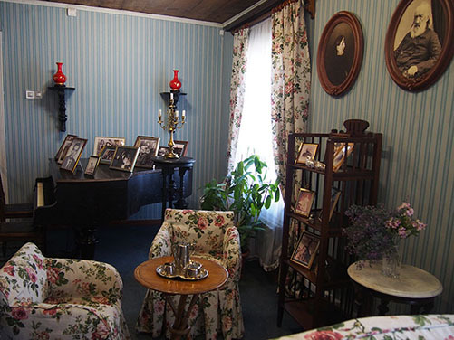

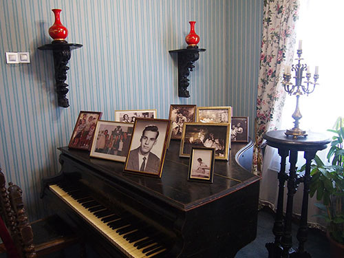

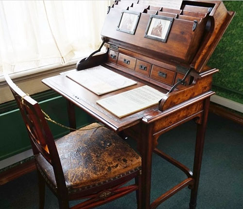

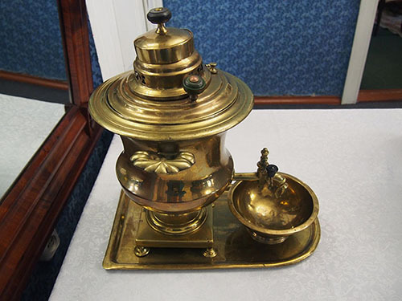

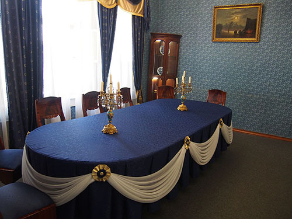

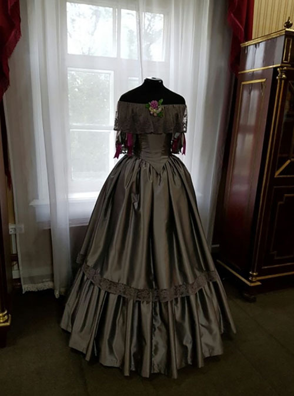

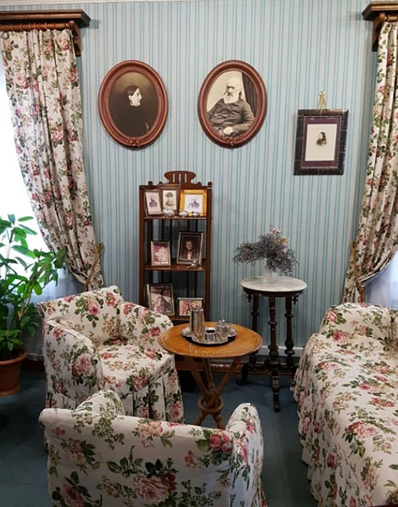

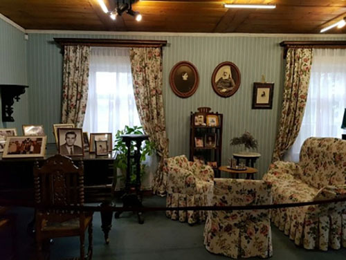

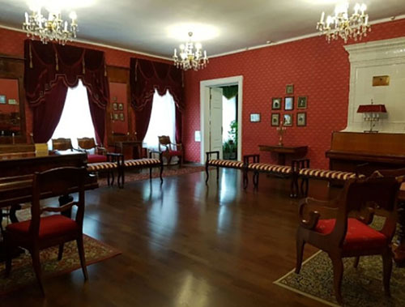

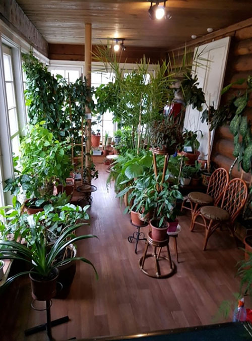

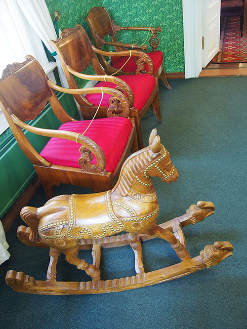

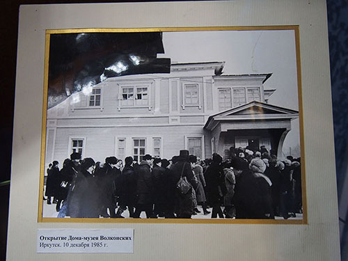

1985년 박물관 개장날 몰려든 인파

공유하기

게시글 관리

**백규서옥\_Blog ver.**

[저작자표시 비영리 변경금지
(새창열림)](https://creativecommons.org/licenses/by-nc-nd/4.0/deed.ko)