아, 바이칼!

-고려인들의 한이 서린 산하를 지나며.../5

 조규익

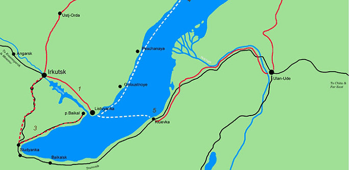  
우리의 바이칼 탐사는 리스트비양카에서 시작되었다.

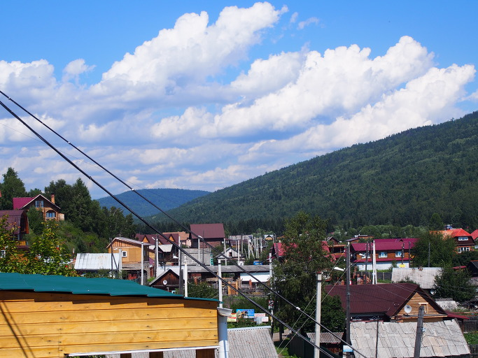  
식당에서 바라본 리스트비양카 마을 모습

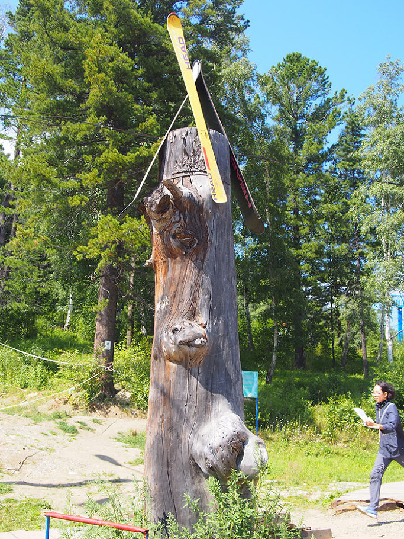  
점심 후 들른 스키장(전망대 리프트 출발점)

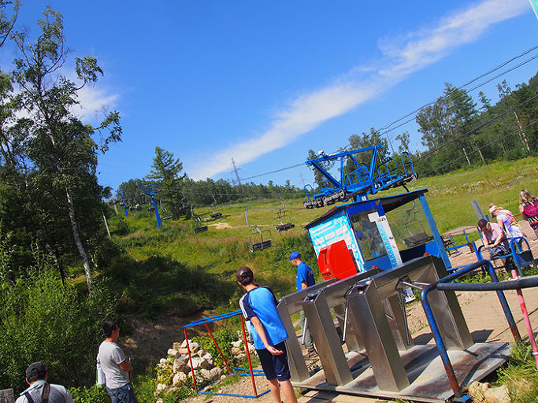  
전망대 가는 리프트 출발점

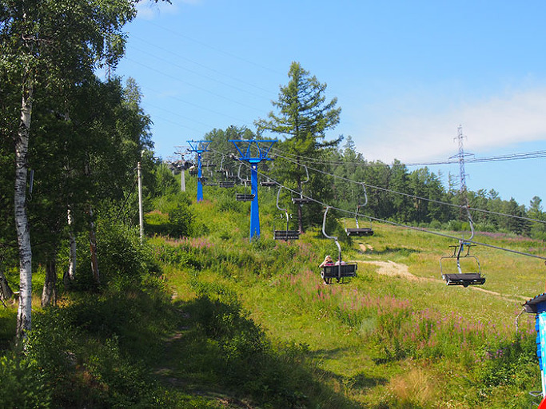  
리프트를 타고 미끄러지듯.

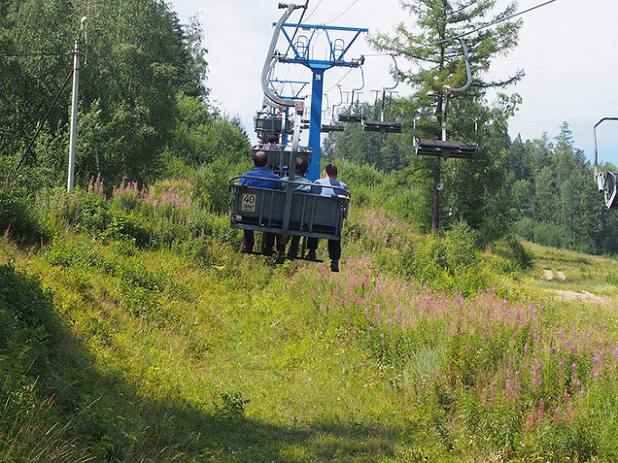  
일행 뒷모습

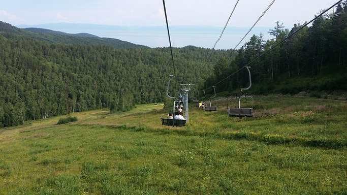  
아, 저 숲!

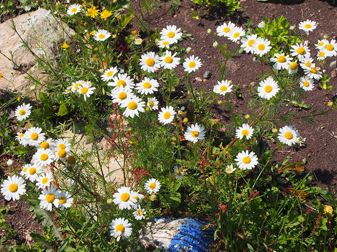  
아래를 내려다보니 이쁜 꽃들이! 혹시 구절초인가요?

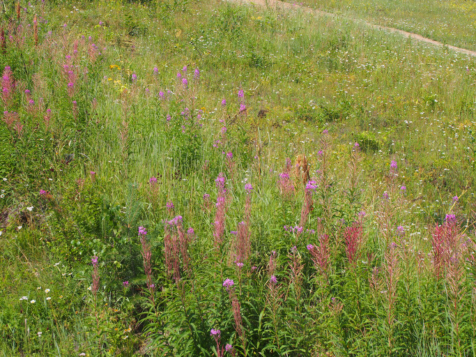  
러시아에만 있다는, '이반차이' 만드는 꽃

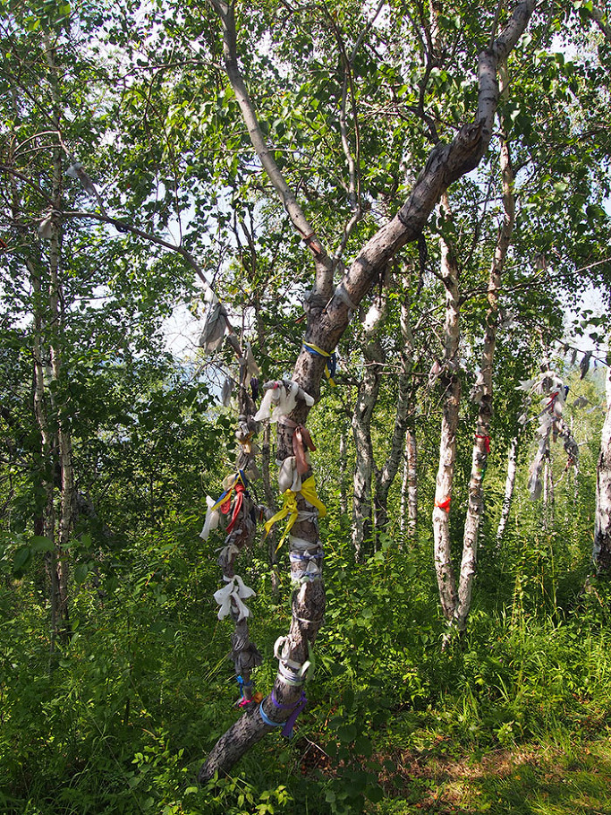  
체르니셰프스키 전망대에 오르자 드디어 보이기 시작하는 부랴트 족 무속의 증거물

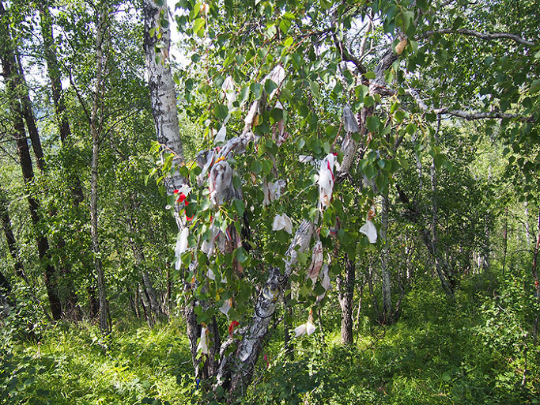  
부랴트 족 무속의 증거물

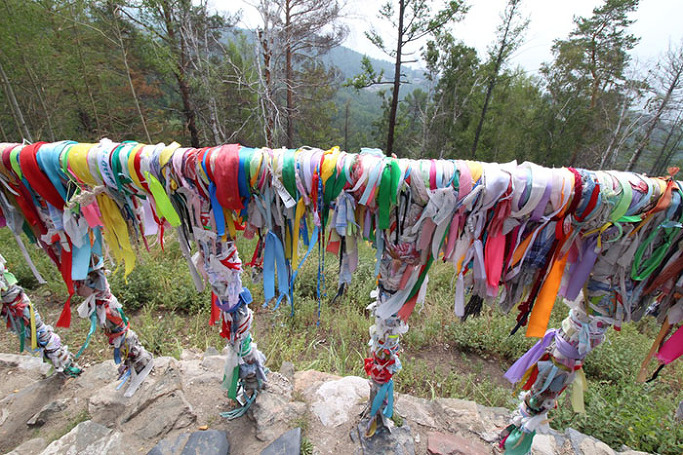  
부랴트 족 무속의 뚜렷한 증거물

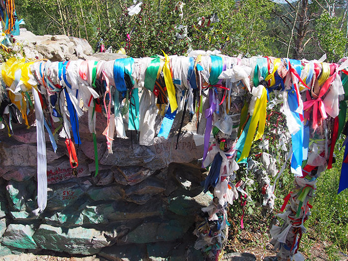  
부랴트 족 무속의 증거물

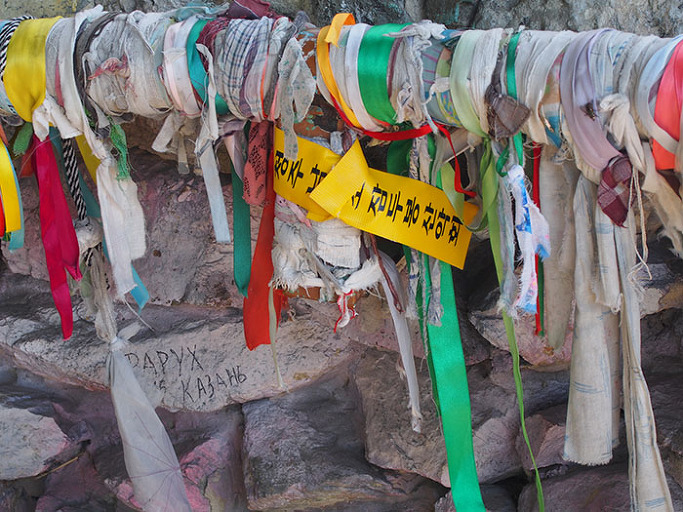  
잠두봉 산악회도 다녀갔군요!

                                                                                                                        조규익 

    

언제부턴가 바이칼을 만나고 싶었다. 민족의 시원(始源)을 의심하기 시작할 때부터였을까. 호수 물을 ‘쭈욱!’ 소리 나게 들이마심으로써 내 협애(狹隘)한 인식의 천박한 때를 벗겨내고 싶기도 했다. 고려인 강제이주의 발자취를 추체험하는 대장정, 그 한복판에서 바이칼을 만나게 된 것이다.

이르쿠츠크에서 데카브리스트 박물관을 떠난 게 오전 10시 남짓. 한 시간 넘게 달려 바이칼의 한 계곡 리스트비양카(Listvyanka)에 도착했다. 호숫가를 따라 5km나 이어진, 크지만 작아 보이는 마을, 자연과 어울리는 목조 주택들이 정겨운 곳이었다. 언덕배기에 붙여 지은 식당에서 감자를 주 재료로 만든 러시아 음식^^으로 점심을 해결했다. 허나, ‘개똥이 어딘들 없으랴?’ 그곳에서도 고래고래 소리 지르며 행패를 부리는 젊은 중국인 여성과 그 가족을 만났다. 러시아의 한복판에서 말도 안 되는 이유로 음식 값을 내지 않으려 작전을 쓰는 듯한 중국 관광객들을 통해 ‘이제 배 밖으로 삐져나온 중국인들의 간덩이와 몰염치’를 그곳에서도 목도했다. ‘러시아에 있긴 하지만 엄청난 바이칼’을 친견하고자 온 내겐 시끄럽고 불쾌했으나, 참 볼만한 광경이었다.

 

점심 후 30여분을 달려 국립공원 안의 체르니셰프스키 전망대 행 리프트의 출발지에 도착했다. 겨울에는 스키 객들을 위해, 그 외의 계절에는 바이칼 호 탐승객들을 위해 리프트는 계속 오르내리고 있었다. 앙가라 강이 흘러나오는 지점이 내려다보이는 곳에 자리 잡고 있는 체르니셰프스키 전망대에 오르자 남북으로 길게 뻗은 바이칼 호수의 진면목이 비록 일부분이지만 드러났다. ‘아름답다’는 말은 너무 가벼워 차라리 입을 닫을 수밖에! 굳이 미학으로 따지자면 ‘숭엄미’라고나 할까.

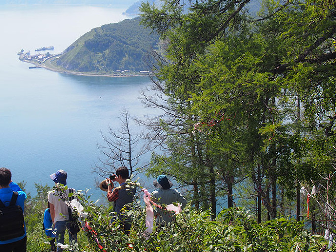  
전망대에서 호수를 담는 사람들

  
바다같은 호수가 꿈처럼 펼쳐져 있었다!

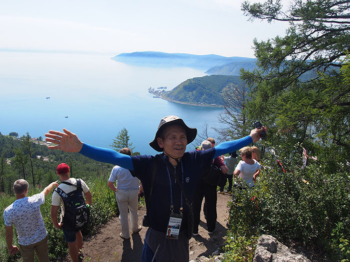  
김병학 선생이 자신의 감동을 표현했다.

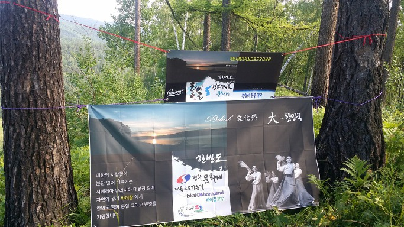  
한반도 평화문화제를 지낸다고 했다. 기원의 대상은?

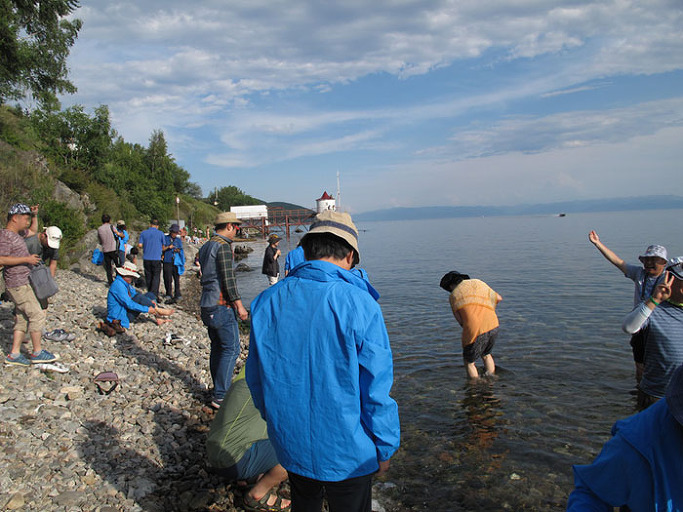  
바이칼의 물에 발을 담그는 사람들

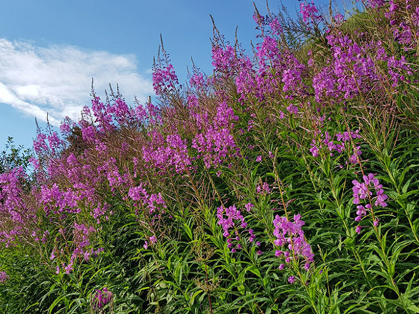  
호숫가에도 이꽃은 만발해 있었다!

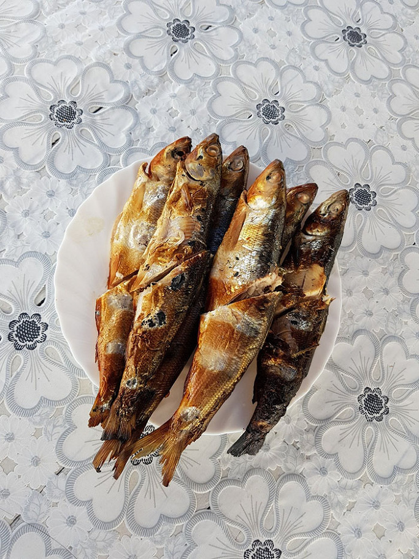  
바이칼에서만 산다는 민물고기 오물(omul). 담백한 맛이었다.

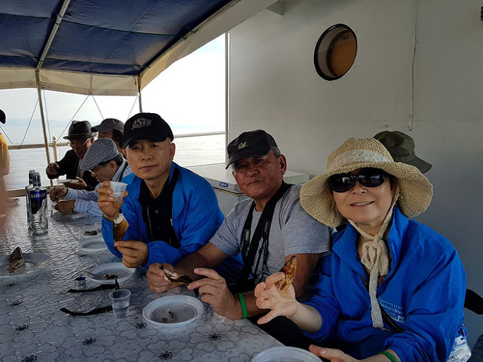  
구워낸 오물을 안주 삼아 일행과 보드카 한 잔을. 블라디미르 김 선생과 정막래 선생.

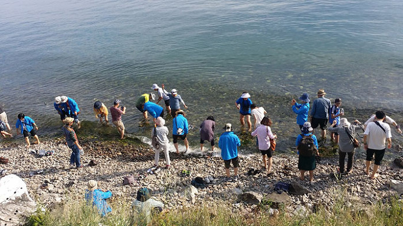  
호수 물에 흥분한 사람들

러시아의 이르쿠츠크와 부랴트 자치공화국의 사이에 위치한, 세계 최고(最高/最古)의 바다 같은 호수. 2,500만 년은 누가 헤아린 역사이며, 최고 수심 1,621m는 누가 헤아린 깊이란 말인가. 주변을 병풍처럼 두른 2,000m 급의 산들은 대체 언제부터 생겨나 호수의 물을 가두고 있단 말인가. 360여개의 강이 흘러 들어오지만, 출구는 앙가라 강 오직 하나 뿐이기 때문일까. 저토록 깨끗한 물은 세계 담수(淡水)의 1/5에 달하는 양이라고 한다.

 

2,000m 이상의 연봉들로 둘러싸인, 면적 31,722㎡, 길이 620km, 폭 24~79km, 해안선 2,100km 최고 수심 1,642m의 바이칼. 바이칼에서의 우리 민족의 원류를 상상하는 것은 이곳에서 둥지를 틀었다는 인구 40여 만에 달하는 부랴트 족의 샤머니즘과 우리의 그것이 적잖이 겹친다는 이유 때문이기도 할 것이다. 누가 매어놓았는지, 호수가 내려다보이는 산마루엔 형형색색의 끄나풀들이 칭칭 둘러 매여 있었다. 우리가 익히 보아왔던 무당굿의 흔적들이다. 뿐만 아니라 주몽의 탄생지가 이 근처였다는 설들을 귓전으로 들으며, 우리 민족의 발원처가 여기 아니겠느냐는 의문은 확신에 가까운 믿음으로 바뀌어갔다.

 

유람선이 호수 복판으로 다가갈수록 시원의 생명이 풍기는 비린내가 나의 내면으로 차올랐다. 주변의 참한 봉우리들은 그림자를 드리우고, 이곳에서만 산다는 물고기 ‘오물(omul)'은 두껍게 이랑지는 코발트블루를 차고 올라왔다. 조용한 호수의 표면에 팽팽한 긴장이 느껴지는 것도 그 속에 생명들이 깃들어 숨 쉬고 있기 때문일 것이다. 사람들은 저마다 상념에 젖어 말을 잊어버리고, 호수를 둘러 싼 병풍산들은 흡사 물 한 방울이라도 흘러 나가지 못하게 막으려는 듯 촘촘히도 어깨들을 겯고 있었다. 바람은 살랑살랑 수면을 훑으며 땀에 쩐 여행객들을 위로하고, 저 건너 산 위로 석양은 엷어지고 있었다. 눈 깜짝 사이에 낯선 다음 행선지로 나그네들을 몰아대는 바이칼의 밤이 깊어지고 있었다.

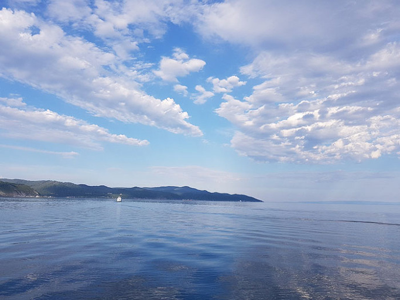  
하늘, 구름, 호수

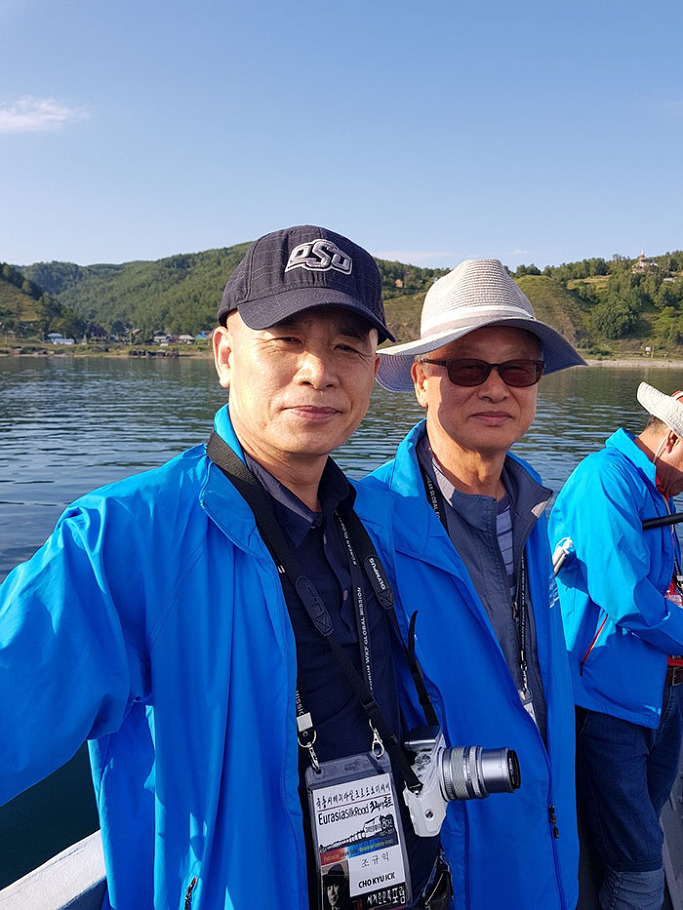  
일행들과 함께

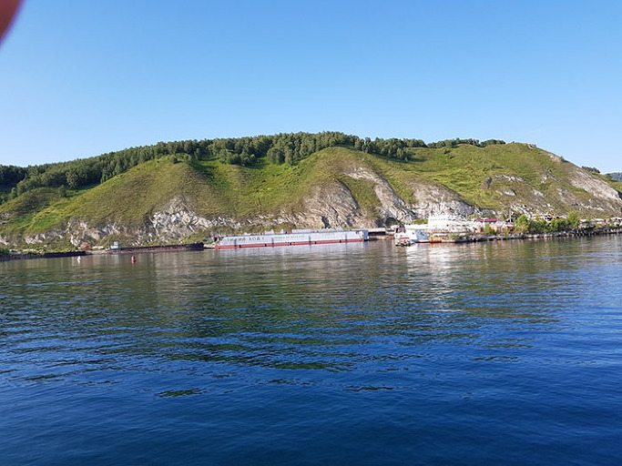  
물에 비친 산 언덕

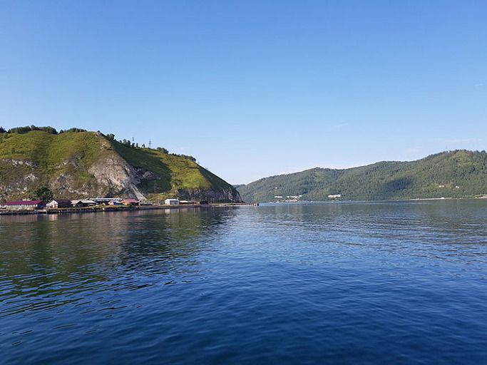  
물에 비친 산, 그리고 멀리 떨어진 인가들

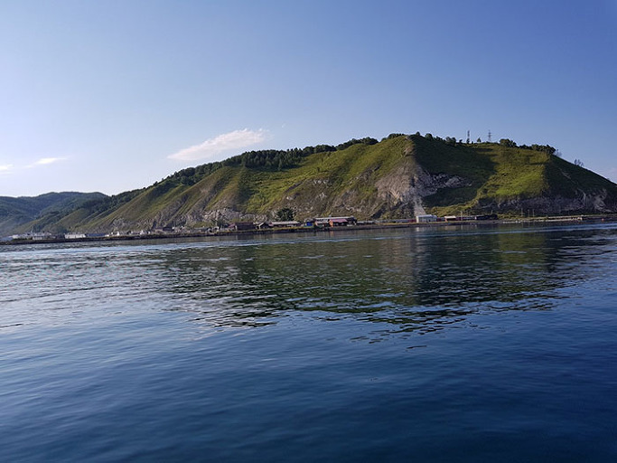  
산, 그리고 물

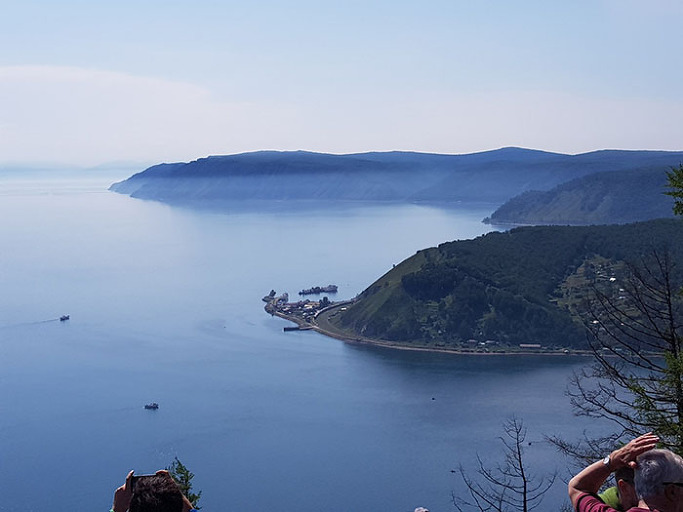  
호수에서 앙가라강이 갈라져 나가는 곳, 그 언저리를 안개가 살짝 둘렀네요!

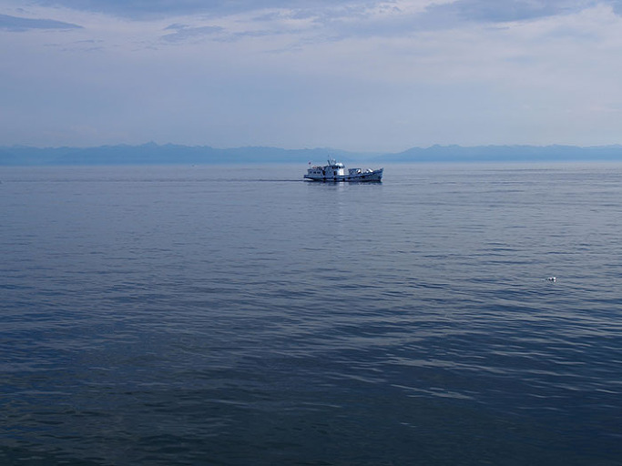  
고기잡이 배일까요?

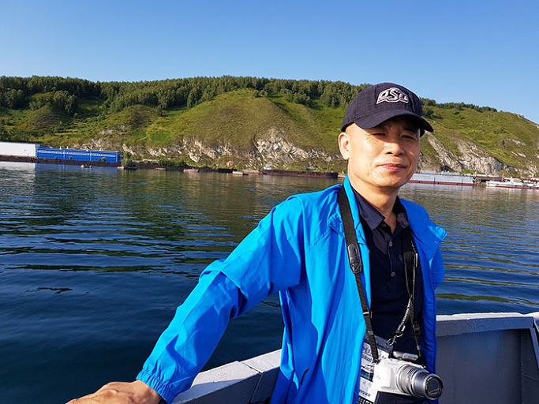  
호수에서 뒷산을 배경으로...

  
그 배가 또 오는군요.

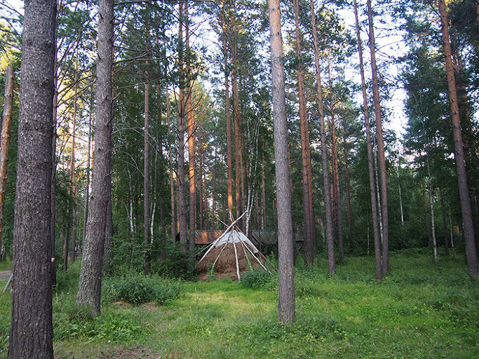  
호수를 나와 저녁 먹으러 가는 길, 숲에서 티피를 만났다.

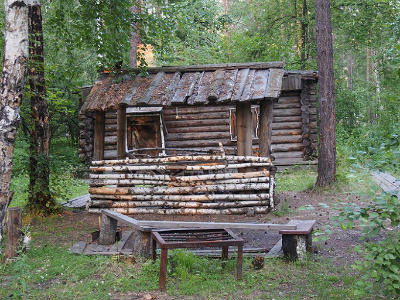  
사냥꾼들의 티피

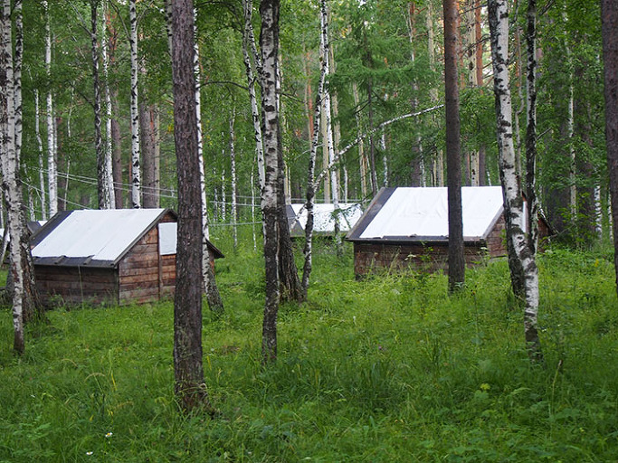  
여러 채의 티피들이 자작나무 숲에...

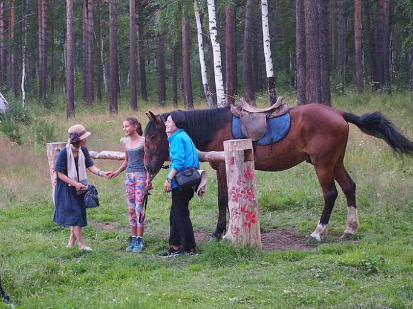  
돈 받고 말을 태워주는 곳도 있었다.

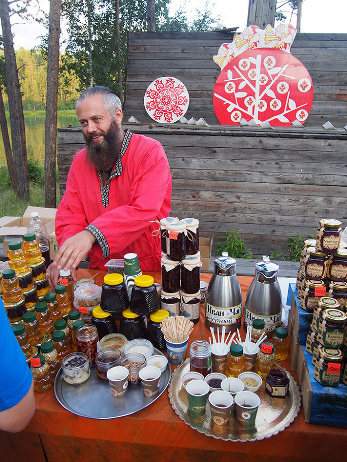  
식당 앞의 즉석 노점상. 주로 차 종류, 열매 종류들이 많았다.

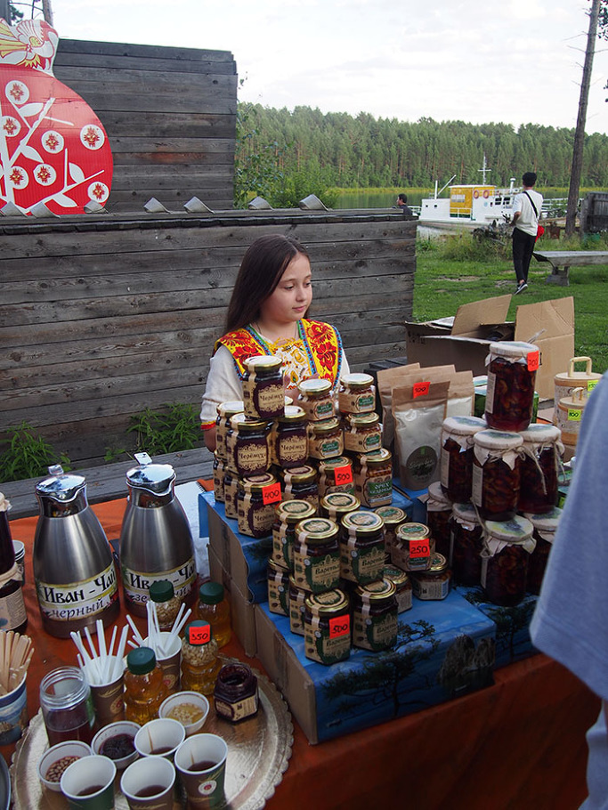  
아버지와 함께 노점상으로 나선 이쁜 딸

공유하기

게시글 관리

**백규서옥\_Blog ver.**

[저작자표시 비영리 변경금지
(새창열림)](https://creativecommons.org/licenses/by-nc-nd/4.0/deed.ko)