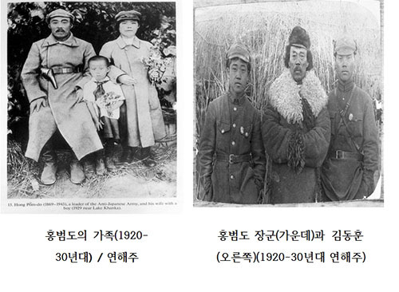

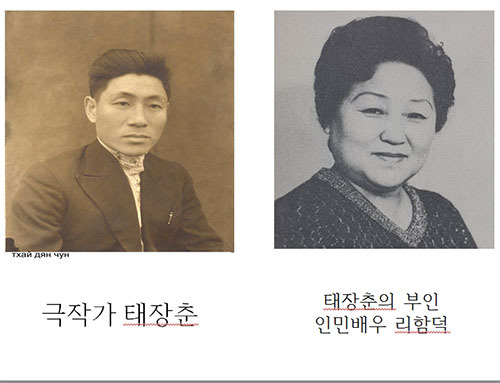

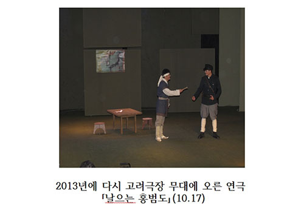

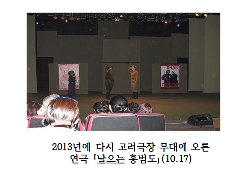  
  
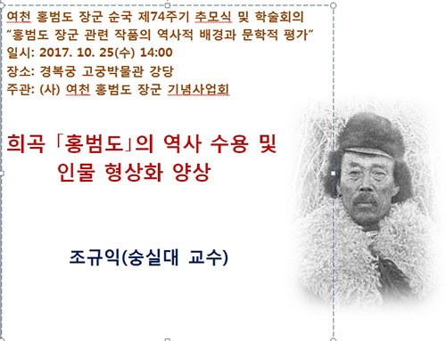

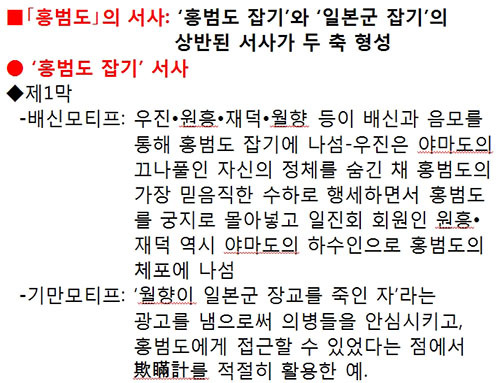

아, 홍범도 장군!

-2017년 홍범도 장군 순국 제 74주기 추모식 및 학술회의 참가기-

 

 

맑은 가을날 오후. ‘여천 홍범도 장군 순국 제74주기 추모 및 학술회의’에서 논문을 발표하기 위해 경복궁 고궁박물관 별관 강당을 찾았다. 꽤 많은 인사들이 모여있었다. 알 만한 사람들도 있었지만, 대부분은 모르는 사람들이었다. 홍범도기념사업회의 이종찬 이사장이야 원래 유명한 분이니 말할 필요도 없지만, 내 논문의 토론자로 나선 최영근 선생(알마틔 고려극장 문예부장), 반병률 교수(외국어대), 김보희 박사, 장세윤 박사(동북아 역사재단 한일관계연구소 소장) 등은 오랜 인연들이다. 특히 희곡 ｢날으는 홍범도｣를 2013년에 연출한 리 알레그 선생이 모스크바로부터 와 있었다. 뜻하지 않은 만남에 감회가 깊었다.

 

제2부 학술회의에서 발표된 논문들은 ｢역사기록 소설 ｢홍범도｣의 역사성｣(윤상원 전북대 교수), ｢희곡 ｢홍범도｣의 역사 수용 및 인물 형상화 양상｣(조규익), ｢｢홍범도｣를 매개로 하는 체제 옹호의 서사｣(임형모 군산대 겸임교수) 등이었다.

 

1940년대 카자흐스탄 크즐오르다 조선극장의 총연출자 겸 희곡작가 태장춘은 친구였던 시인 조기천의 권유로 희곡 ｢홍범도｣를 쓰게 되었다. 그는 당시 조선극장의 수위장으로 있던 장군을 자신의 집으로 초청하여 그로부터 들은 이야기들을 하나씩 희곡의 소재로 바꾸어 나갔다. 장군은 태장춘의 강력한 권고에 의해 전부터 만들어 온 많은 메모들을 바탕으로 󰡔홍범도 일지󰡕를 만들었고, 태장춘은 그것을 바탕으로 희곡 ｢홍범도｣를 만든 것이다. 그 일지의 원본이 태장춘 혹은 장군으로부터 사라진 뒤인 1958년, 태장춘의 부인 리함덕(고려극장 인민배우)이 베껴 쓴 둥사본 ｢홍범도 일지｣가 이인섭을 통해 교포 작가 김세일에게 전달되었고, 김세일은 이 기록을 비롯한 많은 자료들을 바탕으로 장편소설 󰡔홍범도󰡕를 써서 ｢레닌기치｣에 연재했다. 장군은 태장춘을 만날 때마다 결코 자신을 영웅화하지 말고, 사실을 있는 그대로 쓸 것을 강조했다. 자신보다는 자신 주변의 인물들에 초점을 맞출 것도 요구했다. 말하자면 극작가 나름의 창작성을 인정하지 않고, 희곡을 ‘철저히 사실에 입각한 기록물’로 만들 것을 요구함으로써 희곡 ｢홍범도｣는 일종의 서사문학처럼 늘어져 버렸고, 등장인물도 36명으로 늘어나게 된 것이다.

 

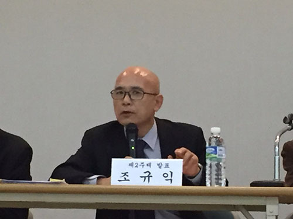  
발표 중

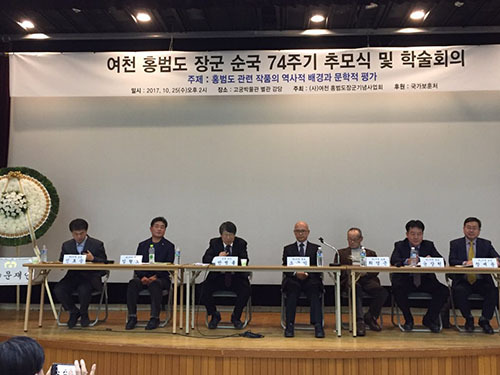  
발표 후 토론

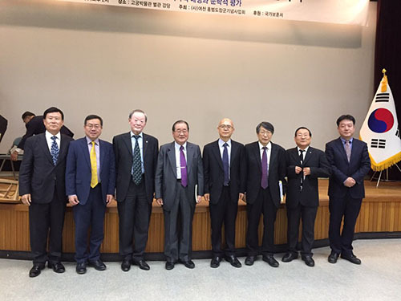  
토론이 끝나고

1942년 완성된 ｢홍범도｣(초연 당시 제목은 ｢의병들｣)는 같은 해 최길춘의 연출로 드디어 무대에 올려졌다. 원래 태장춘은 ｢홍범도｣를 3부작(‘사냥꾼 출신 홍범도의 투쟁을 그려낸 ｢의병들｣-1부/볼셰비키 혁명의 영향 아래 붉은 빨치산의 지휘자가 되는 것-2부/레닌과의 만남 이후 이상적이며 분명한 혁명가 혹은 국제주의자가 되는 것-3부’)으로 완성하려는 생각을 갖고 있었다. 그러나 장군이 1943년 별세하면서 그 계획은 무산되어 버렸다. ｢홍범도｣는 1947년에 이길수의 연출로, 1957년에 채영의 연출로, 1960년에 맹동욱의 연출로 연거푸 무대에 올려졌고, 2013년에는 ‘날으는 홍범도’로 개제(改題)되어 무대에 올려졌다. 이때의 연출가가 바로 이번에 직접 참여한 이 올레그 선생이었다. 바로 그 분이 발표 시간 내내 청중석에 앉아 계셨다.

 

전체 4막으로 이루어져 있는 것이 희곡 ｢홍범도｣다. 나는 이 작품의 핵심을 ‘홍범도 잡기 서사’와 ‘일본군 잡기 서사’의 두 축으로 형성되어 있다고 본다. 그리고 각각의 서사를 형성하는 모티프(motif, 話素)들은 상당히 많았는데, 물처럼 흐르는 이야기를 그려내다 보니 그 모티프들의 짜임이 그다지 치밀하지 못한 흠을 보여주고 있었다. 다음 두 서사들과 각각의 모티프들을 살펴보자.

 

홍범도 잡기 서사

 

\*제1막

-배신모티프: 우진•원흥•재덕•월향 등이 배신과 음모를 통해 홍범도 잡기에 나섬. 우진은 야마도의 끄나풀인 자신의 정체를 숨긴 채 홍범도의 가장 믿음직한 수하로 행세하면서 홍범도를 궁지에 몰아넣고 일진회 회원인 원흥과 재덕 역시 야마도의 하수인으로 홍범도의 체포에 나섬.

-기만모티프: ‘월향이 일본군 장교를 죽인 자’라는 광고를 냄으로써 의병들을 안심시키고 홍범도에게 접근할 수 있었다는 점에서 기만계(欺瞞計)를 적절히 활용했다고 할 수 있음.

 

\*제2막 1장

-날조모티프: 홍범도 처의 편지를 날조하여 홍범도 귀순 시키기.

\*제2막 2장

-염탐모티프: 재덕•원흥•중대부관 등이 밀고꾼 조니를 통해 마을의 의병 참여자들을 염탐.

-사냥모티프: 원흥이 의병들을 지칭하는 ‘백두산 포수’를 들먹이며 묘한 수단으로 홍범도를 잡겠다고 함.

 

\*제3막 1장

-함정모티프: 우진이 거짓으로 의병들과 홍범도를 궁지에 빠뜨림.

일본군 잡기 서사

 

\*제2막 1장

-복수모티프: 야마도가 첩자로 파견한 월향이 동생인 홍범도 부대의 의병 일남으로부터 일본군에 의해 살해된 어머니의 진실을 듣고 홍범도 부대를 위해 일하기로 결심함.

 

\*제2막 2장

-사냥모티프: 연옥이가 자신의 아버지가 백두산 포수로서 못된 짐승을 잡는다고 언급함으로써 ‘일본군 잡기 서사’의 핵심으로 사냥 모티프 제시.

 

\*제3막 1장

-복수모티프: 월향이 홍범도의 설득에는 실패했으나, 우진의 정체를 홍범도에게 경고함으로써 어머니를 죽인 원수 일본군과 배신자 우진에게 타격을 입힘.

-기만모티프: 변장한 홍범도가 일본군을 총공격하기 위한 준비단계로 변장한 채 치강의 집에 들어감으로써 작전에 성공함.

 

\*제4막

-복수모티프: 일본군을 토벌하고 배신자 우진•원흥•재덕을 잡아 처형함.

-사냥모티프: 일본군의 감옥에 갇혀 있던 의병 용준을 구해내면서 ‘훌륭한 포수가 되려면 악한 짐승에게 물려 보아야 한다’는 비유의 말을 던짐. 즉 일본군을 잡으려다 오히려 그들에게 잡혀 고초를 겪은 사실이 이 비유의 핵심임.

 

이런 점들로부터 희곡 ｢홍범도｣의 특징을 다음과 같은 몇 가지 특징을 추출할 수 있었다.

 

1. 살아있는 주인공과 작가의 대화를 통해 주인공의 체험을 작품화 시켰다는 점에서 작품 자체가 실화극 내지 역사극의 성격을 지니게 되었다는 것.

2. 주인공 홍범도는 민중들 사이에 ‘전설적 영웅’으로 자리 잡은 존재였으나, 주인공의 영웅성을 과장하지 말고 주변 인물들의 활약상을 부각시켜 달라는 홍범도의 주문 때문에 작가는 자신의 상상력을 최소화시키고, 작품의 사실성을 극대화시킬 수밖에 없었다는 것.

3. ‘홍범도 잡기’와 ‘일본군 잡기’라는 상반되는 서사들을 작품의 두 축으로 내세우고, 각각의 범주에 ‘배신•기만•날조•염탐•사냥•함정•복수’ 등의 모티프를 설정함으로써 ‘민족에 대한 사랑과 미래에 대한 희망’이라는 주제를 구현할 수 있었다는 것.

4. 실존하던 주인공의 강한 주문에 따라 철저한 사실성의 구현을 지향했으면서도, ‘전설적 영웅’이자 ‘호랑이 잡던 백두산 포수’라는 홍범도의 이미지를 이야기 전개의 미학적 요소로 드러나지 않게 군데군데 끼워 넣음으로써 관객이나 독자의 흥미를 불러일으키는 데 성공했다는 것.

\*\*\*

 

이제 옛날의 ｢홍범도｣를 역사의 뒤안에 묻고, 새로운 세대의 작가가 새로운 시대의 ｢홍범도｣를 만들어 무대에 올림으로써 새로운 차원의 애국심을 고취시킬 단계가 되었다고 보아야 하지 않겠는가.(2017. 10. 25.)

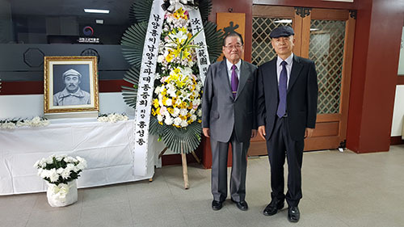  
이종찬 이사장과

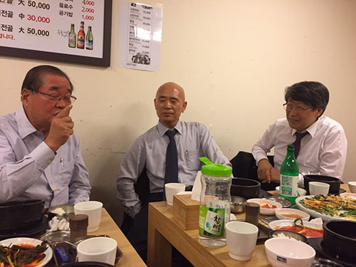  
행사 후 저녁 자리에서 이종찬 이사장, 반병률 교수 등과

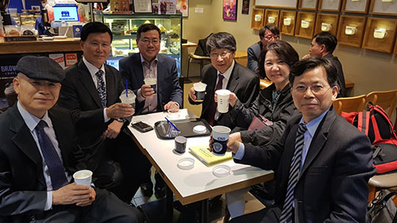  
식사 후 차를 마시며 환담

공유하기

게시글 관리

**백규서옥\_Blog ver.**

[저작자표시 비영리 변경금지
(새창열림)](https://creativecommons.org/licenses/by-nc-nd/4.0/deed.ko)