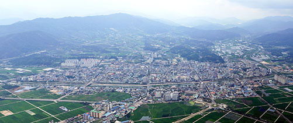
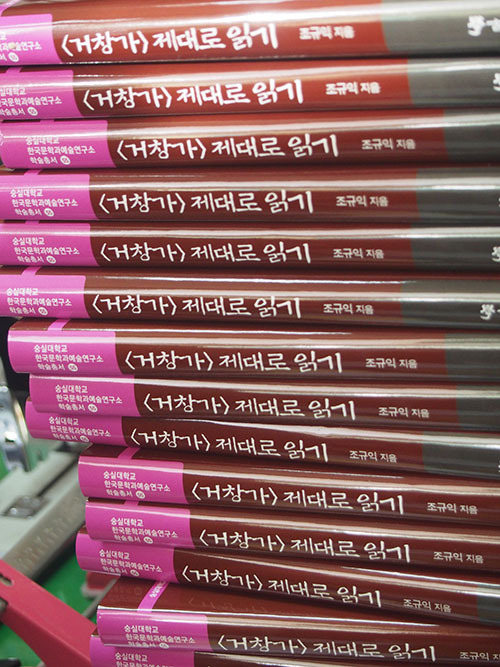
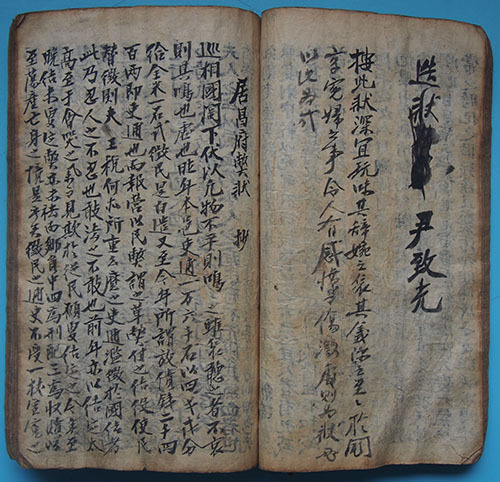
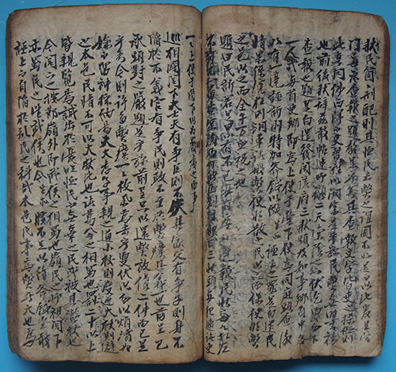
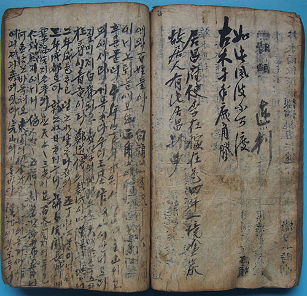
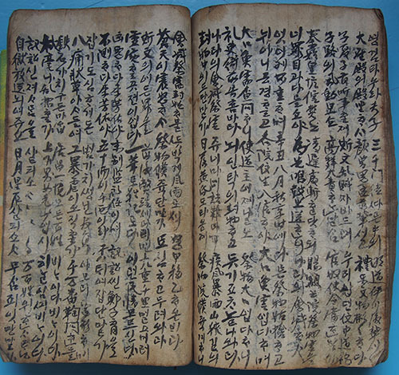

󰡔<거창가> 제대로 읽기󰡕를 내며

 

 

  
거창의 가을

  
거창의 여름

 2000년 10월 23일 <<봉건시대 민중의 저항과 고발문학-거창가>>를 낸 뒤 최근까지 20년 가까운 세월이 흐르는 동안, <거창가>를 잊어버리고 지냈다. 그런데, 지난 해 한국학중앙연구원으로부터 <<한국민족문화대백과사전>>의 ‘거창가’ 항목을 새로 써달라는 부탁을 받고, 학계의 ‘<거창가> 담론’을 대략 훑어보게 되었다. 17년 전의 논점에서 달라진 것이 거의 없었다. 당시 그 책에 공개한 자료들은 <거창가>에 관련된 그간의 의문점들을 완벽하게 해소해줄 만큼 명료했다. 그러나 당시 새롭고 결정적인 자료를 공개한다는 사실에 가슴이 벅차서였을까. 빠뜨린 부분들과 오류들이 적잖았음을 발견하게 되었다. 

 

그 뿐 아니다. 그 당시 나는 새로운 자료들을 탈초(脫草)하고 역주하는 데 꽤 고생을 했는데, 근자 그런 번역을 자신들의 것으로 도용하는 사람들이 있음을 알게 되었고, 심지어 그 자료의 사진들을 자신의 저서에 무단히 갖다 쓰면서도 출처조차 밝히지 않은 연구자도 있었다. 그런 일들이 내겐 다소 충격적이기까지 했다. 일부 사람들의 말처럼 그런 것이 학계의 관행(?)이라면, 나는 관행조차 이해 못하는 국외자인 셈이다. 유쾌하진 않았지만, 그간 내 작업을 소중히 간수하지 못한 책임도 인정하지 않을 수 없었다. 그런 연유로 이번의 책을 내게 된 것이다.

‘조규익 본’으로 명명한 <거창별곡>과, ｢거창부 폐장 초(居昌府弊狀 抄)｣•｢취옹정기(取翁政記)｣•｢사곡서(四哭序)｣ 등을 연결시켜, 당시 거창에서 벌어지고 있던 수령과 아전들의 탐학(貪虐)을 평이하게 설명한 것이 이 책의 핵심이다. 그와 함께 역주 상의 오류를 바로잡아 줌으로써 무단 도용하는 철부지들이 잘못 된 부분까지 그대로 베끼는 비극(?)을 미연에 방지하려는 의도도 있었다.

 

거창 현지를 답사하여 그 땅에 아직도 남아 있는 <거창가>의 여운을 찾았고, 그것들의 상당 부분을 책에 담을 수 있었다. 문자 텍스트로 남아 있는 것이 <거창가> 류의 사실적인 고발문학이라 해도, 현지인들의 거주 공간과 산하(山河)는 그 노래의 진정한 모습과 의미가 투영된 또 다른 텍스트였다. 옛날 은사님께서 ‘공부는 발로 하라’는 말씀을 진지 드시듯 하셨는데, 못난 제자는 그 뜻을 다 늙은 지금에서야 깨달았으니! 하늘에 계신 선생님께서 내려다보시면서 혀를 차고 계시지나 않을지, 부끄러움으로 모골이 송연하다.

 

<거창가>가 비록 지방 관리들의 적폐(積弊)를 고발한 문학이긴 하나, 그건 이미 지나간 시대의 일일 뿐이다. 혹시 당시라면 ‘관민 대립’으로 읽힐 여지도 있겠으나, 민주화가 완벽하게 이루어진 지금에야 ‘적폐 청산과 관민 화합의 서사시’로 이해될 바탕이 이미 마련되어 있지 않은가. 봉건 시대 관청의 적폐에 대하여 항거한 거창 사람들의 정신이야말로 끊임없이 기리고 널리 선양해야 할 자랑 거리 아니겠는가. 지금도 <거창가>를 ‘관(官)에 대한 민(民)의 반발이나 저항’으로만 해석하여 보고도 못 본 체 한다면, 그거야 말로 미련한 처사일 수밖에 없다고 보는 것도 바로 그 때문이다.

 

생각해보라. 임술년(1862) 당시 민란이 거국적으로 일어났지만, 거창 외의 어느 지역에서 <거창가>나 ｢거창부 폐장 초(居昌府弊狀 抄)｣•｢취옹정기(取翁政記)｣•｢사곡서(四哭序)｣ 같은 운문과 산문의 장르들을 통해 자신들의 입장을 당당히 밝히고 사람들의 단결을 도모한 경우가 있었단 말인가. 세계 역사를 훑어보아도 이와 유사한 사례를 발견하기란 쉽지 않다는 것이 내 생각이다. 그런 점에서 역사적 근거들을 잘 갖추어 ‘세계기록문화유산’으로 등재할 수도 있는 일 아니겠는가? 현실적으로 그게 어렵다면, 최소한 매년 추수가 끝난 다음 ‘거창가 역사 문화제’라도 기획하여 ‘거창의 정신’을 전국적 아니 세계적으로 선양할 수 있는 일 아니겠는가? 왜 그런 머리들을 쓰지 못하는지, 국외자로서는 답답할 뿐이다.

 

이 책의 목차와 머리말을 이곳에 옮긴다.  

 

차례

제1부 <거창가>·｢거창부폐장 초｣·｢취옹정기｣·｢사곡서｣란 무엇인가?

1. <거창가>에 대한 오해의 전말 3

2. 왜 ‘거창가’이고, ‘이재가’인가? 8

3. <거창가> 내용의 사실성에 대한 근거 14

4. 붕괴된 수취체제와 민중의 신음 16

5. <거창가> 보조 텍스트로서의 ｢취옹정기取翁政記｣와  
｢사곡서四哭序｣ 55

6. 거창에서 찾아본 <거창가>의 흔적 66

7. <거창가>, 미래를 예비한 을들의 서사적 고발문학 90

 

제2부 텍스트 원문 및 번역문

1. <거창별곡>(조규익본) 원문 97

2. <거창가> 교합 및 현대어 역본 110

3. ｢거창부폐장 초｣ 원문 142

4. ｢거창부폐장 초｣ 역주 147

5. ｢취옹정기｣의 원문과 역주 170

6. ｢사곡서｣의 원문과 역주 174

 

제3부 <거창가>(조규익본) 영인본 179

 

▪ Summary 229

▪ 찾아보기 236

 

머리말

고서의 매력에 빠져 지내던 시절 고서 전문가 이현조 선생의 따뜻한 도움으로 <거창가>를 만났고, 지금부터 만 17년 전인 2000년 10월 23일 <거창가>에 관한 첫 저서를 냈다. 탐서의 현장에서 얻은 ‘사람과 책’이 보물이었다. <거창가>와 ｢거창부폐장 초｣·｢취옹정기｣·｢사곡서｣, 호박 넝쿨에 참외·수박까지 딸려 온 형국이었다.

이미 <거창가>를 두고 몇 분의 좋은 논문들이 있었다. 그러나 그 때까지 <거창가>는 ‘불완전한 텍스트’였다. 그 불완전성은 세 건의 산문들에 압축된 콘텍스트가 해결해 주었다. <거창가>의 마지막 퍼즐은 스스로 풀렸다. 그 시기 거창에서 자행된 탐학의 주체가 부사 이재가李在稼로 밝혀지자 상당수의 문제들이 싱겁게 해결된 것이다. 

작년에, 󰡔한국민족문화대백과사전󰡕의 ‘거창가’를 새로 써달라는 부탁을 받았다. ‘민백’이 나온 지 25년, 필자의 저서 󰡔거창가󰡕가 나온 지 16년만의 일이다. 모든 것들이 전광석화처럼 바뀌는 우리 사회에도 ‘만만디’는 있는 법인가. 그래도 그나마 다행이다.

이전 책의 ‘봉건시대 민중의 저항과 고발문학 거창가’란 제목을, 이번엔 ‘<거창가> 제대로 읽기’로 바꿨다. <거창가>의 텍스트와 콘텍스트를 ‘제대로’ 보아야 그 본질이 파악될 수 있다고 판단했기 때문이다. <거창가>에 노래된 갑질들의 내용을 평이하게 설명했고, 이전 책에서 범한 한문 번역과 주석의 오류들을 수정했다. 그 책에 산문들이 너무 복잡·산만하게 배치되어 일반 독자들은 알아보지 못한 흠도 있었다. 그래서 원문과 역주들을 참고하기 편하도록 제2부에 몰아놓았고, 제1부에서는 <거창가>를 설명하되 그 산문들을 참고자료로 끌어왔다. ｢거창부폐장 초｣를 가사로 풀어 만든 것이 <거창가>이고 문제적 인간들을 풍자한 희문戱文이 ｢취옹정기｣와 ｢사곡서｣이니, <거창가>의 내용을 설명하려면 이들 산문들을 끌어와야 했다. 현지답사를 통해 거창이 <거창가>에 못지않게 중요한 텍스트임도 확인했다. 아직도 그곳엔 그 시절의 아픔이 살아 있었다. 그걸 이 책에 담게 되어 무척 ‘곰지다.’ 그러나 완성을 눈앞에 두고 있던 ‘<거창가>의 작자 및 ｢거창부폐장 초｣․｢취옹정기｣․｢사곡서｣ 등의 필자 추정 문제’는 부득이 다음 책으로 미룬다. 다소 복잡한 이유 때문이다.

 

9년 전 별세하신 김태순 선생님은 생전에 <거창가>를 ‘거창의 최고 자랑거리’라 말씀하시곤 하셨다. 그런 혜안이 없는 요즘을 아쉬워하며, 그 분의 명복을 다시 빌어드린다. 늘 고서를 통해 가르침을 주시는 인산 박순호선생님, 거창박물관의 구본용 관장님, 거창향토사연구소의 김영석 선생님, 정쌍은 선생님, 이산 선생님, 거창군청 이남열 공보담당관님 등께 깊이 감사드린다. 어려운 시절을 함께 해온 학고방의 하운근 사장님과, 책을 멋지게 만들어주신 조연순 팀장께도 감사드린다. 이 책에 ‘숭실 근속 30년’ 자축의 뜻을 담았다. 건강 속에서 즐겁게 살아온 세월이다. 앞으로도 그러리라 믿고 있다.

 

정유년 가을에

백규

공유하기

게시글 관리

**백규서옥\_Blog ver.**

[저작자표시 비영리 변경금지
(새창열림)](https://creativecommons.org/licenses/by-nc-nd/4.0/deed.ko)