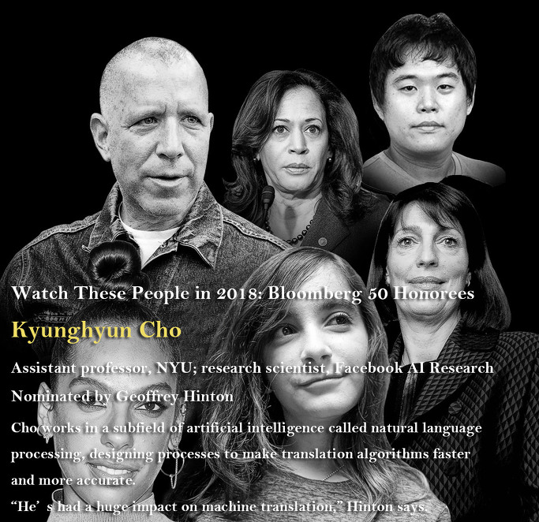

조경현 박사(뉴욕대 교수/페이스북 AI 연구 과학자)가 Bloomberg에서 2018년에 주목해야 할 50인 가운데 1인으로 선정되었다.

추천인인 제프리 힌턴(Geoffrey Hinton) 교수는 다음과 같이 말했다.

“조 박사는 자연 언어 처리 즉 번역 앨고리즘을 더 빠르고 더 정확하게 하기 위한 디자인 과정으로 불리는 인공지능의 한 분야를 연구하고 있습니다. 그는 기계번역 분야에 엄청난 영향을 미쳐 왔습니다.”

 

Kyunghyun Cho

Assistant professor, NYU; research scientist, Facebook AI Research

Nominated by Geoffrey Hinton

Cho works in a subfield of artificial intelligence called natural language processing, designing processes to make translation algorithms faster and more accurate. “He’s had a huge impact on machine translation,” Hinton says.

공유하기

게시글 관리

**백규서옥\_Blog ver.**

[저작자표시 비영리 변경금지
(새창열림)](https://creativecommons.org/licenses/by-nc-nd/4.0/deed.ko)