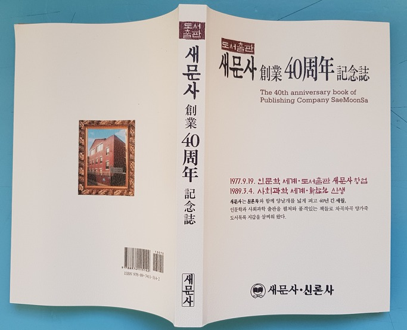
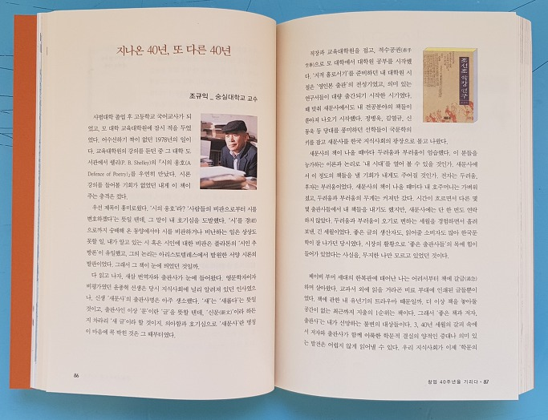
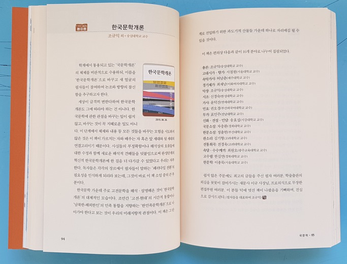
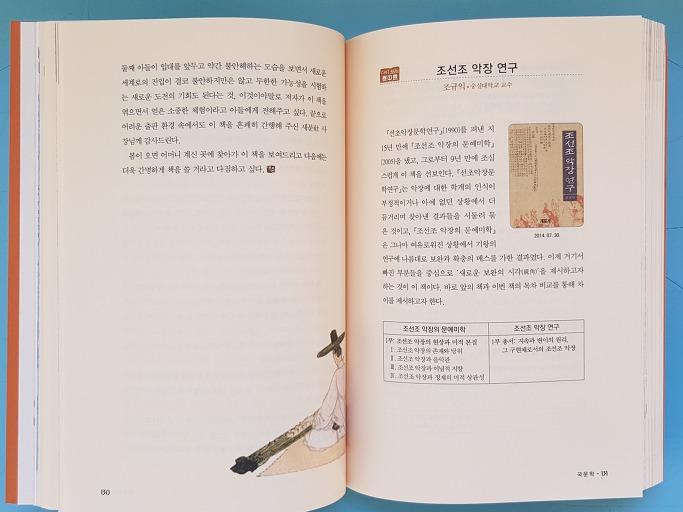
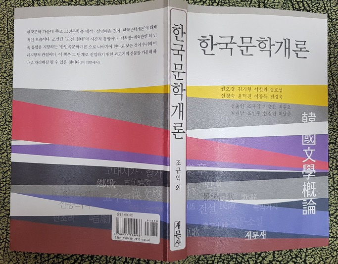
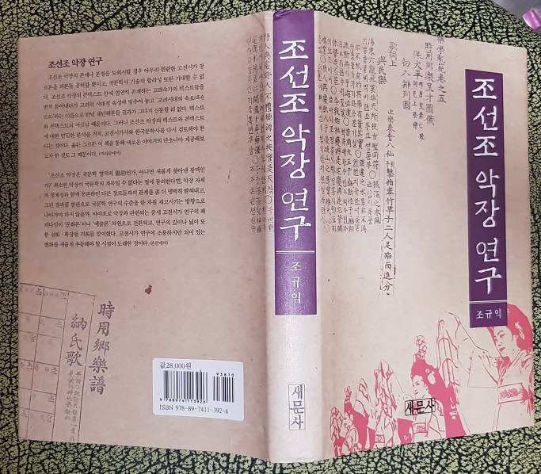

지나온 40년, 또 다른 40년

-새문사 40주년을 축하함

 

 

조규익(숭실대 교수)

 

 

사범대학 졸업 후 고등학교 국어교사가 되었고, 모 대학 교육대학원에 잠시 적을 두었었다. 어수선하기 짝이 없던 1978년의 일이다. 교육대학원 재학 중 그 대학 도서관에서 쉘리(P. B. Shelley)의 <<시의 옹호(A Defence of Poetry)>>를 우연히 만났다. 시론 강의를 들어볼 기회가 없었던 내게 이 책이 주는 충격은 컸다.

 

우선 제목이 흥미로웠다. ‘시의 옹호’라? ‘사람들의 비판으로부터 시를 변호하겠다’는 뜻일 텐데, 그 말이 내 호기심을 도발했다. ‘시’를 경(經)으로까지 숭배해 온 동양에서야 시를 비판하거나 비난하는 일은 상상도 못할 일. 내가 알고 있는 시 혹은 시인에 대한 비판은 플라톤의 ‘시인 추방론’이 유일했고, 그의 논리는 아리스토텔레스에서 발원한 서양 시론의 발판이었다. 그래서 그 책이 눈에 뜨였던 것일까.

 

다 읽고 나자, 새삼 번역자와 출판사가 눈에 들어왔다. 영문학자이자 비평가였던 윤종혁 선생은 당시 지식사회에 널리 알려져 있던 인사였으나, 신생 ‘새문사’의 출판사명은 아주 생소했다. ‘새’는 ‘새롭다’는 뜻일 것이고, 출판사인 이상 ‘문’이란 ‘글’을 뜻할 텐데, ‘신문(新文)’이라 하든지 차라리 ‘새 글’이라 하는 게 맞지 않을까. 아니면 말 그대로 ‘새 문(new gate)’의 뜻일까. 의아함과 호기심으로 ‘새문사’란 명칭이 마음에 콕 박힌 것은 그 때부터였다.

 

직장과 교육대학원을 접고, 적수공권(赤手空拳)으로 모 대학에서 대학원 공부를 시작했다. ‘지적 홀로서기’를 준비하던 내 대학원 시절은 ‘영인본 출판’의 전성기였고, 의미 있는 연구서들이 대량 출간되기 시작한 시기였다. 때 맞춰 새문사에서도 내 전공분야의 책들이 쏟아져 나오기 시작했다. 정병욱, 김열규, 신동욱 등 당대를 풍미하던 선학들이 국문학의 키를 잡고 새문사를 한국 지식사회의 광장으로 몰고 나왔다.

 

새문사의 책이 나올 때마다 두려움과 부러움이 엄습했다. 이 분들을 능가하는 이론과 논리로 ‘내 시대’를 열어 볼 수 있을 것인가. 새문사에서 이 정도의 책들을 낼 기회가 내게도 주어질 것인가. 전자는 두려움, 후자는 부러움이었다. 새문사의 책이 나올 때마다 내 호주머니는 가벼워졌고, 두려움과 부러움의 무게는 커져만 갔다. 시간이 흐르면서 다른 몇몇 출판사들에서 내 책들을 내기도 했지만, 새문사에는 단 한 번도 연락하지 않았다. 두려움과 부러움이 오기로 변하는 상황을 경험하면서 흘려보낸, 긴 세월이었다. 좋은 글의 생산자도, 읽어줄 소비자도 많아 한국문학이 잘 나가던 당시였다. 시장의 활황으로 ‘좋은 출판사들’의 목에 힘이 들어가 있었다는 사실을, 무지한 나만 모르고 있었던 것이다.

 

베이비 부머 세대의 한 복판에 태어난 나는 어려서부터 책에 갈급(渴急)하며 살아왔다. 교과서 외에 읽을 거라곤 비료 부대에 인쇄된 글들뿐이었다. 책에 관한 내 유년기의 트라우마 때문일까. 더 이상 책을 놓아둘 공간이 없는 최근까지 지출의 1순위는 책이다. 그래서 ‘좋은 책과 저자, 출판사’는 내가 선망하는 불변의 대상들이다. 3, 40년 세월의 갈피 속에서 저자와 출판사가 함께 이룩한 학문적 결실의 양적인 증대나 의미 있는 발전은 어렵지 않게 읽어낼 수 있다. 우리 지식사회가 이제 ‘학문의 르네상스’를 넘어 완숙기에 접어 든 것이다.

 

당시 40대 초반이셨을 이규 사장님을 몇 해 전에 뵈었다. ‘처음으로 부탁을 받아’ 새로운 세대의 <<한국문학개론>>을 여러 학자들과 함께 만들었고, 내친 김에 <<조선조 악장 연구>>도 낼 수 있었다. 학생에서 학자로 변신해온 지난 세월은 책에 대한 내 트라우마의 치유 기간이었고, 바야흐로 장년에 접어든 새문사의 성장기였으며, 우리나라 지식사회의 완숙기였다. 이제 누군가 또 다른 ‘트라우마 보유자’를 발굴하여 그와 함께 또 다시 40년을 성장하고 발전하는 것. 이것이야말로 ‘불혹(不惑)’에 접어든 새문사가 계획하고 수행해야 할 당면 과제가 아닐까.

 

 

공유하기

게시글 관리

**백규서옥\_Blog ver.**

[저작자표시 비영리 변경금지
(새창열림)](https://creativecommons.org/licenses/by-nc-nd/4.0/deed.ko)