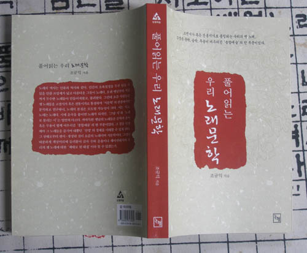

  
  
이번에 새 책 <<풀어읽는 우리 노래문학>>(논형, 2007. 7. 1.)을 펴냈습니다. 전공자는 물론 일반인들에게도 우리 고전시가의 아름다움을 알려드리기 위해 쉽게 쓰려고 노력해 보았습니다만, 독자 여러분께서 어떻게 생각하실지 걱정스럽습니다. 다음은 이 책의 목차입니다.   
  
머리말  
  
1부 우리 노래 다시 읽기  
이별의 비극, 승화된 넋두리의 미학  공무도하가·가시리·원부가  
유리왕이 지은 ‘군–민 소통’의 태평가  두솔가  
훔쳐보기와 일탈의 미학  서동요·쌍화점·간부가  
‘무소유’와 버림의 힘, 그 예술적 발현  우적가  
삶과 죽음의 이중주, 그 예술적 형상화  제망매가  
위대한 모정의 승리  도천수관음가  
비장한 사랑과 죽음, 그 제의적 등가성  불굴가  
‘사랑노래’의 시 문법과 미학적 전형성  단심가  
서울의 찬가, 인간 욕망의 정치적 수사학  신도가  
역사와 현실, 그 경계의 시적 형상화  용비어천가  
성과 속의 서사적 대결과 숭고한 결말  월인천강지곡  
열어줌과 풀어줌  장진주사  
성본능과 일탈의 꿈  만횡청류  
완경의 서사로 위장된 정치적 메시지  관동별곡  
시대정신과 지식인의 대외인식  일동장유가  
패기의 젊음이 엿본 세계, 그 빼어난 표현미  병인연행가  
부패한 지배층과 민중의 저항, 그 미학적 승화  물것노래·거창가  
  
2부 삶과 노래, 그리고 노래문학  
1. 우리 노래문학의 흐름  
2. 우리 노래문학과 자연, 그리고 삶  
  
찾아보기  
  
관심있는 분들의 일독을 권합니다.   
  
2007. 7. 3.  
  
백규 드림

공유하기

게시글 관리

**백규서옥\_Blog ver.**