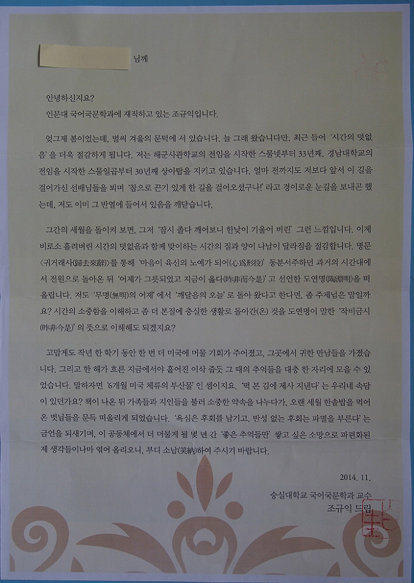

작비금시(昨非今是)의 깨달음

 

 

4년 전(2013. 9.~2014. 2.) 미국에 다녀와서 책(<<인디언과 바람의 땅 오클라호마에서 보물찾기>>, 푸른사상, 2014. 11.)을 한 권 낸 바 있다.(백규서옥 블로그 No.119 참조) 당시 그 책을 교수들에게 증정하면서 나름대로의 소회를 적은 서한도 책갈피에 끼워 보냈는데, 책을 받았다는 반응은 10% 정도였고,  그 서한에 대한 반응은 거의 zero에 가까웠다.

 

‘객쩍은 짓을 했나?’라고 자책하며 한동안 겸연쩍은 시간을 보냈다. 분주한 일상 속에서 그 일을 까맣게 잊어버리고 있었는데, 지난해 ‘숭실 근속 30년’을 맞게 되었다. 나름대로 어떻게 기념을 할까 생각하다가 부랴부랴 새 책(<<<거창가> 제대로 읽기>>, 학고방, 2017. 10. 23.)을 내고, 교수들에게 돌렸다.(백규서옥 블로그 No.3 참조) 학자가 시간의 마디마디 자신의 존재를 알리는 수단으론 책을 능가할 게 없다는 것이 내 철학이기 때문이었다. 이번의 응답률은 대략 20%였다. 그나마 위안이 되었다. 표지를 거들떠보지도 않고 휴지통에 버린 경우가 대부분이었겠지만, ‘당신과 같은 직장에서 한 솥밥을 먹으며 30년을 근속하고 있노라’는 인사는 전해지지 않았을까. 스스로 위안을 삼으며 허전한 마음을 다독여야 했다.

 

그리고 오늘 아침. 논문을 쓰다가 책 한 권이 필요하여 책장을 뒤지던 중, 책들 속에 끼여 질식하기 직전의 <<인디언과 바람의 땅 오클라호마에서 보물찾기>>를 발견했다. 책을 펼치자 ‘이쁘게’ 편집•출력된 서한이 접힌 채로 툭 떨어졌다. 아, 바로 내가 정성스레 작성하여 ‘교수들에게 보낸’ 그 편지였다. 읽어보니, 숫자(33→36/30→33)만 바꾸면 현재의 내 상황을 정확히 드러낼 만한 내용이었다. 교수직이 얼마나 ‘따분한’ 생활인지, 이 글을 읽고 비로소 깨닫게 되었다. 이 편지를 버리기가 너무 아까웠다. 그래서 숫자만 바꿔 이곳에 올리고, 그 때 그 편지와, 그 글에서 숫자만 바꾼 ‘숭실 근속 30년의 인사장’을 늦었지만 이곳에 올린다.

 

                                                       \*\*\*\*\*\*

 

        님께

 

 

안녕하신지요?

인문대 국어국문학과에 재직하고 있는 조규익입니다.

 

엊그제 여름이었는데, 벌써 겨울의 한복판에 서 있습니다. 늘 그래 왔습니다만, 최근 들어 ‘시간의 덧없음’을 더욱 절감하게 됩니다. 저는 해군사관학교의 전임을 시작한 스물넷부터 36년째, 경남대학교의 전임을 시작한 스물일곱부터 33년째 상아탑을 지키고 있습니다. 얼마 전까지도 저보다 앞서 이 길을 걸어가신 선배님들을 뵈며 ‘참으로 끈기 있게 한 길을 걸어오셨구나!’라고 경이로운 눈길을 보내곤 했는데, 저도 이미 그 반열에 들어서 있음을 깨닫습니다.

 

그간의 세월을 돌이켜 보면, 그저 ‘잠시 졸다 깨어보니 한낮이 기울어 버린’ 그런 느낌입니다. 이제 비로소 흘려보낸 시간의 덧없음과 함께 맞이하는 시간의 질과 양이 나날이 달라짐을 절감합니다. 명문 <귀거래사(歸去來辭)>를 통해 ‘마음이 육신의 노예가 되어(心爲形役)’ 동분서주하던 과거의 시간대에서 전원으로 돌아온 뒤 ‘어제가 그릇되었고 지금이 옳다(昨非而今是)’고 선언한 도연명(陶淵明)을 떠올립니다. 저도 ‘무명(無明)의 어제’에서 ‘깨달음의 오늘’로 돌아 왔다고 한다면, 좀 주제넘은 말일까요? 시간의 소중함을 이해하고 좀 더 본질에 충실한 생활로 돌아간(온) 것을 도연명이 말한 ‘작비금시(昨非今是)’의 뜻으로 이해해도 되겠지요?

 

꽤 오래 전에 귀한 자료(<거창가>)를 입수한 뒤 책 한 권과 논문 여러 편을 낸 바 있으나, 다른 데 신경을 쓰다가 그 귀한 것을 그만 10년 넘게 망각의 늪에 빠뜨려 놓고 있었습니다. 최근 새로 쓴 글들을 하나로 엮고, 오독(誤讀)•오역(誤譯)을 바로잡아 새 책을 내게 되었습니다. ‘떡 본 김에 제사 지낸다’는 우리네 속담이 있던가요? 책이 나온 뒤 가족들과 지인들을 불러다가 소중한 약속을 나누다가, 오랜 세월 한솥밥을 먹어 온 벗님들을 문득 떠올리게 되었습니다. ‘욕심은 후회를 남기고, 반성 없는 후회는 파멸을 부른다’는 금언을 되새기며, 이 공동체에서 더 머물게 될 몇 년 간 ‘좋은 추억들만’ 쌓고 싶은 소망으로 파편화된 제 학문적 견해들이나마 엮어 올리오니, 부디 소납(笑納)하여 주시기 바랍니다.

 

2017. 12. 31.

 

숭실대학교 국어국문학과 교수

조규익 드림

공유하기

게시글 관리

**백규서옥\_Blog ver.**

[저작자표시 비영리 변경금지
(새창열림)](https://creativecommons.org/licenses/by-nc-nd/4.0/deed.ko)