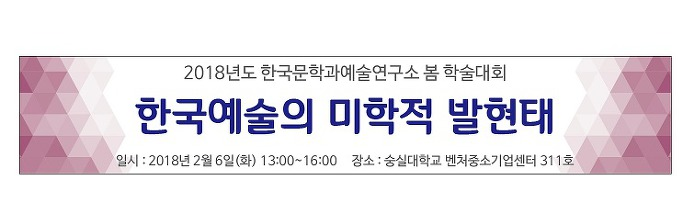

2018년도 한국문학과예술연구소 봄 학술대회에 여러분을 모십니다. 함께 모여 학술의 새로운 조류를 체험하시고, 저녁에는 맛있는 음식을 앞에 두고 자유로운 담론을 펼치도록 하십시다. 여러분의 많은 참여 부탁드립니다.

 

 

■일시: 2018년 2월 6일(화) 13:00~16:00

■장소: 숭실대학교 벤처중소기업센터(벤처관) 311호

 

12:30~13:00 등록

13:00~13:20 개회사: 조규익(한국문학과예술연구소장),  사회: 문숙희

 

기획 발표: 한국예술의 미학적 발현태,   사회: 문숙희(숭실대)

 

13:20-13:50

문학작품의 회화 표현을 통한 시대 문화 발현

발표 조인희(도쿄대학 동양문화연구소 연구원) / 토론 박효은(고려대)

 

13:50-14:20

순조 대 이후 춘앵전의 변모양상-1930년대 춘앵전 기록서를 중심으로

발표 김꽃지(한국전통문화연구원 연구원) / 토론 성영애(숭실대)

 

14:20-14:50

1931년 영상자료에 기초한 향령무의 재현가치

발표 손선숙(숭실대) / 토론 강기화(한예종)

 

14:50-15:00 휴식 및 정리

 

15:00-15:30

李匡師)의 書訣과 禮道의 생명미학-意象과 意境의 變奏를 중심으로

발표 김연재(공주대학) / 한윤숙(성균관대)

 

 

자유 발표,   사회: 하경숙(선문대)

 

15:30-16:00

이덕형의 <죽천행록> 재론

발표 김일환(동국대) / 김지현(광운대)

 

16:00-16:30

대립인유를 통해 본 신동엽 시와 오장환 시 연구

발표 이대성(서강대) / 박동억(숭실대)

 

 

16:30-16:50 휴식 및 정리

16:50-18:00 종합토론(좌장: 조규익)

18:00~ 만찬

공유하기

게시글 관리

**백규서옥\_Blog ver.**

[저작자표시 비영리 변경금지
(새창열림)](https://creativecommons.org/licenses/by-nc-nd/4.0/deed.ko)