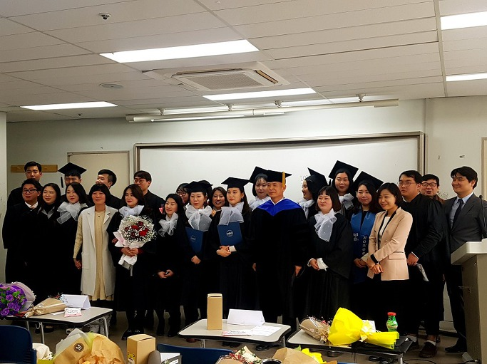

사랑하는 2014학번 졸업생 여러분!

 

학부 졸업생들과 함께

 

성공적으로 학창생활을 마무리한 14학번 여러분에게 따뜻한 축하를 보냅니다. 무엇보다 자녀들을 잘 길러주시고 대학교육까지 책임 져 주신 학부모님들께 감사드리고, 이 자리에 함께 해 주신 교수님들, 재학생 여러분에게도 고마움을 표합니다.

 

어제 밤 저는 대학생활에 대한 기대와 젊음의 열정으로 빛나던 여러분의 새내기 시절을 떠올려 보았습니다. 덧없이 흐르는 시간의 여울에 밀려 여러분과 이별하는 자리에 서게 되었습니다. 혹시 시간의 무상함을 나 혼자만 느끼는 것인가요? 여기 계신 교수님들 가운데 제가 가장 먼저 ‘쓸쓸한 계절’에 접어들었기 때문일까요? 여러 교수님들을 대표하여 여러분에게 석별의 정을 담아 한 말씀 드려야 하는 책임을 지게 된 것 또한 그런 이유 때문이리라 생각합니다.

 

지금 우리는 정신없는 변화의 시대에 살고 있습니다. 자고 일어나면 어제의 가치기준이 달라져 있는 오늘을 발견합니다. 내일은 또 어떤 변화가 우리 주변에서 일어날지 모른다는 불안감에 우리 모두 사로잡혀 있습니다. 사물인터넷이나 인공지능, 빅데이터 등이 그 변화를 주도하는 4차 산업혁명의 시대가 이미 개막되었다고 하지만, 미래를 알 수 없는 데서 오는 불안감은 갈수록 커져가고 있습니다.

 

그러나 지금 4차 산업혁명에 대한 준비가 충분한 나라는 없습니다. 우리나라도 그런 나라들 가운데 하나일 뿐입니다. 그러다 보니 일자리가 충분치 못하여 많은 젊은이들이 상당 기간 실의의 나날을 보낼 수밖에 없는 현실입니다. 이건 이공계나 인문계 모두 함께 겪는 고통이라고 봅니다. 그러나 저는 지금이 고도지식정보화 단계에서 4차 산업혁명으로 넘어가는, 일종의 과도기 혹은 조정기라고 생각합니다. 여러분이 공부한 인문학이 조정기를 거친 미래의 대한민국에 긴요하게 쓰일 시기가 조만간 도래한다고 보는 것이 제 판단입니다. 그리하여 미국이나 일본 등 선진국 수준으로라도 인문학의 수요가 늘어나는, 괜찮은 시대가 조만간 시작될 것이라 생각합니다.

 

지금 일자리를 갖고 교문을 나서는 사람이라고 안심해선 안 되고, 일자리를 구하지 못했다고 실망해서도 안 되는 것은 변화의 바람이 어느 곳을 향할지 제대로 알지 못하기 때문입니다. 그러나 길게 보아 인문학의 창조적 소양과 역량을 갖춘 여러분이야말로 조만간 찾아올 새로운 시대의 새로운 기회들을 많이 포착하게 되리라는 것이 우스갯말로 ‘수렵채취시대에 태어나 농경시대, 산업화시대, 정보화시대, 고도지식정보화시대를 거쳐 오며 변화의 속성을 체험했다고 자부하는’^^ 제 판단입니다. 일단 사회에 나가 크게 변하는 사회의 조류와 용감하게 부딪쳐 보라고 권고하는 것도 그런 이유 때문입니다.

 

학교가 온실이었다면, 사회는 밀림입니다. 학생에서 사회인으로 신분이 바뀌는 지금이야말로 여러분 스스로 내면의 혁명적 변화를 만들어야 하는 순간입니다. 여러분에게 다가오는 내일은 오늘과 다를 것이 분명합니다. 일방적으로 배려를 받아 온 기존의 시간대에서 부모, 형제, 이웃 등 여러분을 둘러싸고 있는 모든 사람들을 배려해야 하는 시간대로 180도 전환되기 때문입니다. 우리 교수들이 지난 4년 간 중점을 두어 가르친 것도 바로 그런 주체적 의무감의 함양이었습니다.

 

과거 여러분의 선배들과 석별의 정을 나누는 자리에서 저는 그들에게 ‘10년 후에 만나자’는 약속을 먼저 건네곤 했습니다. 저 자신도 그러했지만, 통계적으로 대학 졸업 후 10년이 지나면 대부분 자리를 잡고 사회적 정체성을 확보하게 된다는 점을 확인했기 때문입니다.

 저는 여러분을 믿습니다. 여러분의 꿈과 능력을 믿습니다. 함께 약속합시다. 앞으로 10년 후인 2027년, 저는 멋진 칠순잔치를 열고 그 자리에 여러분을 주빈(主賓)으로 초대하겠습니다. 그 때 멋진 모습으로 저를 찾아 주기 바랍니다.

 

이제 출항의 돛을 높이 달고 용감하게 망망대해로 나가십시오. 저는 여러분의 늠름한 뒷모습에 언제까지라도 ‘파이팅!’을 외치겠습니다. 용감하고 지혜로운 여러분의 앞날에 신의 보살피심과 행운이 함께 하길 기원합니다. 고맙습니다.

 

2018. 2. 9.

 

조규익

공유하기

게시글 관리

**백규서옥\_Blog ver.**

[저작자표시 비영리 변경금지
(새창열림)](https://creativecommons.org/licenses/by-nc-nd/4.0/deed.ko)