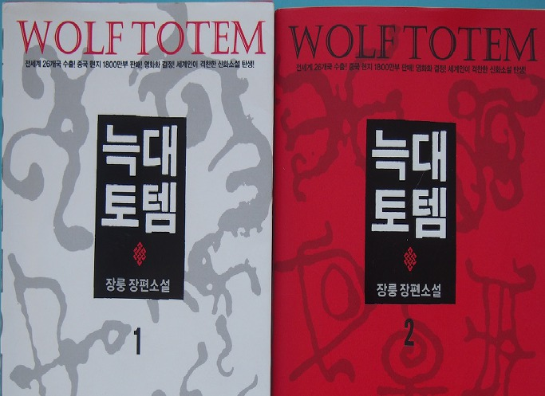
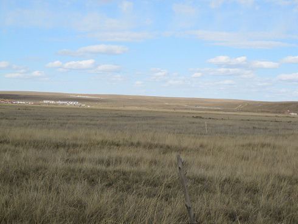

 소설인가? 생태학 보고서인가?

-‘늑대토템(狼圖騰)’에 대한 존재론적 질문-

 

                                                                                                                         조규익(국어국문학과 교수)

 

 

 

토템은 아버지를 대치한 최초의 형식이었을 것이고, 신은 아버지가 인간의 모습을 되찾은 후대의 형식이다. 모든 종교 형성의 뿌리인 아버지에 대한 동경으로부터 신 관념이라는 새로운 창조가 일어난 이유는 시간이 경과함에 따라 아버지에 대한 관계, 그리고 아마 동물에 대한 관계에서 본질적인 변화가 일어났기 때문일 것이다.

-S. 프로이트, 󰡔토템과 타부󰡕에서-

 

 

Ⅰ

 

수만 년 거센 바람이 빗질하여 키워낸 목초로 수많은 초식동물들을 키워내던 몽골 초원. 인간의 짧은 안목과 인색한 이기주의를 한 치도 허용치 않던 원초의 공간이 바로 그곳이었다. 그 자연이 허락한 먹이사슬의 꼭짓점에 지금은 인간이 앉아 있으나, 늑대가 그 공간을 지배하며 인간에게 생존경쟁의 원리를 생생하게 가르쳐 주던 한때가 있었다. 생존의 원리에 대한 정당한 명분을 뺏기지 않으려는 늑대와 한사코 빼앗으려는 인간 사이에 ‘피 터지는’ 갈등과 싸움이 벌어지던 초원. 그곳에서의 싸움은 인간과 늑대 전사들 간의 명백한 게릴라전이었다.

‘신이 허여한’ 발톱과 이빨, 그리고 전략을 보유한 늑대는 초원의 챔피언이었고, 그 왕좌는 자연과 세계를 위해 아니 궁극적으로 인간을 위해 유지되는 것이 옳았다. 늑대와 달리 이렇다 할 발톱도 이빨도 없이 강자에 대한 대책 없는 복수심과 교활한 욕심만 그득한 것이 인간의 내면이다. 그런 늑대와 인간이 초원이란 한 공간에서 주도권 싸움을 벌여온 것이다. 싸움의 룰이 대체로 공정했던 초반과 달리, 갈수록 늘어나는 인간 욕망의 부피에 그 공정성은 훼손되고 말았다. 주도면밀하다는 점에서 늑대와 인간은 비슷하지만, 늑대는 본능인 반면 인간은 후천적인 교육을 통해서만 습득할 수 있다는 점이 차이라면 차이일까. 어쨌든 생태계란 한때 잘 ‘때려먹고 살다가’ 없어져도 괜찮은 ‘허약한 공동체’가 아니기 때문에, 늑대와 인간은 최선을 다해 싸워야 했다. 인간의 짧은 안목으로 볼 때, 늑대와 인간은 서로를 죽여야 살아남는 ‘제로섬 게임’의 경쟁자들이다. 불행하게도 상대방을 절멸(絶滅)시킬 경우 스스로의 삶도 유지될 수 없다는 점을 아직도 깨닫지 못하는 것이 인간이다. 그러나 늑대와 인간의 공존은 당위이자 존재의 원리다. 늑대와 인간이 불안하게 공존하는 초원은 먹이사슬의 꼭짓점을 차지하기 위해 양자가 결전을 벌이는 최종 공간인가. 아니면, 최강의 경쟁자들끼리 공존할 수밖에 없음을 깨닫고 궁극적인 화해에 도달하게 될 최후의 공동체인가. 챔피언 결정전에 나선 두 선수들의 피나는 싸움을 관찰하여 기록한 것이 이 글, 소설 아닌 생태 관찰 보고서로서의 󰡔늑대토템󰡕이다.

늑대도 인간도 생태계를 유지해가는, 동등한 위치의 구성원일 뿐이다. 따라서 자연과 인간을 연결해주는 학문이 생태학이라는 상식은 인간의 존재를 너무 크게 부각시킨다는 점에서 어쩌면 오류일지도 모른다. 근원적으로 인간 역시 자연의 한 요소에 불과하므로 자신들을 자연과 분리된 특권적 존재로 생각해야 할 이유는 전혀 없기 때문이다. 자연을 자연스럽게 바라보거나 유지시키는 학문이 생태학이라면, 인간을 예외적인 존재로 단정해 놓고 자연과 분리시킬 필요도 분리시켜서도 안 되는 것이다. 그래서 중국 지식청년 출신의 장룽(姜戎)이 30여년을 올론 초원 늑대들의 생태를 관찰하여 완성시킨 󰡔늑대토템󰡕은 ‘늑대를 통한 인간의 생태학적 보고서’인 셈이다. 달리 말하자면, 이 책은 늑대와 인간이 공존해야 한다는 생태계의 당위를 제시함으로써 ‘인간의 이기적 행태’에 대한 고발과 늑대토템사상의 차원 높은 합리성을 강조한 ‘인문학적 보고서’라 할 수 있는 것이다.

 

몽골늑대

  
몽골초원

Ⅱ

 

작가 장룽은 21살의 지식청년 천전으로 바뀌어 무대인 몽골 초원에 등장한다. 내몽골 변경 올론 초원의 인민공사 목축대대에 자원하여 배속된 실제 지식청년 장룽은 그곳에 11년간 머물면서 자신을 매료시킨 늑대의 생태와 정신을 체험적으로 관찰하게 된다. 초원에서 늑대와 함께 자라고 늙어온 빌게노인의 가르침을 받음으로써 늑대의 정신을 이해했을 뿐 아니라 유목민과 농경민 사이의 극복할 수 없는 거리 또한 절감했다.

실제로 그는 늑대를 만나면서 두 가지 사실을 절실히 깨달았다. 늑대는 초원의 혼을 주도했고, 그것이 강인한 생명력과 전투력을 가능케 한 유목정신으로 승화되었다는 것. 즉 유목 생활 내부의 냉혹한 생존경쟁은 강한 늑대와 군마, 강한 무사들을 지속적으로 키워 왔으며, 그것들을 바탕으로 낙후되었던 유럽의 로마문명이나 중세의 봉건제도를 무너뜨림으로써 세계사에 큰 충격을 줄 수 있었다는 것이 그 첫 번 째 깨달음이었다.

그 반대로, 냉혹하고 강한 경쟁력을 갖추지 못함으로써 형편없이 나약해졌고, 그 나약성으로 인해 비약적인 발전을 기할 수 없는 농경문명의 한계가 중국의 치명적인 결함이라는 것이 그 두 번째 깨달음이었다. 따라서 식량 생산의 면에서 비효율적인 초원을 농토로 바꾸어 곡물생산을 늘이고 목축의 방법을 바꾸려는 국가의 시책이야말로 무한한 발전의 원동력을 꺾는 일임을 주인공은 강하게 주장하지만, 개발 시대의 조류를 혼자서 막을 수는 없었다.

그가 빌게노인을 비롯한 초원의 주민들로부터 배우고, 실제 늑대들의 생태로부터 체득한 것은 초원에 내재되어 오랜 세월 지속해온 생태적 공존의 원칙이었다. 오랜 옛날부터 인간은 초원을 보호하고 초원은 목축을 통해 인간의 생존을 가능하게 함으로써 상호 공존의 토대가 마련되어 있었다. 늑대 또한 초원을 정복하고 인간과 경쟁을 벌이는 존재이긴 하지만, 초원을 해치는 동물들의 개체수를 조절함으로써 목축업을 보호하고 궁극적으로 인간과 이해관계를 함께 한다는 측면에서 3자(초원-인간-늑대)는 공존의 당사자들이기도 했다.

목축대대의 대표 바오순궤이를 설득하는 올론 초원 울지 노인의 말은 그들의 경험에서 우러나온 지혜 그 자체라 할 수 있다.

 

“가장 중요한 일은 목초지를 보호하는 일이고, 이것이야말로 목축업의 근본이지요. 중요한 건 한정된 목초지 안에서 가축 수를 엄격히 통제하는 것이고(…)목초지를 보호하는 관건은 늑대를 지나치게 많이 잡아서는 안 된다는 거지요. 초원에는 풀을 망치는 야생동물이 너무 많아요. 그 중에서도 쥐, 산토끼, 마르모트, 가젤이 가장 심한데, 이런 동물들은 목초지를 파괴하는 큰 화근이 되지요. 늑대가 없으면 쥐나 산토끼가 몇 년 안에 초원을 전부 뒤엎을 수도 있다는 말입니다. 그런데 늑대가 바로 그것들의 천적인지라, 늑대가 있어야 그것들이 활개를 펼 수 없게 되지요. 목초지가 잘 보호되면 목장의 재해 대처 능력 또한 커지게 된답니다.(…)목초지가 좋아서 수분과 토양도 유실되지 않고, 샘이나 작은 강도 물이 마르지 않으니 큰 가뭄을 만나도 마실 물이 부족할 일이 없지요. 풀이 좋으니 자연히 소와 양들도 건강해서 몇 년 간 목장에 병해가 한 번도 발생하지 않았고요. 목장의 생산량이 올라가면 기계 설비를 추가할 능력도 생기니, 우물을 파거나 우리를 지어 재해 대처 능력 또한 덩달아 증강시킬 수 있게 되는 거지요.”

 

사실 ‘목초지를 보호하여 많은 동물들을 기르고 재해에 대비하자는 것’이 울지 노인의 말인 것 같지만, 초점은 말의 이면에 숨어 있다. 즉 ‘늑대를 보호해야 목초지가 보호되고, 목초지가 보호되어야 사람들도 살 수 있다’는 생태적 순환성을 말했고, 그 논리적 연쇄의 출발점에 늑대가 놓여있는 것이다.

그러나 바오순궤이는 “하지만 아직도 늑대에게 의존해 목초지를 보호한다는 말에는 그리 확신이 서지 않는군요. 늑대가 그렇게 큰 역할을 해낼 수가 있단 말인가요?”라고 여전히 늑대의 존재나 능력에 대한 회의와 불신을 드러내고 있다. 초원에서 태어났거나 성장하지 않았기 때문에 초원의 생리를 알지 못하는 사람들을 대신하는 존재가 바오순궤이다. 빌게나 울지 노인은 초원 늑대의 생태를 자신들의 몸처럼 꿰고 있는 사람들이고, 천전은 대도시 출신의 지식청년이지만, 초원 늑대의 생태를 관찰하고 경험한 덕에 바오순궤이와 빌게⋅울지의 사이에서 양자를 통합하면서도 양자를 뛰어넘을 수 있는 통찰적 인식을 갖고 있었다.

그렇다면 늑대의 생태적 특성은 무엇일까. 늑대는 늙거나 약하거나 병든 동족에게 먹을 것을 남겨 주려 애쓴다는 것. 즉 호랑이나 표범보다 결속력이 뛰어나기 때문에 먹을 것이 생기면 무리 전체를 생각한다는 것이 늑대의 가장 큰 특징이다. 인간보다도 오히려 가족을 끔찍하게 챙기고, 심지어 새끼를 낳아 젖을 먹여야 하는 암 늑대까지 챙기는 것이 늑대의 생태적 본성이라는 것이다. 그러다 보니 무리들의 결속력이 강하여 우두머리 늑대가 한 번 울면 100여 마리의 늑대들이 몰려들어 함께 싸우기 때문에 초원에 살던 호랑이도 늑대 무리에게 쫓겨났다는 일화가 있을 정도다.

 

Ⅲ

 

물론 늑대가 방목중인 양떼나 소, 말 등을 공격한다는 점은 초원에 사는 사람들에게 큰 위협이다. 그러나 반대로 가젤이나 마르모트 같은 작은 동물들을 잡아먹음으로써 초원을 보호⋅유지한다는 것은 사람들에게 크게 도움 되는 점이다. 사실 이런 먹이사슬은 자연 환경을 바람직하게 유지하는 최고의 생태 시스템이다. 초원을 망가뜨리는 야생 초식동물들의 개체수를 유지하여 초원을 보호하고, 그 덕에 양들은 자라고, 양떼 덕에 인간의 삶은 안정적으로 유지될 수 있다. 그 점이 바로 생태환경의 유지나 산업발전의 면에서 초원의 늑대가 갖는 장점이다.

그런데, 늑대의 자산이 그것뿐일까. 그렇지 않다는 것이 저자의 주장이다. 당면하게 먹고 사는 문제 이상의 매력적인 생태적 특질을 늑대들은 갖고 있다. 튼튼한 이빨, 발톱, 근육, 그리고 이것들로부터 발휘되는 힘, 그 힘을 몇 배로 키워주는 생태적 특성으로서의 모성애와 가족애, 집단생활 등은 늑대를 단순한 초원의 야수로 머물게 하지 않는다. 늑대 무리는 그들 나름의 규율에 의해 움직이고 지탱되어 나가는데, 그건 일종의 문화라 할 수 있다. 그래서 몽골인들은 늑대로부터 어떤 신성성을 발견했다. 신의 정령(精靈)이 늑대로 화(化)했고, 그 늑대는 인간을 ‘텡그리(tengri)’로 데려다 주는 역할을 한다고 초원 사람들은 믿는다. 말하자면 그들의 내세관이나 신앙에까지 끼어들어 핵심적인 역할을 하는 존재, 즉 토템으로 군림하게 된 것이다.

주인공 천전에게 늑대의 출중한 장점을 역설하는 목동 장지웬의 말도 몽골민족이 오래도록 토템으로 섬겨 온 늑대의 본질을 정확히 보여준다. “몽골초원의 늑대야말로 세계에서 가장 큰 인내력과 끈기를 가진 몽골말은 물론이고, 세계를 뒤흔든 흉노, 돌궐, 몽골의 강인한 기병들까지도 길러낸 주역이었다.”거나 “몽골초원의 늑대들은 초원 사람들에게 강인한 정신력과 탁월한 전투능력, 그리고 가장 출중한 군마를 공급해 주었고, 이 세 가지가 바로 몽골초원 사람들이 세계를 뒤흔들 수 있었던 이유이자 비결”이라는 이들의 대화에는 몽골초원의 늑대에 의해 사실상 조련된 몽골 군마를 소유함으로써 몽골의 기병이 더욱 강인해졌다는 믿음이 들어 있다. 그 뿐 아니라, 늑대 토템 정신의 강점은 중국인들의 유가사상(儒家思想)보다 훨씬 오래 지속되었고, 천연의 연속성과 생명력을 지니고 있다는 사실이다. 유가사상의 체계는 이미 쇠락했지만, 늑대토템의 정신은 서구 선진 민족들의 귀중한 정신적 유산으로 유지되고 있다는 것이다.

특히 몽골민족에게 늑대는 인간과 텡그리를 이어주는 중개자로 인식되어 왔음을 알 수 있다. 오랜 세월 올론 초원의 장례식이 그 증거였다. 목축민이 죽으면 옷을 벗기고 펠트로 말아 묶거나 입은 옷 그대로 달구지에 싣고 나이 든 두 명의 남자가 달구지를 끄는 말에 올라 채찍을 가한다. 달구지가 덜컹거리면서 시체는 땅에 떨어지는데, 그곳이 바로 죽은 이의 영혼이 텡그리로 돌아가는 장지가 된다는 것이다. 그 남자들이 죽은 이의 펠트를 벗기고 시신을 하늘을 향해 똑바로 눕히면 장례의식은 끝나는 것이다. 늑대들이 깨끗하게 육탈(肉脫)시킨 시신으로부터 나온 영혼이 올라가 텡크리의 품에 안기게 된다는 믿음. 그 죽음은 영원한 소멸이 아니라 텡그리의 연회에 참석하여 성스러운 물로 세례를 받고 새 생명을 부여받는다는 믿음이 그것이다. 그것이 초원의 몽골민족이 진정으로 믿고 있는 늑대토템 사상의 핵심이었다.

 

Ⅳ

 

인간의 삶을 가능하게 해주는 자연, 그리고 그 안에서 다양한 생물들과 인간이 조화를 이루며 살아가는 것이 생태계의 원리다. 몽골초원 생태계의 정점에 있는 늑대는 자신들보다 아래쪽에 위치한 동물들의 개체수를 조절함으로써 초원의 황폐화를 막아주고 생태계를 건강하게 유지하는 역할을 한다. 말하자면 늑대는 인간의 적이 아니라 우호적인 협력자인 셈이다. 그 뿐 아니라 그의 강인하고 지혜로운 생태적 습성을 본받은 종족이 치열한 생존경쟁에서 우세한 삶을 이루어 왔음을 역사는 입증해 주지 않는가.

그런 점에서 늑대를 멸종시키지 않고 적정한 선에서 유지하기 위해 ‘늑대토템’의 신앙을 지속시켜 온 초원민족은 얼마나 지혜로운가. 초원에서 열심히 살다가 죽은 인간의 시신이 초원늑대에 의해 해체되고, 남은 영혼이 텡그리로 올라가 새로운 생명을 얻게 된다는 믿음의 체계야말로 또한 얼마나 합리적인가.

생물학자 헤켈(E. Haeckel)의 말대로 ‘진화론자 다윈이 제시한 생존경쟁의 상황에서 이루어지는 모든 복합적인 상관관계들을 연구하는 학문’이 생태학이라면, 초원에서 형성된 늑대 등 다양한 동물들과 인간의 복합적인 상관관계, 혹은 조화로운 공존이야말로 세계의 지속가능성을 위해 유지해야 할 생태적 메커니즘이 아닌가.

풀밭 속에서 10여년의 시간을 험한 늑대와 뒹굴고, 그 기간을 포함하여 30여년을 소모하여 ‘늑대 생태의 바이블’을 완성해낸 작가 장룽이야말로 생태계의 건강한 유지와 보호가 인간의 지속 가능 여부를 결정하는 전제조건임을 몸으로 보여준 ‘위대한 선각자’라 할 수 있지 않을까.

 

장룽 지음, 송하진 역, 󰡔늑대토템 1⋅2󰡕, 김영사, 2015. 11.

공유하기

게시글 관리

**백규서옥\_Blog ver.**

[저작자표시 비영리 변경금지
(새창열림)](https://creativecommons.org/licenses/by-nc-nd/4.0/deed.ko)