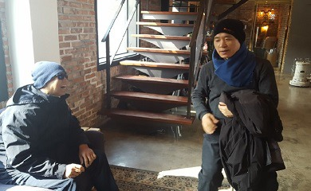
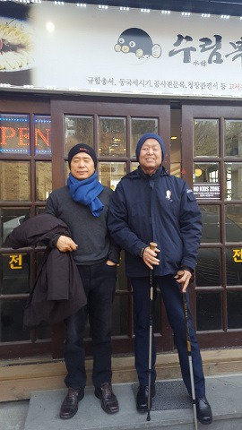

최근 광주의 찻집에서

친구를 보내며

                                                                                                               백규

 

다정하던 친구 김성원이 이승을 떠났다.

내가 마지막으로 다녀 온 다음 날부터

그는 급격히 혼돈에 빠져들었고,

드디어 12일 새벽 돌아오지 못할 먼 곳으로 떠나고 말았다.

오늘 아침 이른 시각

너무나 짧은 발인식을 마치고

그는 뜨거운 불의 정화(淨化) 의식을 거쳐 저승으로,

나는 현실의 원리가 작동하는 일터로 다시 돌아왔다.

 

눈을 감기 나흘 전

병원으로 그를 찾았다.  
그는 나를 보고 싶어했고

나 역시 그가 몹시 궁금했다.

서로 두 손을 마주 잡은 채

우리는 힘주어 몇 마디 말을 나누었다.

밝은 웃음이 모처럼 그의 얼굴에 번졌다.

언젠가 그에게 처음으로 이런 말을 꺼낸 적이 있었다.

“학교 졸업 후 지금껏 나는 인천 방향으론 소변도 보지 않았노라!”고.

별 생각 없이 내뱉은 말 같지만,

사실 그 속에는 어린 시절 그곳에서 겪은 고통과

마음의 상처가 듬뿍 실려 있었다.

그는 그 말이 마음에 걸렸던 것일까.

그동안 나의 그 말을 마음에 담아두고 있었음을

병상 머리맡에서 처음으로 알게 되었다.

그는 갑자기 폰을 집어 들더니

어느 부분엔가 저장해 놓은 사진 한 장을 찾아 더듬거렸다.

마지막 순간 내게 보여주려고 잘 갈무리해 두었겠지만,

정신이 혼미해진 탓인지 결국 사진을 찾아내지 못하였다.

어릴 적 동생을 안고 있는 사진이라는데,

무뎌진 손끝과 흐려진 정신으론 끄집어 낼 수 없었다.

아버지의 사업 실패로 엉망이 된 자신의 어린 시절을 통해

마지막으로 내 마음의 상처를 위로하려는, 속 깊은 마음씀이었으리라.

 

그 뿐 아니다.

모든 면에서 참 사려 깊은 그였다.

좋은 일이든 궂은일이든

친구들 일이라면 빠진 적 없었고,

함께 어울리기 좋아한 그였다.

자신이 정한 원칙은 한 치도 어김없이 지키려 했고,

적당히 타협하지 않으려 했다.

친구들에게도 그렇게 해주길 원하다 보니,

그들 역시 때로는 지치고 힘들었으리라.

그래도 늘 넉넉한 웃음으로

모임의 분위기를 부드럽게 만들곤 했다.

 

누군들 그렇지 않을까만,

삶과 이승에 대한 애정이 유독 도타운 친구였다.

그래서인가.

이렇게나 빨리 홀로 먼 길 나선 그가 안쓰러울 뿐이다.

붙잡는 이승의 손길을 지긋이 뿌리친 채,

그는 떠났다.

삭막한 세상을 함께 할 친구 하나가 줄어든 것이다.

이 상실감이 제대로 치유되지 못한 채 절망으로 연결된다면,

그 때문에 나 또한 세상을 뜨게 되리라.

허무의 심연에서 헤어나지 못한다면,

나 또한 이승에 대한 집착을 버리게 되리라.

 

오늘

햇살은 이리도 좋은데,

그대는 어디쯤 가고 있는가.

길가에 주막 한 채라도 있거든

병마 탓에 그동안 끊었던 막걸리 한 사발이라도 사 마시며

얼큰 취한 목소리로 <희망가> 한 자락이라도 불러 보시게나,

사랑하는 친구여!

 

"이 풍진 세상을 만났으니 너의 희망이 무엇이냐

부귀와 영화를 누렸으면 희망이 족할까

푸른 하늘 밝은 달 아래 곰곰이 앉아서 생각하니

세상만사가 춘풍 중에 또다시 꿈같도다.“

 

  2018. 3. 14.

 성원을  보내며

공유하기

게시글 관리

**백규서옥\_Blog ver.**

[저작자표시 비영리 변경금지
(새창열림)](https://creativecommons.org/licenses/by-nc-nd/4.0/deed.ko)