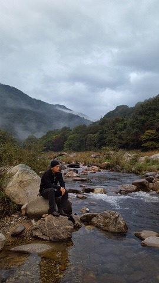
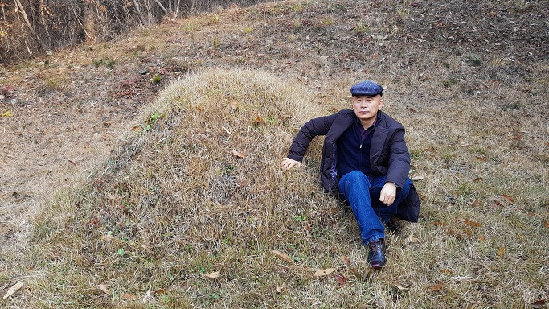
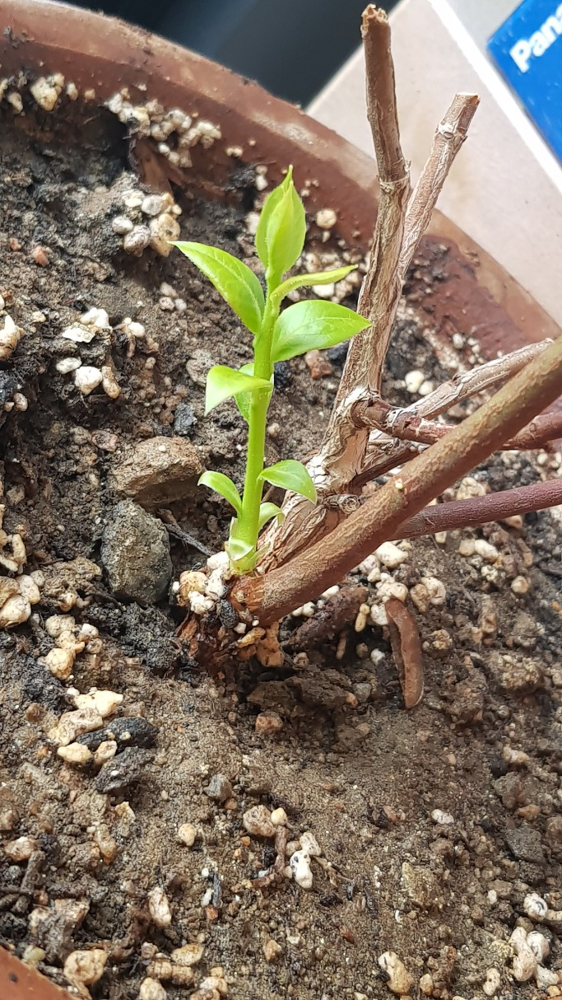

  
흘러가는 물을 보며

  
부모님 묘소에서

많은 죽음들을 기억하며

 

 

                                                                                                                                조규익

 

 

두 해 전에 어머니를 보내드렸다. 올해 가까운 친구 김성원이 떠났고, 며칠 전엔 대학원 시절 함께 공부하던 정명기도 떠났으며, 최근 들어 이런 저런 이유로 ‘비명(非命)’에 떠나는 멀고 가까운 이웃들을 자주 목격하게 된다. 그간 죽음에 대한 고민이나 사색을 통해 나름대로 ‘의미부여’의 방법을 터득했다고 자신하기 때문일까. 이젠 어떤 죽음도 비교적 담담히 받아들일 수 있게 되었다. 

 

자연사(自然死), 병사(病死), 사고사(事故死) 모두 항거할 수 없는 상황의 산물이다. 또한 개인적•사회적 이유로 인한 최근의 자살들 역시 따지고 보면 어쩔 수 없는 상황의 산물일 것이다. 어떤 경우이든 삶과 죽음에 대한 생각을 ‘반듯하게’ 챙겨 갖고 있지 않다면, 견디기 어려운 광경들을 주변에서 자주 목격하는 요즈음이다. 사실 보는 사람의 마음을 좀 더 복잡하게 만드는 것이 자살이다. 어쩌면 스스로의 자존심을 지킬 수 없고, 그동안 지탱해오던 사회적 자아를 유지할 수 없는 절망적 상황에서 택할 수 있는 유일한 출구가 자살일 것이기 때문이다. ‘절망이야말로 죽음에 이르는 병’이라는 키엘케골의 말도 바로 그런 점을 지적했으리라.

 

‘가차 없는 죽음의 위협’으로부터 도피하고자 하는 본능 때문에 인간은 종교에 귀의한다고 한다. 사실 죽음이 매우 두려운 것은 ‘죽음 이후의 세상’을 알 수 없기 때문이다. ‘죽음 이후의 삶’을 예비해야 한다는 절박함이 지금도 사람들을 교회로, 성당으로, 사찰로 이끄는지 모른다. 돈독한 논리체계로 사후 세계를 치밀하게 설계해 온 종교들은 사람들에게 그것을 믿으라고 권유한다. 그래서 대부분의 사람들은 반신반의하면서도 그 세계의 주재자인 신을 받들고 있을 것이다. 그 믿음이 강할수록 죽음에 대한 두려움이 경감되리라고 믿으면서 말이다. 죽음에 대한 두려움이 인간의 내면에 남아 있는 한 종교는 계속 번창할 것이라고 보는 것도 그런 이유에서다.

 

자연물로서의 인간의 삶은 참으로 짧고, 그 가운데 가치 창조를 위해 쓸 수 있는 시간은 더욱 덧없다. 하기야 한갓 미물로서 ‘무슨 가치를 창조하겠노라’ 뜻을 세우는 것 자체가 오만하고 가당찮은 일일지도 모른다. 자신이 그저 하나의 ‘던져진 존재’라는 점을 깨닫기만 한다면, 겸손한 자세로 ‘생명의 장(場)’인 세상에 폐를 끼치지 않고, 조용히 살다 사라지련만. 대부분은 주어진 생애 동안 ‘기고만장’하여 같은 공간의 동지들과 멱살잡이로 날밤을 지새우기 마련이다. 소수는 죽음의 순간에 이르러서야 자신을 돌아보고 깨달음을 얻지만, 대부분은 삶에 대한 헛된 집착으로 그런 깨달음조차 얻지 못하는 것 아닌가.

 

메멘토 모리(memento mori). ‘(그대는) 죽어야 하는 존재임을 기억하라!’는 라틴어 경구(警句)다. 아침저녁 열심히 가꾸어 오던, 꽃 같은 얼굴이 한 줌 재로 바뀌어 풀밭에 뿌려질 때, 풍채 좋던 친구가 ‘주검 옷’에 둘둘 말려 석자 깊이의 무덤으로 내려 갈 때, 그들을 바라보며 비로소 내 모습을 깨달아야 한다. 그들을 보며, ‘생자필멸(生者必滅)’의 자연법칙에서 나만은 예외일 것이라는 착각으로부터 빠져 나와야 한다. 그 자리에서 시신으로 바뀐 그들과 나의 ‘자리바꿈’을 통해 비로소 ‘삶과 죽음의 우주적 이치’를 깨닫게 될 것이며, 그 순간부터 죽음은 두렵지 않게 될 것이다.

 

어떻게 살아야 하며, 어떻게 죽어야 할까? 하나, 둘 떠나는 이웃들을 보며, 그 순번이 내게 돌아올 때까지 나는 어떤 자세로 살아갈 것이며 어떻게 그 순간을 맞아야 할지, 이제 결정할 때가 되었음을 깨닫는다. 오늘 할 일을 내일로 미루지 말자. 메멘토 모리!!!

  
등걸에서 새싹이...

공유하기

게시글 관리

**백규서옥\_Blog ver.**

[저작자표시 비영리 변경금지
(새창열림)](https://creativecommons.org/licenses/by-nc-nd/4.0/deed.ko)