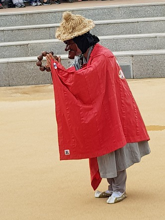

하회 별신굿 탈놀이 다섯째 마당의 파계승

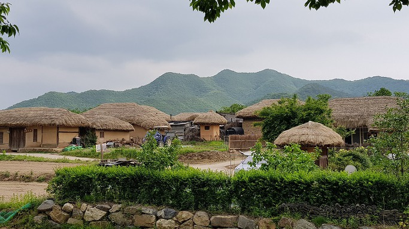

하회마을의 아름다운 초가들

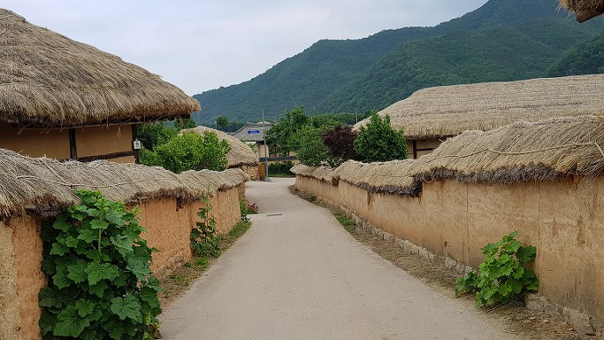

하회마을 초가들 사이의 골목길

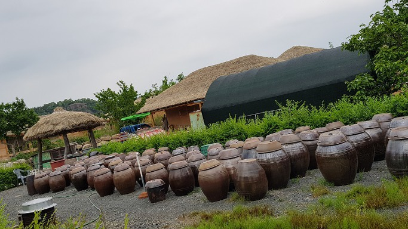

하회마을에서 만난 장독들

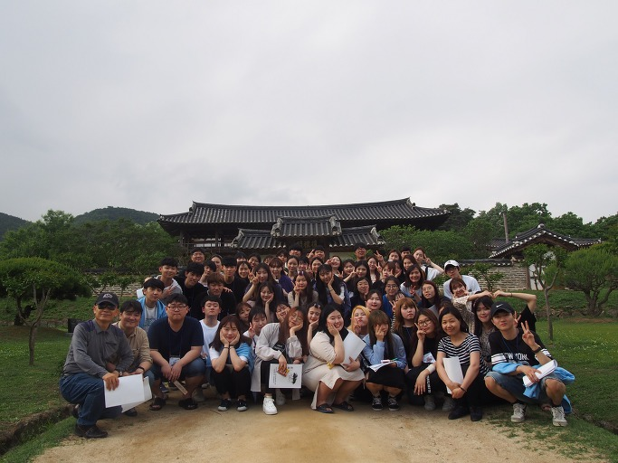

병산서원에서 숭실국문 학생들과

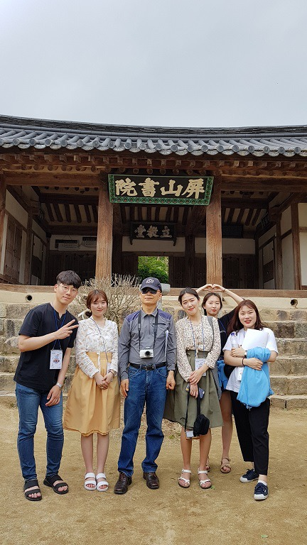

병산서원에서 집행부 학생들과

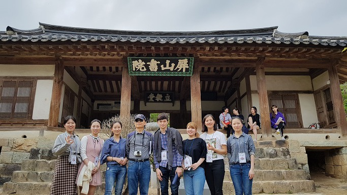

병산서원에서 외국인 유학생들과

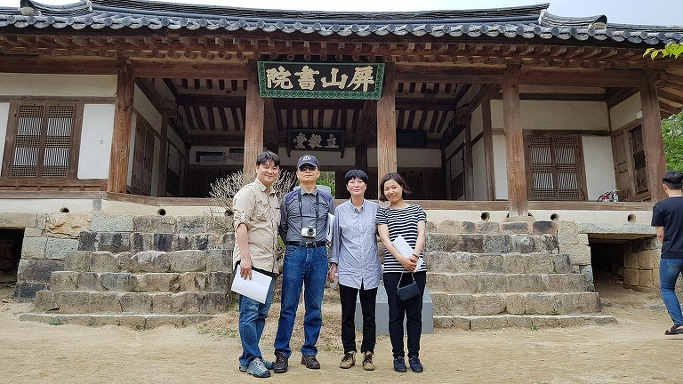

병산서원에서 임채훈 교수, 엄경희 교수, 소신애 교수 등과

학술답사 후기

-왜 ‘학술답사’인가?-

 

                                                                                                                  조규익(숭실대 교수)

 

내 학창 시절 은사 한 분은 늘 ‘논문은 발로 써야 한다’고 말씀하셨다. 논문을 발로 써라? 처음엔 그 말씀이 몹시 낯설었다. 당시 엉망진창인 번역을 ‘발 번역’이라 부르던 나였지만, ‘발 논문’이란 조어(造語)의 진의를 이해하기 어려웠다. 나이가 들고 공부가 좀 익어지면서 깨달았다. 자료를 찾아 ‘발로 뛰는’ 학자가 좋은 논문을 쓸 수 있다는 사실을. 그래서일까. 팔도 어디든 내가 필요로 하는 자료의 소장 자(처)를 찾아다니는 일이 연구 작업의 반 이상을 차지하는 경우가 꽤 된다. 그렇다고 내가 좋은 논문들을 쓰는 건 아니지만, 그나마 큰 실수 없이 어쭙잖은 글들이나마 엮어 낼 수 있는 건 전적으로 그 때 익힌 현장 중시의 습관 덕분이리라.

 

국어국문학의 현장은 우리 전통사회다. 십 수 년 전만 해도 그런 공간들이 제법 남아 있었다. 어느 마을 논두렁이나 밭두렁에만 가도 생생한 자료제공자들을 만날 수 있었다. 그 분들이 아무렇지도 않게 내뱉는 말들이 방언이었고, 힘들거나 즐거울 때 질러내는 소리들이 민요였다. 어릴 적부터 어른들로부터 물려받아 기억의 창고에 차곡차곡 쌓아 둔 이야기들은 좀 많았나. 그런 걸 찾으러 틈나는 대로 방방곡곡 누비고 다니며 국어국문학도들은 자긍심을 지닐 수 있었다. 사라지는 우리의 전통과 정서를 글자로 잡아놓고 분석하여, ‘과거-현재-미래’로 이어지는 민족문화의 파수꾼이 될 수 있다는 믿음 덕분이었다.

 

이제, 세월은 마구 변하여 외견상 전통사회는 가뭇없이 사라졌다. 국어국문학도들의 임무나 사명을 고도로 세련시켜야 할 때가 도래한 것이다. 사실 변화는 잔존(殘存)을 전제로 하는 개념일 뿐 ‘사라짐’이 아니다. 육안으로 보이지 않는다 하여 ‘찾는 일’을 포기할 순 없다. 변화의 근거들이야 하다못해 DNA에라도 남아있을 것 아니겠는가. 그래서 집요함은 공부하는 자가 갖추어야 할 ‘최종병기’다. 문학이나 언어의 생산자이자 사용자인 ‘사람들’을 만나 보는 기회가 주어지지 않는다면, 그 사람들을 키워 낸 자연과 문화적•역사적 잔존물들을 ‘현장에서’ 느껴보지 못한다면, 강의실에서 펼쳐지는 담론들의 공허함을 무슨 방법으로 극복할 수 있으리오.

 

우리가 장삼이사(張三李四)들의 관광여행을 본받으려 하지 않는 것도 답사지역이 우리의 또 다른 교과서이기 때문이다. 밤을 새워 그곳 인물들의 문학을 찾고, 유•무형 문화재의 뿌리를 가늠하며, 숨은 역사를 캐는 일은 이 시대의 국어국문학도에게 부여된 사명이자 특권이다. 2018년도 숭실 국문인들이 그 사명과 특권을 오롯이 수행하고 누릴 수 있도록 ‘지역선정-계획 수립-사전답사-자료집 준비’ 등으로 학생회장 김태호를 비롯한 집행부원들이 진한 땀을 흘렸다. 그 덕에 멋진 자료집이 나왔고, 모두 참여하여 현장 공부의 특권을 누릴 수 있게 되었다. 고마운 일이다. 이제 우리 모두 귀한 ‘공부여행’에 적극 동참하여 하나라도 더 얻어오는 기회로 삼아야 하지 않겠는가.

 

\*\*\*

 

위 글은 2018학년도 숭실대 국어국문학과 학술답사 자료집에 실은 나의 인사말이다. 나는 교수 초년병 시절부터 몇 번을 제외하고는 대부분 학술답사에 참여하여 학생들과 고락을 함께 해왔다. 그동안 사회의 변화와 함께 학술답사의 양상도 많이 바뀌어 이젠 일반인들의 ‘여행’과 구분 못할 지경에까지 이르렀다. 지역과 방문 대상이 역사나 전통문화로 한정되고 ‘강의실 교육의 연장’이라는 점에서나 국문과의 학술답사는 일반인들의 관광여행과 구분될 따름이다. 그러나 오늘날 목적과 테마를 우선적으로 고려할 만큼 일반인들의 관광여행도 많이 세련되었다. 오히려 문화답사 동호인들끼리의 여행일 경우 대학의 학술답사보다 더 전문적인 경우도 적지 않다. 이제 일반인들의 안목이나 교양 수준은 많이 높아진 반면, 대학 교육은 거의 완벽하게 대중화⋅보편화되었다. 따라서 앞 시대엔 전문인들이나 예비전문인들이 주로 수행하던 학술답사가 이젠 교양의 심화나 지적인 욕구의 충족을 지향하는 일반인들의 문화관광 여행과 구별할 수 없는 상황에 이른 것이다.

 

대학 내에서 학술답사는 국어국문학과의 고유활동으로 굳어지다시피 했다. 그 분야의 교수 로 30년 넘게 재직해오면서 깨달은 시대의 변화는 매우 크고 의미심장하다. 인터넷의 무한한 확장, 기계화를 통한 전통사회의 변화, 교통⋅통신의 발달을 통한 전국의 1일 생활권화 등으로 현장 조사나 학습의 중요도가 많이 저감되었기 때문이다. 그러나 아무리 시대가 변했어도 국어국문학과 학생들을 데리고 역사와 전통의 맥이 살아있는 현장을 둘러 보는 것은 무엇보다 중요하고 신나는 일이다.

 

올해는 안동지역을 답사 대상으로 잡았다. 첫날(5월 17일)은 하회마을에 도착, 하회별신굿 탈놀이를 함께 관람한 뒤 하회마을의 정취를 음미하고 병산서원(屛山書院)에 들렀으며, 풍산읍에 있는 ‘안동 펜션 & 게스트’에서 1박을 했다. 다음 날은 분과에 따라 고전문학학회와 민속문화학회는 가송리 농암종택(聾巖宗宅)을 방문한 뒤 한국국학진흥원 및 전통문화콘텐츠박물관에, 현대문학회는 권정생 동화마을과 이육사문학관 및 농암종택에 각각 들렀으며, 언어학회는 가구1리 마을회관에서 방언을 채록하고 영호루와 안동 문화의 거리를 답사했다. 셋째 날에는 전원이 함께 도산서원(陶山書院)과 소수서원(紹修書院)을 들러 서원문화를 체험한 뒤 오후에 서울로 돌아왔다.

 

\*\*\*

 

방대한 이 지역의 문화와 정신을 받아들이기에 2박3일은 매우 짧았다. 그러나 학생들의 표정에서 작지만 어떤 변화의 조짐을 읽어낼 수는 있었다. 물론 학생들 각자의 내면적 수준이나 성향에 따라 감수(感受)한 것들은 달랐으리라. 어쨌든 늘 복잡한 도심에서 각자의 삶을 살다가 함께 한국의 ‘추로지향(鄒魯之鄕)’으로 불리는 안동에 찾아가 선비문화를 체득한 것은 이들의 삶에 큰 정신적 자산으로 남게 되지 않을까.

 

나는 답사 기간 내내 서원을 중심으로 펼쳐진 이 지역의 사림문화(士林文化)를 제대로 볼 것을 학생들에게 주문했다. 농암종택 안 쪽에 위치한 분강서원(汾江書院)의 입교당(立敎堂)에 학생들을 앉히고 ‘농암 선생의 풍류와 자연 친화의 삶’을 강의했고, 도산서원의 전교당(典敎堂)에서는 ‘퇴계 선생의 시가와 도학적 세계관’을 강의했다. 병산서원, 도산서원, 농암종택, 소수서원 모두 자연과의 조화를 바탕으로 만들어진 심성 수양의 공간이었음을 학생들에게 이해시키고자 노력했다.

 

그 분들이 추구한 도(道)란 ‘자연 속에서 읽어낸 불변의 길’이라고 보는 것이 내 생각이다. 하늘이 천성으로 부여한 생태의식이 바로 도학의 바탕이었던 것이다. 주어진 세상의 삶을 마치고 뛰어난 생태 공간인 안동의 땅에 스며든 위대한 스승들. 일찍이 퇴계 선생은 <도산십이곡>의 제9곡에서 다음과 같이 노래하지 않았던가.

고인(古人)도 날 못 보고 나도 고인(古人) 못 뵈

고인(古人)을 못 뵈어도 가시던 길 앞에 있네

가시던 길 앞에 있거든 아니 가고 어찌 할꼬

 

그렇다. 신재(愼齋), 농암(聾巖), 퇴계(退溪) 등 우리 스승들의 걸어가신 길을 뒤쫓아 가면 잘못 될 일 없을 터인즉, 이제라도 따라가 보자. 학생들을 지도하겠노라 나선 길이었으나, 나 스스로 배움만 가득 안고 온 2박3일의 학술답사였다.

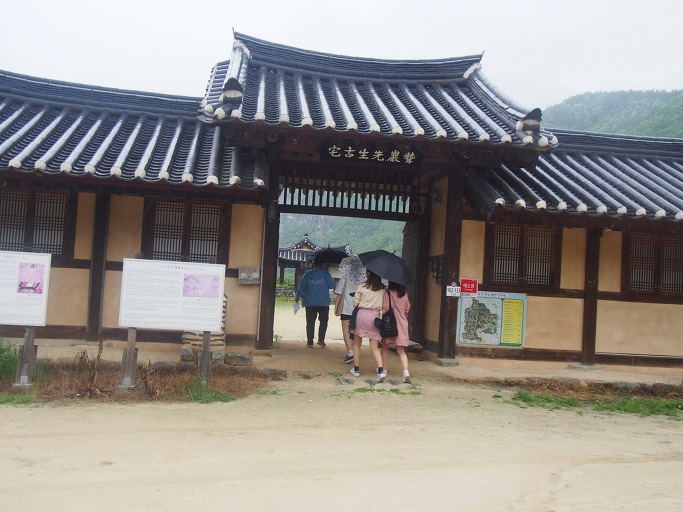

농암종택에 들어서며

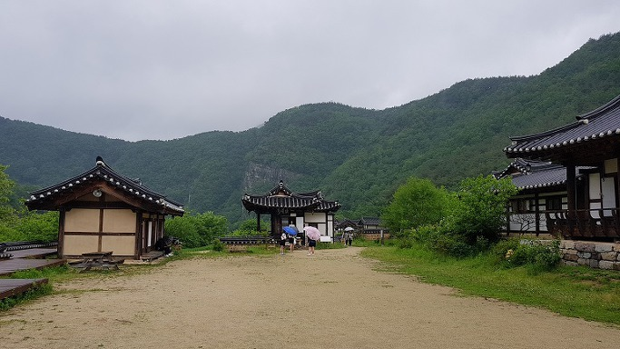

농암종택 안쪽의 넓고 안온한 풍경

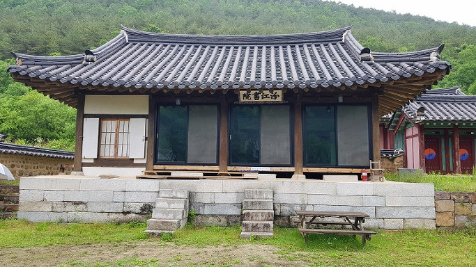

농암종택의 분강서원

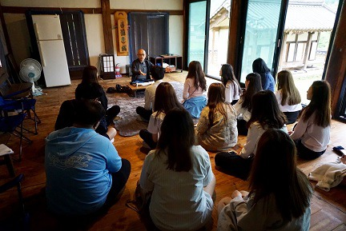

분강서원에서 강의를 듣는 학생들

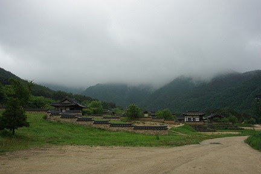

멀리서 잡은 농암종택

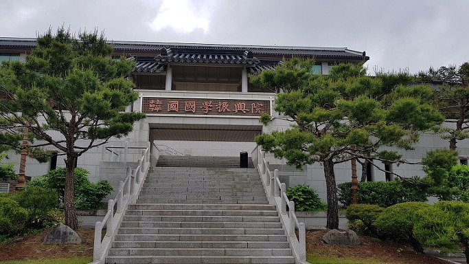

안동 한국국학진흥원

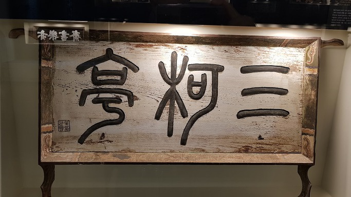

안동 박실에서 구미 일선리로 이건한 삼가정의 현판

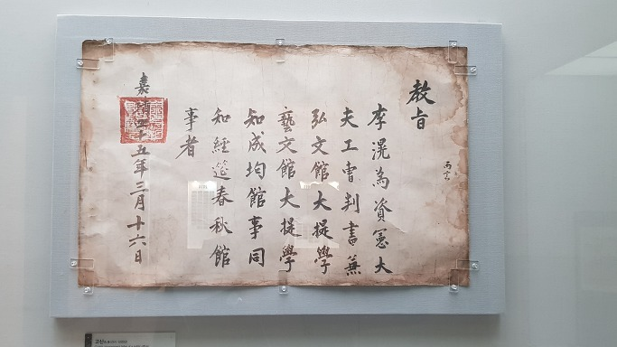

퇴계 선생에게 내린 교지

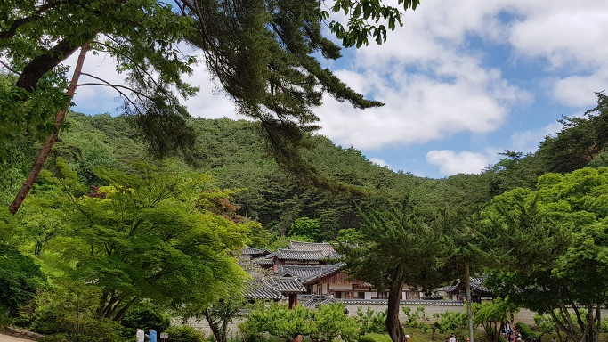

도산서원의 안온한 모습

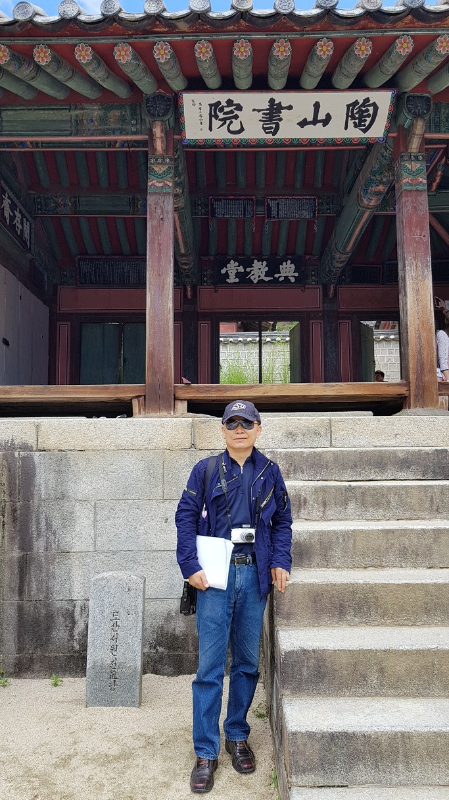

도산서원 전교당 앞에서

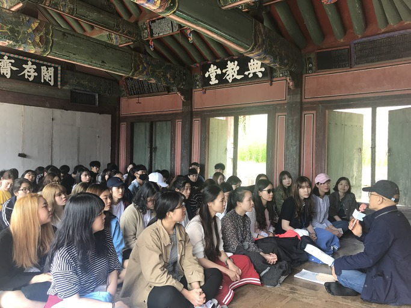

도산서원 전교당에서 학생들에게 강의를 하며

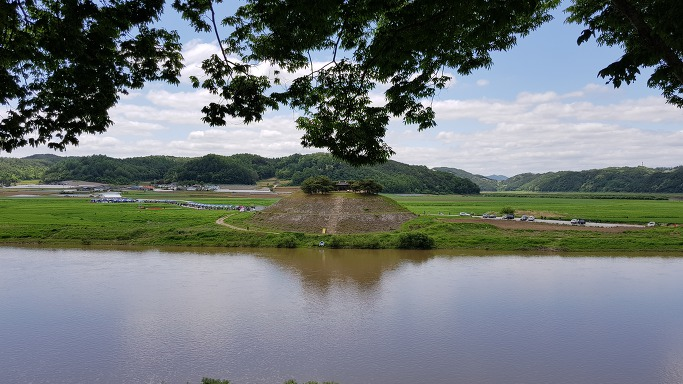

도산서원 시사단(試士壇)

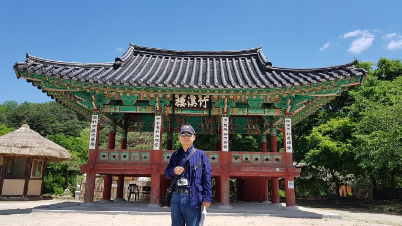

순흥의 죽계루 앞에서

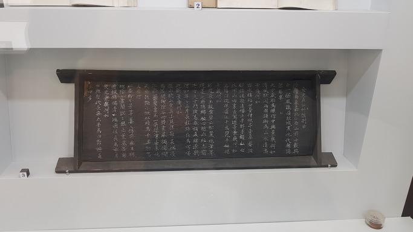

근재 안축(安軸)의 <죽계별곡(竹溪別曲)> 현판

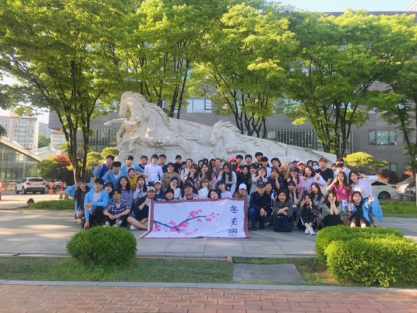

다시 학교로 돌아와서

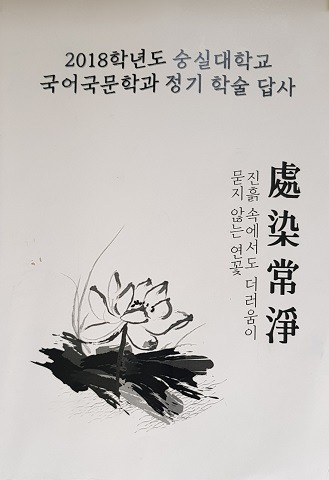

학술답사집

공유하기

게시글 관리

**백규서옥\_Blog ver.**

[저작자표시 비영리 변경금지
(새창열림)](https://creativecommons.org/licenses/by-nc-nd/4.0/deed.ko)