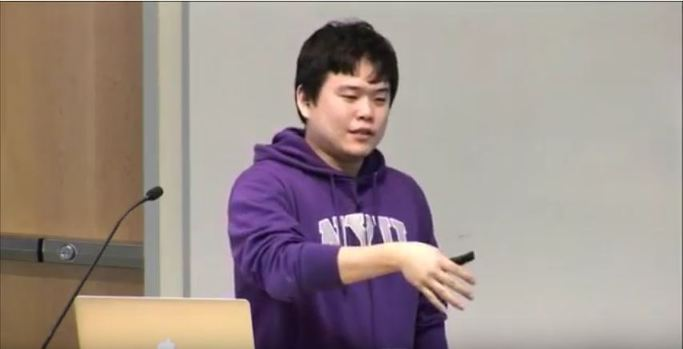
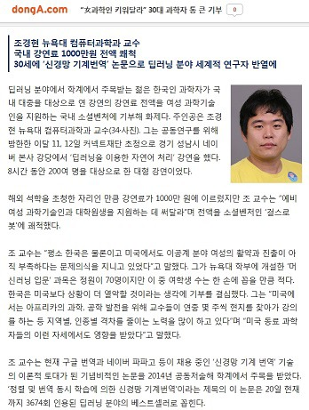
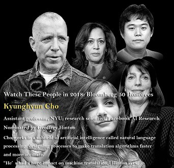
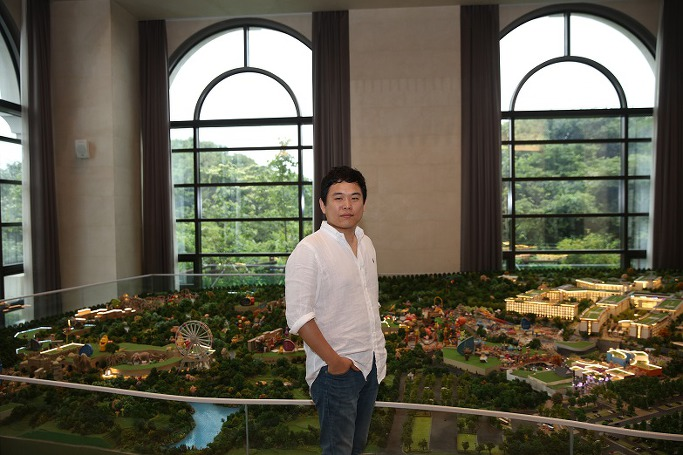
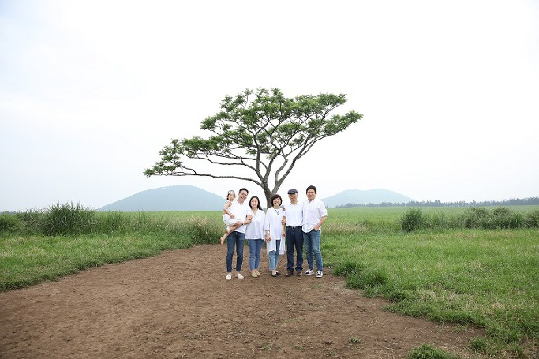

관련 유튜브 링크 :  <https://www.youtube.com/watch?v=z4CNmiLF-YU&feature=youtu.be>

팔불출(八不出)의 변(辯)-학자로 자란 아들을 보며

 

 

누군가는 말했다. ‘저 잘났다 자랑하는 놈, 마누라 자랑하는 놈, 자식 자랑하는 놈, 선조와 부모 자랑하는 놈, 형제 자랑하는 놈, 선•후배 자랑하는 놈, 돈 자랑하는 놈, 고향 자랑하는 놈’을 팔불출(八不出)이라 부른다고. ‘불출’이란 사전적으로 ‘못난이’란 뜻이지만, 어감(語感) 상으론 ‘엄청 못난 놈’ 쯤 되는 말이다. 체면 중시 사회에서 수오지심(羞惡之心: 옳지 못함을 부끄러워하고 미워하는 마음)을 뼛속 깊이 간직하고 이 나이까지 살아 온 나다. 그런데 지금 팔불출 가운데 세 번째 불출이 되어 보고자 한다.

 

근래 한두 가지 일을 경험하면서 내 알량한 자존심의 메커니즘이 더 이상 작동될 수 없음을 깨달았다. 내 생각에 자존심이란 ‘살아 갈 날들이 살아 온 날들보다 많을 때’ 생겨나기 쉬운, 특이한 심리다. 이제 교수로서 내 인생의 한낮은 기울었고, 내 뒤에 끝도 없이 늘어선 후생(後生)들은 빨리 비켜서라고 재촉한다. 가당치 않은 자존심으로 그들에게 군림하려 한 과거를 버리고, 그들의 장점을 인정하면서 슬그머니 앞자리를 양보하는 것. 그 길만이 내게 남은 유일한 출구임을 이제야 깨닫는다. 따라서 학자의 길을 걷기 시작한 아들의 장점을 인정하는 것도 즐거움일 뿐 자존심 차원의 문제는 아닐 것이다. 이제 내 협소한 울타리를 걷어내려는 것은 꽤 오래 전부터 견지해 온 학자로서의 아이덴티티가 심각하게 도전을 받는 중이고, 어쩌면 그런 도전들의 정당성이 역사적 필연임을 알게 되었기 때문이리라.

 

조경현(Kyunghyun Cho)은 33살 된 내 큰 아들이다. 이번 방학에 그가 보여준 놀라운 일을 계기로 망설임 없이 이 공간에서 그를 언급하게 되었다. 그는 현재 뉴욕대 컴퓨터과학과 교수다. 2002년 2월, 인문계 고등학교 2학년을 마치고 카이스트(KAIST)로 진학하는 그를 보내며 쓴 글(｢공부하러 집 떠나는 아들을 보며｣, <<어느 인문학도의 세상 읽기>>, 인터북스, 2009)의 마무리 부분에 다음과 같은 내 소망을 담은 바 있다.

 

“자식이 어찌 부모의 마음을 알 수 있으랴? 그리고, 알아주기를 바란들 무엇 하랴? 그러나, 세상의 아들들이 이것만은 알아야 할 것이다. 세상의 부모들 대부분은 공부하러 집 떠나는 아들들에게 물질로 호강시켜 줄 것을 바라지 않는다는 사실을 말이다. 험한 세파 속에서도 자신의 두 발로 서서 당당하게 자신만의 목소리를 내는 것. 그러나 이왕이면 가정과 사회, 그리고 국가와 민족에게 보탬이 되는 삶을 살아감으로써 부모에게 자부심을 안겨 주는 것. 이 시대의 부모로서 그 이상 무엇을 바란단 말인가?”(247~248쪽)

 

이것이 16년 전 집을 떠나던 그에게 아버지의 입장에서 표명한 소망이었고, 그 점은 지금도 전혀 달라지지 않았다. 카이스트를 나온 그는 핀란드의 알토대학(Aalto University: 2010년 1월 1일에 설립된 핀란드의 대학교. 2010년부터 정부 주도 하에 핀란드의 산업•경제•문화를 선도하는 기존의 세 대학-헬싱키 기술 대학교•헬싱키 경제대학교•헬싱키 미술 디자인 대학교-을 합병하여 출범했음)에서 석•박사학위를 받고, 몬트리올 대학교에서 박사 후 과정을 거친 뒤, 2016년 뉴욕대학의 교수가 되었다.

처음에 그가 영국이나 스웨덴 등의 전통 명문대학으로부터 입학허가를 받았으면서도 핀란드의 대학교를 선택한 이유가 궁금했지만, 결국 묻지 않았다. 그의 고집을 알고 있었고, 그를 믿어야 한다는 나의 ‘자기억제(self-control) 소신' 때문이기도 했다. 그 후 우연한 기회에 핀란드의 그 대학에서 유능한 교수의 지도로 ‘인공지능’ 분야를 공부한다는 소식을 접했지만, 인공지능이란 말의 의미를 잘 알지 못했고, 그 때만 해도 내겐 ‘뜬구름 잡는 듯한’ 그 분야나 공부내용을 자세히 알고 싶지도 않았다.

 

카이스트에서는 물론 핀란드로 간 뒤에도 그는 부모에게 돈 한 푼 요구하지 않았다. 매우 궁금했지만, 그것도 묻지 않았다. 다만, 핀란드는 학비가 필요 없다는 사실을 알고 있었고, 당시만 해도 우수한 핀란드 교육을 배운다는 명목으로 파견되던 우리나라 시찰단들을 위해 그가 틈틈이 영어 통역 ‘알바’를 하고 있다는 사실을 언젠가 인터넷을 통해 알게 되었다. 박사과정에 진학한 뒤에는 큰 규모의 핀란드 정부 장학금을 받았는데, 학비와 생활비는 물론 해외 컨퍼런스 참여에 따르는 모든 비용을 해결할 만큼 풍족한 것이었다. 그 장학금에 대한 설명을 듣고 나서 비로소 나는 핀란드라는 나라를 존경하게 되었다. 외국인을 무료로 교육시켜주고 장학금까지 지급하면서 아무런 조건을 달지 않는 나라가 세상 어디에 있단 말인가. ‘가능성 있는 젊은 인재’라면 국적을 불문하고 국가가 나서서 양성해야 한다는 책임감이야말로 국가 이기주의가 그악하달 정도로 팽배한 지금의 상황에서 매우 숭고한 일 아닌가. 그런 점에서 인구 550만의 작지만 강한 나라 핀란드를 존경하게 된 것이다.

어쨌든 그런 과정에서도 나는 그가 컴퓨터 계통을 전공한다는 사실 외에 구체적인 것을 알고 있지 못했다. 문외한이기도 하려니와 내 전공에 묻혀 살아 온 나로서는 관심을 가질 여유도 없었다. 지금에 와서야 어렴풋이 그가 당시에 갖고 있던 학문적 비전(vision)을 짐작하게 되었다. 석사논문(Improved Learning Algorithms for Restricted Boltzmann Machines/2011)과 박사논문(Foundations and Advances in Deep Learning/2014년)에 그가 꿰뚫어 본 미래가 분명 담겨 있지 않은가! Dr. Juha Karhunen, Dr. Tapani Raiko, Dr. Alexander Ilin 등 유수 학자들의 지도 아래 그는 이미 8년 전부터 10년 이내에 핫이슈로 부상될 딥 러닝(deep learning)의 중요성을 알고 차곡차곡 준비해 왔음을 나는 비로소 깨닫는다.

 

학위를 받고 핀란드를 떠난 그는 캐나다의 몬트리올 대학에서 박사 후 과정을 밟기 시작했다. 자기 분야의 세계적인 석학 요슈아 벤지오(Dr. Yoshua Bengio) 교수를 찾아간 것이다. 그곳으로 간 지 1년쯤 지났을까. 채용 공고에 응모한 미국과 영국, 스위스, 스코틀랜드 등의 유수 대학들에서 교수직 제의를 받았다는 소식을 듣게 되었다. 마지막까지 저울질한 것은 미국의 뉴욕대학교와 영국의 옥스퍼드대학교였는데, 내가 보기에도 두 곳의 장단점은 분명했다. 오래도록 대학물을 먹은 나로서는 전통적인 명성과 함께 정년보장 직으로 채용되는 옥스퍼드가 나아 보였으나, 결국 그는 뉴욕대학을 선택했다. 그 대학에 딥 러닝 분야의 석학 얀 르쿤(Dr. Yann LeCun) 교수가 있었음을 나중에서야 알게 되었다. 세계의 중심인 뉴욕, 경쟁과 자기혁신의 용광로인 미국 대학사회에서 맘껏 연구 활동을 펼치고자 한 그의 뜻을 완전히 이해하기까지는 상당한 시간이 필요했다.

 

잘은 모르지만, 캐나다로 건너 간 뒤부터 그의 학문은 비약적인 발전을 이루게 되었다. 그는 랩(lab)에 몰려드는 세계의 수재들을 지도하며 다양한 테마의 연구에 몰두하고, 한 주에 한 번씩 강의실에서 만나는 학생들을 이끌어주며, 연간 십여 차례씩 국내외 컨퍼런스와 연구교류 여행을 해야 하는 간단치 않은 삶을 살고 있다. 자세한 건 모르지만, 그의 주된 관심사는 컴퓨터의 ‘딥 러닝을 이용한 자연어 처리(natural language processing with deep learning)’인 듯하다. 그가 고안한 것으로 알고 있는 NMT(Neural Machine Translation/신경망 기계번역)는 이미 인공지능 컴퓨터 언어학습 분야의 핫 이슈가 되어 있고, 현재 그는 서로 다른 언어들 사이에서 통•번역을 자유자재로 처리할 수 있는 인공지능의 메커니즘을 만들기 위해 동분서주하고 있다. 

 

\*\*\*

 

1년에 단 한 번, 체류기간은 단 1주일. 그는 여름 방학 초에만 부모가 있는 서울로 온다. 그 짧은 체류기간도 이곳저곳에서 요청한 강연 스케줄로 빡빡하다. 올해 강연들 중 핵심은 네이버(NAVER)의 커넥트(Connect) 재단에서 있었다. 등록자 200명을 위해 하루 네 시간 씩 이틀 동안 여덟 시간을 강의하고 온 그는 늘 그러하듯 담담했다. 강연료는 얼마나 받았느냐고 농담조로 묻자 “천만 원이오. 그런데 모두 기부했어요.”라고 간단히 대답했다. 강연료 액수에 우선 놀랐고, 기부 사실을 아무렇지도 않다는 듯 말하는 그의 무심함에 또 한 번 놀랐다. 그래도 태연한 척 “어디에 기부했니?”라고 물으니, “여성 과학자들을 위해 소셜 벤처 걸스로봇(Girlsrobot)에 기부했어요.” 한다. “잘 했다”고 대답은 하면서도 궁금증은 커졌다. 그의 전공 지식이 대체 무엇이관대 8시간 강의에 천만 원씩이나 받는 것이며, 그 돈을 한꺼번에 기부하는 배포나 철학은 또 뭐란 말인가. 궁금했으나, 더 묻지 않기로 했다. 아무리 아버지이지만, 가난한 나라의 국문학 교수가 그 내용을 자꾸만 캐묻는 것도 후학에 대한 예의가 아니란 생각이었다. 이삼일 후 그가 떠나고 나서 우연히 인터넷을 서핑하다가 동아일보의 놀라운 기사 한 건을 접하게 되었다.

 

donga.com

 

“女과학인 키워달라” 30대 과학자 통 큰 기부

 

조경현 뉴욕대 컴퓨터과학과 교수

국내 강연료 1000만원 전액 쾌척

30세에 ‘신경망 기계번역’ 논문으로 딥러닝 분야 세계적 연구자 반열에

 

 

딥러닝 분야에서 학계의 주목을 받는 젊은 한국인 과학자가 국내 대중을 대상으로 연 강연의 강연료 전액을 여성 과학 기술인을 지원하는 국내 소셜 벤처에 기부해 화제다. 주인공은 조경현 뉴욕대 컴퓨터과학과 교수(33·사진). 그는 공동연구를 위해 방한한 이달 11, 12일 커넥트재단 초청으로 경기 성남시 네이버 본사 강당에서 ‘딥 러닝을 이용한 자연어 처리’ 강연을 했다. 8시간 동안 200여 명을 대상으로 한 대형 강연이었다.

 

해외 석학을 초청한 자리인 만큼 강연료가 1000만 원에 이르렀지만, 조 교수는 “예비 여성 과학기술인과 대학원생을 지원하는 데 써 달라”며 전액을 소셜벤처인 ‘걸스로봇’에 쾌척했다.

 

조 교수는 “평소 한국은 물론이고 미국에서도 이공계 분야 여성의 활약과 진출이 아직 부족하다는 문제의식을 지니고 있었다”고 말했다. 그가 뉴욕대 학부에 개설한 ‘머신러닝 입문’ 과목은 정원이 70명이지만 이 중 여학생 수는 한 손에 꼽을 만큼 적다. 한국은 미국보다 상황이 더 열악할 것이라는 생각에 기부를 결심했다. 그는 “미국에서는 아프리카의 과학, 공학 발전을 위해 교수들이 연중 몇 주씩 현지를 찾아가 강의를 하는 등 지역별, 인종별 격차를 줄이는 노력을 많이 하고 있다”며 “미국 동료 과학자들의 이런 자세에서도 영향을 받았다”고 말했다.

 

조 교수는 현재 구글 번역과 네이버 파파고 등이 채용 중인 ‘신경망 기계 번역’ 기술의 이론적 토대가 된 기념비적인 논문을 2014년 공동 저술해 학계에서 주목을 받았다. ‘정렬 및 번역 동시 학습에 의한 신경망 기계번역’이라는 제목의 이 논문은 20일 현재까지 3674회 인용된 딥 러닝 분야의 베스트셀러로 꼽힌다.

 

윤신영 동아사이언스 기자 ashilla@donga.com

원문보기:

<http://news.donga.com/3/all/20180621/90681370/1#csidxc09a80b7f83fa0ea2f4c765d86099f0>

 

아, 그랬구나! 세상은 그의 존재를 알고 있는데, 나만 그의 성장을 모른 채 늘 어린 아이로만 생각하고 있었다! 1997년 첫 연구년을 받아 미국으로 떠날 준비를 할 때, 초등학교 6학년인 그와 4학년인 둘째 아이에게 초급 영어 회화를 가르치며 초조해 하던 나를 떠올렸다. 이 어린 것들을 데리고 낯설고 물 선 미국 땅에서 무사히 1년을 지내고 돌아올 수 있을 것인가. 내게 주어진 천금 같은 기회를 살려 이 철부지들을 낯선 미국 땅과 문화에 잘 적응시킬 수 있겠는가. 가족들을 끌고 물을 건너는 가장에겐 걱정이 많았다. 그러나 미국에 건너가자마자 영어도 미국 생활 자체도 그들에게 대뜸 추월당한 나였다. 그렇게 아이들은 어른들을 앞서 갔지만, 바로 어제까지 그들은 내게 코흘리개 아이들일 뿐이었다. 올해 초 그는 미국의 블룸버그 통신이 선정한 ‘2018년 50개 분야에서 주목해야 할 인물’에 들었다. 사실 놀라워할 만한 사건이었다. 그러나 그 때만 해도, ‘뭘 갖고 그러지?’라고 심드렁하게 생각한 나였다. 그런데 그게 아니었다.

 

어느 새 그는 이미 남들이 인정하는 ‘세계적인 학자’가 되어 있었다. 논문의 인용지수나 강연파일들의 태그 건수가 내 상식을 초월하고, 미국 안에서는 물론 유럽에서도 아시아에서도 그를 찾는 곳들이 많아 일일이 응대할 수 없다는 점도 알게 되었다. 특히 인공지능이 대세를 형성하고 있는 오늘날 그는 순풍을 탄 독수리처럼 하늘로 솟고 있다. 그러면서도 늘 겸손한 자세로 구부정하게 앉아 키보드를 두드리는 그가 대견하다. 좀 잘 나간다고 까불다가 추락하는 세상 천재들의 말로를 잘 알고 있다는 듯 밤낮으로 노력하는 그를 보며 안심을 한다.

 

인천공항 출국장. 그를 탑승구로 들여보내고 나는 아내에게 속마음을 털어 놓았다. “지금 보니 저 녀석은 대양을 헤엄치는 고래이고, 나는 고향 마을 실개천의 붕어나 미꾸라지일세. 고래가 실개천으로 돌아올 이유도 없고, 붕어나 미꾸라지가 대양으로 나갈 이유도 없겠지. 나는 ‘개천 속 붕어와 미꾸라지의 삶’을 녀석에게 보여주며 항상 교만하지 않고 초심을 유지할 수 있도록 할 셈이네!”

제주도의 호텔 로비에서

제주도 목장에서 오른쪽부터  조경현, 백규, 임미숙, 김미언, 조원정, 조영빈

공유하기

게시글 관리

**백규서옥\_Blog ver.**

[저작자표시 비영리 변경금지
(새창열림)](https://creativecommons.org/licenses/by-nc-nd/4.0/deed.ko)