에코팜(Eco Farm) 이야기

 

 

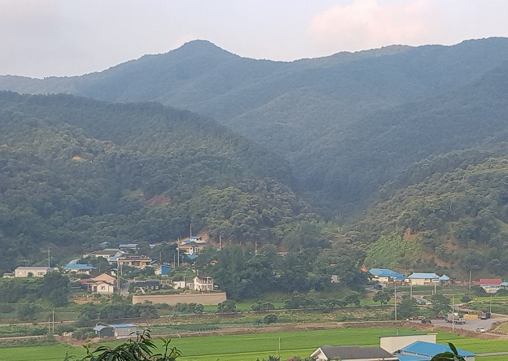

멀리서 바라 본 에코팜

 

1박2일 잡초와의 승산 없는 전투를 건성건성 마무리하고 도망치듯 상경, 일요일 아침 학교 연구실의 고요함에 피곤한 몸을 맡긴다. 지난 금요일 밤까지 쓰던 논문 파일을 꺼내 놓고 ‘침 발라가며’ 끊어진 생각의 실마리를 이어보려 애쓴다. 그러나 나오는 문장들은 잡초 줄기 꼬이듯 지리멸렬이다. 안락의자에 윗몸을 비스듬히 맡기고 눈을 감아 보지만, 피로는 옷을 적시는 물처럼 번지기만 한다. 비몽사몽 속절없이 흐르는 시간의 충격에 간헐적으로 화들짝 놀라며 눈을 떠 보긴 하나, 눈꺼풀은 천근만근 늘어지고 생각의 끝은 가뭇없이 사라진다. 해가 설핏해질 무렵 어쩔 수 없이 자리에서 일어나며 ‘이제 삶의 리듬을 바꾸어야 한다’고 힘주어 다짐한다. 다음 주에도 똑 같은 사이클이 반복되리라는 걸 잘 알면서도 말이다.

 

책상 앞에서 책과 씨름하는 생활은 일요일 혹은 월요일 아침부터 금요일 초저녁까지 만이다. 무슨 일이 있어도 나를 기다리는 녀석들을 보러 에코팜에 가야 하는 토요일 새벽 무렵의 요동치는 생체 리듬을 거부할 수 없기 때문이다. 나를 기다리는 건 9할이 잡초이고 1할 정도가 작물, 그러나 그 모두가 생명이니 어쩌랴. 그것들이 지난주에 비해 몇 뼘이나 자랐을까 몹시 궁금하고 걱정스러운 것을! 지난 번 심어 놓은 고구마 순은 뿌리를 내렸을 것이며, 서리태는 싹을 틔웠을까. 그 사이사이에 모습을 보이던 잡초들은 또 어떤 기세로 고구마와 서리태를 괴롭히고 있을까. 큰 희망을 품고 씨를 뿌려 넝쿨까지 조성해 놓은 더덕 밭은 이미 우악스런 잡초들에 휘감긴 채 ‘더덕 산’으로 변신한 지 오래다. 가끔 그 속에 들어가 더덕들의 안부를 확인하지만, 이름도 모를 잡초들만 그득하다. 이 잡초들이야말로 그 땅이 원래 산이었음을 증거하는 존재들 아닌가. 참으로 끔찍하고 존경스런 생명력이다.

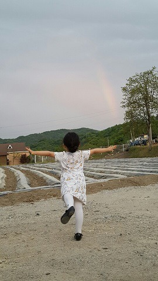

에코팜의 무지개를 온몸으로 맞이하는 영빈

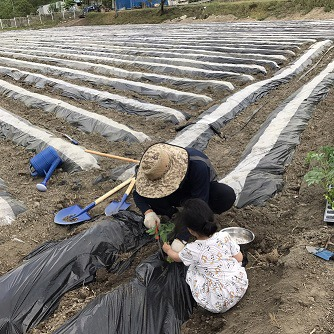

수박을 심는 조손(祖孫)

 

\*\*\*

 

일생을 흙 속에 사신 부모님. 나는 순혈 농부의 아들이다. 1년 농사를 지어 이듬 해 땅 몇 평 늘이고, ‘장리(長利)’로 곳간을 계속 확충해 나오신 분들. 이른바 ‘자수성가(自手成家)’의 표본이셨다. 옴짝달싹할 수 없는 황토 빛 시골에서 출구가 보이지 않던 그 시절, 대처에 나가 공부한다는 것은 불가능에 가까운 일이었다. 어쨌든 하늘이 도운 것일까. 부모님의 멋진 단안 덕에 간신히 집을 탈출할 수 있었다. 그 뒤로 ‘결코 고향엔, 흙에 묻혀 살아야 하는 고향엔 돌아가지 않으리!’ 노래 부르며 이 나이까지 타향을 전전해 왔다.

 

그런데, 알 수 없는 것이 인간의 마음이다. 스스로의 나이를 인식하게 되면서 생각이 달라지기 시작했다. 아버지, 어머니의 꿈을 떠올리게 된 것이다. 이루지 못한 당신들의 꿈이 과연 무엇이었을까 생각하기 시작한 지 올해로 20년. ‘그 분들이 아무런 꿈도 꾸지 않으셨다면, 과연 그 흙 속에서 일생을 보내는 게 가능하셨을까?’ 풀리지 않는 궁금증이 간간이 나를 엄습했다. 출구가 보이지 않는 농사일을 일생 지속하려 하셨다면, 최소한 지금보다는 나은 미래를 계획할 만한 꿈 한 조각이라도 갖고 계셨을 것 아닌가. 과연 그게 무엇이었을까.

20년 가까이 내가 굴려온 화두(話頭)들 가운데 하나가 바로 이것이다. 그 분들이 갖고 있던 꿈은 무엇이었을까. ‘그냥 던져진’ 존재임을 인정하며, 운명에 순응하신 분들일까. 그 분들만 생각하면 조여드는 죄의식으로 안절부절 못하던 형극(荊棘)의 세월을 최근까지 살아온 나였다. 나이가 들면서 다라운 욕망들이 서서히 빠져 나가고, 부모님의 삶이 던져 준 화두를 풀어내겠다는 새로운 의욕이 그 빠져나간 옛 욕망의 자리를 되 메우고 있음을 깨닫기 시작한 게 거금 20년이다. 그 문제를 풀 만한 최적의 공간을 찾아 헤맨 20년 세월이었다. 그러다가 만난 곳이 바로 지금의 ‘에코팜’이다.

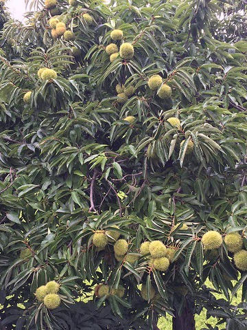

정안밤

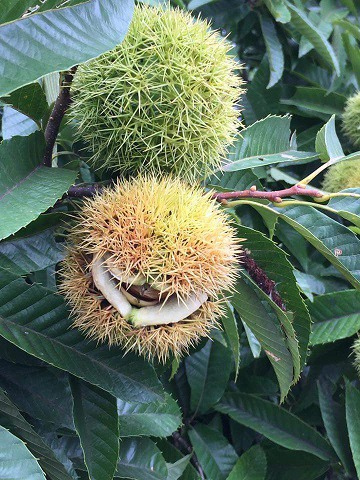

정안밤의 미소

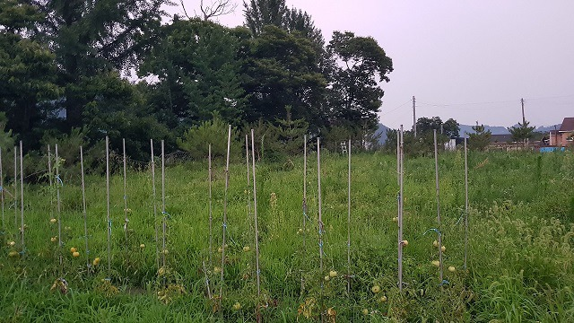

에코팜의 잡초생태연구소^^

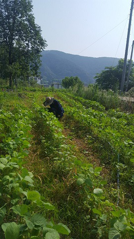

에코팜의 서리태 밭

 

\*\*\*

 

뽑히지 않는 바래기 풀을 억지로 휘어잡아 뽑고 그물처럼 촘촘하게 땅을 덮은 띠 풀을 쥐엄쥐엄 뜯어내며, 호미와 맨손으로 흙을 주무르시던 부모님 얼굴의 주름과 그 골들 사이로 줄줄 흐르던 땀을 생각한다. 부드러운 양토(良土)의 풀을 뽑으며 쓰다가 미루어 둔 논문들이나 걱정하고 그런대로 제 길을 잘 가고 있는 아이들의 미래나 상상하는 나와 달리, 돌투성이 박토(薄土)에 힘들여 호미 날을 꽂으시며 공부한답시고 객지에서 떠도는 아이들의 끼니 걱정에 허리 끊어지는 고통도 잠시잠시 잊으셨을 부모님을 떠올린다.

입으로는 에코팜의 멋진 풍수를 자랑하고, 어린 시절 부모님의 노동을 통해 눈으로 익힌 어설픈 농사지식이나 떠벌이곤 하지만, 지금의 내가 무엇을 알 수 있단 말인가. 손바닥 크기의 땅뙈기, 자칫 한 해 농사를 망치면 보충할 길이 막막했던 그 분들이었다. 말없는 땅을 상대로 표출하시던 결기(決氣)를 그 누군들 제대로 이해할 수 있으랴.

그래서 나는 에코팜의 풀 한 포기라도 함부로 대하지 못한다. 사람들은 이러는 나를 ‘게을러 빠져서 옥토를 풀밭으로 만든 놈이 별 핑계를 다 댄다’고 비웃으리라. 하루 밤 자고 나면 산판처럼 우거져 있는 잡초를 보면서도 놈들을 처치 못하는 나를 이해할 수 없으리라. 그러니, 산이면 어떠랴. 잡초와 곡물, 반반씩이라도 건지면 될 것 아닌가. 잡초 하나 없이 반질반질 고른 땅에 온갖 곡물들을 보암직하게 길러내는 시골 어른들의 눈에 ‘한량의 놀이’ 쯤으로 비쳐져도 어쩔 수 없다. 잡초가 우거져 ‘잡초생태연구소’란 자조적(自嘲的) 언사를 농하고 있긴 하나, 그 옛날 부모님이 꿈을 키우시던 곳과 비슷한 공간을 내가 휘젓고 다닐 수 있는 지금이 얼마나 행복한가. 풀을 뽑지 못해 멀쩡한 옥토를 산판으로 만들었다 해도, 무언가가 왕성하게 자라고 있는 이 공간이 그 얼마나 좋은가. 오죽하면 잡초 밭에 ‘에코팜(Eco Farm: Ecological Farm)’의 명패를 붙여놓고 자랑스레 홍보하겠는가?^^

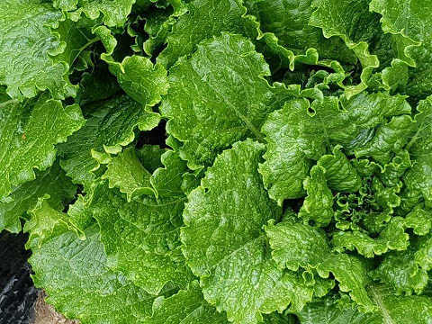

에코팜의 상추

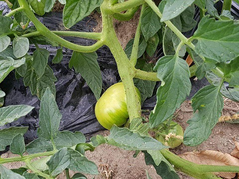

에코팜의 도마도

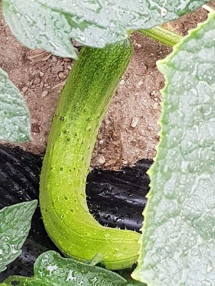

제멋대로 자란 에코팜의 오이

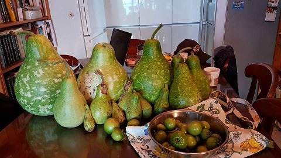

에코팜의 첫 수확

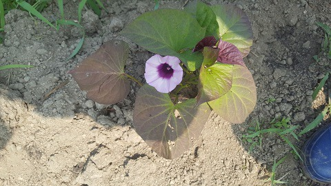

에코팜의 고구마 꽃

 

\*\*\*

 

나처럼 농사를 모르는 사람도 농사를 잘 짓는 사람들과 어울려 겁나게 질긴 저 잡초들처럼 생생하고 즐겁게 살아갈 수 있는 공간을 만들어 볼 것이다. 그 한복판에서 풀과 함께 아웅다웅 꿈을 가꾸셨을 내 부모의 작은 유택(幽宅)과 소박한 돌비 하나 세워 보리라.  그 돌비에 새길 문구는 이미 내 마음에 새겨져 있으니,

 

“잡초같이 질긴 고집과 꿈을 자식에게 물려주신 두 분, 여기 잠들다”라고.

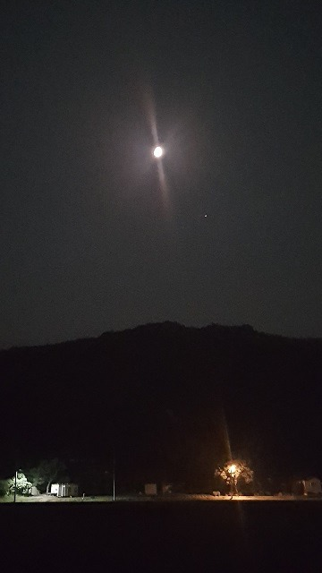

에코팜의 밤. 빛으로 대화하는 달과 가로등

공유하기

게시글 관리

**백규서옥\_Blog ver.**

[저작자표시 비영리 변경금지
(새창열림)](https://creativecommons.org/licenses/by-nc-nd/4.0/deed.ko)