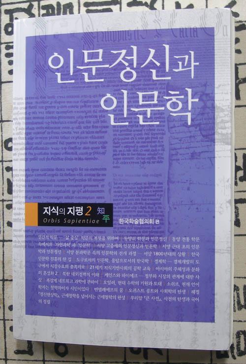

  
  
인문학의 위기를 외치는 광야의 선지자들(?)이 넘쳐나는 시대입니다. 그러나 정작 인문학이나 인문정신이 뭐냐고 묻는다면, 벙어리가 되곤 합니다. 이 시대에 왜 인문학이 죽었다고 생각하며, 왜 인문학이 왕성하게 발전해야만 하는가 물으면 더욱더 답변은 궁색해집니다. 정말로 인문학이 위기냐? 아니면 인문학자들의 위기냐? 대학내 인문학과들의 위기냐? 여러분은 인문학의 위기는 어디서 초래되었으며 앞으로의 지향점은 무어라고 보시는지요? 이런 물음들에 대한 대답이 이 책(<<인문정신과 인문학>>)에 잘 나와 있습니다.   
목차는 다음과 같습니다.   
1. 장회익-인간적 학문-'삶 중심' 학문의 복원을 위하여  
2. 김영식-동양의 학문과 인문정신  
3. 강상진-서양 고중세의 인문정신과 인문학  
4. 이종흡-서양 근대 초의 인문학과 인문정신  
5. 최성환-서양 분과학문 속의 인문학의 전개과정-서  
              양 1800년대의 상황  
6. 백종현-한국 인문학 진흥의 한 길  
7. 한형조-도구로서의 인문학, 응답으로서의 한국학  
8. 전성인-경제학-경제개발의 도구에서 시장수요의 충  
              족자로   
9. 김도연, 이정동-21세기 지식기반사회의 공학교육  
10. 리처드 로티, 김우창-'아시아의 주체성'과 '문화의   
                                혼성화'  
11. 고병철-북한 대외정책의 이해  
12. 안석교-케인스와 하이에크-정부와 시장의 관계에   
               대한 사상  
13. 정하웅-복잡계 네크워크 과학에 관하여  
14. 지동표-오일러 탄생 300주년 현대 수학의 기원과   
               토대  
15. 최용호-소쉬르 탄생 150주년 천재 언어학자는 철학  
               자이자 시인이었다   
16. 김희준-멘델레예프 사망 100주기 멘델레예프의 꿈  
17. 민문홍-콩트 사망 150주기 오귀스트 콩트와 사회학  
               의 탄생  
18. 강순전-'정신현상학' 출간 200주년 근세철학을 넘어  
              서는 근세철학의 완성  
19. 최경봉, <<큰 사전>> 발간 50주년 사전의 탄생과   
              국어의 정립  
  
바야흐로 기로에 선 인문학. 삶과 학문의 경계에서 우리의 미래를 고민하는 지식인 여러분께 일독을 권합니다.   
  
   한국학술협의회, <<인문정신과 인문학>>, 2007. 12000원  
  
        2007. 6. 6.  
  
  백규

공유하기

게시글 관리

**백규서옥\_Blog ver.**