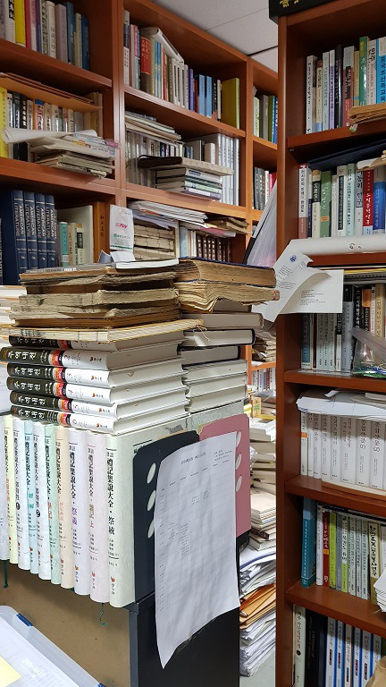
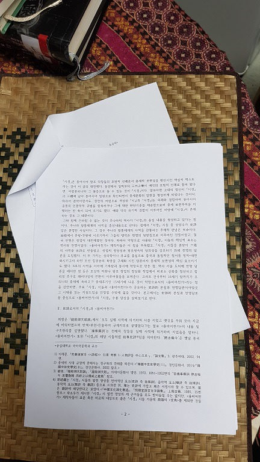
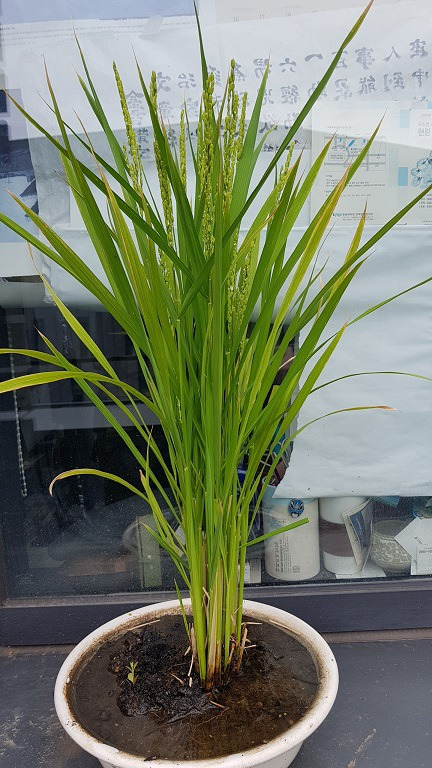
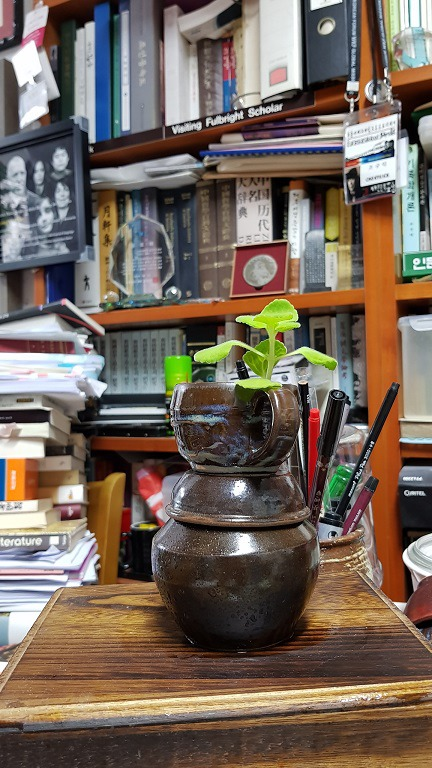
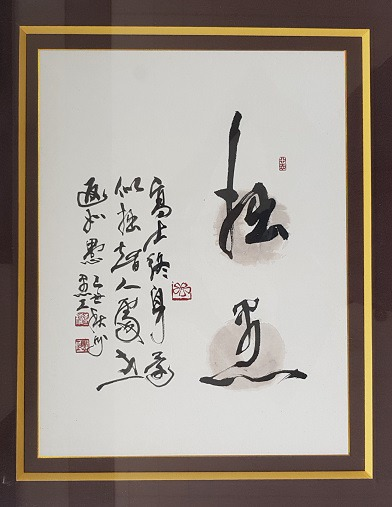
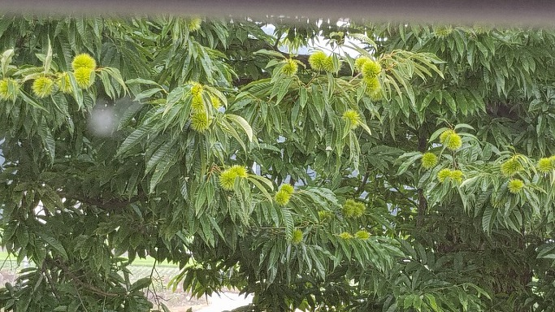

“네가 쓴 논문들을 찢어 버려라!”

                                                                                                            조규익

 

xml:namespace prefix = "o" /

 

학자란 누구인가. 넓은 의미로 ‘학문을 연구하는 사람’, 좁은 의미로 ‘대학교나 연구소 등 연구기관에서 전문적으로 학문을 다루는 사람’이다. 학문을 연구하거나 다룬 결과는 논문이나 책으로 나오기 마련이니, 교수나 학자는 논문 쓰는 사람, 혹은 ‘논문으로 말하는’ 사람이다. 그래서 학자가 제 아무리 언변이 뛰어나고 생각이 기발해도 그것이 논문으로 엮여져 나오지 않으면 그냥 달변가 혹은 재주꾼일 뿐이다.

 

공부도 잘하고 말까지 잘하는 재주꾼을 최고로 치는 시대가 되었지만, 동양 사회에서 말 잘하는 사람을 경원(敬遠)해 온 역사는 길다. 특히 학자들의 말이 뻔지르르하면 일단 의심을 하고 보는 것이 전통사회의 통념이었다. 오죽하면 공자는 ‘말에 있어서 더듬거리고 실행에 있어서는 민첩하고자 하는 것이 군자(欲訥於言而敏於行/󰡔논어(論語)󰡕 ｢이인(里仁)｣)’라고 했을까.

 

옛날의 군자는 완성된 도덕을 갖춘 인격자로서 남의 사표(師表)가 되는 사람, 그래서 전통사회의 ‘학자’를 겸한 인간상이었다. 그렇다면 그는 왜 말을 더듬어야 했을까. 자신의 내뱉는 말이 과연 얼마나 진실한지, 누가 보아도 확실한 근거를 갖고 있을지 아무도 자신 못하기 때문이었다. 사실 누군들 자신의 말을 100% 자신할 수 있겠는가. 그래서 군자란 단 한 마디 말이라도 내뱉기 전에 수십 수백 번을 되씹어 보고 숙고하는 사람이어야 한다. 그렇게 하고 나서도 막상 말을 내뱉는 순간 걱정이 앞서는 것이다. ‘과연 나는 진실을 말하는 것일까. 내 말에 분명한 근거가 있는가.’ 거침없이 나가야 하는 말 줄기를 이 두 가지 물음이 막아서면 더듬거릴 수밖에 없지 않겠는가. 그래서 한 마디 말이라도 내뱉기 전에 심사숙고하라는 것이고, 그것은 예나 지금이나 변함없는 학자의 자세다.

 

그러나 지금은 말(만) 잘하는 학자들이 너무나 많다. 매스 미디어가 지배하는 이 시대엔 ‘말 잘하는 것’이 모든 조건들을 압도한다. 방송에 나와 사자후를 토하는 학자들치고 제대로 된 논문이나 저서를 갖고 있는 경우가 드물다고들 한다. 언제 차분하게 생각을 정리하고 공부를 다져 논문이나 저서로 만들어내겠는가. 그리고 그렇게 쉽게 내뱉는 말들이라면 심사숙고의 과정을 거쳤을 리 없을 터. 당장 대중의 인기에 영합하고 그들의 찬탄을 이끌어내기에 급급할 것이니, 언제 책상머리에 앉아 자신의 가설을 논증하고 강호 현인들의 생각을 참고할 겨를이 있단 말인가. 대중의 눈과 귀를 솔깃하게 하는 달변가들 가운데 의외로 좋은 학자가 드물다는 건 바로 그 때문일 것이다.

 

제대로 학자 노릇을 하기란 어렵다. 선현들이 남긴 생각을 토대로 자신의 뜻을 세우기가 좀처럼 쉽지 않다. 그저 앞 사람들이 걸어간 길을 그대로 따라가는 건 그런대로 가능할 수도 있으리라. ‘전술(傳述)할 뿐 짓지 않으며, 옛것을 믿고 좋아한다(述而不作 信而好古)’고 󰡔논어󰡕 ｢술이｣편에서 공자는 말했다. 정말로 그가 ‘술이부작’으로만 일관했을까. 사실은 앎에 대한 겸양의 태도를 강조한 말이었을 것이다. 학자는 도덕가를 겸해야 한다는 차원 높은 인식의 노출로 보는 것이 옳다. 공자가 극구 사양한 것은 ‘없던 것을 만들어낸다’는 창조자의 타이틀. 외람하다 보았기 때문이리라. 외람하지만 않다면, 그 역시 ‘인간에게 좋은 것들을 만들어 내는 것이 좋다’는 판정을 내리지 않았을까. 공자가 얼마나 창조적인 생활을 했는가를 생각해보면, ‘술이부작’ 속에는 자칫 교만해지기 쉬운 인간을 다잡는 의미가 들어 있을 뿐, ‘새로운 것’을 고안하거나 만들어내는 일을 부정적으로 보지 않았음은 분명하다.

 

\*\*\*

 

한여름 더위를 먹어서 그런가. 쓸데없이 서론이 길어졌다.

내 본업은 교수다. 교수는 당연히 학자이고, 학자가 대부분 교수인 것은 우리의 상식이다. 그래서 교수는 연구하고 가르치는 일을 겸하는 존재다. 대학원 시절, 존경하던 은사들은 늘 ‘좋은 논문 많이 쓰라’고 말씀하셨고, 당신들께서 몸소 모범을 보이셨다. 상당 기간 대가들의 곁을 배회하며 논문 쓰는 일의 중요함을 마음에 새겨온 나다. 언제나 되어야 저 분들처럼 멋진 논문들을 맘껏 써서 후학들을 위해 지남(指南)할 것인가. 뜻은 높되 손과 아이디어가 따라주지 않아, 일종의 비원이 마음속에 똬리처럼 들어앉게 된 내 '학자로서의 한평생'이다.

 

비교적 이른 나이인 스물일곱 여덟에 대학 교수로 자리를 잡았으면서도 마음은 편치 못했다. 초년 시절 내내 ‘논문을 써야 한다’는 생각에 사로잡혀 왔으면서도, 진짜로 쓰지 않고 못 배기는 테마나 문제의식 혹은 가설 하나 제대로 떠오르지 않는 나날이 꽤 오래 지속되기도 했다. 어느 순간 ‘공부가 설어서 그렇다’는 것을 스스로 깨치긴 했으나, 그에 대한 처방을 얻지 못한 채 이날까지 ‘삽질을 하며’ 학자의 삶을 살고 있는 중이다.

 

밤늦도록 연구실에서 고민하며 책장을 넘기고, 휴일을 잊은 적도 적지 않았지만, 내 곳간은 늘 적막하다. 지금도 물색 모르는 고향 친구들은 ‘교수는 그저 놀고먹으며 땡하는 직업 아니야?’ 라고들 놀리기 일쑤다. 수시로 전해오는 친구들의 ‘번개 자리’에 불참하는 나를 그들은 이해하지 못한다. 적막한 연구실에 틀어박혀 글 한 편을 완성하기 위해 끙끙대는 나를 이해하려 하지 않는다. 그래서 나는 눈총을 줄 때마다 빙그레 웃음으로나 화답할 뿐이다. 그러고 나면 마음이 한결 한가로워진다.

 

여섯 평 연구실에서의 삼십여 성상(星霜)! 엊그제 존경하는 소재영 선생님께 전화를 드렸다. 내게 늘 사표(師表)가 되어주신 학자의 표본. 문득 생각해보니 그 분이 지금의 내 나이셨을 때 나는 40을 바라보는 애송이였다. 당시 그 분은 참으로 까마득하게 올려다 보였다. ‘나도 저 연세, 저 경지에 도달할 수 있을까?’라는 멍청한 생각에 사로잡혀 있었는데, 나이만큼은 어느덧 그 고개에 올라서고 말았다. 논문 쓰는 일도, 강의도, 세상사도 모두 달관의 경지에서 유유자적 해결하시던 내 나이 때의 선생님이셨는데. 지금의 나는 어찌 그 경지를 상상도 못한단 말인가. 늘 뇌리를 훑고 지나는 아이디어나 가설을 잡아 매어놓고 내 것으로 만들기 위해 무진 애를 쓰지만, 손에 잡히는 결론은 늘 ‘텅 빈 괄호( )’ 뿐이다!

누가 있어 ‘무엇이 중헌디?’라고 물으면, 정말로 할 말이 없다. 쉽게 헤아릴 수 없을 만큼의 논문들을 써 보았지만, 결론이 하나같이 공백으로 남아 있다면, 그간 줄창 헛공부만 해왔다는 말이다. ‘교수니까 논문을 쓴다’는 구조화된 아비투스(habitus) 속에서 가치 있게 살아야 했던 삶을 내 스스로 몰각(沒却)해온 건 아닐까. 그러면서도 ‘교단생활을 쓸쓸하게 마무리하지 않으려는’ 습관적 욕망에 사로잡혀 논문의 화두(話頭)를 꼭 틀어쥐고 의자를 당겨 앉는 내 모습은 또 얼마나 우스꽝스러운가. 인문학이 밥을 해결해주지 않는 시대에 (고맙게도) 우리를 찾아준 학생들의 눈치를 살피며, 고담준론(高談峻論)^^을 펴는 내 모습은 또 얼마나 가련하고 처량한가.

한 주에 단 하루, 육체의 괴로움을 통해 내 실존을 아프게 자각하는 에코팜의 은혜로운 시간이라도 없었다면, 허물어져가는 내 자존심의 성벽을 무슨 용기로 대면할 수 있을까.

 

“네가 쓴 논문들을 찢어 버려라!” 등짝을 후려치는 죽비와 함께 귀를 찢는 노(老) 선승(禪僧)의 할(喝)이 텅 빈 내 마음을 울린 뒤 메아리가 되어 여섯 평 연구실을 휘감다가 사라지곤 한다. 깨달음은 내게 미래의 시간을 부여할 것인가. 갈가리 찢긴 논문들을 주섬주섬 이어 붙이면 천사의 날개옷으로 부활할 것인가. 그 옷 걸치고 구만리장천을 훨훨 날아오를 수 있을 것인가.

졸우(拙愚)-우공 이일권 작

공유하기

게시글 관리

**백규서옥\_Blog ver.**

[저작자표시 비영리 변경금지
(새창열림)](https://creativecommons.org/licenses/by-nc-nd/4.0/deed.ko)