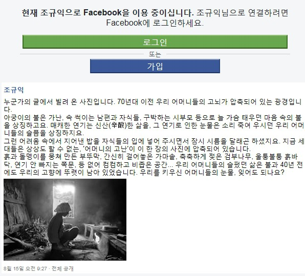

\*누군가의 글에서 빌려 온 사진. 매우 감동적이어 페이스북에 올리고, 다시 이곳에 퍼다 붙입니다. \*

 

70년대 이전 우리 어머니들의 고뇌가 압축되어 있는 광경입니다.

 

아궁이의 불은 가난, 속 썩이는 남편과 자식들, 구박하는 시부모 등으로 늘 가슴 태우던 마음 속의 불을 상징하고요. 매캐한 연기는 신산(辛酸)한 삶을, 그 연기로 인한 눈물은 소리 죽여 우시던 우리 어머니들의 슬픔을 상징하지요.

 

그런 어려움 속에서 지어낸 밥을 자식들의 입에 넣어 주시면서 잠시 시름을 달래곤 하셨지요. 지금 세대들은 상상도 할 수 없는, '어머니의 고난'이 이 한 장의 사진에 압축되어 있습니다.

흙과 돌멩이를 뭉치고 다져 만든 부뚜막, 간신히 걸어놓은 가마솥, 축축하게 젖은 검부나무, 울퉁불퉁 흙바닥, 연기 안 빠지는 쪽문, 등 없어 컴컴하고 비좁은 공간...

 

우리 어머니들의 슬펐던 삶은 불과 40년 전에도 우리의 고향에 뚜렷이 남아 있었습니다.

 

우리를 키우신 어머니들의 눈물, 잊어도 되나요?

                                                                 <조규익 페이스북>에서

공유하기

게시글 관리

**백규서옥\_Blog ver.**

[저작자표시 비영리 변경금지
(새창열림)](https://creativecommons.org/licenses/by-nc-nd/4.0/deed.ko)