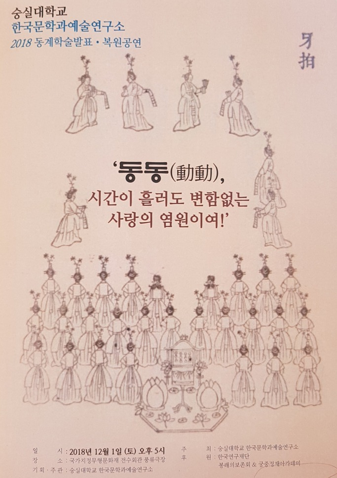
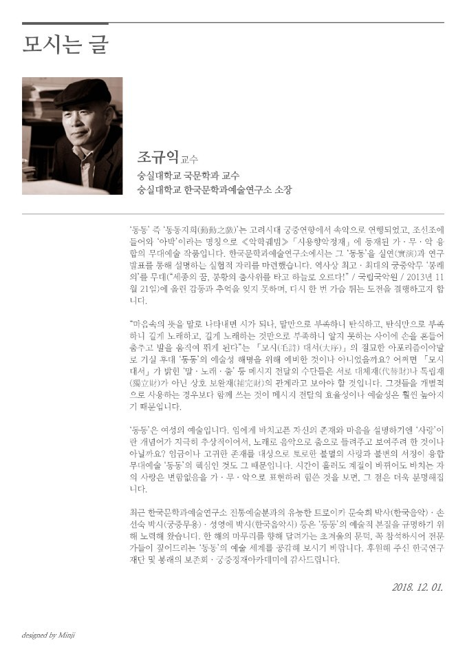
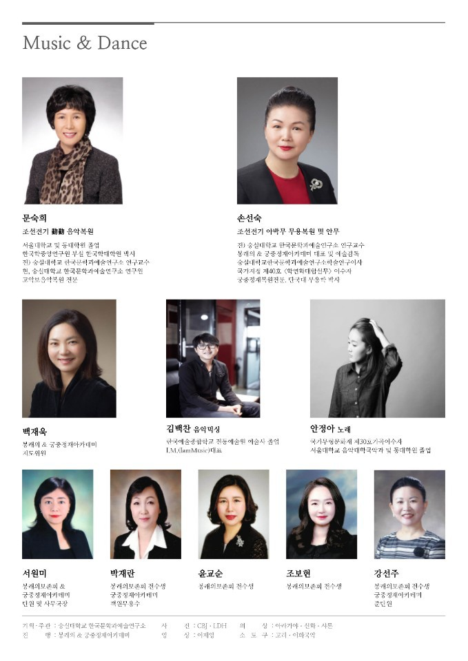
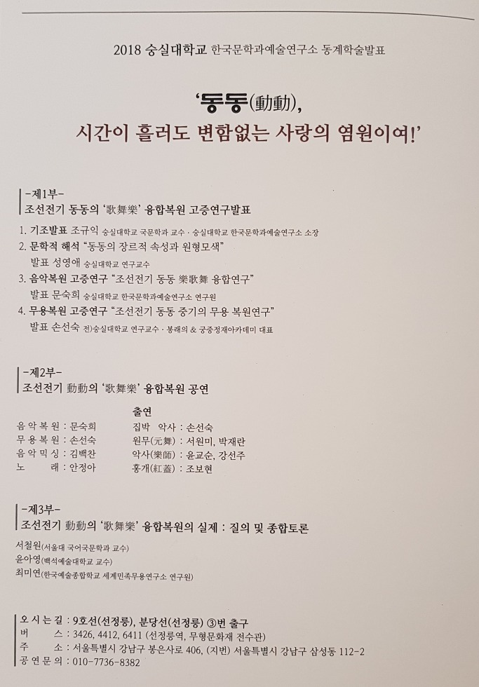

모시는 말씀

 

 

‘동동’ 즉 ‘동동지희(動動之戱)’는 고려시대 궁중연향에서 속악으로 연행되었고, 조선조에 들어와 ‘아박’이라는 명칭으로 󰡔악학궤범󰡕 ｢시용향악정재｣에 등재된 가•무•악 융합의 무대예술 작품입니다. 한국문학과예술연구소에서는 그 ‘동동’을 실연(實演)과 연구발표를 통해 설명하는 실험적 자리를 마련했습니다. 역사상 최고•최대의 궁중악무 ‘봉래의’를 무대(“세종의 꿈, 봉황의 춤사위를 타고 하늘로 오르다!”/국립국악원/2013년 11월 21일)에 올린 감동과 추억을 잊지 못하며, 다시 한 번 가슴 뛰는 도전을 결행하고자 합니다.

 

“마음속의 뜻을 말로 나타내면 시가 되나, 말만으로 부족하니 탄식하고, 탄식만으로 부족하니 길게 노래하고, 길게 노래하는 것만으로 부족하니 알지 못하는 사이에 손을 흔들어 춤추고 발을 움직여 뛰게 된다”는 ｢모시(毛詩) 대서(大序)｣의 절묘한 아포리즘이야말로 기실 후대 ‘동동’의 예술성 해명을 위해 예비한 것이나 아니었을까요? 어쩌면 ｢모시 대서｣가 밝힌 ‘말•노래•춤’ 등 메시지 전달의 수단들은 서로 대체재(代替財)나 독립재(獨立財)가 아닌 상호 보완재(補完財)의 관계라고 보아야 할 것입니다. 그것들을 개별적으로 사용하는 경우보다 함께 쓰는 것이 메시지 전달의 효율성이나 예술성은 훨씬 높아지기 때문입니다.

 

‘동동’은 여성의 예술입니다. 임에게 바치고픈 자신의 존재와 마음을 설명하기엔 ‘사랑’이란 개념어가 지극히 추상적이어서, 노래로 음악으로 춤으로 들려주고 보여주려 한 것이나 아닐까요? 임금이나 고귀한 존재를 대상으로 토로한 불멸의 사랑과 불변의 서정이 융합 무대예술 ‘동동’의 핵심인 것도 그 때문입니다. 시간이 흘러도 계절이 바뀌어도 바치는 자의 사랑은 변함없음을 가•무•악으로 표현하려 힘쓴 것을 보면, 그 점은 더욱 분명해집니다.

 

최근 한국문학과예술연구소 전통예술분과의 유능한 트로이카 문숙희 박사(한국음악)•손선숙 박사(궁중무용)•성영애 박사(한국음악사) 등은 ‘동동’의 예술적 본질을 규명하기 위해 노력해 왔습니다. 한 해의 마무리를 향해 달려가는 초겨울의 문턱, 꼭 참석하시어 전문가들이 짚어드리는 ‘동동’의 예술 세계를 공감해 보시기 바랍니다.

 

2018. 12. 1.

 

한국문학과예술연구소 소장 조규익

공유하기

게시글 관리

**백규서옥\_Blog ver.**

[저작자표시 비영리 변경금지
(새창열림)](https://creativecommons.org/licenses/by-nc-nd/4.0/deed.ko)