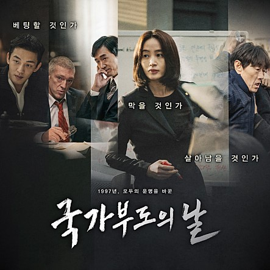
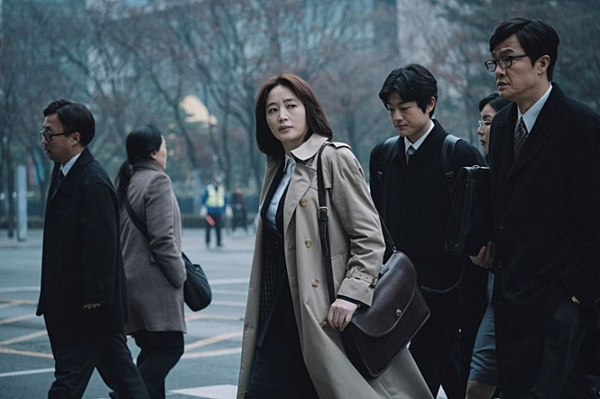
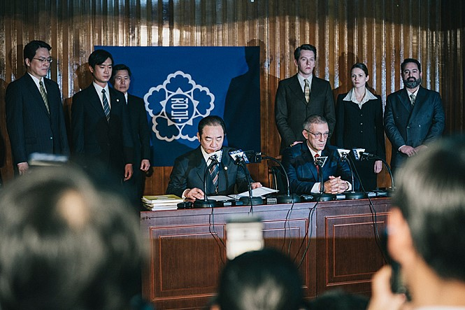
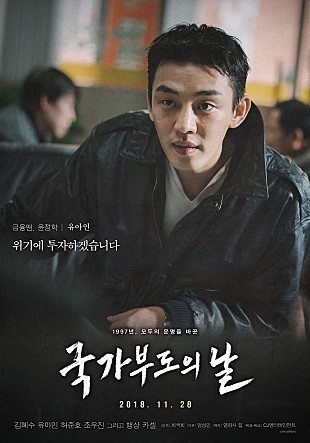
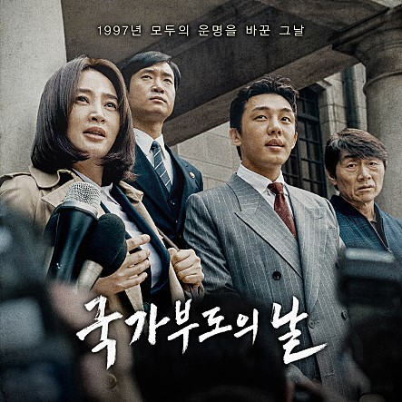
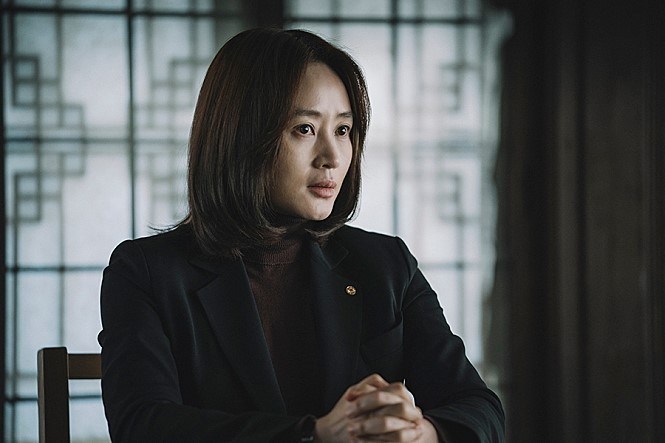

‘국가부도’의 아수라장을 뒤돌아보며

                                                                                                         조규익

음울하고 처참했던 1997년의 겨울.

날만 새면 굴지의 기업들이 쓰러졌다는 소식과 일가족 자살 같은 끔찍한 뉴스들이 귓전을 때렸다. 이미 재계 14위 한보는 무너졌고, 진로도 재계 4위인 기아도 무너졌으며, 2위인 대우도 막 무너져 가고 있었다. 그러니 이들보다 규모가 작은 무수한 기업들은 물어 무엇하랴! 가장의 실직으로 헤아릴 수 없이 많은 가족들이 한파에 내몰리는 등 나라 전체가 상갓집 분위기였다. 자살률도 OECD 국가들 중 최고로 치솟았다. 곳곳에 곡성이 울렸고, 어른이고 아이들이고 자기 한 몸 추스르기에도 버거운 시련의 시절이 계속되었다. 대통령을 비롯한 권력층의 리더십은 간 데 없고, 그 많던 사회의 지도 그룹들도 종적을 감추었다. 불쌍한 국민들만 각자도생의 벌판으로 내몰리고 말았다.

나는, 아니 우리 가족은 1998년 1월 미국(UCLA)으로 첫 연구 년을 떠나기로 되어 있었다. 떠나기로 되어 있었으나, 1997년 12월까지 확실한 것은 4인 가족 비행기 표를 사놓은 일 뿐이었다. 가족들에게 차마 말은 못했지만, ‘떠나야 하나 말아야 하나’로 혼자서 속을 끓이고 있었다. 고맙게도 1997년 2월 LG연암재단 해외연구교수’ 프로그램에 선발되었고, 98년 출국을 위해 착착 준비를 진행하고 있던 참이었다. 당시 연암재단 지원금 25,000불은 큰돈이었다. 4인 왕복 비행기 표와 건강보험료까지 계산하면 3만 불이 훌쩍 넘는 거금이었다. 원래 계획대로라면 10월 중 연암재단으로부터 선금 12,500불에 해당하는 원화가 입금되어야 했다. 그러나 소식이 없었다. 매일 아침 뉴스에서는 환율 고시가 나왔다. 연초 800원대 환율이 1,500원을 넘어서면서 초조해지기 시작했다. 하는 수 없이 재단의 오 부장에게 전화를 걸었다. 그의 음성 역시 가라 앉아 있었다. 조금만 더 기다려 달라고 했다. 환율을 보고 있는데, 환율이 조금이라도 안정되면 송금해주겠노라고 했다. 거기에 대고 독촉할 배짱은 없었다. 평소 LG는 무너질 수 없는 회사라고 믿어왔지만, 대우가 흔들리는 마당에 안심할 수는 없었다. 11월이 되면서 1,600~1,700원을 오르내리던 환율은 12월이 되자 1,800원대를 찍기 시작했다. 아, 나라가 드디어 망하는구나! 12월 3일 깡드쉬 IMF 총재와 임창렬 총리 사이에 구제금융 협상이 타결되면서, 대한민국은 IMF 치하로 들어갔고, 환율도 1,830~1,850원대를 오르내렸다. 더 이상 미룰 수 없다고 생각한 재단에서 1,830원대에 12,500불에 해당하는 원화를 송금해주었다. 어쩔 수 없이 미국으로 떠나야 했다.

인천공항에 나갔으나, 개미들처럼 커다란 이민 팩 서너 개를 밀고 일가족이 나타난 건 우리뿐이었다. LAX에 픽업 나온 배광복 선생 부부는 우리가 미국행을 포기한 줄 알았다고 했다. 당시 미국의 대학으로 오는 가족단위 한국인들의 발길이 뚝 끊어졌기 때문이었다. 만약 LG 연암재단의 배려가 없었다면, 우리도 당연히 미국행을 포기했을 것이다. 그래서 미국 체류 13개월 동안 늘 바늘방석에 앉은 느낌이었다. 인터넷으로 전해지는 고국의 소식들은 언제나 끔찍했다. 국제사회의 냉엄한 현실을 모르고 방만하게 지내온 우리 모두의 탓이라는 반성도 있었지만, 순진한 장삼이사들이야 무슨 수로 세상의 변화를 알아 미리 대처하겠는가.

IMF 통치를 받기 시작한 1998년으로부터 만 20년이 지나고 있다. 우리에게 트라우마로 남아있는 치욕적인 IMF의 기억을 지금의 상황에 대입하면 상당 부분 들어맞는다. 우리는 지금 그 때와 큰 차이 없는 상황으로 내닫고 있는 것이다. 그래서 더 불안함을 느낄 수밖에 없다. 엊그제 대통령은 ‘우리 경제의 기본은 튼튼하다’고 장담했다. 그 말이 ‘우리 경제의 펀더멘털(fundamental)은 튼튼하다’고 호언하던 당시 정부 관계자들의 말과 어찌 그리도 정확하게 맞아 떨어지는가. 소상공인들이 퍽퍽 나가떨어지고, 젊은이들이 일자리를 못 잡으며, 대기업들이 투자를 꺼리는 지금의 상황이 어째서 걱정 없는 상태란 말인가. 과연 지금의 대통령은 무슨 신통한 방책이라도 갖고 있는가. 사악한 정치인들의 인기놀음에 멍드는 건 서민들뿐이니, 과연 저들의 말을 믿어도 될 것인가.

\*\*\*

오늘 ‘국가부도의 날’을 보기 위해 극장을 찾은 것은 내 가슴의 트라우마를 지우고 싶어서였다. 집단적 트라우마를 왜 내 작은 가슴에 담고 살아야 하는지 답답할 때가 많다. 늘 팽팽한 긴장 속에 살아야 하는 운명을 타고 나서 그런지도 모르지만, 이젠 좀 털어버리고 홀가분하게 살고 싶다. 유사한 상황이 닥친다면, 당당하고 똑똑하게 사태의 진실을 인식하며 용감하게 대처해 나갈 수 있었으면 좋겠다. 영화 속의 김혜수처럼...

어쨌든 이 영화, 참 좋다.

<2018. 12. 15.>

공유하기

게시글 관리

**백규서옥\_Blog ver.**

[저작자표시 비영리 변경금지
(새창열림)](https://creativecommons.org/licenses/by-nc-nd/4.0/deed.ko)