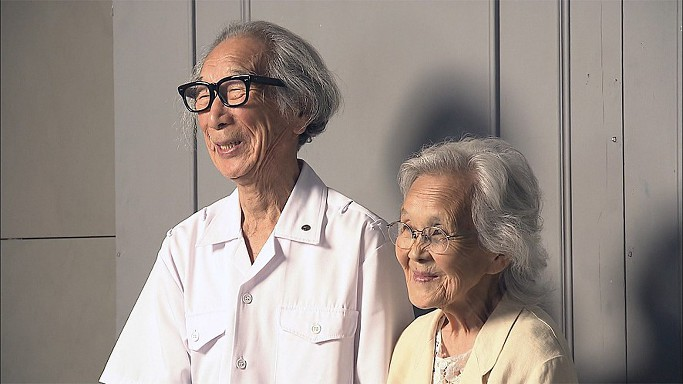
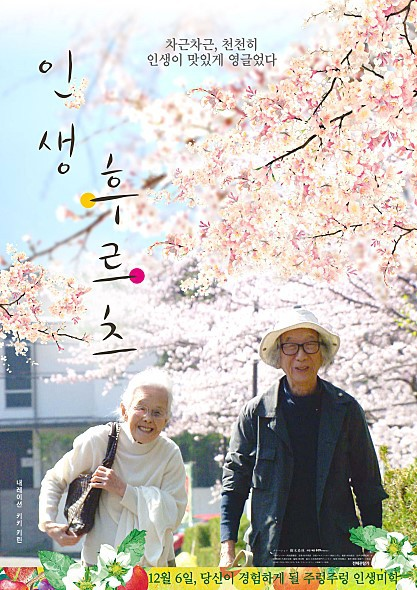
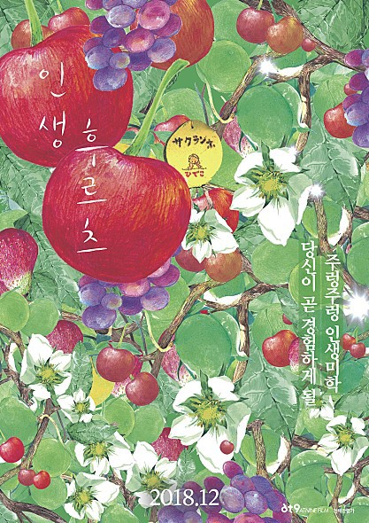
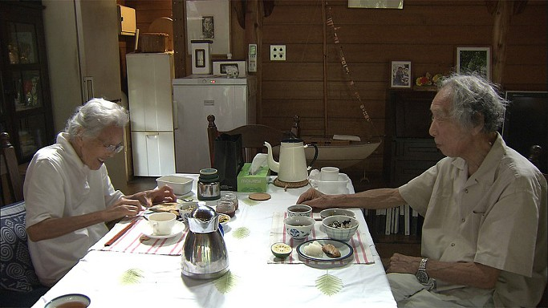
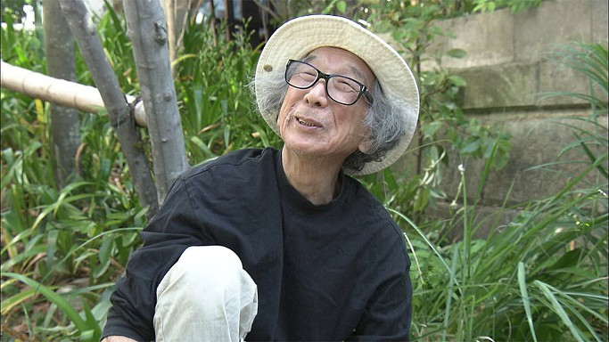
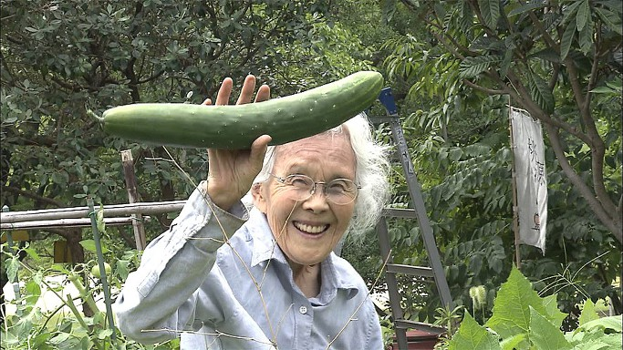

‘인생 후르츠’를 에코팜에서...

                                                                                                          조규익 

 

 

아내의 손에 이끌려 떨떠름한 표정으로

일본 다큐영화 ‘인생 후르츠’를 보러 가는 길.

 

일본영화, 그것도 다큐라는 점이 매력을 반감시켰으나, 전원에서 삶을 마감해가는 노부부의 이야기라는 사실이 에코팜 주인인 내 흥미를 끌었다.

잡답(雜沓)의 도회에서 적막강산 에코팜으로, 에코팜에서 다시 알 수 없는 저세상으로 입사(入社/initiation)해야 하는 나(우리)로서는 사실 적절한 참고서가 필요하던 차였다.

 

원제로 보이는 ‘Life is Fruity'.

‘인생은 감미로워라’ 혹은 '인생 결실' 쯤으로 번역될 수 있는 말이리라.

‘진세이 흐루-티-’ 라고 느릿느릿 나직이 깔리는 일본인 여성 내레이터(키키 키린)의 음성도 노인들의 호흡에 맞춘 것일까. Slow Life를 손에 잡을 듯이 들려주고 보여주었다.

 

아이치현(愛知県) 가스아이시(春日井市)의 고조지(高蔵寺) 뉴타운. 45,000의 인구가 모여사는 이 도시의 변두리에 그들의 집은 그림인  듯 온갖 나무들에 둘러싸여 있다. 그 숲에 70여 종의 채소들, 50여종의 과수들이 모여 이들과 함께 살아간다. 슈이치가  존경하던 선배 건축가 안토닌 레이몬드의 집을 본떠 지은, 40년 된 작은 집이다.

1950년 도쿄대학 요트부원이었던 슈이치와의 만남, 1955년의 결혼 등으로 시작되는 두 사람의 스토리는 1945년 패전, 1960년 나고야 교외의 뉴타운 설계, 1970년 고조지 뉴타운 집합주택 입주 등으로 이어지면서 약간의 서사성이 가미된다. 그러나 최근까지 이어지던 그들의 서정적 삶은 1975년 뉴타운 안의 300평 토지를 구입하면서부터다. 숲을 남기고 바람 길을 만드는 꿈의 계획을 이루고자 하던 슈이치의 마스터 플랜은 쉽게 이루어지지 않는다. 소박한 꿈이 실용주의에 밀려 상자를 모아놓은 것 같은 신도시의 모습으로 바뀌고 마는 현실을 하릴없이 바라보며, 슈이치는 고조지의 뉴타운에 50년째 살고 있는 것이다.

그러다가 슈이치가 90세 되던 해 사가현 이마리의 정신과 병원에서 사람이 찾아온다. 환자들이 인간다운 삶을 살 수 있는 건축물을 만들고자 슈이치에게 조언을 구한 것. 사례금과 설계료 등을 일체 받지 않은 그는 멋진 설계도를 건넨다. "할 수 있는 것부터 조금씩, 꾸준히, 시간을 모아서 천천히"라는 충고와 함께. 생전에 그 건물을 보고 싶어했지만, 결국 그 기회는 주어지지 않았다. 그가 세상을 떠난 뒤 8개월 되던 시점부터 이마리에는 슈이치의 설계대로 건축이 시작되었고, 완공 후 그 시설을 히데코가 방문하게 되었다. 가슴에는 슈이치의 사진을 안고...

90세의 할아버지 츠바타 슈이치와 87세의 ‘이쁘고’ 착한 할머니 츠바타 히데코. ‘둘이 합쳐 177살’이란 멘트가 자주 들려왔다. 177살을 살면 신선이 될 만한 나이인데, 그들은 과연 신선일까. 신선이 별 것이던가. 삶과 죽음의 경계를 초월하면 신선이 된다. 애면글면 삶에 집착하지 않으면, 그게 바로 신선이다! 불로장수(不老長壽)의 해탈 경에 든 두 노인이 ‘신선처럼’ 자연의 리듬에 맞추어 느릿느릿 살아가고 있는 삶이 계절의 변화와 함께 한 폭의 수채화나 감미로운 서정시처럼 펼쳐지고 있었다.

 

“바람이 분다

바람이 불면 이파리가 떨어진다

이파리가 떨어지면 흙이 비옥해진다

흙이 비옥해지면 열매가 맺는다

꾸준히 그리고 천천히”

 

내레이터는 간헐적으로 시 구절같은 이 말들을 들려주곤 했다. 그러나 이 말을 들을 때마다 뭔가 허전했다. 생각해보니 생략의 미학이 구사되고 있었음을 영화가 끝난 뒤에야 깨달았다. 장난삼아 다음의 말을 덧붙여 본다.

 

“열매가 떨어지면 싹이 튼다

싹이 자라면 나무가 된다

나무에 이파리가 달리면 바람이 분다

바람이 불면 이파리가 떨어진다

꾸준히 그리고 천천히”

 

아, 생략된 부분을 채워 넣으니 ‘윤회(輪廻)’의 한 고리가 이루어지지 않는가.

‘함께 죽은 뒤 육신을 태워 남태평양에 뿌렸으면 좋겠다’고 하얗게 웃는 히데코 할머니의 얼굴이 빛난다.

육신의 재가 태평양에 뿌려진 뒤 다시 무슨 모습으로 태어나고 싶다고 노부부는 말하지 않았다.

그저 자신들을 감싸고 돌아가는 자연의 모습만 되뇔 뿐이었다.

그 이상의 일은 자신들이 관여할 바가 아니라는, 초탈(超脫)의 경지랄까.

 

두 노인의 삶에서 복잡다단한 것들을 모두 약분하면 남는 건 ‘성실과 무욕’ 두 가지였다.

일생을 건축가로 지내온 할아버지 슈이치는 자연과 어우러진 주거공간을 성실히 만들고자 했다.

자신의 철학과 미학을 듬뿍 담은 아이디어를 제공하고는, 일이 본 궤도에 오르면 슬쩍 빠지곤 했다.

열매를 탐하지 않겠노라는 무욕의 자세이리라.

등이 굽은 히데코 할머니는 일생 텃밭을 가꾸고 할아버지를 위해 음식을 만들며 살아왔다.

텃밭의 딸기를 수확하여 굽는 케이크도 슈이치를 위한 것이었다.

할머니가 만든 음식, 할머니가 내놓는 아이디어에 언제나 ‘좋아!’로 대응하는 할아버지 슈이치.

에덴동산에 내려 보낸 천상의 배필이다!

 

에코팜의 주인인 나는 종말에 ‘인생 후르츠!’를 외칠 수 있을까.

정원에 가득한 모과나무, 감나무, 도토리나무들을 바라보며 내게 주어진 삶의 이치를 깨닫고

성실과 무욕 속에 자적할 수 있을까.

잡초를 뽑고 나서 잠들었다가 잠든 모습 그대로 저세상에 입사(initiation)한 슈이치처럼 윤회의 한 도막을 ‘추하지 않게’ 마감할 수 있을까.

 

\*\*\*삼가 슈이치 할아버지의 명복과 히데코 할머니의 행복을 빕니다!!!

공유하기

게시글 관리

**백규서옥\_Blog ver.**

[저작자표시 비영리 변경금지
(새창열림)](https://creativecommons.org/licenses/by-nc-nd/4.0/deed.ko)