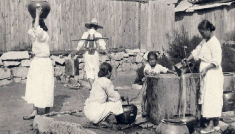
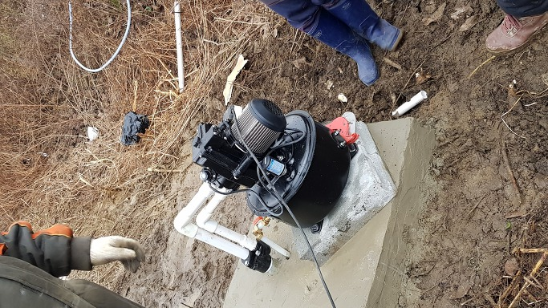
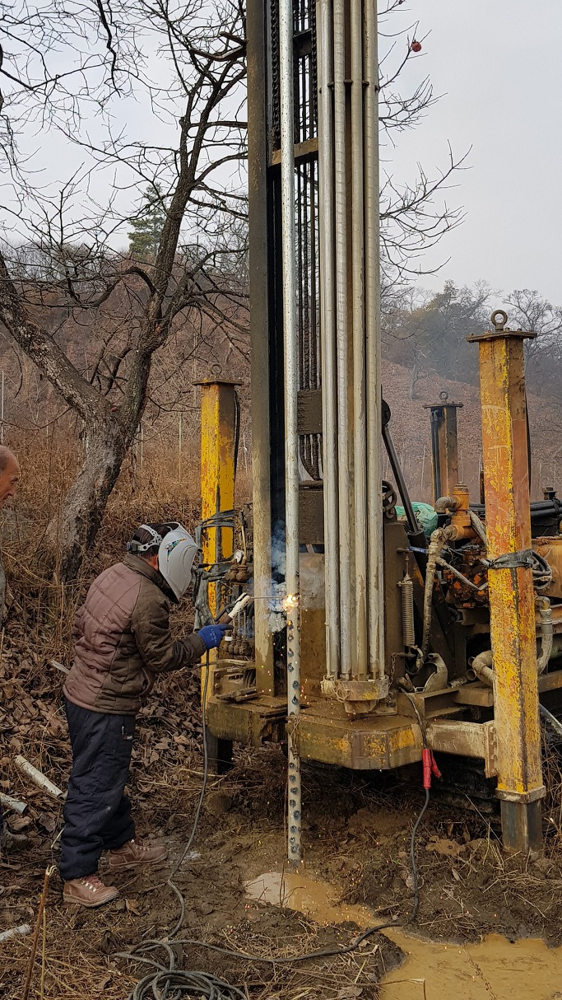

우물을 파도 '한 우물'만 파라?

그 옛날의 우물터

현대식 관정

 

                                                                                                                                    조규익

 

노후 전원생활의 꿈을 심고 있는 에코 팜에 얼마 전 우물을 뚫었다. 둥글거나 네모난 형태의 전통 우물을 ‘판 것’이 아니라, 드릴(drill)로 뚫고 내려가 지하수맥을 연결하여 물을 길어 올리는 형태의 관정(管井)이니 ‘뚫었다’는 말이 맞다.

 

내 어린 시절엔 곡괭이와 삽으로 물 나올 때까지 한 뼘씩 파 들어가는 것이 샘 파는 방법이었다. 그래서 기껏 여남은 길 파내려 가다가 물이 나오지 않으면 포기하고 메우는 일이 다반사였다. 우물 뚫어 대번에 물이 나오거나 맑고 맛있는 물이 나온다면, 그것은 그 집의 복이었다. 십 여 군데를 파도 물이 나오지 않거나, 나온다 해도 맑지 않거나 맛이 안 좋은 경우가 비일비재하기 때문이었다.

 

삽이나 곡괭이만으로 샘을 파는 일이니, 쉽지 않은 건 당연했다. 파 내려가는 땅 속에 암반이 누워있는 경우라면 얼른 포기해야 하고, 자갈이 많은 땅도 쉽지 않은 건 물론이었다. 이보다 더 답답한 일은 얼마간 파 내려가도 물이 나오지 않는 경우였다. 수맥이 어디에나 뻗어 있는 건 아니었다. 간혹 수맥이 얕은 경우도 있겠지만, 깊숙한 곳에 있는 것들이 대부분이었다. 그래서 웬만큼 파다가 물이 안 나온다 싶으면 옆으로 옮겨 다시 파기 일쑤였다. 물이 안 나와도 진득하게 파 내려가다 보면 대부분 물은 나오게 되어 있는데, 성질 급한 사람들은 여기저기 파게 되고, 그러다가 끝내 우물 파는 일을 포기하는 경우도 없지 않았다. 사실 수맥 잡는 기술이 일반화되고 있는 요즘에도 샘 파는 일은 쉽지 않다.

 

그래서 ‘우물 팔 땐 한 우물만 파라’는 속담이 생겨난 것일까. 고집스러울 정도로 한 가지 일에만 몰두해야 성공한다는 뜻인데, 지금도 과연 이 말이 통할지는 의문이다.

사실 나는 ‘한 우물’ 세대다. 어려서 부모님과 선생님들로부터 귀에 못이 박힐 정도로 들어온 말이 ‘한 우물’ 속담이다. 그래서 내 삶의 모든 것들은 이 말과 직•간접적으로 연결되어 있다. 심지어 결혼하여 가정을 이루고 살아가는 일에도 이 말은 지켜야 할 금언이었다. 우리 시대까지 남자도 여자도 ‘한 번 결혼했으면 죽을 때까지 그 사람만 사랑해야 한다’는 것은 일종의 법이었다. ‘결혼한 뒤 맘에 안 맞으면, 헤어지고 다른 여자(혹은 남자)를 취하라’는, 전제조건 부대의 가언명법(假言命法)으로 바뀐 것은 겨우 21세기에 들어오고 나서부터였다. 그러니 맘에 맞지 않아도 맞춰가며 살아가야 하는 것이 그 시대의 불문법(不文法)이었던 것이다.

 

남녀문제만 그런 게 아니었다. 공부도, 직장도 그랬다. 한 번 대학에 들어가 전공으로 택하면 졸업 후 밥 먹고 사는 일도 그 전공 혹은 거기서 그리 멀지 않은 분야를 선택하는 것이 일반적이었다. 직장도 평생직장이라야 했다. 멀쩡한 직장을 중도에 박차고 나가는 사람은 문제가 있다고 보기 일쑤였다. 지금도 그런지는 모르겠지만, 몇 년 전까지만 해도 한국의 대학들(일부라고 생각되긴 하지만)에는 해괴한 규정이 있었다. 신임교수를 채용할 때 ‘전공적합도’라는 항목이 있었는데, ‘학부-석사-박사’가 일치해야 만점인 30점을 주는 규정이었다. 나는 그 점이 불만이었다. 학부에서 영문학, 석•박사에서 국문학을 전공한 지원자도 더러 있었고, 학부는 이공계, 석•박사에서 국문학을 전공한 지원자도 간혹 있었다. 사실 나는 그런 사람들에게 가점을 주고 싶었으나, 선배들은 엄격하고 가차 없었다. ‘학문도 한 우물을 파야한다’는 통념의 힘이었을 것이다.

 

학부에 들어가 외국문학을 공부한 사람이나 이공계를 전공한 사람이 석•박사에서 국문학으로 바꾸는 것은 참으로 쉽지 않은 일 아닌가. 사실 당시에도 나는 그런 사람들이 부러웠다. 그들에게는 ‘국문학으로 바꾸어도 승산이 있다’, ‘바꾸는 게 절대로 유리하다’, ‘바꾸고 싶다’는 등의 판단과 절박한 욕망이 있었거나 바꾸어도 괜찮을 만큼의 여유가 있었기에 바꾸었을 것이다. 시골에서 발발 떨며 올라와 국문학을 택한 내 처지에 전공을 바꾸는 일은 꿈도 꿀 수 없었다. 그저 ‘시골에서 옛날 하던 식으로’ 한 우물을 파는 것이 최선이었기 때문이다. 요즘은 ‘융합’이 대세이니, 대학에서도 옛날의 관행이나 규정은 더 이상 통할 수 없을 것이다. 그러나 ‘학부에서 불문학을 전공하고, 석•박을 국문학으로 하신’ 석학 조동일 선생을 이채로운 눈으로 바라보는 분위기가 아직도 말끔히 사라지지 않고 있는 것은 예의 ‘한 우물’ 인습이 갖는 힘이리라.

 

오늘 작은 아이가 직장을 바꾸기로 했다는 소식을 듣고 깜짝 놀랐다. 연봉으로도 안정성으로도 남들이 모두 부러워하는 최 상위 대기업의 사원인 그였다! 공교롭게도 전직(轉職)을 결정하는 날, 대리에서 과장으로 진급까지 한 터였다. ‘인문학 전공자로서 시공사(施工社)의 관리직으로 평생을 보내기보다는 좀 더 역동적으로 능력을 발휘하고 싶어 투자금융사의 경력직으로 옮기게 되었다’는 그의 선언에 ‘격려’ 말고는 달리 대꾸할 말이 궁했다. 회사를 위해 젊음을 바쳐도 나이가 들면 가차 없이 버려지는 대기업의 냉혹함을 미리 깨달았던 것일까. 아직 30대 초반의 팽팽한 그의 입장에서 새로운 성공의 가능성을 포착한 것일까. 어느 쪽이든 나로선 ‘가슴 떨리는’ 신선함과 두려움의 단안일 수밖에 없다. 그러고 보면 시대가 바뀌었음을 나만 모르고 있었던 것이니, 분명 내 의식의 밑바닥에는 ‘한 직장에 뼈를 묻어야 한다’는 착각이 아직도 똬리를 틀고 있음이 분명하렷다?

 

\*\*\*

 

‘한 우물’을 파면서도 용케 패자로 전락하지 않고 살아온 내 지난 세월을 돌이켜 본다. 이제 ‘한 우물만 파다가는 목도 축일 수 없다’는 생각으로 사람들의 인식과 의식의 패러다임은 바뀌었다. 그렇다면 내가 파온 ‘한 우물’은 앞으로 어떻게 할 것인가. 문득 그 옛날 시골의 ‘나간 집 우물’을 떠올려 본다. 우물은 쓰지 않으면 반드시 퇴락한다. 지나가는 사람들은 괜히 빈 집의 우물에 돌을 던지거나 침을 뱉고 떠난다. 바람이 불면 나뭇가지가 날아들고, 큰물에 자갈들이 밀려들기도 한다. 낮으로 밤으로 우물 밑바닥에는 흙이 솔솔 들어찬다. 그러다가 한 십년 지나면 언제 그곳이 우물이었던가 싶게 평평해진다. 우물이 사라진 곳에 새로운 삶이 자리를 잡게 되는 것이다. 인간의 삶도 그렇지 않은가. 열심히, 죽을 때까지 새롭게 파거나 보수하지 않으면, 자취도 없이 사라지는 게 우리네 우물이 아니던가. 그래서 나는 오늘도 곡괭이를 메고 그간 매달려 온 '한 우물'을 더 파기 위해 집을 나선다.

드릴로 관정 뚫는 모습

공유하기

게시글 관리

**백규서옥\_Blog ver.**

[저작자표시 비영리 변경금지
(새창열림)](https://creativecommons.org/licenses/by-nc-nd/4.0/deed.ko)