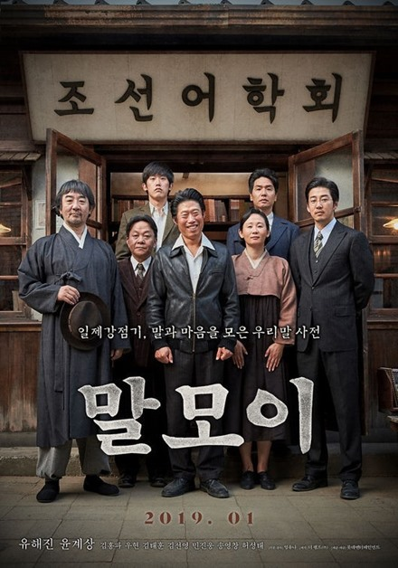

     좋은 영화 <말모이>

의무감으로 찾았다가 감동 받고 돌아오다!

                                                                                                                                                      

                                                                                                                                                               조규익

얼마 전부터 ‘말모이’라는 말이 들려오기 시작했다. 소리 소문도 없이 ‘말모이’라는 영화가 등장하여 사람들의 시선을 모으고 있다는 것이었다. ‘말모이’라? ‘국어사전’이란 뜻인데? 한일합방 전후 주시경 선생을 중심으로 우리말 사전의 필요성을 절감한 인사들이 쓰기 시작한 말인데...

 

그렇다. ‘조선말 큰 사전’ 편찬까지의 우여곡절을 사건의 축으로 조선어학회 회원들이 겪은 수난(조선어학회 사건)을 그려낸 영화였다. 사실 처음엔 볼까 말까 고민했다. 수없이 읽고 들어, 익히 안다고 자부하던 사건이었다. 2019년 들어오며 겹치기로 찾아온 우울증에서 헤어나지 못하는 상황이기도 했다. 비참한 역사를 반추하며 우울증을 심화시킬 이유는 더더욱 없었던 것. 모른 척 피하는 게 상책이었다. 그런 나를 움직인 것은 중국 조선족 대학원생의 말이었다.

 

“교수님, <말모이>란 영화 보셨어요? 최근에 본 영화 중 최고였어요. 할아버지 나라의 말과 글을 지키기 위해 그런 고통이 있었다는 사실을 첨 알았어요. 감동이었어요. 꼭 보세요!”

 

갑자기 얼굴이 붉어졌다. 그래, 중국에서 온 너도 그런 말을 하는데. 명색이 한국어문학을 가르치고 연구한다는 내가 너만도 못한 생각을 하고 있었구나! 가난한 시골에서 자라나 사범대학 국어교육과를 지원할 때만 해도 ‘우리말과 글을 가르쳐 훌륭한 한국인들을 기르겠다.’는 것이 내 꿈이었다. 애국의 순정으로 충만해 있었던 것이다. 세월의 격랑 속에 가슴 속의 정열은 모두 식어버려, 그냥 ‘국어국문학 선생으로’ 습관화된 삶을 지탱해오고 있었구나!

 

‘따분한 역사 이야기와 상투적인 메시지의 나열’에 불과할 것이라는 내 예상은 일자무식 소매치기 김판수(유해진)와 조선어학회 핵심요원 류정환(윤계상)의 조우, 판수의 조선어학회 합류, 자녀들(덕진과 순희)을 통한 판수 가족의 생활고, 경성제일중 이사장 류완택(송영창)과 아들 류정환의 갈등, 치밀하고 집요한 일본 경찰과 그들을 통해 고발하는 일제의 야욕 및 만행, 막바지에 무산되는 공청회와 말모이의 원고를 두고 일본 경찰과 벌이는 추격전, 김판수의 장렬한 죽음, 해방 후 천행으로 되찾은 원고, 그 원고로 만들어진 <<조선말 큰 사전>>...그와 함께 사건들의 치밀한 배치와 주도면밀한 서사전략이 돋보이는 영화예술의 격을 맛보게 된 건 망외(望外)의 소득이었다.

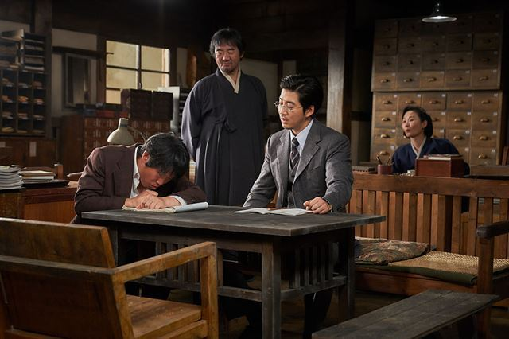

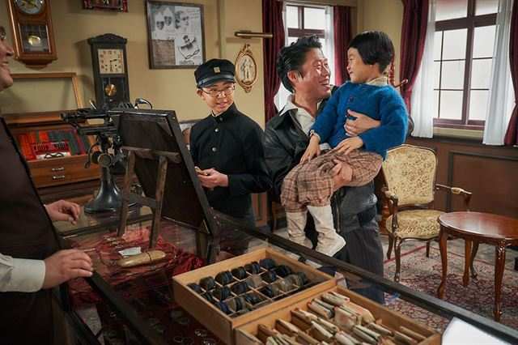

팩트(fact)와 픽션(fiction)의 비율이나 배합이 시나리오 작가나 감독에겐 중요했겠지만, 이 영화의 경우 그게 전부는 아니었다. ‘말과 글이 민족의 정신이자 생명이라는 것’을 보여주는 축, ‘어느 순간에는 평범한 사람들이 대의(大義)에 동참하여 큰일을 이룰 수 있다는 것’을 보여주는 또 하나의 축, ‘일본이 우리를 정신까지 집어먹기 위해 얼마나 잔혹하게 굴었는가’를 보여주는 제3의 축이 동아줄 꼬이듯 엮여 나간 것이 이 영화의 서사였다. 사실 ‘한 사람의 열 발자국보다 열 사람의 한 발자국이 더 큰 것이고 그것들이 모여 비로소 조선의 독립을 이룬다’는 말이 감동적이긴 하나 예술성을 흠집 낼 상투적 요소로 저평가될 수도 있지 않겠는가. 그럼에도 관객들이 그 말을 들으며 전율했다면, 이 영화의 흠을 더 이상 찾기는 어려울 것이다.

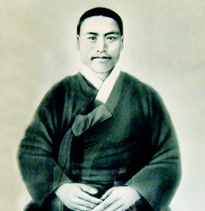

주시경 선생

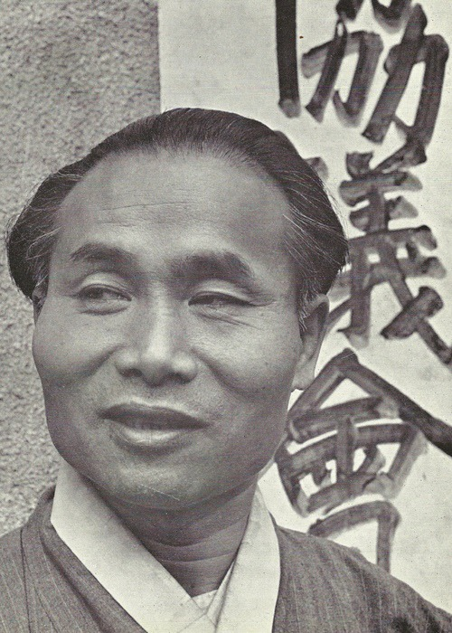

이극로 선생

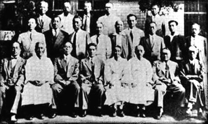

조선어학회 사건에 고초를 겪은 인물들

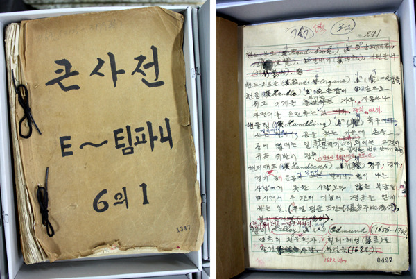

조선말 큰 사전 원고

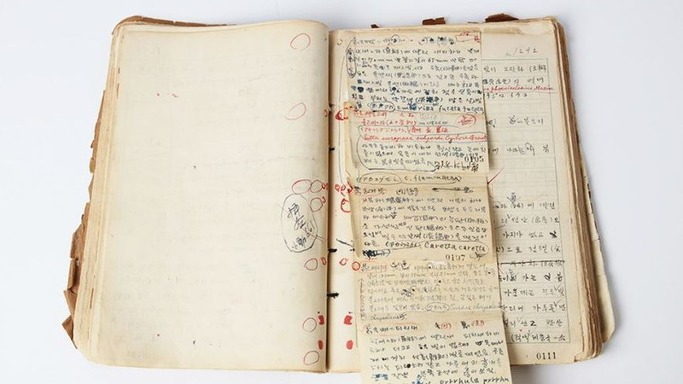

조선말 큰 사전 원고

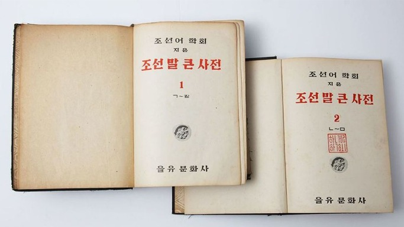

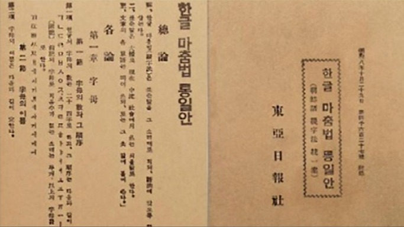

또 하나. 일본이 동해상에서 초계기 장난을 벌이고 있는 지금. 이 영화의 타이밍이 절묘하다. 일본인들이 이 영화를 볼 이유도 없고, 본다 한들 자신들의 ‘야만적 잔인성’을 인정할 리도 없겠지만 말이다. 제국주의 시대 식민지를 개척하면서 식민지의 문자와 글을 뿌리 뽑고 그 자리에 자신들의 것을 강압적으로 심으려는 시도를 인류사 어디서 찾을 수 있단 말인가. 알퐁스 도데의 단편소설 <마지막 수업(La Dernière Classe)>에서나 약간 찾아 볼 수 있을까. 일상생활에서까지 자신들의 말과 글을 쓰지 못하게 한 만행의 주체로 일본 같은 경우는 일찍이 없었다.

\*\*\*

시간과 상황 속에 던져진 존재로서의 인간임을 깨달았기 때문일까. 영화가 돌아가는 내내 눈물이 흘렀다. 영화 속의 저들은 대체 왜 ‘말도 안 되는’ 탄압을 받으며 살아가야 하는 운명을 타고 났단 말인가. 잠시 잊고 있던 역사적 진실이 가슴 속에 감동으로 되살아났다. 예술적 팩션(faction)으로 감동을 선사해준 감독과 배우들에게 경의를 표한다.

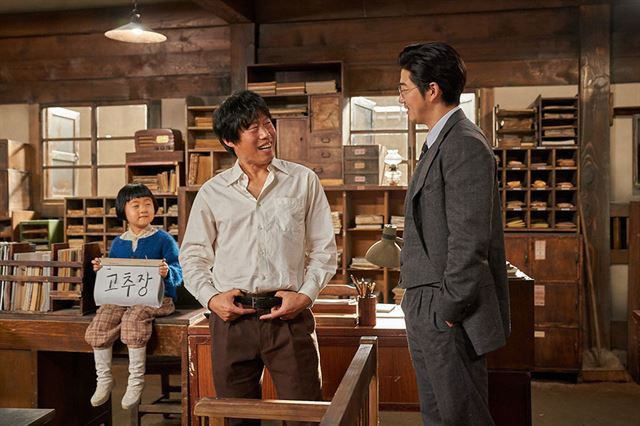

공유하기

게시글 관리

**백규서옥\_Blog ver.**

[저작자표시 비영리 변경금지
(새창열림)](https://creativecommons.org/licenses/by-nc-nd/4.0/deed.ko)