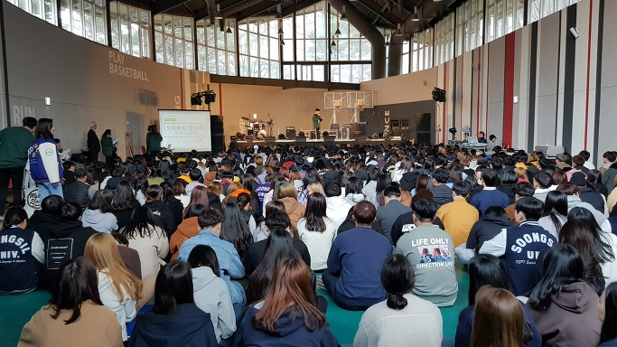
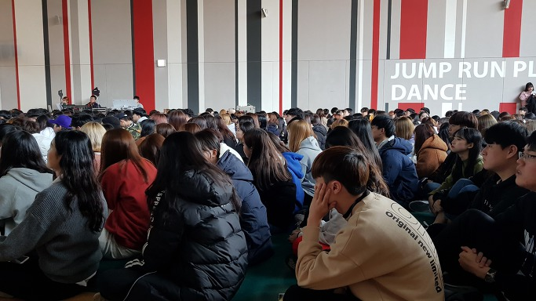

새내기 OT에 다녀오며

                                                                                                                        조규익

매년 이맘때(2월의 마지막 주)면 대학 본부가 주최하는 새내기들의 OT 모임이 있다. OT란 ‘ORIENTATION’의 약자일 터인데, 서양의 대학들에서 기원한 Student Orientation이 바로 그것이다. 새내기들에 대한 환영과 대학생활 안내, 새내기들과 교수 및 선배들의 만남, 새내기들 간의 친목 도모 등 다양한 목적과 내용으로 진행되는 행사다.

3천명 넘는 신입생들이 한 곳에 모일 수 없으니, 각 단과대학별로 흩어져 열리게 된다. 올해 인문대학 OT는 포천의 한화리조트에서 있었고, 교수들은 그곳으로 가서 새내기들을 만났다. 두 눈을 반짝이며 기대에 부푼 갓 20의 젊음들이 텅 빈 계곡을 뜨겁게 채우고 있었으며, 나도 새내기로 돌아가 그들과 함께 하고자 했다. 아, 그들 사이엔 45년 전 새내기였던 내가 들어 있었다!

그들을 만나는 순간, 나는 타임머신을 타고 45년 전으로 돌아갔다. 그 시절 시골 소읍(小邑)에 있던 모교의 OT 장소는 부속고등학교 강당이었다. 겨울의 끝자락에 진행되던 당시의 OT가 내겐 참으로 씁쓸한 추억으로 남아 있다. 시골 치고 인심 사나운 곳이었다. 객지에서 겨우 잡은 자취방은 주인집 뒤쪽의 쪽문으로 통하는 곳에 있었고, 주인은 아예 한 번 와보지도 않았다. 방세를 내기 위해 안채를 방문하면 받아 든 돈의 액수만 확인한 뒤 방 안으로 쏙 들어가 버리곤 했다. 말을 섞을 필요도 섞으려 하지도 않았다.

자취방의 연탄온돌은 좀처럼 데워지지 않았고, 그 해 마침 연탄파동으로 연탄가게는 늘 텅 비어 있었다. 하루에 한두 덩이씩 연탄을 사서 새끼줄에 꿰어들고 언덕마을 자취방으로 오르내리는 것이 고역이었다. 채 마르지 않은 연탄이었던지라, 부엌에 갖다 놓아도 불을 붙이는 게 쉽지 않았고, 가까스로 불이 붙어도 고약하게 만들어진 구들장 탓으로 방 안엔 온기가 돌지 않았다. 밤새 참새새끼처럼 떨다가 아침에 일찍 일어나 겨우 식사를 해결한 뒤 찾아가던 OT 장소.

‘4년 동안 이렇게 지루한 강의가 진행된다’는 것을 미리 보여주고 겁을 주려는 행사가 OT라는 것을 그 때 알게 되었다! 강당을 빽빽하게 채운 410명의 새내기들은 지루하게 짜인 강의들에도 아무렇지 않은 듯 웅성거리는데, 하루 일정이 끝나고 냉방으로 들어갈 생각에 나 혼자만 우울했었다. 그렇게 대학 새내기 시절의 OT는 내 회색빛 추억의 폴더에 지금까지 고스란히 갈무리되어 있다.

으레 회상하고 싶지 않은 회색빛 추억을 소환할 수밖에 없어서일까. 늘 OT 때만 되면 가급적 현장에 가지 않으려 꾀를 내곤 한다. 그러나 지난해와 올해는 빠질 수 없는 상황이었다. 그런데 올해는 좀 달라진 내 마음을 확인하게 되었다. 이미 6학년을 넘어섰고, 강의실 밖에서 요런 젊음들과 가까이 할 날들도 그리 많이 남아있지 않음을 깨달았기 때문이리라.

그들에게 꿈을 물었다. 대답은 ‘국어교사, 아나운서, 출판 편집자, PD, 작가’가 대부분이었고, 그나마 ‘없다’는 친구들도 몇 있었다. 그렇겠지. 아이들의 꿈을 키워주는 나라가 아니니, 애당초 그들 내면의 현주소는 새삼 물어볼 필요도 없는 일이었다. “산 정상으로 올라갈수록 시야는 넓어진다./ 장래에 무슨 일로 입신(立身)할 것인지는 앞으로 결정해도 된다./ 그러나 그런 시야를 갖기 위해 지금 당장 ‘하루-한 달-한 학기-한 해-대학 4년-일생’에 걸친 자신만의 시간표를 짜야 한다./ 그 시간표는 수시로 수정되겠지만, 어쨌든 그 시간표에 충실하게 최선을 다해야 한다”는 예의 내 ‘시간표론’을 그들에게 들려주었다. ‘꿈을 갖고 노력하는 일’만이 대학생활에 성공하고 인생에 성공하는 유일한 길임을 올해도 어김없이 역설한 것이다. 그들 가운데 몇이나 내 말을 알아듣고 실천할지는 알 수 없다. 그저 ‘지둘려’ 보는 수밖에.

OT장에서 돌아오는 길. 발걸음이 무거웠다. 새내기 부모들의 얼굴이 자꾸만 밟혔다. 그들은 자신의 자식들이 대학 공부를 발판으로 험한 사회에서 어렵지 않게 ‘서바이벌’ 해주기를 기도하고 있을 것이다. 대학에 보내놓고 고관대작이나 재벌이 되어주길 소망하거나 자신하는 부모는 별로 없을 것이다. 그저 밥이나 제대로 먹고, 착한 남녀 만나 자식들 낳아 기르며, 소소한 행복이나마 누리며 살게 되는 것. 이른바 ‘소시민의 행복’이라도 보장되었으면 하는 것이 나를 포함한 대다수 부모들의 바람 아니겠는가. 우리의 아이들에게, 제자들에게 그걸 안겨주는 일이 왜 이리도 어렵단 말인가. 자신들의 이기심을 충족시키기 위해 촛불 들고 광야에 나서게 함으로써 젊은이들을 ‘혁명의 전사’로 만드는 게 정치인의 할 일인가. 고매한 이상이나 그럴 듯한 이념을 추구하기에 앞서 젊은 영혼들에게 ‘작은 일에서 행복을 찾는 방법’을 보여주고 가르쳐 주는 게 교육자의 해야 할 일 아니겠는가.

차창 밖으로 펼쳐지는 겨울 막바지의 스산한 풍경이 우울한 내 마음에 끝없는 파문을 일으켰다. 그나마 이렇게 피곤한 육신을 뉠 수 있는 집으로 돌아가는 것마저 내겐 사치스러운 일일까.

xml:namespace prefix = "o" /

공유하기

게시글 관리

**백규서옥\_Blog ver.**

[저작자표시 비영리 변경금지
(새창열림)](https://creativecommons.org/licenses/by-nc-nd/4.0/deed.ko)