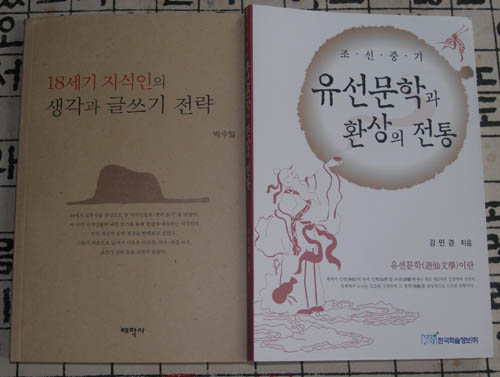

  
  
부부가 같은 일을 하기란 쉽지 않고, 같은 일을 해도 멋진 성과물을 내기란 더더욱 어려운 게 사실입니다.  
그런 점에서 박수밀, 강민경 양 박사는 참으로 부러운 동반자들이라고 할 수 있지요. 뛰어난 감수성과 객관적 분석력을 갖추고 있어 무슨 글을 써도 맛깔스러운 '물건'을 만들어 내는 두 사람. 학계를 위해 조만간 크게 쓰일 날이 있으리라 믿습니다.   
이번에 박수밀 박사는 <<18세기 지식인의 생각과 글쓰기 전략>>을, 강민경 박사는 <<조선 중기 유선문학과 환상의 전통>>을 각각 펴냈습니다. 전자는 우리 역사상 '변화의 세기'이자 '문화의 시대'였던 18세기의 연암 박지원을 비롯한 '열린 지식인들'의 생각을 읽어낸 글입니다. 저자는 머리말에서 당대 지신인들의 자세와 방법을 다음과 같이 단정하고 있습니다.   
  
"18세기 '지적 사유'의 근원은 무엇이었을까? 지금까지의 공부를 토대로 보자면 그들은 세계를 객관화시켜 바라볼 줄 알았다. 그들은 세계의 틀에 갇힌 인간이 되지 않고 세계를 대상화시켜 세계와 마주 대했다. 세계 속의 그림자에서 벗어나 세계의 밖에서 안을 들여다보는 존재! 그리하여 그들은 사물 하나하나를 '다시금' 꼼꼼하게 들여다보기 시작했다. 상식과 통념을 의심하고 미루어 따져보는 '회의와 유추'의 정신이야말로 생각의 패러다임을 바꾼 원동력이라 본다"  
  
고 했습니다. 이 말로 미루어 본다면 우리 지성사에서 이 시기만큼 큰 변화를 이루어낸 시기도 없다고 할 수 있습니다. 이 시기 변화의 핵심만 잡아낸다면 우리가 추구해야 할 미래도 환히 보이지 않겠는가 생각합니다.   
  
후자는 저자가 '중세 지식인들의 미니 홈피'라고 단정한 유선문학을 분석적으로 바라 본 글입니다. 꿈과 현실의 거리 혹은 양태야말로 그 때나 지금이나 글 쓰는 사람들의 주된 관심사가 아닐까요? 저자는 서문에서 다음과 같이 술회하고 있습니다.   
  
"나는 그 때의 지금을 살았던 인간들의 꿈꾸기가 궁금했다. 그리하여 지금의 환상을 그 때의 지식인들은 어떤 방법으로 실현했을까를 들여다보려 하였다. 이 책은 꿈꾸기 문학인 유선시가 당대 지식인들의 삶과 내면에 어떻게 작용하였는가를 밝혀본 것이다. 지식인들의 초월세계에 대한 꿈꾸기 방식을 엿보고, 새로운 세계를 갈망하는 인간의 내면을 들여다보았다."  
  
고 했습니다.  어쩌면 저자는 문학을 통해 꿈꾸기를 시도한 당대 지식인들과 함께 하고자 했는지도 모르겠습니다. 꿈과 현실적 인간의 욕망을 정치하게 분석한 글입니다.   
  
이 분들의 글을 자신있게 추천하오니, 많이들 읽으시고 공감해 주시기 바랍니다.   
  
  \*박수밀, <<18세기 지식인의 생각과 글쓰기 전략>>, 태학사, 2007, 13000원  
          
  \*강민경, <<조선 중기 유선문학과 환상의 전통>>, 한국학술정보(주), 2007, 15000원  
  
  
          2007. 6. 6.  
  
          백규

공유하기

게시글 관리

**백규서옥\_Blog ver.**