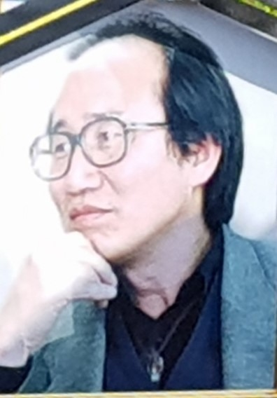
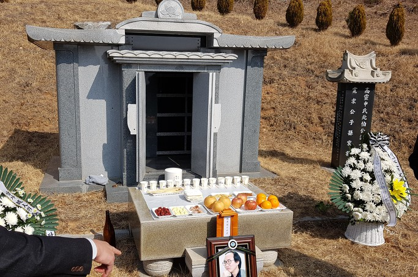
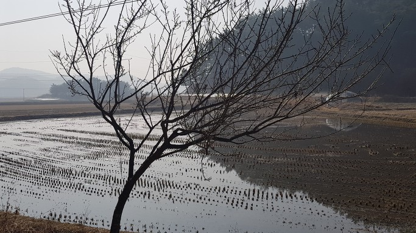
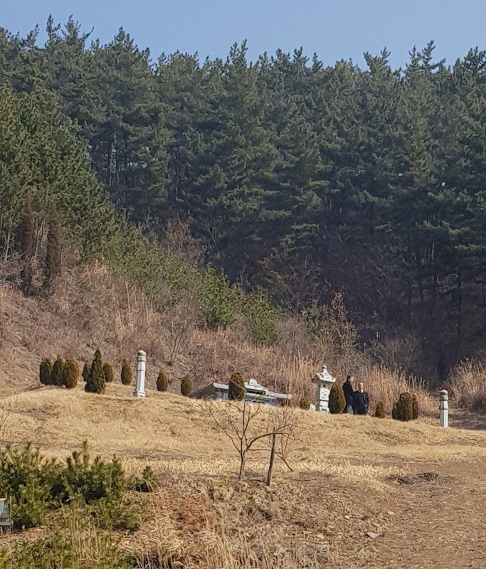

친구 신연식을 보내며

조규익

친구 신연식이 떠났다. 15년 해직으로 고통 받고, 10년을 병마와 싸우던 그는 결국 병마의 끈질긴 공격으로 이승에의 집착을 내려놓고 말았다. 그리고 영원한 안식의 길을 떠났다. 그의 얼굴은 편안했고, 막바지에 그가 남겼다는 글은 평소 그의 말처럼 담담했다.

장례식장에 내걸려 추도객들을 맞이하던 그의 영정은 오늘 내게 무슨 할 말이라도 있는 것 같았다. 그러나 끝내 그는 입을 열지 않았다. ‘무언의 말’로 자신의 속내를 전하고, 다시 긴 침묵에 잠긴 것이다.

그와 나는 시골 친구다. 살던 마을도 '국민학교'도 달랐으나, 각자 졸업 후 당시 중학과정을 가르치던 ‘계도농축기술학교’에서 만났다. 참, ‘똘망하고’ 공부 잘하던 그였다. 형과 두 누이들 밑에서 자란 막둥이여서 그랬을까. 시골 아이 답지 않게 준수한 용모에 입성도 깨끗하였다. 졸업 후 그는 서울의 명문고에 들어가 졸업 후 연세대로 진학했고, 대학을 졸업한 뒤에는 유능한 국어교사가 되었다. 몇 년 동안 교사로 봉직하던 그는 교육현장의 부조리에 항거하기 시작했다. 후일 전교조로 확대・정착된 참교육 운동은 그를 중심으로 몇몇 열혈 교사들에 의해 주도되었고, 뜻을 굽히지 않던 그는 그 일로 결국 해직의 독배를 마셨다. 그로부터 15년은 형극(荊棘)의 세월이었다. 생각해보라. 생활인의 입장에서 직장으로부터 쫓겨나 15년을 버티며 자신의 얼굴만 바라보는 가족들의 눈망울을 외면하기가 어찌 쉬웠겠는가. 무엇보다 참교육이 사라지고 있는 교육현장을 먼발치에서 바라보아야 하는 그의 정신적 고통을 상상할 수 있겠는가.

그는 해직의 고통을 극복해야 했고, 교육현장의 부조리들과 싸워야 했다. 그래서 그의 삶은 투쟁의 연속이었다! 그의 향년은 63세. 공자 말대로 30이 입지(立志)의 나이라면, 그 후 ‘불혹(不惑)-지천명(知天命)-이순(耳順)’은 송두리째 투쟁과 고난으로 일관한 시간대였다. 교육현장의 문제만이 아니라, 우리사회의 이데올로기 대결과 그로부터 파생되는 사회갈등에 대해서도 열변을 토하기 일쑤였다. '동지'들과 함께 평양을 방문하여 그 쪽 일꾼들과 민족의 미래를 논의하고 돌아온 일은 훈장처럼 빛나는 그의 이력이었다.

그 강고한 투쟁들이 병을 불러 왔으리라. 교단 복직 후 몇 차례의 수술과 투병을 거치면서 삶에 대한 깊은 성찰을 얻은 것은 물론이다. 정년을 맞은 뒤에도 끈질긴 투병생활을 지속해왔으나, 극성스런 병마는 그의 온몸을 만신창이로 만들었고, 결국 그는 또렷한 정신 속에 이승을 떠난 것이다.

 자그마한 단지 하나에 담긴 그의 유골이 양지 바른 선산의 납골묘에 안치됨으로써, 그와 우리는 유명(幽明)으로 길을 달리 하게 되었다. 그가 잠든 납골묘 밑으로는 어린 시절 드나들던 신작로가 있었고, 그 앞으로 물이 담긴 서너 마지기의 논이 있었다. 논을 보호하고 서 있는 산 너머에는 신두리 백사장이 펼쳐져 있었고, 그 발치를 핥아보려 끊임없이 들고나는 파도가 일렁거리고 있었다.

\*\*\*

내 친구 연식아, 이제 투쟁의 검(劍)을 내려놓아라. 그리고 백사장의 맹꽁이들과 달랑게들, 파도의 하얀 포말들을 벗 삼아, 그간 잊고 지내던 동심으로 돌아가는 게 어떻겠니? 물 드는 시각이면 한 바구니 그득 굴뻑들을 담아 오시던 어머니를 동구 밖에서 맞아 손잡고 돌아오는 삶을 새로이 시작해 보는 게 어떻겠니?

부디 고통 없는 그곳에서 편안하고 행복한 '또 하나의 영원한 삶'을 누리기 바라며, 네가 없는 허전함을 통곡으로 메워본다!ㅠㅠ

2019년 3월 1일

                 친구 백규, 삼가 통곡하며 씀

\*그가 며칠 전 친구들에게 썼다는 고별의 인사말 가운데 한 부분을 여기에 옮겨 놓습니다.

“이승을 떠날 날이 임박했다는 몸의 신호를 받으며, 여러분께 작별인사 겸 몇 마디 부탁의 말씀을 드리고자 합니다. 병마가 온몸을 갉아먹어 혹 기회를 놓치면 작별의 인사조차 남기지 못할 수도 있다는 우려 때문입니다.

제 몸의 질병은 크게 두 가지입니다. 하나는 암으로 더 이상 치료 방법이 없는 상태에 이르렀습니다. 또 한 가지는 폐기종으로 이 또한 현대의학으로는 회복 불가능한 질환이지요. 3주 전부터는 하루가 다르게 악화되어 이제 떠날 날이 임박했음을 부정할 수 없게 되었어요.

제 몸이 갈수록 살아있는 사람들의 짐이 되어 가는 걸 지켜보면서, 아무런 손을 쓸 수 없음이 슬퍼지는군요. 매 순간이 고통이었습니다. 의학적으로 회복할 수 없는데, 끝을 향해 가는 몸을 지켜봐야 하는 것은 더욱 참을 수 없는 고통이군요. 갈수록 가빠지는 호흡과 기침, 움직일 수 없는 현실 또한 말할 수 없는 고통입니다. 그 속에서 행복을 느낄 수 없는 것은 다른 무엇보다 더 큰 고통입니다. 내가 하고 싶은 일을 하나도 할 수 없고, 가까운 사람들에게 짐이 되는 삶을 연장해가는 현실은 참 견디기 힘든 고통입니다.(…)넋두리가 길었군요. 여러분과 함께 한 그동안의 세월이 얼마나 소중하고 귀한 시간대였는지 모르겠습니다. 교단에 있는 동안 매년 첫 시간 수업은 ‘인연’이었습니다. 살면서 부딪치는 인과 연이 내 삶 모두를 형성하는 것이기 때문이지요. 그런 의미에서 여러 벗님들과의 인연은 내 생애의 행운 그 자체였습니다. 다시 한 번 크게 고맙다는 말씀을 드립니다.(…) 지금까지 저를 세워 주신 벗님들, 사람 사는 세상을 만들기 위해 더욱 애써 주시기 바랍니다. 참으로 고마웠습니다. 안녕히 계십시오! 부디 행복하십시오!”

xml:namespace prefix = "o" /

공유하기

게시글 관리

**백규서옥\_Blog ver.**

[저작자표시 비영리 변경금지
(새창열림)](https://creativecommons.org/licenses/by-nc-nd/4.0/deed.ko)