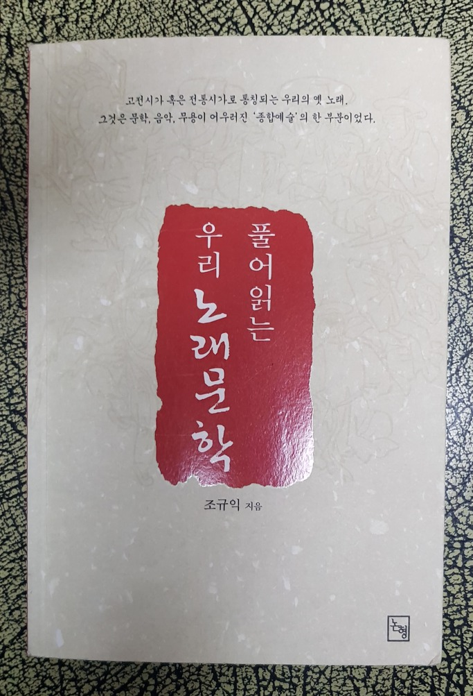
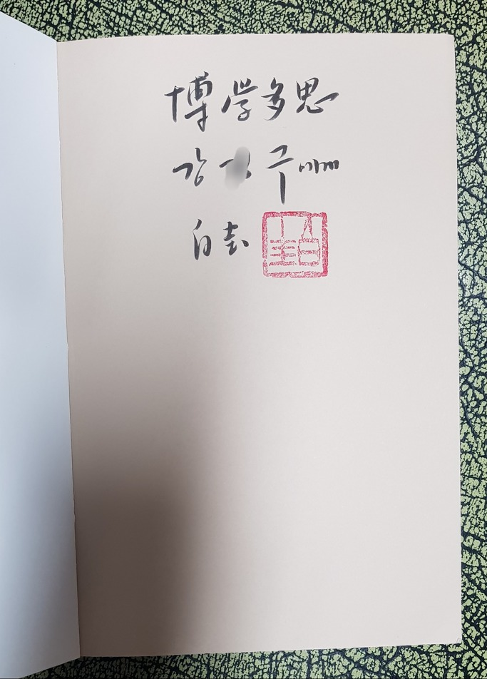
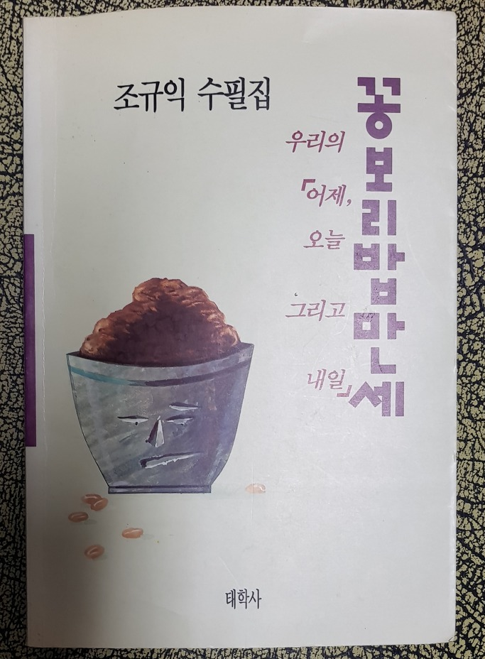
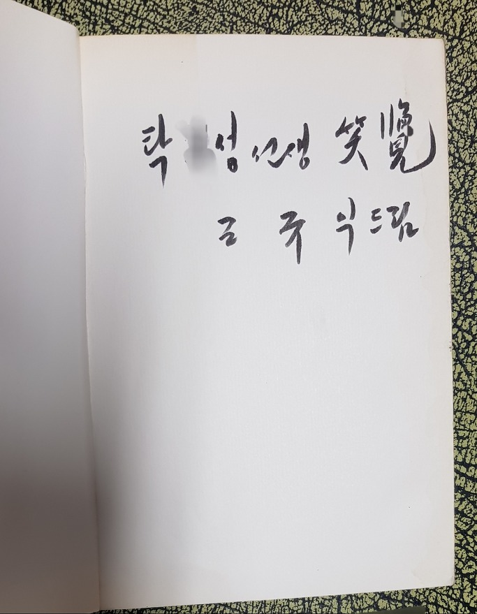
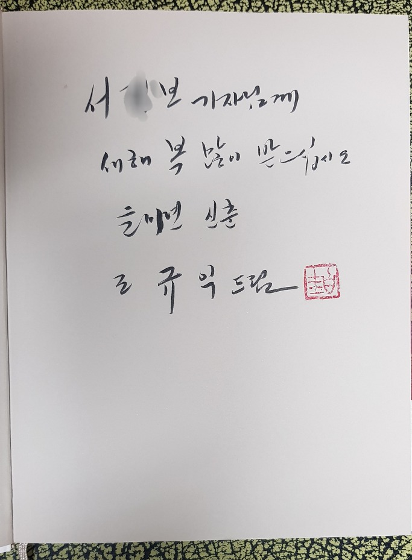
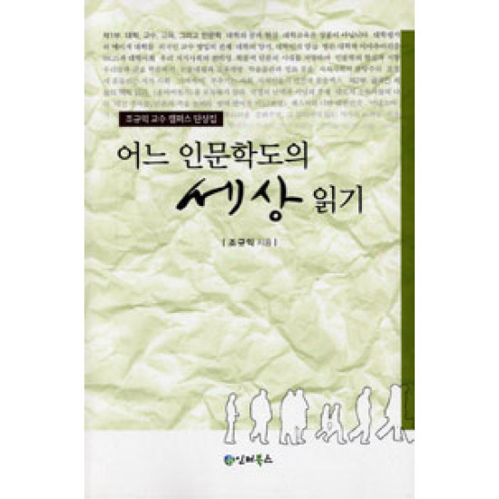
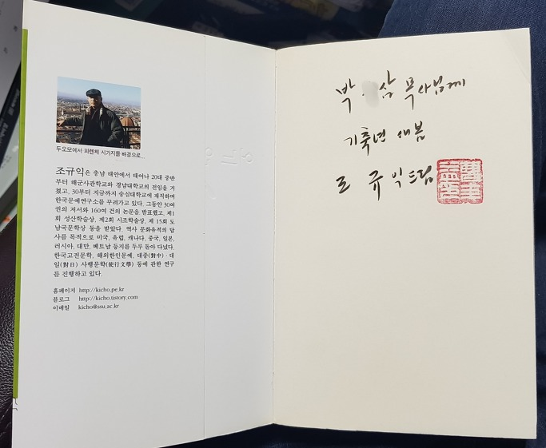
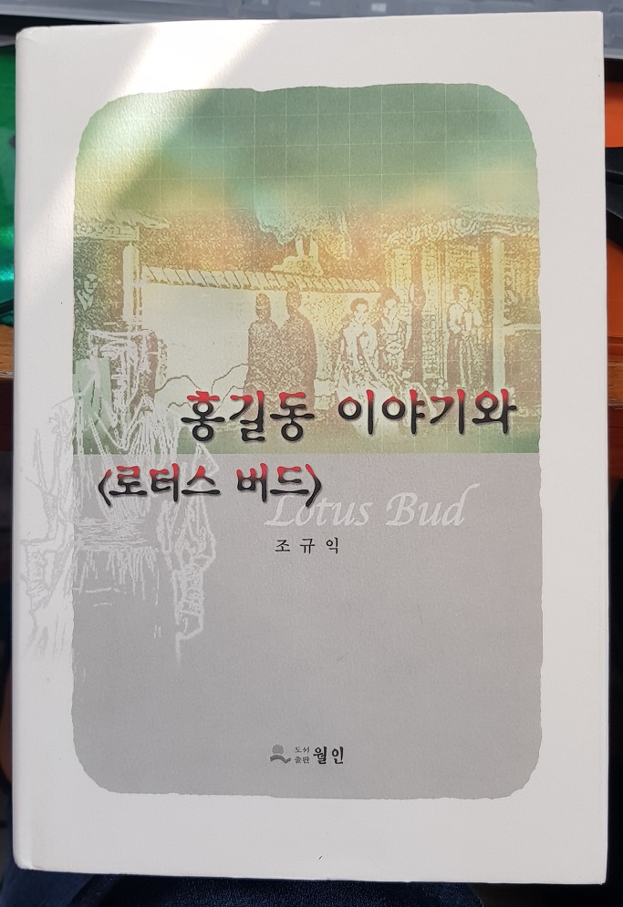
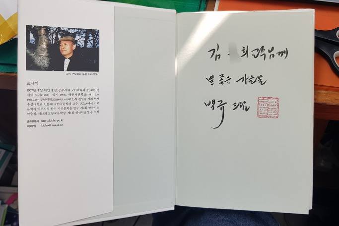

책을 잘 버려주신 분들께 감사드리며 

                                                                                                                         조규익

책과 돈은 한 군데 고여 있으면 썩는다. 한 나라의 경제가 잘 되려면 돈이 ‘재빨리 활발하게’ 돌아야 하고, 한 나라의 학계가 잘 되려면 책이 많이 만들어져 왕성하게 유통되어야 한다. 내 서재에서 잠자고 있는 책들이 언젠간 후학 누구에겐가 전해져 새로운 지식의 원료로 쓰인다면, 그보다 더 다행한 일은 없을 것이다. 누구에겐가 증정한 내 책이 자취생의 라면 냄비 받침으로 쓰이다가 애완견의 똥받이나 시골집 아궁이의 불쏘시개로 사라지는 것보다는 중고서점 진열대에라도 올라 새로운 수요자에게 선택받을 날을 기다리는 것이 훨씬 다행한 일이리라.

그러나 시계추처럼 당위와 현실 사이를 쉴 새 없이 오가는 것이 인간의 마음이다. 며칠 전 페이스북에 포스팅한 ‘책을 쓰지도 말고, 증정하지도 말라!’는 내 글이 바로 그런 경우다. 내가 누구에겐가 친필 헌사를 써서 증정한 책이 중고서점의 서가에 진열되어 있었고, 그 책들을 산 후배가 내게 전화를 걸어 그 사실을 알려 주었다. 그 책들이 훌륭한 내 후배의 손에 들어갔으니, 제대로 된 임자를 만났다는 사실에 일단 안도했고, ‘책들은 돌고 돈다’ 아니 ‘책들은 돌고 돌아야 한다’는 당위를 확인한 셈이었다. 그럼에도 왜 나는 이리 섭섭하고 슬퍼질까.

후배로부터 그 책 사진들을 받아든 순간, 내 책을 받았을 그 사람들의 얼굴이 떠올랐다. 다섯 사람 모두 바로 눈앞에 앉아 있는 듯 생생했다. 서운한 순서로 말하면 제자, 대학 후배, 몇 년 전 정년퇴임한 교수(\*그는 현재 목사로 활동 중이다!),  문학평론가로 활동중인 다른 대학 교수 등으로 나열된다. 갓 펴낸 전공 책에 ‘박학다사(博學多思)’란 소망 섞인 헌사를 써서 제자에게 건넸으니, 당시 나는 그를 얼마나 아꼈던 것일까. 그 다음이 대학 후배. 1년 후배였으나, 학창 시절에는 사적인 만남이 거의 없었던 존재였다. 시내 모 대학에 재직하던 그는 언젠가부터 내가 재직하고 있는 대학에서 박사 공부를 했고, 학위를 받은 후에는 가끔 강의를 나오기도 했다. 강의가 끝나면 종종 연구실로 찾아왔고, 함께 점심이나 저녁식사를 하면서 세상 돌아가는 이야기도 곧잘 나누던 사이였다. 시원치는 않으나 첫 수필집을 ‘소람(笑覽)’이란 헌사를 써서 그에게 증정했다. 공부하는 입장에서 수필집을 낸 사실이 겸연쩍었던 것일까. ‘웃으면서 보아 달라’는 주문을 담은 헌사였다. 그 다음이 내가 재직하고 있는 대학의 모 외국어문학과에 있다가 몇 년 전 퇴임하여 목회를 하고 있는 교수. 그에겐 내 단평집 <<어느 인문학도의 세상읽기>>를 건넸다. 그 다음은 전공 책 <<세종대왕의 봉래의, 그 복원과 해석>>에 신년인사를 헌사로 적어 증정한 모 언론사의 기자다. 아마 보도 좀 해달라는 속뜻도 담겨 있을 것이다. 마지막은 문학평론가로 활동 중인 모 대학 교수다. 똑똑하고 실력 있는 현대문학 분야 전공자인데, 내가 무슨 연유로 이 책(<<로터스 버드와 홍길동 이야기>>)을 증정했는지는 분명치 않다. 

  

처음 후배로부터 전화연락을 받을 당시에는 밀려드는 서운함과 후회를 누르기 어려웠다. 나로선 상상하기 어려운 일이었기 때문이다. 그리고, 그 뒤 후배가 보내 준 그 책들에서 단 한 페이지를 넘겨 본 흔적이라도 발견했다면 덜 서운했을 것이다.(\*페이스북에 그 글을 포스팅한 다음 날 후배는 퀵서비스로 그 책들을 내게 보내왔다.) 내게서 받은 그대로 어딘가 던져 놓았다가 쓰레기장에 내다 버렸음을 그 책들은 내게 속속들이 일러바치고 있었다! 그런 사람들에게 '나로서는 금쪽같은' 그 책들을 정성스레 포장하여 증정했다는 사실이 땅을 칠 정도로 후회스러운 것이다.  늘 책 욕심에 찌들어 살아온 나인지라, 책을(더구나 증정 받은 책을) 버리는 행위는 일종의 ‘죄악’이었다. 누군가들로부터 받은 책들에는 그들의 얼굴과 정신이 박혀 있었고, 그것들은 늘 나를 주시하고 있었다. 그래서 나는 그들과 대화를 주고받으며 나를 다잡아 온 셈이다. 내가 남에게 책을 줄 때도 마찬가지 마음이다. 감사와 호의, 그리고 충고가 듬뿍 담긴 마음이다. 선배들에게는 ‘감사’의 뜻을 담는다. 힘들여 만든 책을 드릴 수 있는 선배가 계시기에 행복하다는 마음이 그것이다. 친구들에게는 ‘우정’의 뜻을 담는다. ‘너와 나는 친구, 앞으로도 변치 말고 살아가자’는 뜻을 내 분신인 책에 담아 전하는 것이다. 선택된 제자들에게는 ‘충고’의 뜻을 담는다. ‘학해양양(學海洋洋)/마부위침(磨斧爲針)/박학다사(博學多思)’ 등을 포함, 대상에 따라 그 수와 내용은 헤아릴 수 없다.

그런 마음을 담아 건넸으므로, 가급적 그 책이 오래 간수되길 바라는 것이 내 소망이었다. 그러나 이번 해프닝을 통해 깨달았다. 책은 무언가를 끄적거린 종이뭉치일 뿐 삶의 공간이나 잡아먹는 물건이어서, 학자들이라 할지라도 책을 그리 소중하게 여기지 않는다는 사실을 알게 된 것이다. 세상은 좁고, 사람은 많은데, 무거운 책을 지고 다니며 소중한 삶을 방해받기 싫어한다는 사실을 새삼 발견하게 된 것이다.

 

이것들은 그저 우연히 내 눈에까지 들어온 것들일 뿐, 내가 헌사를 써서 증정한 책들이 버려진 경우가 어찌 이것들뿐이랴. 분명 그들은 아파트 혹은 동네 어귀의 쓰레기통에 이 책들을 버렸으리라. 간혹 눈썰미 있는 쓰레기 처리업자나 폐지 수거자가 저울에 달아 종이 값으로 중간상에게 넘겼을 것이고, 그 단계에서 일부가 살아남아 중고서점으로 들어갔을 것이다. 그러니, 그만 해도 얼마나 다행이냐? 노숙자들의 라면 냄비 받침으로 쓰이다가 지나가는 껄렁패들의 발길질에 너덜거리며 굴러다니는 것이 내 눈에 띄었다면, 나는 아마 5분 정도는 족히 기절해 있었을 것이다. 그래서 내 증정본을 그나마 중고서점의 진열대에 오르도록 해준 이 분들에게 심심한 사의를 표하고 싶은 것이다. 얼마나 나를 사랑하기에 중고서점의 점주 눈에 잘 띄는 쓰레기장에 버려 주었는지, 이 분들이 눈앞에 있다면 절이라도 하고 싶은 심정이다.

책을 제대로 버려 주신 여러분, 고맙습니다!!!

공유하기

게시글 관리

**백규서옥\_Blog ver.**

[저작자표시 비영리 변경금지
(새창열림)](https://creativecommons.org/licenses/by-nc-nd/4.0/deed.ko)