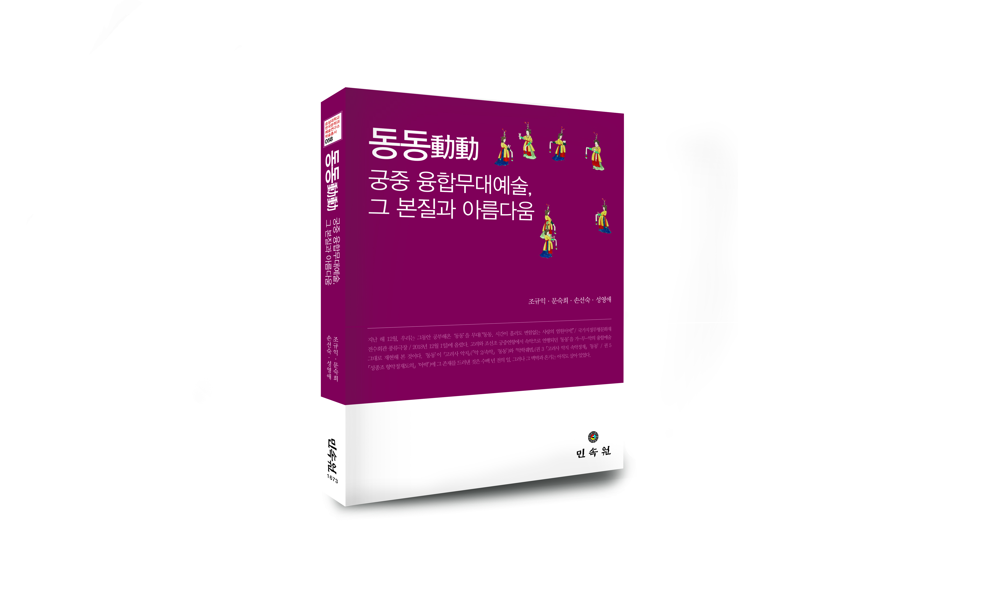

조규익

QR코드를 열어 보세요!

<<동동動動: 궁중 융합무대예술, 그 본질과 아름다움>>을 내며

숭실대학교 한국문학과예술연구소에서 올해의 첫 책인 <<동동動動: 궁중 융합무대예술, 그 본질과 아름다움>>(민속원)이 ‘한국문학과예술연구소 학술총서 58’로 나왔다. 고려조와 조선조의 궁중 연향에서 공연되던 가∙무∙악 융합 무대예술 ‘동동’에 관한 공동저술(저자: 조규익∙문숙희∙손선숙∙성영애)이다. 이미 2015년에도 우리(조규익∙문숙희∙손선숙)는 궁중 예술 역사상 최고봉으로 인정받고 있는 ‘봉래의鳳來儀’를 유사한 관점과 방법론으로 연구한 저서(<<세종대왕의 봉래의, 그 복원과 해석>>, 민속원/한국문예연구소 학술총서 47)를 낸 바 있다. 양자 모두 각 분야의 연구자들이 들러붙어 분석한 결과를 바탕으로 무대공연을 갖고, 그 결과를 엮어 낸 것들이다. 전자와 마찬가지로 이 책도 규모는 비록 작으나, 학계에 던지고자 하는 메시지는 ‘턱 없이’ 크다. 사실 기존의 학문적 관습이나 섹트의식에 매몰되어있는 동학들이 개권(開卷)할 가능성은 희박하고, 설사 슬그머니 열어본다 해도 가납(嘉納)될 확률은 더더욱 희박함에도 할 말이 많은 우리였다.

최근까지 <동동>은 국어국문학과 은사님들로부터 배운 ‘문자 텍스트로서의 동동’일 뿐이었고, 그것은 고려속요∙고려가요∙여요∙려가’ 등의 명칭으로 부르던 시문학 텍스트일 뿐이었다. 초창기 연구자들이 명칭에 대하여 갖고 있는 편견과 그로부터 확립된 논리구조가 별 수정 없이 대물림되어 내려오고 있는 형편이다. 본 연구소에서는 그런 문제를 타개하고자 문학∙음악∙무용을 연구하는 4인이 머리를 맞대고 ‘동동’ 정재의 융합적 성격을 분석적으로 고찰하기 시작했고, 작년 12월 초에 그 중간 결과를 무대로 올렸으며, 그 결과를 보충하고 다듬어 지금의 책으로 묶어내게 된 것이다. 이 책의 내용이나 방향을 점 더 구체적으로 설명하기 위해 머리말을 첨부하고자 한다.

QR 코드를 읽어 보세요!

머리말

지난 해 12월, 우리는 그동안 공부해온 ‘동동’을 무대(“동동, 시간이 흘러도 변함없는 사랑의 염원이여!”/국가지정무형문화재전수회관 풍류극장/2018년12월 1일)에 올렸다. 고려와 조선조 궁중연향에서 속악으로 연행되던 ‘동동’을 가․무․악의 융합예술 그대로 재현해 본 것이다. ‘동동’이 고려사 악지(｢악 2/속악｣ ‘동동’)와 악학궤범(권 3 ｢고려사 악지 속악정재｣ ‘동동’/권 5 ｢성종조 향악정재도의｣ ‘아박’)에 그 존재를 드러낸 것은 수백 년 전의 일. 그러나 그 맥박과 온기는 아직도 살아 있었다.

"마음속의 뜻을 말로 나타내면 시가 되나, 말만으로 부족하니 탄식하고, 탄식만으로 부족하니 길게 노래하고, 길게 노래하는 것만으로 부족하니 알지 못하는 사이에 손을 흔들어 춤추고 발을 움직여 뛰게 된다."

그 옛날 <<모시毛詩>> ｢대서大序｣의 이 단언斷言이야말로 훗날 ‘동동’의 예술성 해명을 위해 예비한 것이나 아니었을까? ‘말(시), 노래, 춤’ 등 메시지 전달의 수단들은 대체재代替財나 독립재獨立財 아닌 상호 보완재補完財들이다. 개별적으로보다 함께 쓰면 전달의 효율성과 예술성이 훨씬 높아지기 때문이다. ‘동동’의 융합예술미 대신 “고려속요 <동동> 운운”하며 조각난 텍스트만을 공부해오던 지난날들. 고전시가의 콘텍스트에 대한 무지가 불러 온 무명無明의 시간대였다.

‘동동’은 여성의 예술이다. 임에게 바치고픈 자신의 존재와 마음을 설명하기엔 ‘사랑’이란 개념어가 지극히 제한적이고 추상적이었으리라. 그래서 노래로 음악으로 춤으로 들려주고 보여주려 한 것이나 아닐까? 중세왕조의 임금이나 고귀한 존재를 대상으로 토로한 불멸의 사랑과 불변의 서정이 융합 무대예술 ‘동동’의 핵심인 이유도 바로 여기에 있다. 시간이 흘러도 계절이 바뀌어도 바치는 자의 사랑은 변함없음을 가․무․악으로 표현하려 애쓴 점이 참으로 놀랍지 아니한가.

문학, 음악, 무용 세 분야의 행복한 융합을 꿈꾸며 한국문학과예술연구소를 출범시켰고, 우리 역사상 최고․최대의 궁중악무 ‘봉래의’를 무대(“세종의 꿈, 봉황의 춤사위를 타고 하늘로 오르다!”/국립국악원/2013년 11월 21일)에 올리기도 했다. 그 감동과 추억을 떠올리며 감행해본 지난 해 겨울의 그 무대는 실연實演과 연구발표를 통해 ‘동동’의 예술미학을 구현하기 위한 실험적 자리였다. 그리고 오늘, 그 결과를 이렇게 엮어낸다. ‘고려속요 동동’에서 ‘속악정재 동동’으로, ‘분리에서 융합’으로! 단언컨대, ‘텍스트 지평의 전환’이란 바로 이런 것이다.

귀한 고악보 및 사진자료들의 사용을 허락해주신 국립국악원․한국학중앙연구원 장서각․국립중앙박물관, 꿈과 땀의 결실을 아름다운 책으로 엮어주신 민속원 홍종화 사장님과 신나래 선생님 등께 감사드리며, 강호제현의 가르침을 고대한다.

2019. 4. 1.

지은이들을 대표하여

조규익

민속원, 2019. 4. 20. 25,000원

<부기(附記)>

고전시가를 연구해오면서 깨닫는 바가 없지 않았던 나는 2005년에 한국전통문예연구소를 개설했다. 그 뒤 ‘한국문예연구소’로 개명했고, 몇 년 뒤 다시 ‘한국문학과예술연구소’로 개명하여 오늘에 이르고 있다.

고전시가들 가운데 고려속가들과 조선조 궁중악장이 원래는 정재(呈才)라는 무대예술의 한 부분인 노랫말들이었음을, 문학도라고 간과해서는 안 된다는 생각이 나를 초조하게 만들었고, 결국 이 연구소의 개설로 이끌었던 것이다. 정재의 한 부분인 노랫말 텍스트가 흡사 전부인양 착각한 채 그 텍스트만을 공부한다는 것이 잘못임을 학계의 누구도 지적하지 않았다. 노랫말 텍스트를 제대로 알기 위해서라도 콘텍스트로서의 악곡과 춤을 함께 고려해야 한다는 사실을 문학연구자 누구도 알고 있지 못했던 것이다. 고전시가가 어떤 양상으로 실연(實演)되어 왔는지에 대한 통합적 시각이나 시야를 충분히 갖추고 있는 선학들이 드물었다. 그것들 가운데 상당수 작품들의 생산이나 향유계층이 민중이라는 사실만을 강조함으로써, 그것들이 궁중에서 임금을 비롯한 지배계층의 연향에 쓰였다는 사실은 더더욱 까맣게 모르고 있었다. 음악학계 및 무용학계와의 협업이 절실함을 느낀 것도 그 때문이었다. 그런 연유로 탁월한 한국음악 연구자 문숙희 박사, 앞서 가던 한국무용 연구 및 실연자(實演者) 손선숙 박사가 연구소 창립 초기부터 가세하여 활발한 활동을 통해 연구소의 발전을 견인하게 된 것이다.

공유하기

게시글 관리

**백규서옥\_Blog ver.**