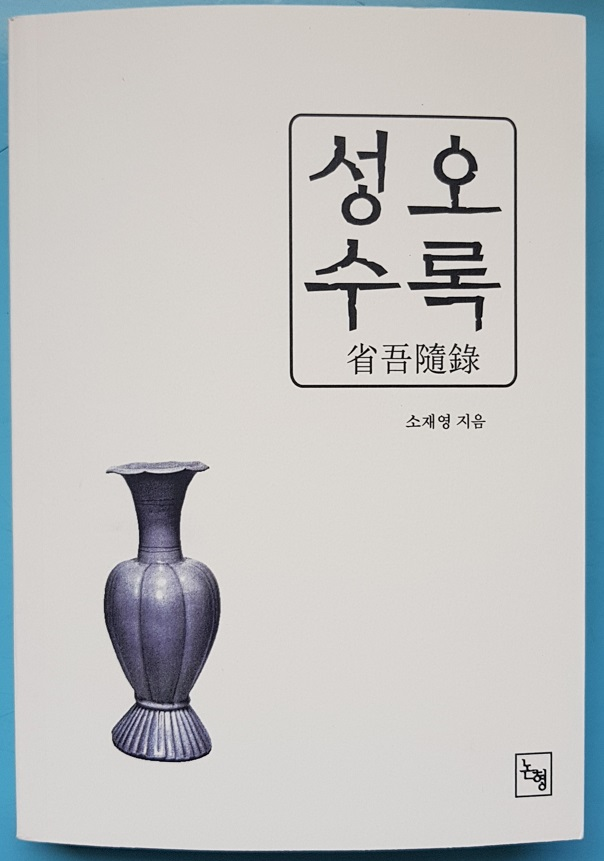

## 

## 아, 소재영 선생님!

                                                                                                               조규익

책 표지

## 소재영 선생님께서 새로 내신 책(<<성오수록(省吾隨錄)>>)을 보내 오셨다. 성오(省吾)는 선생님의 아호(雅號)로서 <<논어>> ｢학이｣편의 “일일삼성오신(一日三省吾身/나는 하루에 세 번씩 내 몸을 반성한다)”에서 따오신 호칭이다. 선생님의 설명(“내년이면 미수를 맞는다. 그간 내가 지나온 삶을 어떤 형식으로든 한번 정리하고 뒤돌아보아야 되겠다는 생각에서 부끄러움을 무릅쓰고 이 글을 준비하기에 이르렀다. 이번에 출간하는 <<성오수록(省吾隨錄)>>은 일단 내 삶의 모습들을 정리한다는 차원에서 편집된 것이며, 여기에 그간 써온 글들을 모아 세상에 내놓게 된 것이다.”)에 따르면, 이 책은 선생님의 일생을 조감한 책이다. 즉 ‘만남과 체험’을 중심으로 일생을 서술하신 셈이니, 자서전으로 보아도 무방하다.

## 

## 

소재영 선생님

## 

## 

## 나는 책 앞에서 30분 정도 묵상을 했다. 선생님과 함께 한 숭실에서의 10년 세월, 그 후 현재까지 마음으로 교유해온 20여년의 세월이 주마등처럼 지나갔다. 선생님은 1999년 정년퇴임하셨으니, 학교를 떠나신지 올해로 21년째. 내년에 미수(米壽)를 맞으신다. 갑자기 가슴 속으로 자책과 회한이 밀려들었다. 그동안 늘 곁에 계신 것으로 착각한 채 무심히 지나버린 세월이었다. 그 사이 사모님을 사별하셨고, 혼자 지내오시다가 새로운 친구를 만나시어 알콩달콩 재미있게 사신다는 소식까지 들었는데, 그 분마저 사별하셨음을 지금서야 알게 되었다. 지금 느끼는 회한은 아버지 돌아가시고 어머니 돌아가실 때의 감정과는 또 다른 그것이었다. 제자는 아니지만 스승으로 존경하며 사숙(私淑)해온 지난 세월. 행복했고 철없었다. 그 세월이 영속되리라는 착각 속에 빠져 있었는데, 지나고 보니 모든 것이 허무하다. 그동안 나는 쓸데없는 일들에 매여 살아왔다는 증거일까.

## 

## 추억 속 선생님의 모습은 ‘반듯함과 따뜻함’으로 요약된다. 가깝고 먼 사람을 불문하고 늘 따뜻하게 대해주셨다. 그러면서도 지켜야할 거리는 늘 지키셨다. 선생님의 곁에 끊이지 않고 사람들이 모이는, 가장 큰 요인일 것이다. 무엇보다 한 번 맺은 인연을 소중히 지키고자 하신 철학은 선생님의 최대 장점이셨다. 세대의 차이를 넘어 일본과 중국의 대단한 학자들은 대부분 선생님의 팬들이다. 일본이나 중국에서 만나는 학자들은 모두 선생님의 안부를 여쭙고, 선생님과의 인연을 자랑한다.

## 

## 사실 외국 학자들과의 인연을 지속시키기가 어려운 것을 체험으로 알고 있는 나다. 성격이나 취향의 종족적 차이가 현격하고, 각자가 속한 문화의 차이가 두드러지며, 각자의 학문적 지향 또한 아주 다르기 때문이다. 뿐만 아니라 그런 차이들을 갈아 없앨 만큼 자주 만날 수도 없지 않은가. 학문적 실력은 물론 적지 않은 시간과 돈의 투자에 큰 인내와 끈기 또한 겸해야 해외 학자들과 만날 수 있고, 설혹 그런 것들을 갖추고 있다 해도 온유한 마음 없이는 불가능한 것이 그들을 친구로 만드는 일이다. 해외의 유수 학자들을 보시는 눈이 범상치 않고, 한 번 연을 맺은 사람들과는 끝까지 좋은 관계로 지내시는 온유함과 끈기를 갖추셨기에 유수 해외 학자들이 선생님을 지기(知己)로 생각하고 따르는 것이리라. 술을 입에 대지도 못하시면서 중국의 학자들과 그런 관계를 유지해 오신 것은 대단한 일이다.

## 

## 숭실에 오면서 나는 선생님의 학문적 자세를 본격적으로 배우기 시작했다. 대학, 대학원 시절 누구로부터도 배우지 못한 학자적 자세를 선생님에게서 발견했기 때문이다. 우선 근학(勤學)의 자세다. 선생님은 늘 자료를 모으시고, 논문을 쓰셨으며, 학회 활동에 열중하셨다. 그 때까지 나는 논문 한 편 간신히 쓰거나 발표해놓곤 ‘이제 한동안 쉬어도 된다’고 드러눕기 일쑤였다. 그런데, 선생님을 엿보면서 나는 깜짝 놀라 기준을 바꾸게 되었다. 논문은 쉼 없이 쓰는 것, 논문 쓰기 위해서는 자료를 열심히 모으고 읽어야 한다는 것, 남의 글과 말을 열심히 읽고 들어야 한다는 것 등등, 나름대로의 수칙을 만들었다. 그러나 그것으로 만족할 수 없었다. 외람된 말이지만, 선생님을 추월하기로 마음먹은 것이다. 그 유일한 방안이 ‘논문 쓰는 작업장을 두 군데로 늘이는 일’이었다. 연구실과 집에서 각각 다른 논문들을 동시에 진행해보자는 것이었다. 아이디어는 적지 않게 있으니, 작업을 두 곳에서 진행하면 생산성이 훨씬 높아지리라는 계산이었다. 그렇게 한동안 실행해보았으나, 내 스스로 지쳐서 결국 선생님을 따르지 못하고 말았다. 그래서 겸허한 마음으로 선생님의 발걸음 흉내나 내보고자 했으나, 그마저도 이젠 불가능하다는 판단을 내렸다. 옛말에도 있지 않은가. “나보나 훌륭한 사람을 따라가거나 추월하기 위해 최선을 다하라. 그게 안 되면, 무조건 존경하라!”고.

## 

## \*\*\*

## 

## 선생님의 의연하신 학자적 자세와 후학에 대한 사랑 덕분에 나는 이때까지 나를 다잡아 올 수 있었다. 학문을 어떻게 해야 하며, 학자의 행동거지는 어떠해야 하는지를 선생님으로부터 ‘확실히’ 배웠는데, 감사의 말씀을 드릴 기회가 없었다. 고백의 타이밍을 놓친 다음 복잡한 세상사에 휘말려 여기까지 밀려오게 되었다.

## 

## ‘무엇이 소중헌디?’라고 묻는다면, 나는 정말로 대답이 궁해진다. 그 때는 ‘중하다’고, ‘내 자존심을 손상시킬 수 없다’고 강변하며 고집을 세웠지만, 지나고 보니 모든 것이 헛되고 헛될 뿐이다. 학자로서의 걸음마와 옹알이를 선생님으로부터 배운 셈인데, 그 은혜를 깡그리 잊고 지냈다. 정신을 차리고 보니 벌써 내 인생도 석양으로 접어들고 있지 않은가. 선생님께서 보내주신 <<성오수록>>이 매서운 회초리로 다가오는 것도 그 때문이다. 선생님을 본받아 나도 <<백규수록(白圭隨錄)>>을 쓸 수 있을까. 얼얼한 종아리를 매만지며, 새삼 부끄러운 내 지나간 시간대를 반추해본다.

## 

## 성오 선생님, 부디 용서하여 주십시오.ㅠㅠ

## 

## 2019. 5. 12.

## 

## 선생님을 사숙(私淑)해온 후학

## 

## 조규익 절하고 올림

## 

## 

## 추기(追記)

## 

## 선생님의 글귀 가운데 눈물을 훔치며 읽은 부분을 아래에 적어본다.

## 

## “언젠가 전도서에서 보았던 한 구절이 생각난다. ‘헛되고 헛되도다. 모든 것이 헛되도다. 한 세상이 지나고 다른 세상이 오도다.’ 사랑하는 내 아내 김숙희, 다시 사랑했던 김미혜자 약사, 부디 천국에서 평안하고 행복한 삶 누리기 바랍니다.”

공유하기

게시글 관리

**백규서옥\_Blog ver.**