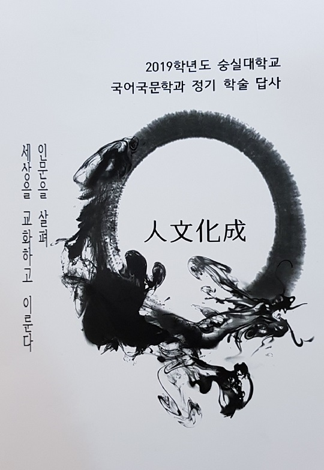

## 학술답사 혹은 보물찾기

## 

## 조규익

## 

## 내 어린 시절 소풍날의 가장 가슴 뛰는 행사는 ‘보물찾기’였다. 파릇파릇 돋아난 나물더미 속이나, 하찮아 보이는 돌덩이 밑에 감쪽같이 숨겨진 쪽지를 찾아내곤 환호성을 지르던 친구들의 얼굴이 아직도 내 기억 속에 생생하게 남아 있다. 쪽지 하나 찾아 봐야 연필 두어 자루, 공책 두어 권 주어지는 게 고작이었지만, 그 시절엔 보물을 찾아낸 아이들이 왜 그리도 부럽고 샘이 나던지. 쪽지 한 장 찾지 못한 채 소풍이 끝날 무렵이면, 늘 아쉽고 허전했다. 그 뒤부터 이날까지 내 삶은 대부분 ‘실패한 보물찾기’의 연속이다.

## 

## 철이 들면서 국문학에 뜻을 두었고, 학부와 대학원 시절의 답사에서 얻는 설화나 민요, 귀한 자료들이 보물임을 저절로 깨닫게 되었다. 촌로들로부터 약간 이색적인 설화 한 편이라도 얻어 듣는 날엔 가슴이 뛰었다. 비슷한 것들이 대부분이었지만, 천하에 없는 이본(異本)이라도 얻은 듯 흡족함을 느꼈으니, 그게 보물 아니고 무엇이랴. 그 뿐인가. 가끔 ‘고서답사(古書踏査)’를 떠났다가 희귀본 소설 자료나 노래 자료라도 얻을라치면, 가슴이 설레어 여러 날 밤잠을 설치기 일쑤였다. 그러니 그것들은 분명 보물이었다.

## 

## 나이를 먹고 삶의 영역이 넓어지면서 현장에서 만나는 보물들은 보다 깊고 다양한 의미를 함축한 채 내 앞에 나타나곤 했다. 14년 전 ‘기독교 확산과 중세문명의 자취’를 확인하기 위해 6개월 간 유럽의 20개국 120개 도시들을 자동차로 여행한 적이 있었다. 다양한 민족과 국가들이 모여 있으나 동유럽을 제외하곤 국경이 따로 없는 그 지역을 돌며, EU의 현존재가 갖는 역사적 필연성이 기독교로부터 나왔음을 덤으로 깨닫게 되었다. 전공 공부는 잠시 뒤로 미룬 채, 곰브리치의 <<세계사 이야기>>를 비롯한 각종 유럽 중심의 세계사 저술들을 샅샅이 뒤져 읽으며 ‘보물찾기’의 도구로 갖춘 것은 물론이었다. 그 덕분이었을까. 유럽에서 만난 보물들은 내 협소한 세계인식의 폭을 거의 무한대로 넓혀 주었다.

## 몇 년 전 미국의 오클라호마주립대학에 6개월 정도 머무를 때였다. 미국에 인디언들이 많다는 사실을 들어서 알고 있었지만, 오클라호마 주에 39개의 인디언 부족과 그들의 보호구역이 있다는 사실은 그곳에 가서야 알게 되었고, 틈 날 때마다 그들을 찾아 다녔다. ‘인디언 종족・역사・문화 답사’에 나섰던 것이다. 드넓은 대초원과 계곡 속에 숨은 듯 살아가고 있는 그들을 만나보면서 문득 옛날의 ‘보물찾기’가 떠올랐다. 현장에서 만나는 인디언들을 통해 미국 역사의 그늘을 발견했고, 세상살이의 한 단면을 깨닫게 된 것이다. 그런 답사여행이 대학시절 학술답사체험에서 길러진 내 습벽(習癖)의 발현이었음은 물론이다. ‘무언가를 추구하는’ 삶 자체야말로 답사로부터 체득한 결과라 할 수 있으리라.

## 

## 강의실이나 연구실은 삶의 현장을 최소화시킨 공간이고, 교과서나 참고서는 삶의 현장에 널린 자료들을 모아 가공하거나 조리한 음식 같은 것이다. 강의실과 연구실에서 잘 만들어진 텍스트를 보며 열심히 공부하는 것만이 능사는 아니다. 공부에도 가끔은 야성(野性)이 필요하다. 엄마 젖을 뗀 뒤 얼마동안 이유식을 먹다가 이빨이 솟기 시작하면서 ‘날 것 그대로’를 씹어 먹고 싶어 하는 아가들을 보라. 학생들이 강의실 아닌 현장에서 ‘거칠지만 날 것 그대로의 자료’를 찾아 공부하고 싶어 하는 것도 바로 그런 성장의 원리 때문이다. 그래서 역사가 살아 숨 쉬는 전통 마을들을 찾아, 그 정신적 자료들을 수집하는 일은 잦을수록 좋다. 강의실 안에서 이루어지는 ‘표준화된 공부’는 누구나 할 수 있다. 그러나 무언가를 찾아 현장에 나가는 일은 그리 쉽지 않다. 남들과 달리 ‘쉽지 않은 일’을 하는 것이 큰 공부다.

## 

## \*\*\*

## 

## 우리는 ‘백제’라는 이름으로 과거・현재・미래가 함께 숨 쉬는 ‘카오스의 시공’ 공주와 부여를 찾았다. 학생들로 하여금 그곳에 사는 백제인들과의 대화를 통해 우리들의 언어와 문학, 역사를 분석적으로 이해할 수 있도록 하기 위해서였다. 그분들의 어떤 것이 오늘날의 우리를 만들었는지 그들 스스로 느껴보았으면 하는 마음도 컸다.

## 부여에 도착하여 궁남지에서 서동(薯童)을 만나 건강한 생명력을, 부소산에 올라 백마강을 내려다보며 소름 끼치는 망국의 한을 확인했다. 그 뿐 아니다. 얼마 전까지 민중의 저항의식을 거침없이 시로 뱉어내던 신동엽(1930~1969)을 만났다. 지금도 그는 고즈넉한 부여의 한 모퉁이에 앉아 ‘껍데기는 가라!’고 쉼 없이 외치는 중이었다. 옛날의 껍데기를 밀어내고 등장한 새로운 껍데기들이 주인 노릇을 하고 있는 현실을 젊은이들이 깨달을 수만 있다면, 그것이 바로 보물이었다. 어둘 녘 동학군의 피비린내가 아직 가시지 않은 ‘우금치’를 넘어 공주의 숙소에 도착했다. ‘웅진 백제→사비 백제’를 역으로 밟아온 것이다. 계룡산 산록에 자리 잡은 숙소, 그 앞엔 작은 호수가 거울처럼 앉아 흘러가는 시간과 역사를 정화시키는 중이었다. 신동엽의 ‘금강’이 거세게 흐르는 민중의 삶을 그려내려 했다면, 이곳 호수는 조용조용 ‘껍데기들’을 갈앉히는 중이었다.

## 

## 시간을 거스르느라 피곤한 몸을 맑은 공기와 바람으로 정화시킨 다음 날, 공주대학교를 찾았다. 잘 만들어진 국제회의장에서 국어교육과 송재일 교수로부터 ‘공주-부여의 문학과 역사’ 특강을 들었다. 조근조근 짚어가며 공주와 부여의 역사를 깔고 그 위에 문학으로 수를 놓는 송 교수의 말씀. 소문대로 명 강의였다. 강의 전 학생들에게 송 교수를 소개하며 나는 울컥하고 말았다. 자리에 앉아있는 19학번 새내기들 사이에서 45년 전 74학번으로 초라하게 앉아 있는 내 모습을 보았기 때문이다. 발그레한 19학번 새내기들과 당시의 내 모습이 오버랩되는 순간, ‘금강 물처럼 흘러간’ 45년 세월이 허무해서였을까. 갑자기 목이 메었던 것이다. 45년 전의 그곳은 논밭뿐이었고, 지금 이 학교의 한쪽 구석에 간신히 남아있는 돌 건물 한 채와 체육관, 연구동(지금은 박물관)이 전부였다. 지금은 종합대학이지만, 당시는 단설(單設) ‘공주사범대학’이었다. 읍내의 자취방에서 진창길을 걸어와 강의실에 자리를 잡으면, 한숨이 새어나오곤 했다. 점심 걱정, 강의 뒤 금강 백사장에서의 막걸리 파티 걱정, 과제 걱정, 저녁 걱정 등등. 지금 같았으면 목가적이었을 당시, 작은 몸으로 해결해야 할 문제들이 많았다. 그런 추억의 찌꺼기들이 한 번에 몰려들어 나를 울컥하게 만들었으리라.

## 

## 특강 후 그곳 교수들(송재일, 권대광, 송홍규, 정형근)과 학생들이 함께 단체 촬영을 했다. 두 학교 학생・교수의 멋진 만남의 자리였고, 공주대 국어교육과 교수들이 베풀어준 감동적인 호의의 현장이었다. 그곳 교수들과의 식사를 마친 뒤, 학생들은 분과별 답사의 현장으로 흩어졌다. 고전・민속분과는 곰나루 전설의 현장과 박동진판소리전수관으로, 현대분과는 나태주문학관 및 공산성으로, 언어학분과는 방언채록을 위해 정안면 월산2리 마을회관으로... 저녁 무렵, 숙소에 돌아온 학생들은 가벼운 흥분으로 들떠 있었다. 새로운 것을 배운 뒤에 경험한 흡족함이 그들의 표정에 역연했다. 그 뿐 아니었다. 이구동성으로 가는 곳마다 만난 공주 사람들의 ‘너그럽고 고운 심성’에 놀랐다고 했다. 그래서 공주라는 지역에 정이 간다고 했다. 사실 그건 덤이지만, 무엇보다 중요한 선물이었다. 가슴 속에 보이지 않는 선물을 듬뿍 안고 숙소로 돌아온 학생들은 모닥불 타오르는 광장에서 끝없이 울려 퍼지는 풍물소리로 피로를 풀었다. 아마도 그들은 꿈속에서 낮 동안 마을회관에서 만났던 할머니와 아주머니들을 다시 만났을 것이다. 미진했던 대화를 다시 이어가며 그 분들의 모습을 마음속에 다시 새겼을 것이다. 지워지지 않을 추억 속의 영상으로...

## 

## \*\*\*

## 

## ‘역사란 과거와 현재의 끊임없는 대화’임을 갈파한 카아(E.H.Carr)처럼 부여와 공주에서 백제인들과 대화를 나누며 자신들만의 새로운 역사를 쓰기 위해 분주한 학생들의 모습을 보았다. 그들은 학술답사를 통해 현재에 숨어있는 과거를 찾아내고, ‘과거와 현재의 대화’를 복원하며, 미래를 창조하는 일에 초점을 맞추기 위해 애쓰고 있었다. 다시 강조하건대, 인생은 ‘보물찾기’의 역정이다. 그 보물들은 삶의 현장 구석구석에 ‘과거’라는 시간의 탈을 쓴 채 숨어있음을 그들은 깨달았으리라. 그래서 과거는 버려진 폐기물이 아니라 현재와 미래를 창조하는 바탕 아니겠는가. 숭실동산에서 출발한 버스는 그들을 과거의 시공으로 이입시킨 타임머신이고, 그들은 과거∙현재∙미래를 통합하는 ‘시간여행’을 잘 마친 뒤 다시 원래의 위치로 돌아온 ‘시간 여행자들’인 것이다.

## 

## 멋진 젊음들에게 내 사랑을 보내며...

## 

## 2019. 5. 22.

## 

## 백규서옥에서 45년 전의 공주사범대학 새내기 백규 씀

## 

## 

궁남지로 향하는 숭실 국문인들

## 

궁남지와 포룡정

## 

포룡정의 현액(<서동요>)

## 

백제역사에 대한 설명을 듣는 학생들

## 

고란사 극락보전 앞에서 대학원생들과 교수들

## 

고란사에서 내려다 본 백마강

## 

고란사에서(왼쪽부터 임채훈 교수, 백규, 이경재 교수)

## 

신동엽 시인 생가

## 

신동엽 시인

## 

신동엽 시인 생가(시인의 방 앞 현판의 시-부인 인병선 작)

## 

신동엽 시인의 방

## 

신동엽 시인의 육필

## 

신동엽 시인 앞에서

## 

숙소 사계절펜션의 뜰(커플상)

## 

숙소 앞 호수

## 

숙소 앞 호수

## 

공주대학교 송재일 교수 특강

## 

특강이 끝나고 학생들과 교수들(앞줄 왼쪽 다섯번째부터 공주대 권대광 교수, 정형근 교수, 송홍규 교수, 임채훈 교수, 송재일 교수, 백규, 이경재 교수)

## 

고마나루 곰사당

## 

고마나루 숲을 걷다가 만난 노송

## 

박동진판소리전수관의 김양숙 관장

## 

<사랑가> 학습을 마치고

## 

국립공주박물관

## 

월산2구 마을회관에서 방언채록 중

## 

방언채록을 마치고

## 

무령왕 부부가 잠들어 있던 목관(재현)

## 

무령왕릉에서 출토된 왕의 신발

## 

공주 송정리 출토 금동관음보살입상

## 

청양 본의리에서 출토된 백제 시대 사찰의 대좌

## 

청춘의 열기마냥 타오르는 불꽃

## 

그 옛날 학창시절의 강의동이자 본부건물이었던 돌건물. 50여년의 세월 속에 본 모습을 유지하고 있었다!

## 

궁남지에서 대학원생 이은란, 이다온

## 

부여의 식당 앞에서 숭실 국문의 젊은 피(임선우, 이경재 교수,장현태, 이찬희, 라힘, 박일)

## 

신동엽문학관의 김형수 상임이사

## 

## 

## 

## 

## 

## 

## 

## 

## 

## 

## 

## 

## 

##

공유하기

게시글 관리

**백규서옥\_Blog ver.**

[저작자표시 비영리 변경금지
(새창열림)](https://creativecommons.org/licenses/by-nc-nd/4.0/deed.ko)