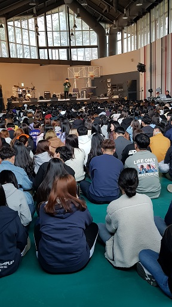

내 공부를 어떻게 '땡처리'할 것인가

                                             

                                                                                조규익

Ⅰ

연구실에 앉아 자료 해독 · 해석으로 부심(腐心)하던 중, 전화벨이 울렸다.

갓 20이나 되었을까. 앳된 여성의 목소리였다.

“혹시 ‘부녀자취업알선센터’인가요?”

약간 긴장한 탓일까. 가느다란 목소리는 더욱 기어들어가듯 가늘어지고 있었다.

나는 무심코 “전화 잘못 거셨어요!”라고 건조하게 응답한 뒤 끊었다.

한참동안 책장을 넘기는데, 문득 세 가지 의문들이 내 작업을 방해했다.

“전화를 잘 못 건 그녀는 누구일까?”

“그녀는 왜 ‘부녀자취업알선센터’에 전화를 걸었을까?”

“그런데 그녀의 음성은 어쩌면 그렇게 내 귀에 익숙할까?”

세 물음들이 오후 내내 나를 심란하게 만들었다.

‘내가 언제부터 잘못 걸려온 전화에 이렇게 민감하게 되었지?’ 라고 반문하며, 마음속으로는 부질없을지도 모르는 분석 작업을 계속했다.

오후 늦어서야 아래와 같은 추론하나를 완성하게 되었다.

「그녀는 전화기 자판을 잘못 눌렀을 것이다. 그러나 그게 하필 내 전화번호였을까. 어쩌면 그녀의 잠재의식 속에 내 번호가 들어 있었던 것은 아닐까. 그런데 그녀의 음성은 어쩌면 그렇게도 내 귀에 익숙할까. 흡사 학부 3학년이나 4학년 때 내가 지도교수로 있던 어떤 여학생의 음성 같기도 했다. 그렇다면 그녀는 갓 졸업한 입장이었을 것이다. 그녀가 ‘부녀자취업알선센터’에 연락하고자 했다면, 지금까지 직장을 얻지 못한 상태란 말인가. 옷도 사야하고, 친구들과 수다를 떨면서 커피도 마셔야 하며, 화장품도 사야 할 텐데. 때마다 부모님께 손을 내밀기란 얼마나 수치스러운 일인가. 돌아다니다 다니다 못해 이젠 (실제로 있는 기관인지는 모르나) ‘부녀자취업알선센터’의 문까지 두드린 건 아닐까.」

마음이 무거웠다. 호주머니에 돈이 없던 내 청춘시절이 떠오르면서 눈물도 찔끔 나오려 했다. 그래도 그 땐 ‘적빈(赤貧)’이었으나, ‘무일푼’은 아니었다. 그러나 지금. 길바닥에 나서는 순간부터 호주머니의 돈이 나가는 시대 아닌가. 이 시대에 ‘항산(恒産/살아갈 수 있는 일정한 재산이나 생업)’이 없다면, 아니 '능력은 있으나 일거리가 주어지지 않는다면’, 어떻게 한 발짝인들 운신(運身)할 수 있단 말인가.

Ⅱ

학기 초 어느 날. 이메일에 모르는 사람의 이름이 떴다. 열어보니 신입생이었다. 자퇴를 하려는 면담 신청이었다. 다음 날 오후 그 여학생은 연구실로 나를 찾아왔다. 사유를 물었다.

「나: 왜 자퇴하려고?

학생: 광고 카피라이터가 되는 게 제 꿈인데요. 한두 달 국문과 공부를 해보니, 그것과 거리가 멀어서요. 더구나 학년이 올라갈수록 더 어려운 과목들뿐인데, 그런 걸 하다 보면 제 꿈과 더 멀어질 것 같아서 지금 단계에서 그만 두려고요.

나: 광고 카피라이터가 되려고 해도, 대학 시절 폭 넓은 공부를 해둬야 ‘더 멀리 더 높이’ 날 수 있지 않겠니? 카피 라이팅 기법만 배울 목적이라면, 굳이 대학 공부를 할 필요 없겠지? 기술만 배우려면, 학원이나 개인 교습을 받으면 몇 개월 만에도 가능하겠지. 부모님들께 말씀은 드려 보았니?

학생: 네. 부모님도 제 말씀에 동의하셨어요. 취업을 할 수 없는 공부라면 지금 당장 바꾸는 게 좋겠다는 생각이셔요.

나: 그렇다면 할 수 없구나. 나는 너와 생각이 다르지만, 너와 네 부모님께서 생각이 같다니, 내 생각이 잘못 되었을 수도 있겠네. 앞으로 무슨 공부를 하건 좀 폭 넓고 진중하며 끈기 있게 최선을 다해 주렴. 그리고 잠시라도 우리가 ‘국문인’으로 맺었던 인연을 잊지는 말아다오.」

1학년 초반에 자퇴하려는 학생은 처음 만나는 터여서, 내심 당황스러운 게 사실이었다. 무거워지려는 마음을 누르고 잠시 생각에 잠겼다. 시대는 바뀌고 톡톡 튀는 감성의 ‘새 세대’가 부모가 되고 사회의 중견그룹이 되어 있는데, 나는 지금 어디서 무슨 일을 하고 있는가. 새삼 책상 위에 무질서하게 쌓인 고전 텍스트들을 내려다보았다. 이것들을 읽고 분석하여 글로 써내고 말로 풀어내는 것이 젊은 영혼들의 삶에 무슨 도움을 준단 말인가. 이들이 이런 어려운 말이나 들으려고 답답한 강의실에 고문 받듯 앉아서 내 말을 경청하고 있단 말인가. 이들에게 한 그릇의 밥도 마련해주지 못하는 나는 과연 누구인가.

참, 국문과 고전분야의 ‘교수질’이 어렵다는 걸 느끼기는 난생 처음이다. 첫 번 째 경우도 결국 그렇게 귀착되고, 두 번 째 학생은 더욱 그렇다. 국문학을 배워서, 아니 고전문학을 배워서 ‘밥 문제’가 해결되는가? 시대는 이제 이것만을 집요하게 묻는다.

내 공부를 과연 어떻게 '땡처리'할 것인가.ㅠㅠ

공유하기

게시글 관리

**백규서옥\_Blog ver.**