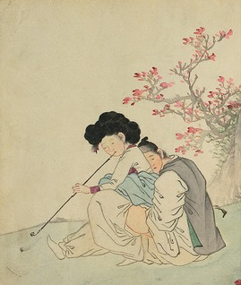

단원 김홍도의 춘화

고전과의 대화

｢만횡청류｣ 성 담론의 정체

                                                                                                                           조 규 익

하나. 왜 성을 노래했나

김천택은 <<진본 청구영언>> 말미에 ｢만횡청류｣ 116수를 실어 놓았다. 학계에서는 ‘만횡청류’라는 명칭을 도외시하고 ‘사설시조’로 호칭하지만, 정확한 명칭은 아니다. 편찬자 김천택의 원래 의도는 ‘사설시조’란 출처불명의 명칭에 있지 않았고, ‘만횡청류’라는 명칭에 담겨 있다. 가곡에서 초장을 곧은 목의 삼삭대엽, 2장 이하는 흥청거리는 농조로 부르는 것이 만횡이고, 만횡과 농・락・편을 두루 포괄하는 노래들의 부류가 ‘만횡청류’이다. 그런데 놀라운 것은 그 노래들의 상당수가 여성의 ‘성적 개방’을 내용으로 하고 있다는 점이다. 성의 주도자가 남성이었던 유교 사회에서 화자인 여성들의 입으로 노래한 개방적인 성을 오늘날의 우리는 어떻게 보아야 할까. 혹자는 남성들이 지은 것들도 있기 때문에 ‘여성의 성 담론’과 거리가 있다고 주장하기도 한다. 그러나 남성 작자들의 작품을 짚어내기도 어렵거니와, 설사 남성이 지은 것이라 해도 여성화자로 설정되어 있는 이상, 페미니즘적 시각에서 보는 것이 맞다.

｢만횡청류｣의 여성들은 성을 노래하며 전혀 쭈뼛거리지 않는다. 여성 화자들이 당당하게 성을 노래한 것은 당시의 여성들이나 ｢만횡청류｣의 담당자들이 성적 자기 결정권이나 성적 주체성의 소중함을 인식하고 있었음을 암시한다. ｢만횡청류｣의 야한 노래들 때문에 문제가 생길까봐 걱정하던 김천택은 <<청구영언>>의 원고를 싸들고 당시 지식사회에서 영향력이 있던 마악노초를 찾아간다. 임해군(선조의 장남)의 후손인 마악노초는 시조 창작과 가창에 관심을 가지고 있던 소론 계통의 지식인이었다. ｢만횡청류｣를 <<청구영언>>에 실어 가요계에 노출시키려던 김천택으로서는 사회적 제재를 막아줄 안전판이 필요했고, 마악노초는 그에 적합한 인사였으리라.

작자들을 익명으로 처리한 점은 또 하나의 안전판이었다. ｢만횡청류｣를 제외한 상당수의 노래들에 분명한 작자명이나 적어도 작자를 추정할만한 단서들이 제시되었으나, ｢만횡청류｣에 대해서만은 작자 혹은 최소한 그것을 짐작할만한 단서 하나 제시되어 있지 않다. 그 노래들이 원래부터 익명의 상태로 전승되거나 창작되고 있었을 가능성도 없지 않으나, 김천택 스스로 작자를 추정할만한 단서를 일부러 밝히려 하지 않았던 것으로 보인다. 마악노초는 ｢만횡청류｣에 대하여, ‘곡조는 비록 아름답고 세련되지 못하나 기뻐 즐기며 원망하고 탄식하고, 미쳐 날뛰며 거칠게 구는 모습과 태도는 모두 자연의 진기(眞機)에서 나온 것들’이라고 설명한 다음, 걱정할 필요 없다고 김천택을 안심시켰다.

여성화자들이 성적 주체성을 노래한 논리적 근거를 ‘자연’의 발로에서 찾은 마악노초의 생각은 매우 열려 있었다. 그가 말한 ‘자연’은 인간과 사물의 존립근거인 ‘스스로 그러함/저절로 그러함’이고, ‘진기‘란 ’현묘한 이치나 비결‘이다. 반복하건대, 앞에서 제시한 ｢만횡청류｣의 특징(곡조는 비록 아름답고 세련되지 못하나 기뻐 즐기며 원망하고 탄식하고 미쳐 날뛰며 거칠게 구는 모습과 태도)이 ‘자연의 진기’에서 나온 것이라면, 과연 ‘스스로 그러함의 현묘한 이치나 비결’이란 무엇일까. 바로 ‘꾸밈없음, 걸림이 없음, 현실적 이해나 이념의 제약으로부터 벗어나 있음’ 등으로 설명될 수 있고, 그것들은 ‘자유분방’으로 요약될 수 있다.

‘자유분방’은 억압으로부터의 탈출이고, 그 가장 극적인 형태가 ‘여성의 성적 일탈’이었다. ｢만횡청류｣를 통하여 남성이 향유하던 성적 희열을 관념적으로나마 공유 혹은 향유하게 되었고, 그로 인한 ‘사회적 불평등’을 ‘심리적 평등’으로 상쇄하는 효과를 얻게 되었을 것이다. 김천택의 그 말에서 생태여성주의 즉 에코페미니즘(eco-feminism)의 단서를 찾을 수 있는 것도 그 때문이다. 남성 중심의 유교적 세계관이 자연을 억압하는 시대 분위기에서 여성들 스스로 ‘성의 자유’를 구가한 일이야말로 우리 문학사에서 드물게 보는 생태여성주의의 증거다. ｢만횡청류｣에서 성을 언급하는 노래들의 화자로 남성이 등장한다 해도 노래 밖으로 두드러지는 개방의 실질적인 주체는 여성이다. 따라서 이 노래들은 당시의 지배 이데올로기에 대하여 꽤 도전적이다. 이처럼 조선조 이념사회의 차별 구조 속에 은폐되어 왔던 여성이 노래에 표현된 성적 사건의 분명한 당사자로 노출된 점은 큰 사건이었다. 남성들이 스스로의 목소리로 성을 노래하기도 쉽지 않았을 터인데, 여성의 목소리로 거리낌 없이 성을 노래하다니! 이 책이 나돌던 당시 조야(朝野)가 떠들썩하지 않았을까. 책을 만들어 배포한 김천택으로서는 무척 긴장했을 것이다. 그럼에도 ｢만횡청류｣로 문제가 되었다는 기록은 어디에도 남아있지 않다. 풍류방을 중심으로 유락적 분위기가 만연되고 있던 당대의 분위기를 보여주는 단서일 것이다.

과연 ｢만횡청류｣가 반역하려 한 대상은 무엇이었을까. 남성 중심의 지배이데올로기가 만들어낸 ‘열녀담론’임은 물론이다. ｢만횡청류｣ 담당계층은 ‘숨김과 드러냄’이란 노랫말의 표현적 기교를 통해 열녀담론의 틀을 깨려 했고, 그런 기교를 통해 억눌렸던 리비도의 해소는 가능했으며, 리비도의 해소야말로 몸의 자연 상태를 회복하는 지름길이었다. 그것은 여성들의 ‘인간선언’이기도 했다.

둘. 어떻게 성을 노래했나

노래 세 편만 들어보자. 먼저 <샛서방 노래 1>.

본서방은 광주 싸리비 장사, 샛서방은 삭녕 짚 비 장사, 눈짓으로 맺어놓은 임은 뚝딱 두드려 방망치 장사, 또르르 감아 홍두깨 장사, 빙빙 돌아 물레 장사, 우물 전에 치달아 간당거리다가 워렁충창 풍 빠져 물 담뿍 떠내는 두레박 장사

어디 가서 이 얼굴 가지고 조리 장사를 못 얻을까?<만횡청류-565>

이 노래의 여성화자는 자신의 상대역으로 ‘본서방, 샛서방, 눈짓으로 맺어놓은 임’ 등 여러 종류의 남성들을 들었다. 본서방을 ‘광주 싸리비 장사’라 했고, 샛서방을 ‘삭녕의 짚 비 장사’라 했다. 그리고 ‘눈짓으로 맺어놓은 임’을 ‘방망치 장사⋅홍두깨 장사⋅물레 장사⋅두레박 장사’라 했으며, ‘뚝딱 두드려⋅도르르 감아⋅빙빙 돌아⋅우물 전에 치달아 간댕간댕하다가 워렁충창 풍 빠져’ 등으로 각각의 모습이나 행위를 묘사하여 덧붙였다. 싸리비・짚 비・방망이⋅홍두깨⋅두레박 등은 남성의 성기를 은유한 말들이다. 싸리비는 강하나 거칠고, 짚 비는 부드럽고 곱다. 화자는 빗자루를 들어 남편의 성기와 샛서방의 성기를 대조적으로 그려냈다. ‘눈짓으로 맺어놓은 임’은 좀 더 다양한 모습들을 보여준다. ‘눈짓으로 맺어놓은 임’이란 아직 본격적인 관계는 갖지 않은 채 눈짓으로만 걸어둔 대상이다. 방망이⋅홍두깨⋅두레박 등에 덧붙은 ‘뚝딱 두드려⋅또르르 감아⋅빙빙 돌아⋅우물 전에 치달아 간당거리다가 워렁충창 풍 빠져’ 등은 성행위의 기교나 모습을 묘사한 은유적 표현들이다. 그리고 ‘우물 전’은 여성 화자 자신의 성기를 은유한 말이다.

화자 자신은 스치는 뭇 남자들로부터 사랑 받고 있으며, 사랑 받을 수 있다는 자신감으로 가득 차 있는 여성이다! 그러기에 끝부분에서 ‘어디 가서 이 얼굴 가지고 조리 장사를 못 얻을까?’ 라고 큰소리 칠 수 있었다. 그러나 그녀가 생각하는 최상의 남성은 조리 장사이다. 조리란 곡식을 이는 데 쓰는 도구다. 화자는 ‘곡식을 이는 행위’와 성행위의 기교를 병치적으로 은유했다. 이 노래의 화자는 현실이든 가상이든 자신이 최상으로 생각하는 어떤 남성과도 만날 수 있다는 자신감으로 가득 찬 여성이다. 이처럼 남성들 앞에서 쭈뼛거리지 않고 자신의 욕망대로 짝을 찾아 성적 쾌락을 즐기는 여성상을 ｢만횡청류｣에서 찾기란 어렵지 않다. 성적 쾌락에 대한 욕구를 억누르고 은폐하는 것을 미덕으로 여기지 않으며, 스스로 그것을 찾아 나서는 일은 자연 혹은 자연스러움의 표준을 자신의 욕망에 맞추는 데서 출발하기 때문이다. 분명 이 여성은 남성 중심의 유교 이데올로기 사회에서 성적 본능을 억압하고 살아온 ‘그녀’는 아니다. 당당하게 자신의 성적 주체성을 주장하고 그 즐거움을 향유하려는, ‘새로운 시대’의 여인이다.

다음은 <샛서방 노래 2>.

어쩔 거나 어쩔 거나, 시어머님.

샛서방의 밥을 담다 놋 주걱 자루를 부러뜨렸으니

이를 어찌하여요? 시어머님!

저 아기야, 너무 걱정 마라

우리도 젊었을 적에

많이 꺾어 보았노라.<만횡청류-478>

시어머니와 며느리가 함께 화자로 등장하여 대화를 나눈다. ‘며느리가 샛서방의 밥을 푸다가 놋 주걱 자루를 부러뜨렸다’는 사건이 노래의 핵심이다. 밥을 너무 꾹꾹 눌러 담다 보니 놋 주걱 자루가 부러졌다는 것이다. 며느리의 입장에서야 이보다 더 큰 낭패가 어디 있겠는가. 먹고 살기 어렵던 시절, 밥그릇에 밥을 꾹꾹 눌러 담은 것은 그 밥그릇 임자에 대한 사랑 때문이었다. 다만 그 사랑의 대상이 남편 아닌 샛서방인 점이 문제였다. 며느리는 죽음에 가까운 불벼락을 각오하고 있었다. 그러나 불벼락을 치는 대신 시어머니 자신도 그러한 과거가 있었다고 고백하는 게 아닌가. 그 덕에 숨 막히는 긴장은 극적으로 해소되었다. ‘놋 주걱 자루를 부러뜨린 사건’으로 ‘샛서방과의 사랑’을 절묘하게 노출시켰다. 기가 막히는 기지(機智)와 해학이다. 불륜이 자아내는 무겁고 탁한 분위기가 비교적 가벼운 느낌의 해학으로 바뀌는 반전의 메커니즘이야말로 탁월한 은유의 소산이었다.

노래 내용의 핵심은 불륜이다. ‘서방 있는 젊은 여인이 샛서방을 두고 있다’는 서사적 문맥이 이 노래에는 들어 있다. 그 문맥 속에는 다양한 상황이 내포되어 있다. 서방이 있음에도 샛서방을 갖게 된 이유가 바로 그 다양한 상황들의 출발점이다. 며느리의 본남편은 나이가 어리거나 반대로 아주 늙은 서방일 수도 있고, 아니면 젊지만 성적으로 무능력한 서방일 수도 있다. 어떤 유형의 서방이든 이 여성을 성적으로 만족시키지 못한다는 것이 문제였으리라. 그래서 며느리는 샛서방을 두게 되고, 그를 사랑하게 되었다. 샛서방에 대한 사랑은 ‘그의 밥을 꾹꾹 눌러 퍼 담는 행위’로 암시된다. 그런데 더욱 놀라운 일은 시어머니도 젊은 시절 그런 불륜을 저질렀다는 사실이다. 물론 노래 속의 내용을 당시의 세태로까지 확대시킬 수 없고, 그럴 필요도 없다. 노래는 노래일 뿐이고, 노래는 노래하는 자의 상상에서 만들어진 언어적 구조물일 뿐이기 때문이다. 그렇다 해도 당시 사람들은 음으로 양으로 이 노래를 부르며 자신들의 현실적 스트레스를 해소하는 수단으로 삼았을 것이다.

이 노래에서 무엇보다 중요한 것은 여성이 성 문제의 주도권을 쥐고 있었거나 쥐고자 했다는 점이다. 이 노래의 작자가 여성이든 남성이든 지배층이 만들어낸 열녀담론을 통해 여성들의 성적 결정권을 억압해온 남성 위주의 반 생태적 인습과 제도에 반역을 꾀함으로써 성에 관한 자연적 질서를 회복하고자 한 시도의 결과로 보는 것이 옳다.

다음은 <비파노래>.

비파야, 너는 어찌 가는 곳마다 앙알거리느냐?

홀쭉한 목을 둘러 안고 움파 같은 손으로 배를 잡아 뜯는데

앙알거리지 않을 소냐!

아마도

크고 작은 구슬이 옥 소반에 떨어지는 소리는 너뿐일 거야.<만횡청류-536>

비파는 아름다운 여성을 닮은 악기이다. 비파의 모습, 아름다운 소리, 연주할 때 비파를 잡는 모습 등이 노래의 중심 소재다. 두 명의 화자가 등장하여 대화를 주고받는다. 비파를 불러낸 화자가 ‘왜 가는 곳마다 앙알거리느냐?’고 묻자 상대 화자인 비파는 ‘홀쭉한 목을 둘러 안고 움파 같은 손으로 배를 잡아 뜯는데 앙알거리지 않을쏘냐?’고 대답했다. 그러자 다시 처음의 화자는 ‘아마도 크고 작은 구슬이 옥 소반에 떨어지는 소리는 너뿐일 것’이라고 감탄한다. 노래의 핵심은 ‘앙알거리는 비파의 소리, 가는 목을 둘러 당겨 안은 채 희고 가냘픈 손으로 배를 잡아 뜯는 듯한 연주 태도 등에 내용 파악의 열쇠가 있다. ‘가는 목을 안고 배를 잡아 뜯으니 앙알거리지 않을 수 없다’는 요지의 언술은 외견상 비파 연주의 모습을 객관적으로 묘사한 내용 같아 보인다.

그러나 그 이면적 의미는 다르다. 우선 비파를 생명체로 설정한 점, 목이나 배 등 인간의 육체를 끌어온 점, 그 육체에 손을 대니 소리를 내는 것으로 묘사한 점 등은 작자의 실제의도가 어디에 있는지를 보여준다. 마지막 부분 ‘크고 작은 구슬이 옥 소반에 떨어지는 소리’의 크고 작은 구슬은 여성을 상징한다. 따라서 이 노래의 주 화자는 남성, 상대 화자인 비파는 여성이다. 노래의 작자는 비파의 모습에서 여인을, 비파 연주 모습 혹은 그 소리를 통해 여인과 벌이는 사랑의 행위를 각각 떠올린 것이다. 비파와 비파 연주자는 사랑하는 남녀와 유사성을 가졌다고 보았음이 분명하다. 비파 연주자가 비파를 다루는 행위는 남자가 여자를 애무하는 행위로 자연스럽게 연결되지 않는가. 비파를 연주할 때 울려 나오는 소리는 남자가 여자를 애무할 때 여자가 토해내는 기쁨의 소리와 유사하다는 생각이 비유 구조의 바탕이다. 그러나 노래의 문면에는 남자와 여자, 혹은 남녀 간의 애정에 관한 말은 한 마디도 노출되고 있지 않다. 세련된 악기 이야기를 펼쳐, 듣는 사람으로 하여금 안심하게 하면서도 이면적으로는 도에 넘치는 외설적 이야기를 펼치는 범상치 않은 표현기법을 사용했기 때문이다.

이 노래는 사랑을 나눌 때 여성이 느끼는 쾌락의 실황을 내용으로 한다. 편의상 주 화자로 남성 화자를 등장시켰을 뿐, 노래의 실질적 주체는 여성이다. 이 시기에 쾌락 추구의 성 담론을 이처럼 과감하게 펼친 것은 사회의 이면에서 큰 변화가 일어나고 있었음을 암시한다. ‘쾌락을 추구하기 위한 수단’으로서의 성을 남성과 여성이 동등한 입장에서 말할 수 있게 된 것은 남성주도의 이념사회에 대한 반역인 동시에 여성들의 ‘성적 주체성’에 대한 깨달음을 보여주는 증거이기 때문이다.

그렇다면 작자는 왜 비파를 소도구로 사용했을까. 작자는 은유를 자기검열 혹은 자기보호의 효과적인 장치로 여겼음에 분명하다. 프로이트에 의하면, 잠재된 꿈의 내용이 외현된 꿈의 내용으로 전환되는 과정에 ‘마음의 검열관’이 자리 잡고 있다 했다. 자기검열의 무의식적 결과를 도출하는 수단이 바로 은유다. 작자 자신 혹은 작자계층의 집단적 욕구[성욕과 쾌락의 자유로운 표출 및 향수를 통한 성적 주체성의 확인]를 드러내기 위해 끌어온 비파의 의미적 명징성에는 한계가 있다. 그 점에 작자의 의도가 숨어 있다. 수용자나 해석자의 능력에 맡겨둘 수밖에 없을 만큼 이 노래의 은유적 표현은 애매하다. 작자는 자기검열을 통해, 외설을 노래함으로써 당할 수 있는 사회적 제재로부터의 도피처를 마련하는 데 성공한 것이다. 이 경우 은유가 훨씬 창조적이고 심층적인 의미를 담을 수 있다는 건 바로 이런 경우를 말한다. 사실 노래의 외설적 의도나 의미가 쉽게 간파될 수도 있었고, 단순한 ‘비파노래’로 이해되는 데 그칠 수도 있었을 것이다. 어느 쪽이든 작자로서 손해 볼 이유가 없었던 것은 여성이든 남성이든 남성중심의 사회가 자행하던 성적 억압에 맞서 그들 스스로 시도한 첫 단계의 반역이 바로 이런 노래에 나타났다고 할 수 있기 때문이다.

셋. 성을 노래한 결과는 어떠했나

조선조의 열녀담론은 반자연적⋅반생태주의적 산물이었다. 그 속에서 여성들은 고작 한숨을 내쉬거나 측은한 신세타령으로 가슴 속의 응어리들을 삭이며 인고의 세월을 견뎌낸 것으로 알고들 있다. 그러나 실제로는 반 생태적 상황을 지혜롭게 극복하는 방법을 고안해낸 것이 당시 여성들이었다. 노래를 통한 가슴 속 응어리의 해소가 바로 그 방법이었다. 남성중심의 성 담론이나 열녀담론에 대한 반역의 의지를 노랫말에 숨겨놓거나 과감히 드러냄으로써 억눌렸던 리비도의 해소는 가능했고, 몸도 얼마간 자연의 상태를 회복할 수 있었다. 노래를 통해서이긴 하나, 남녀가 성적 쾌락을 공유하는 수준을 넘어 여성이 관념 차원의 주도권이나마 쥐게 된 점이야말로 여성이 비로소 성의 향유를 통해 ‘자기 존재’를 확인할 수 있게 되었음을 의미한다. 남녀가 함께 성행위를 하면서도 쾌락을 표현할 경우 가차 없이 ‘음탕한 여자’로 매도되던 것이 당대의 불평등 구조였다. 그런 억압을 극복하고 성적 쾌락을 액면 그대로 받아들이는 것이 몸으로 지각하는 자연의 질서에 부합하는 일임을 깨닫게 되었으니, ｢만횡청류｣를 통해 에코페미니즘적 성 담론은 제대로 구현된 셈이다.

｢만횡청류｣ 에코페미니즘의 가장 큰 부분은 ‘은유를 통한 여성의 존재확인, 여성의 성적 자기 결정권을 통한 자연성의 회복, 여성의 성적 주체성과 자신감의 확립’ 등으로 구체화된다. 노래를 통해 반 생태주의적 열녀담론을 깨는 데서 남성중심 사회에 대한 반역은 시작된 셈이다. 사실 가장 높은 수준의 생태주의는 자연 혹은 자연스러움의 표준을 자신의 욕망에 맞춤으로써 스스로 성적 쾌락을 찾아 나서는 내용의 노래들이다. 남성 중심의 지배 이데올로기에 순종하는 여성들과 달리 적극적이고 능동적으로 성적 쾌락을 탐닉하는 여성들의 노래는 반 생태주의적 억압에 대한 반항의 선언이다. 아울러 당당한 자신감의 표출이야말로 가장 수준 높은 에코페미니즘적 성 담론임을 ｢만횡청류｣는 생생하게 보여주고 있는 것이다.

여성에 대한 남성의 성적 억압이 자연에 대한 인간의 지배와 같은 일이라고 인식하는 데서 ｢만횡청류｣식 에코페미니즘의 단서는 분명해진다. 자연의 본질을 이해하려는 관점에 설 때 비로소 여성도 남성과 마찬가지로 성적 쾌락을 느끼는 존재라는 점을 인정할 수 있기 때문이다. 남성과 여성, 인간과 자연 사이에 균형과 조화를 모색한다는 점에서 이런 노래들이야말로 생명 평등주의 성 담론의 구현일 수 있는 것이다.

신윤복의 <단오풍정>

조규익

숭실대 국어국문학과 교수, ‘아너 펠로우 교수(Honor Soongsil Fellowship Professor)’. 인문대 학장을 역임했고, 현재 한국문학과예술연구소 소장. 도남국문학상・성산학술상・한국시조학술상 등을 수상. LG 연암재단 해외연구교수로 UCLA에서 ‘재미한인 이민문학’을, 풀브라이트 학자(Fulbright Scholar)로 OSU에서 ‘해외한인문학과 비교문학’을 연구. <<조선조 악장 연구>>・<<북한문학사와 고전시가>>・<<고전시가의 변이와 지속>> 외 다수의 저・편・역서와 논문들을 발표했음.

　<<정형시학>> 23, 사단법인 열린시조학회, 2019. 6. 2019년 여름호

공유하기

게시글 관리

**백규서옥\_Blog ver.**