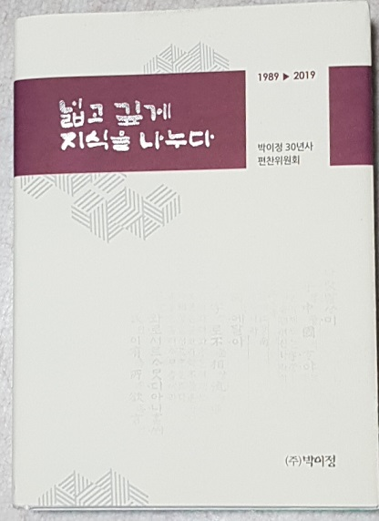

## 

                                                <<넓고 깊게 지식을 나누다>>-박이정 30년사

‘책 허기’를 채워 준 은인

                                                                                                                        조규익(숭실대 교수)

음식과 책에 굶주리며 자랐다는 내 말을 요즘 젊은 세대들은 믿지 않는다. 나를 포함한 이 땅의 베이비부머 세대는 어린 시절부터 음식과 책에 대한 굶주림의 트라우마를 공유한다. 사실 친구들 가운데 나는 유독 더했다. 너덜너덜한 교과서를 제외하면, 글자들이 인쇄된 비료 부대나 장에 가셨던 아버지가 간간이 들고 오시던 ‘농민의 벗’이 유일한 ‘읽을거리’였다. 책에 관한한 끔찍스런 암흑의 세월이었다. 간신히 사범대학 국어교육과를 졸업하고 대학원에 진학해서도 ‘책 빈곤’으로부터 벗어나긴 어려웠다. 근근이 아르바이트로 번 돈에서 하숙비를 제외하고 남는 돈은 전공 자료집의 할부대금으로 깨끗이 소진되곤 했다. 먹고, 입고, 잠자는 것을 수도승처럼 하면서도 책을 사 모으며 ‘골병 깊어지는’ 청춘을 보냈다. 그런 가난 속에서 해군사관학교와 경남대학교 교수를 거쳐 숭실대학교에 부임한 2년쯤 뒤부터 연구실로 찾아온 서광문화사의 박찬익 사장을 만나기 시작했고, 비로소 팔자로 생각되던 ‘책 허기’에서 약간 벗어날 수 있었다.

박 사장은 새로운 영인 자료집들이 나올 때마다 그것들의 묶음을 두 손에 무겁게 든 채로 내 방을 찾아왔다. 그는 내 표정에서 책 욕심, 자료 욕심을 어떻게 읽어냈을까. 만날 때마다 그는 나의 빈 곳을 정확하게 파악하고 있었다. 그래서 우리의 대화는 갓 우려낸 녹차처럼 따뜻하고 담담했다. 서울 유수의 대학에서 국문학을 전공한 박 사장은 유명한 은사들을 언급하며 자신의 전공에 자부심을 보여주곤 했다. 시골에서 간신히 학업을 마친 ‘촌놈’으로서는 그의 말을 열심히 경청하는 게 고작이었다. 서울에서 대학을 다닌 베이비부머 세대들이 대부분 갖고 있던 ‘사제 간의 추억들’을 나는 갖고 있지 못했기 때문이다. ‘설득의 달인’으로 생각되던 그로부터 배우는 게 많았다. 박 사장의 방문 횟수가 늘어날수록 자료들은 내 빈 연구실을 차곡차곡 채우기 시작했다. 내 호주머니가 빈 듯싶으면, ‘사정 되는 대로 주시면 된다’고 안심시키는 그의 따뜻한 말들이 나를 편안하게 만들었다. 단색 양장의 영인본들은 대부분 선학들의 논문 속에서나 구경하던 자료들이었다. 그런 자료들을 갖고 논문을 쓰면서 비로소 내 콤플렉스는 한 낱씩 사라지기 시작했다. 사실 선학들이 신활자로 옮겨놓은 옛 자료들을 대하며 늘 ‘암죽’을 떠올리던 나였다. 곡식의 가루를 밥물에 타서 끓인 유아용 죽이 암죽이다. 내 어릴 적 시골에서는 모유가 나오지 않거나 갓 젖 뗀 아가에게 엄마가 우물우물 씹어 죽처럼 만들어 먹여주시던 ‘그것’을 암죽이라 했다. 당시에 간간이 선학들이 신활자로 바꾸어 출판하던 자료집들은 내게 일종의 암죽이었다. 빨리 암죽의 단계를 뛰어 건너 딱딱하고 거친 곡물 그 자체를 내 ‘이빨’로 씹어야 한다고 생각했기 때문이다. 어쩌면 박 사장을 의지하게 된 것도 당시 내가 ‘학문적 이유기(離乳期)’에 접어들고 있었기 때문이리라. 이제야 고백하건대, 박 사장이 놓고 간 자료들을 어루만지며 한 나절을 상념에 빠진 적도 있었다!

교수 생활 몇 십 년 해오면서 만용이라도 생겼던 것일까. 겁 없이 여러 권의 책들을 냈는데, 그 가운데 박이정이 만들어 주신 두 책은 잊을 수 없다. <<만횡청류의 미학>>(1996년 초판/2009년 제2차 수정증보판)과 <<17세기 국문 사행록 죽천행록>>(2002년)은 나름의 학문적 도정을 보여주는, 내 분신들이다. 고전시가를 공부하면서 갖게 된 모색과 돌파구를 함께 제시한 것이 전자이고, 사행록(使行錄)에 관심을 갖게 된 후 발굴한 새 자료를 야심차게^^ 학계에 제시한 것이 후자이다.

이른바 ‘시조’와 악장을 통해 학계에 진출한 입장이지만, 국문학계의 의식과 담론들에서 명목과 실질이 잘 들어맞지 않음을 느끼는 건 지금도 여전하다. 초창기 어른들이 잘못 끼우신 ‘첫 단추’의 관성 때문이리라. 학계에서는 굳건하게 ‘사설시조’로 호칭하지만, <<진본 청구영언>> 편찬자 김천택의 원래 의도가 ‘사설시조’ 아닌 ‘만횡청류’에 담겨 있다는 점을 필두로 그에 관한 모든 것을 그 한 권의 책에서 다루고자 했다. 지금도 누군가들은 음습한 곳에서 이 책의 내용을 무더기로 도용하면서도 그들의 참고문헌에는 이 책을 올리지 않는다. 깨끗지 못한 학계의 풍토 속에 ‘사설시조’ 아닌 ‘만횡청류’의 문예미학을 제시하여 고전시가의 이름을 바로잡겠노라는 나의 패기를 알아준 곳은 박이정 뿐이었다.

전국을 누비며 고서(古書)를 찾아다니는 습관이 생긴 것도 책에 대한 굶주림의 트라우마로부터 나온 것임은 물론이다. 탐서(探書)의 여정에서 만난 최고의 고서 수집가 이현조 박사를 만났고, 그의 도움으로 <<죽천행록>>을 입수했으며, 그것을 연구・분석한 것이 후자이다. 비록 ‘건・곤’ 두 편 중 곤 편만을 입수했으나, 자료를 어루만지며 며칠 간 잠을 못 이룰 정도로 생애 최고의 흥분을 경험했다. 그 덕이었을까. 국어국문학회에서의 논문 발표와 기고, 책 출간까지 나로서는 최단시간에 해치운(?) 작업이었다. 박이정 박 사장의 적극적인 호응과 도움이 결정적이었음은 물론이다. 최근 국립해양박물관에서 발견한 건 편을 김윤아 박사의 해제로 한국문학과예술연구소의 학술지 <<한국문학과 예술>> 28집에 실을 수 있었으니, 그 소중한 인연 덕분이리라.

\*\*\*

학문적 도정을 마무리하고 있는 요즈음. 보잘 것 없는 나를 이룬 모든 것들을 가끔씩 떠올려 본다. 오늘의 나를 만든 9할은 선조들이 남겨주신 작품들과 선학들의 연구들, 그리고 그것들을 모으고 가공하여 눈앞에 디밀어 준 학술출판 사업자들의 덕이다. 그 중심에 박이정과 박찬익 사장이 있다.

비슷한 시기에 태어나, 이날까지 나는 학자로 그는 출판문화 사업자로 동행해 왔음을 오늘 비로소 깨닫는다. 그 세월이 30년이다! 앞으로 30년도 우리는 함께 청청한 모습으로 그 길을 갈 것이다.

공유하기

게시글 관리

**백규서옥\_Blog ver.**