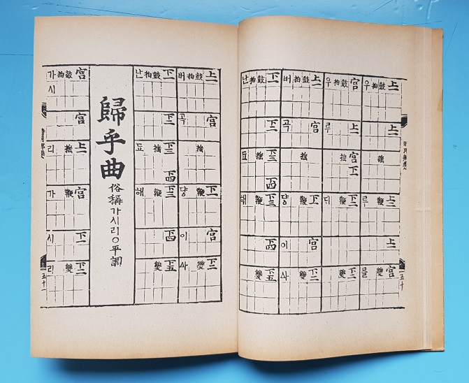

#### \*고전과의 대화: 계간 <<정형시학>> 24(2019 가을호)

‘죽어 이별’의 노래 <가시리>

                                                                                                             조규익(숭실대 교수)

하나/｢가시리 평설｣ 정전화(正典化)의 문제

“소박미와 함축미, 그 절절한 애원, 그 면면한 정한(情恨), 아울러 그 구법(句法) 그 장법(章法)을 따를만한 노래가 어디 있느뇨. 후인(後人)은 부질없이 다변(多辯)과 기교와 췌사(贅辭)와 기어(綺語)로써 혹은 수천어(數千語) 혹은 기백행(幾百行)을 늘어놓아 각(各)히 자기의 일편(一片)의 정한을 서(叙)하려 하되, 하나도 이 일편(一篇)의 의취(意趣)에서 더함이 없고 오히려 이 수행(數行)의 충곡(衷曲)을 못 미침이 많으니, 본가(本歌)야말로 동서문학(東西文學)의 별장(別章)의 압권(壓卷)이 아니랴.”<｢가시리 평설｣, <<여요전주(麗謠箋注)>>, 을유문화사, 1947, 424쪽>

이 언술은 고려속가(高麗俗歌) <가시리>에 대한 양주동 선생의 명쾌하면서도 자못 도발적이기까지 한 평가인데, 오늘날까지 후학들은 ‘그 평가의 무오류성’을 변함없이 신봉해 왔다. 거기에 그치지 않고 다양한 방법으로 그 평가의 합리성을 입증하고 강화하기 위해 노력해온 것이 사실이다. 말하자면 고전시가 연구의 열기가 식어가고 있는 시대 조류의 와중에서 반대논리나 통합적 극복의 논리는 등장하지 못하고 있고, 앞으로도 그럴 가능성은 거의 없다. 그런데 그 평가 내용의 핵심적 정서는 ‘사랑하는 남녀 가운데 남겨진 자가 떠나는 자에게 건네는 원망과 재회의 소망’, 말하자면 ‘살아 이별을 당하는 자의 지극한 심사’라는 것이다. 그러나 과연 그렇게만 볼 수 있을까.

필자는 어린 시절 고등학교 국어교과서에서 이 글을 처음으로 접했는데, 무엇보다 현란한 문체와 수사가 인상적이었고, 그 후 대학원 과정 이수 중 <<여요전주(麗謠箋注)>>[1947년 판]에 실린 그 글을 정독하면서 그 분의 생각에 좀 더 깊이 매몰되고 말았다. ｢가시리 평설｣이 <가시리> 해석의 정전으로 굳어지면서 지금까지 누구도 쉽사리 그 정의나 평가에 대한 반론을 제기하려 하지 않은 게 사실이다.

필자의 이 글은 학술 논문이 아니고, 최소한 학술토론의 문건으로 제공될 가능성도 없는 소품이니, 이 글을 통해 <가시리>에 대한 기존 논의와 평가를 반박하거나 나만의 새롭고 참신한 견해를 제시하기에는 적잖이 조심스럽다. 최근 들어 필자는 우리 옛 노래[혹은 노래문학]들 가운데 상당수가 ‘살아 이별’ 특히 ‘사랑하는 당사자들의 헤어짐’보다는 ‘죽어 이별’의 넋두리들일 가능성이 크다는 사실을 발견했다. <공무도하가>[혹은 <공후인>]는 남편의 죽음 앞에서 오열하는 아내의 넋두리임이 분명하고, 현대문학 초기 김소월의 <진달래꽃>도 그 맥을 이은 ‘죽어 이별’의 노래임을 말한 바 있다. 그 맥락에서 <가시리>야말로 ‘살아 이별’의 노래가 아니라, 오히려 ‘죽어 이별’의 현장에서 내뱉던 넋두리로 보는 것이 더 타당하지 않은가.

그런 넋두리가 아름다운 곡조에 실려 궁중악의 무대에까지 오르면서 뒷사람들에게 ‘사랑하는 남녀의 이별 노래’로 오해되었거나 살짝 바뀌었을 가능성이 크다고 보지만, 그 원천 텍스트를 넋두리로 본다고 무조건 지나치다 탓할 필요는 없다. 비록 인상비평에 머물고 말지라도, 시조 창작의 다양한 담론들의 장(場)인 <<정형시학>>에 이 문제를 공론화 하려는 것은 현 시점에서 우리 전통 정서의 본질에 대한 탐색이나 그런 정서가 근・현대에 들어와 어떤 양상으로 예술화되었는지에 대한 모색이 절실하다고 보기 때문이다.

둘/ 이별의 콘텍스트

<가시리>를 ‘살아 이별’로 보는 양주동 선생의 생각은 다음의 글에 결정적으로 나타난다.

“처음 가신단 말씀을 들었을 때엔 그것이 오히려 농담(弄談)인 양 혹시 나를 울려 보려는 짐짓으로만 생각하였더니, 급기야 그것이 참인 줄을 알자, 또 얼마나 임께 기나긴 말씀을 하소연하였던고. 그러나 그것도 지금엔 모두 다 쓸데없는 말, 정작 임이 떠나시는 마당에 다시 무슨 경황으로 어젯 날의 기나긴 사연을 되풀이할꼬. 일체의 장황한 사설(辭說)은 지금엔 모두 췌사(贅辭)가 아니랴! 급박한 감정과 얼크러진 심서(心緖)는, 그러매로 일체의 군소리와 일체의 잔 생각을 거부하고, 다짜고짜로 원사(怨辭)로 돌진할 밖에 없는 것이다.”<｢가시리 평설｣, 424~425쪽>

양주동 선생이 <가시리>를 ‘살아 이별’, 그것도 ‘사랑하는 남녀의 이별’로 단정하고 평설을 썼다는 점은 이 부분에서 극명하게 드러난다. 어쩌면 선생이 평설을 쓸 당시에 <가시리>가 ‘살아 이별’이냐 ‘죽어 이별’이냐의 문제로 살짝 갈등하셨을 가능성도 없지는 않을 것이다. 그러나 필자의 상상으로 예측해 보건대, 잠시 동안 갈등하신 뒤 예의 그 유쾌한 표정으로 다음과 같이 쾌재를 부르시면서 즉각 당신의 생각을 내놓으셨으리라.

“‘살아 이별’은 내가 좋아하는 사람이 일시 나로부터 멀리 떠나가긴 하나, 가는 자의 마음이 바뀌면 다시 만날 가능성이 있는 상황이지. <가시리>의 뒷부분[“붙잡아 두고 싶지마는/서운하면 아니 올세라/서러운 임 보내드리니/가시는 것처럼 돌아오소서”]좀 보게나. 이 사람아, ‘죽어 영이별’하는 상황에 ‘가는 것처럼 돌아오라’고 말할 수 있겠나?”

이렇게 그 분은 희희낙락 큰 소리 치셨을 것이다. 그러나 과연 그럴까? 다시 한 번 잘 생각해 보자. 사람이 죽었을 때 요즘은 의사가 맥을 짚어보거나 검안한 뒤 사망 선고를 내린다. 그런 다음 염을 하고 빈소로 옮긴다. 그러나 얼마 전까지만 해도 향촌에서는 그러지 않았다. 내 어린 시절의 경험에 비추어 말해 보자. 그 시절 사람이 죽고 나면 즉시 초혼제(招魂祭)를 지냈다. 그러나 초혼제를 지내기까지 거쳐야 할 절차가 있었다.

일단 사람이 죽으면 마을 어른 한 분이 사자(死者)의 코앞에 솜털을 드리워 통기(通氣) 여부를 가늠하며 사망 여부를 판단했다. 설사 솜털이 움직이지 않는다 해도 즉각 ‘사망’이라 단정하지 않았다. 다음 절차는 사자의 옷가지를 들고 지붕으로 올라가 북쪽을 향해 휘두르며 큰 소리로 “고(皐) 아무개 복(復)! 복(復)! 복(復)!” 하면서 육신으로부터 빠져나간 혼을 길게 부르는, 슬프고 장엄한 의식을 행했다. 전통적으로 우리에게는 사람이 죽으면 콧구멍으로 영혼이 빠져나가 시신을 맴돌다가 북쪽 하늘로 날아간다는 믿음이 있었다. 왜 북쪽이었을까. 아마 사람이 죽은 뒤 묻힌다는 ‘북망산’에서 따온 방위개념의 반영이었을 것이다. ‘육신은 북망산으로, 영혼은 북쪽 하늘로’ 라는 생각 때문이었으리라.

육신을 빠져나간 혼이 되돌아오면, 육신은 다시 전처럼 살아나게 된다고 믿었다. 그것이 환혼(還魂)이다. 그렇게 육신을 빠져나가 하늘나라로 가는 혼을 되돌리기 위해 부르는 행위가 초혼이다. 그래서 초혼과 환혼은 우리 전통사회에서 가장 슬프면서도 장엄한 의식이었고, 사자의 지친(至親)들은 그 순간 가장 크고 서럽게 울어야 했다. 그 때의 울음소리가 클수록 떠나가던 혼이 쉽게 듣고 돌아온다고 믿었기 때문이다. 이런 믿음을 바탕으로 전통사회의 곡비(哭婢)도 실재했을 것이다.

그런데, 그 때 무작정 울기만 하는 것은 아니었다. 무언가 말을 해야 했다. 떠나는 혼이 알아듣고 발길을 돌릴 만큼 간절하고 슬퍼야 했다. 그 순간의 말이 바로 넋두리다. 넋두리는 ‘넋[혼(魂)]+두리[환(還)]’, 즉 ‘떠나가는 혼을 되돌리는 말’이다. 남편이 죽는 순간 쪽진 머리를 풀어헤친 아낙네가 남편의 얼굴을 어루만지고 자신의 가슴을 치며 “나 혼자 어찌 살라고 떠나십니까? 못 가십니다, 정녕 못 가십니다!”라고 울부짖는 그 말들이 바로 넋두리다.

<공무도하가>는 전형적인 ‘넋두리 문학’이고, 김소월의 <초혼>은 그야말로 초혼 행사를 시로 승화시킨 작품이다. 그리고 무엇보다 중요한 사실은 김소월의 <초혼>과 긴밀하게 연관되는 노래가 <진달래꽃>이라는 사실이다. 지금 학자들은 <진달래꽃>이 ‘이별의 정한’을 노래한 시라 한다. 그 때의 이별이 사랑하는 사람들 사이의 ‘살아 이별’을 말하는 것임은 양주동 선생이 <가시리>를 ‘살아 이별’의 노래로 보는 것과 마찬가지 관점이다. 한국문학 연구가 한 세기 가까이 진행되고 있지만, 지금껏 그런 고정관념에서 한 발짝도 벗어나지 못하는 것은 큰 문제다.

분명히 김소월의 <초혼>과 <진달래꽃>은 ‘죽어 이별’을 노래한 자매편들이고, <가시리>와 <진달래꽃>은 시대를 격하여 ‘죽어 이별’의 정서로 연결되는 노래 혹은 시문학이라는 것이 필자의 주장이다. <공무도하가>와 <초혼> 사이에 위치한 것이 <가시리>이고, <가시리>와 상통하는 ‘죽어 이별’의 노래가 김소월의 <진달래꽃>이다.[\*<진달래꽃>에 관해서는 다음 고에서 시조와 결부시켜 상론할 예정임.]

그런데 ‘넋두리 문학’의 화자는 예외 없이 여성이다. 전통적으로 넋두리는 여성 화법으로 이루어져 있다. 초상이 났을 때 초혼은 남성이 주관하나 넋두리는 여성 전담이었다. 지붕에 올라가 사자의 옷을 흔들며 구만리장천을 향해 외치는 ‘초혼’은 굵은 목청을 지닌 남성만이 행할 수 있었다. 남성화자가 등장하는 김소월의 <초혼>을 읽어보시라. 그러면 우리 전통사회의 초혼 행사를 역력히 상상할 수 있을 것이다.

셋/<가시리>의 텍스트와 넋두리의 미학적 의미

자, 이제 <가시리>가 ‘죽어 이별’의 노래임을 입증하기 위해 그 본문을 들어보기로 한다.

가시리 가시리잇고(①)

버리고 가시리잇고(②)

날러는 어찌 살라하고(③)

버리고 가시리잇고(④)

붙잡아 두고 싶지마는(⑤)

서운하면 아니 올세라(⑥)

서러운 임 보내드리니(⑦)

가시는 것처럼 돌아오소서(⑧)

<가시리>는 <<악장가사>>∙<<시용향악보>>∙<<악학편고>> 등 조선조 관찬(官撰) 악서(樂書)들에 실려 있다. 매 연 끝에는 “위 증즐가 태평성대”라는 후렴구가 붙어 있는데, 반복되는 그 부분을 제외하고 인용한 것이 바로 이 글의 텍스트이다. 내용상 이 후렴구는 <가시리>가 궁중악으로 사용되었음을 보여주는 증거이기도 하다. ‘위’는 감탄사, ‘증즐가’는 현악기를 긁어내는 소리, ‘태평성대’는 ‘임금이 통치하는 지금의 시대가 태평하다’는 의례적 찬사로서 이 노래가 궁중정재(宮中呈才)에서 불리던 노래임을 보여주는 단서들이다. 고려조와 조선조 궁중에서는 왕을 비롯 지배층을 위한 가・무・악(歌舞樂) 융합의 궁중무대예술이 공연되었고, <가시리>는 무대예술인 속악정재(俗樂呈才)들 가운데 하나에서 불린 노래였다.

노래의 ①~④는 넋두리의 전형으로서 <공무도하가>의 그것과 일치한다. ⑤~⑧은 넋두리에 덧붙어 그 미학적 완성도를 높여주는 부가적 부분이다. 만약 ①~④가 전부라면, 이 노래는 단순한 넋두리를 넘어설 수 없다. 그럴 경우 이 노래는 시적 자아의 실존적 좌절이나 운명의 장벽에 대한 한탄으로 그치기 때문이다. 단순한 넋두리를 넘어 서고자 하는 시적 언술을 통해 상황을 합리화 하거나 죽음에 대한 자아의 초극의지를 피력하기 위해 덧붙인 것이 후반(⑤~⑧)이다. ‘죽어 떠나는 임’과 이별하며 맞이한 실존적 상황을 아름다운 노래로 승화시킨 힘은 창작 및 가창계층의 철학이나 미학으로부터 나온 것이다. 따라서 ①~④의 단순 비극미는 ⑤~⑧의 부가적 미학으로 승화되었다.

넋두리 자체인 ①~④와 연결시키지 않을 경우, ⑤~⑧은 단순히 ‘살아 이별’의 현장에서 사랑하는 사람에게 건네는 당부 이상으로 보이지 않는다. 넋두리인 ①~④를 복합 심리적으로 세련화 시킨 것이 ⑤~⑧임을 즉시 알아차릴 수 있게 한 것도 ‘죽어 이별’을 ‘살아 이별’인 듯 위장함으로써 죽음의 절대성을 비켜 가고자 한 미학적 장치의 힘이었다.

⑤~⑧의 ‘붙잡아 두고 싶다’는 것은 보내는 사람 뿐 아니라 떠나는 사람도 갖고 있었을 현실적 삶에 대한 집착을 암시한다. 그러나 한 번 떠나면 그만인 죽음의 속성을 잘 알고 있는 화자로서는 그 절망감으로부터 자아를 지켜야 했고, 그 구체적 방어기제의 작용으로 나타난 표현이 바로 ‘서운하면 아니 올지 모른다’는 언술이다. 사실 이 경우의 ‘서운함’이란 ‘죽어 떠나는 자’가 갖고 있을 마음 상태다. 화자로서는 ‘죽어 떠나는 임’이 자신에게 서운한 마음을 가지고 떠나길 바랄 리 없다. 그럼에도 그렇게 표현한 것은 돌아 올 수 없는 길을 떠나는 임이기에 그가 돌아오지 못할 명분 정도는 주어야 했기 때문이다. 따라서 사랑하는 사람에게는 가당치 않은 이유이겠지만, ‘죽어 떠나는 임’이 자신에게 서운함을 가지는 것처럼 그려낼 필요가 있었을 것이다.

‘살아남은 자신’이 ‘죽어 떠나는 임’에게 전혀 마음의 짐을 느낄 이유가 없다는 점에서, 이 노래의 화자는 ‘죽어 이별한’ 사람을 ‘나를 싫어해서 떠난’ 사람으로 치환하는 데 성공한 것이다. 그 ‘바꿔치기’란 ‘죽어 떠나는 자’에 대하여 ‘살아남은 자’가 표할 수 있는 최소한의 예의일 수 있으며, ‘죽어 떠나는 자’에 대한 ‘살아남은 자’의 심리적 부채의식을 줄일 수 있는 최고의 방책이기도 했다. 상대가 ‘서러운 임’이 되는 것도 바로 그 때문이다.

사실 ‘살아남은 자’와 ‘죽어 떠나는 자’ 가운데 누가 이 말의 주체가 되느냐에 따라 서러움의 의미는 달라진다. 전자가 주체일 경우 사랑하는 임을 떠나보낼 수밖에 없는 죽음의 절대성 때문에 서러움을 느낀 것이고, 후자가 주체일 경우 이승의 삶이나 사랑하는 사람에 대한 집착으로부터 단절되는 데서 서러움을 느낀 것이다. 그러한 내재적 의미의 모호성이나 분열적 자아는 ⑧에서 매끄럽게 통합된다.

‘가시는 것처럼 돌아오라’는 말 속에서 서로 다르게 표현된 두 주체[남겨진 나/떠나는 임]의 감정은 하나로 합쳐지고 그 이전 단계의 애매성 또한 사라진다. 그래서 ⑧ 또한 넋두리[환혼]이자 초혼이 되는 것이다. ‘이승의 미련을 훌훌 털고 떠나신 것처럼 나를 힘들게 하지 말고 다시 돌아오라’는 당부야말로 전통 시대 초혼의 모티프와 하등 다를 바 없지 않은가.

넷/<가시리>는 ‘죽어 이별’의 노래다

<가시리>는 궁중의 속악정재에서 불린 노래, 즉 속악가사였다. 사실 궁중 무대예술인 정재는 임금을 대상으로 하던 예술이었다. 그런 만큼 여악(女樂)들은 춤과 노래로 임금을 송축하고, 예술적 한계 안에서 ‘연모의 정’을 암시하기도 했다. 텍스트와 콘텍스트, 상호텍스트의 측면에서 면밀히 관찰하지 않을 경우, <가시리>가 ‘살아 이별’의 노래인지 ‘죽어 이별’의 노래인지 알기 어려운 것도 그 때문이다.

노래에서 화자가 의도한 궁극적 결과는 ‘죽음의 초극’이다. 전통 넋두리 노래를 전반에 제시하면서 죽음의 비극성을 바탕에 깔았고, 후반의 분열적 언술을 통해 죽음을 초극하고자 한 것이다. 전반의 넋두리는 사랑의 종말이라는 비극을 초래했으나, 후반의 언술을 통해 죽음이 초극되면서, 그것은 사랑으로 전환되었고, 결국 그 사랑은 극대화 되었다. 따라서 사랑과 죽음은 모순적 관계이자 화합의 관계이고, 궁극적 화합의 불가피성을 내포하면서 다시 분열의 미로로 빠져들기도 하는 관계이다.

무대 위의 여악(女樂)들이 임금에게 수(壽)와 복(福)을 바치는 서왕모 등 신선의 퍼스나를 갖추는 것은 당시 당악(唐樂) 정재들에 흔한 장치였고, 당악정재와 상호 텍스트의 관계를 맺고 있던 속악정재들의 경우도 임금에 대한 송도(頌禱)나 축수(祝壽)는 공통된 모티프였다. 그러니 무대 위에 등장한 여악들은 임금에게 최고의 사랑을 바쳐야 했다. 평범하지 않은, 아니 오히려 극적인 사랑을 요구했다면, ‘죽음으로 패러프레이즈된 사랑’도 가능한 것이고, 넋두리의 외피(外皮)를 쓴 사랑담론 또한 가능한 것이다. 그래서 <가시리>는 단순히 ‘살아 이별’의 노래가 아니라, ‘죽어 이별’의 노래, 더 구체적으로 말하면, ‘죽음을 노래하는 넋두리를 바탕으로 죽음을 극복해낸’ 노래이다.

텍스트의 외면 만으로는 ‘살아 이별’인지 ‘죽어 이별’인지 애매모호하다. 이면까지 뒤집어 봐야 양자는 대립적이면서도 궁극적으로 통합되는 주제들임을 알 수 있다. 죽음을 노래한 이면에 궁극적인 사랑이 존재함을 확인할 수 있기 때문에 이 노래를 ‘죽어 이별’의 노래로 보아야 한다는 것이다. 지금까지의 해석처럼 이것을 ‘살아 이별’의 노래로 본다면, 그 속에 들어 있는 죽음과 죽음에 대한 초극의지를 간과할 수밖에 없다. 그래서 <가시리>를 좀 더 복합적으로 살펴야 할 때가 되었다고 보는 것이다. 이제 <가시리>의 이면을 들여다 볼 만큼 우리의 해석적 안목은 충분히 확장・심화되었기 때문이다.

조규익

숭실대학교 국어국문학과 교수, 아너 펠로우 교수(Honor Soongsil Fellowship Professor). 인문대 학장을 역임했고, 현재 한국문학과예술연구소 소장. 도남국문학상・성산학술상・한국시조학술상 등을 수상. LG 연암재단 해외연구교수로 UCLA에서 ‘재미한인 이민문학’을, 풀브라이트 학자(Fulbright Scholar)로 OSU에서 ‘해외한인문학과 비교문학’을 연구. <<조선조 악장 연구>>・<<북한문학사와 고전시가>>・<<동동: 궁중 융합무대예술, 그 본질과 아름다움>> 외 다수의 저・편・역서와 논문들을 발표했음.

홈페이지(<http://kicho.pe.kr)> 및 블로그(<http://kicho.tistory.com)> 참조.

공유하기

게시글 관리

**백규서옥\_Blog ver.**