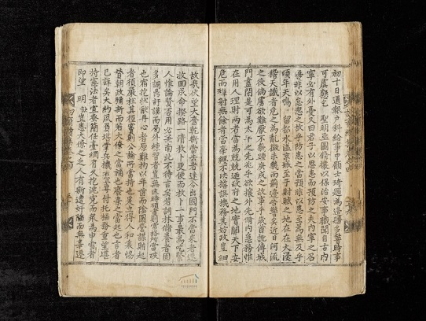

<인재 최현의 조천일록 중에서>

## 연행록이 급하다!

### 조규익

연초부터 중국의 한 젊은 학자가 이메일을 보내오기 시작했다. 하북대학(河北大學)의 량짜오(梁钊) 박사. 연행록에 관한 국제학술회의를 조직했으니, 꼭 참석하여 주제발표를 해달라는 요지였다. 처음 몇 번은 으레 던져오는 ‘낚시 성 이메일’이려니 시큰둥하게 여기고, 치지도외했다. 그런데, 한 번 두 번 거듭되는 연락을 받으면서 생각이 달라지기 시작했다. ‘그동안 연행록에 관한 내 글들을 읽으며 공부해온 입장에서 첫 국제학술대회의 주제발표자로 꼭 모시고 싶다’는 간절한 내용을 반복하여 보내왔다. 크게 내키지는 않았으나, 그의 말이 단순한 의례 차원의 ‘말 건넴’은 아님을 깨닫게 되었다. 무엇보다 외국의 학자인 그가 내 글들을 읽었다는 점과, 악장에 밀려 한동안 책상 밑에 던져두었던 연행록을 재소환하게 만들었다는 점이 내 마음을 움직였다. 악장에 매달려 정신은 없었지만, 그간 논문 두 편을 겨우 쓰고 팽개쳐 둔 최현의 <<조천일록>>을 이번 기회에 다른 관점으로 보고 싶은 충동을 느꼈고, 그 덕으로 원고지 300매가 넘는 분량을 한 달에 걸쳐 탈고하게 되었다.

9월 27일~29일까지 하북대학 문학원 주최로 열린 “제1회 연행록과 연조문화(燕趙文化) 국제학술회의”는 내 경험상 내용에서도 의전(儀典)에서도 돋보이는 학술모임이었다. 그간 나도 국내에서 크고 작은 학술회의들을 조직하거나 참여해보기는 했지만, 궁핍함 속에서 무언가를 도모하고 이룬다는 것은 참으로 힘들고 피곤한 일이었다. 이에 비해 중국에서 열리는 학술회의들에 가끔 참가해온 나로서는 중국인들의 치밀함과 대범함에 놀라게 된다. 그러나 기존의 학술대회들은 그 방면의 달인들이나 큰 기관에서 주관한 것들이니 으레 그러려니 해왔지만, 이번에는 30대 중반의 젊은 학자 량짜오가 동분서주하며 성사시킨 행사라는 점에서 놀라움이 더욱 컸다. 물론 학교 및 문학원의 전폭적인 지원이 결정적이었겠지만, 동에 번쩍 서에 번쩍 큰 배를 끌고 나가는 젊은 학자 량짜오의 활약은 인상적이었다. 한국 체류 10년 동안 갈고 닦은 한국어 실력도 그를 더욱 돋보이게 했다. 그를 통해 중국 학계의 미래를 미리 훔쳐 본 것은 또 다른 소득이었다.

그렇다면 그는 왜 연행록에 그토록 관심을 갖고 있으며, 이제 막 자리를 잡은 대학의 핵심 과제로 만들고자 노력하는 것일까. 그에게 사연을 들었다. 중국에서 고등학교를 졸업하고 유학생으로 선발되어 한국의 전문대학에서 기계공학을 전공한 그였다. 그러나 전문대학 공부를 하던 중 그것이 자신의 길이 아님을 알게 된 그는 대구 소재 한 대학의 국어국문학과에 편입하여 즐거움 속에서 열심히 공부했다. 그 대학을 졸업한 뒤 경북대학교 대학원 석사과정에 진학하여 김문기 교수의 지도 아래 연행가사에 대한 논문으로 석사학위를 받게 되었고, 그 후 정우락 교수의 지도로 박사학위까지 받게 되었다는 것이다. 그런 과정에서 연행록의 매력에 빠져든 그는 고향의 대학인 하북대학 문학원과 경북대학 인문대학 간 교류의 메신저 역할을 하면서 하북대학에 자리를 잡게 되었고, 연행록을 하북대학의 중점분야로 삼으려는 꿈까지 갖게 된 것이었다. 연행록연구소를 신설하고자 노력해온 1년여 사이에 그는 혼자서 한문 연행록 20여 권을 컴퓨터로 입력해내는 저력을 보이기도 했다.

연행사들이 압록강을 건너 요동성을 가로지른 다음 만나는 관문이 산해관이었다. 만리장성이 시작되는 산해관으로부터 북경에 들어가기 전까지의 지역이 오늘날의 하북성인 계주(薊州) 영역이었다. 말하자면 하북성은 당시 연행사들이 반드시 거치던 노정의 핵심 부분인 셈이었다. 그런 점에서 그 중심에 서 있는 하북대학을 연행록 연구의 메카로 만들고자 하는 것은 매우 그럴 듯한 발상 아닌가. 그는 연행록 텍스트 모두를 컴퓨터에 입력하고 데이터베이스를 구축하여 연구자들에게 서비스하고, 연행노정을 복원하여 관광자원으로 활용할 꿈을 갖고 있었다.

사실 이런 일들은 오래 전부터 갖고 있던 내 꿈이기도 했다. 그런 꿈의 실현을 위해 이미 15년 전에 <<연행록연구총서>> 10권을 발간했고, 연행록 사전의 편찬을 기획하기도 했으며, 어떤 여행사 사장과 함께 연행노정들을 학생들의 ‘역사현장 답사 공간’으로 개발하는 문제를 논의한 바도 있었다. 그러나 그런 것들이 꿈으로 그치고 말 것이라는 위기감이 점점 현실화 되고 있던 차에 량짜오 선생으로부터 그런 계획을 듣게 된 것이었다. 그러나 내 꿈은 좌절될 가능성이 많은 반면, 그의 꿈은 실현될 가능성이 컸다. 무엇보다 방대한 한문 전적들의 컴퓨터 입력과 데이터베이스 구축에 경험이 많고, 그런 작업에 대한 국가의 지원이 많으며, 그런 일을 수행할만한 인력이 풍부하다는 점은 중국이 갖고 있는 최고의 강점이었다.

하북대학이 갖고 있는 지정학적 이점에 량짜오 선생 같은 ‘한국통’이 주도한다면, 그야말로 금상첨화의 성사(盛事)일 것이다. 지금 중국 유수의 대학들이 연행록의 주도권을 잡기 위해 무진 애들을 쓰고 있는데, 량짜오가 있는 하북대학 또한 그 그룹의 선두에 설 가능성이 없지 않아 보였다.

                                                     \*\*\*

당시 중국에 파견되던 사신들[정사-부사-서장관]과 자제군관들은 지체나 벼슬도 높았지만, 무엇보다 당대 최고의 지식인들이었다. 그리고 중국은 중세 이데올로기적 보편성의 본산이었고, 바깥세상으로 나 있던 유일한 통로였다. 중국의 현실이나 변화의 기미(幾微)는 우리 왕조의 안위나 존망에 절대적 의미를 지니고 있었다. 글깨나 읽은 사람들은 그런 글들의 원산지인 중국을 선망한 것이 당연하고, 그 글의 내용을 현지에서 확인하고픈 욕망 또한 제어하기 어려웠을 것이다. 학식과 의식을 갖고 있는 지식인들이 무슨 수를 써서라도 사행단에 합류하고 싶어 한 것도 그런 이유에서였으리라. 정치와 외교, 안보 등 국사에 보탬을 주고자 하던 공적 사명감과 함께 중국의 생생한 속살을 견문하고자 하던 ‘앎의 욕구’가 기록으로 구현된 것이 바로 연행록이었다. 이처럼 최고의 지식인들이 현장에 가서 보고 듣는 것을 기록한 것이야말로 후대의 우리에게 ‘가장 의미 있는 사료(史料)’가 아닌가.

반대로 중국 정부나 학자들이 연행록을 보면서 느낄만한 점들을 생각해보자. 조선의 문사들이 중국의 영토 안에서 옛 한자와 고문으로 적어놓은 ‘중국인들의 민낯’을 확인하며, 오늘날의 중국인들은 당연히 ‘호감[혹은 호기심]과 불쾌감[혹은 당혹감]’의 양가감정(兩價感情)을 갖게 될 것이다. 그러면서도 중국학자들의 입장에서야 좋든 싫든 그런 기록들이 지닌 의미와 가치를 무궁한 탐토[探討/탐구와 토론]의 대상으로 받아들였을 것은 불문가지(不問可知)의 사실이다. 그렇다면 호감과 불쾌감의 정체를 좀 더 구체화할 필요가 있다. 언필칭 ‘속방(屬邦)’의 한사(寒士)들이 ‘대국(大國)’의 규모 앞에서 스스로들을 ‘배신[陪臣: 제후의 신하가 천자의 나라에 와서 자신을 낮춰 부르던 일인칭 대명사]’이라 칭하며 머리 조아리는 모습에서 뿌듯함을 느꼈겠지만, 중국의 어두운 면을 지적하고 비판하는 부분에서는 불쾌함과 부끄러움도 느꼈을 것이다.

최근 들어 중국의 학자들이 자신들의 영역 밖에서 생산된 한적(漢籍)[이른바 역외한적(域外漢籍)]들에 큰 관심을 두는 이유는 무엇일까. 그것들의 존재 확인에 그치지 않고, 적극적으로 수집∙분류∙분석∙가공하는 일에 힘을 쏟는 이유는 무엇일까. 그들이 생각하는 이른바 ‘중국 변방’의 나라들 가운데, ‘한적(漢籍)의 양으로나 질로 보아 한국을 능가할만한 나라는 없다. 우리는 연행록을 포함, 경(經)∙사(史)∙자(子)∙집(集)의 범주 안에 묶이는 한적들을 무수하게 보유하고 있기 때문이다. 그러니 중국의 지식사회가 우리나라의 이런 한적들을 보며 놀라는 것도 무리는 아닐 것이다.

이번에 만난 량짜오 박사를 비롯한 대부분의 중국학자들로부터 나는 순수하게 학구적인 이유로 연행록을 사랑한다는 느낌을 받았다. 그러나 매우 정치적인 국가 수뇌부의 입장에 서면 이런 생각은 크게 달라질 수 있다. 변함없이 패권을 추구하는 중국의 지도부가 중국 중심의 세계질서에 대한 향수를 버릴 수 없다고 보기 때문이다.

‘동북공정’이란 폭력적인 명칭으로 과거사를 날조하고 있는 그들로서 연행록에 내포된 ‘지배-피지배’의 정치 논리적 도식을 간과할 이유가 없다는 것이 내 생각이다. 고구려나 발해의 역사를 자국의 역사에 편입시킴으로써 한국의 고대사를 훼손하고 미래 세대 패권전쟁의 무기로 삼으려는 그들에게 연행록은 역사날조에 유용한 근거 자료일 따름이다. 연행록의 바탕을 형성하는 ‘조공-책봉’의 도식이야말로 미국과 동맹관계로 존재하는 한국을 탈취하여 자기네 속국으로 만들려는 중국 지도부의 의도를 역사적∙논리적으로 뒷받침하는 완벽한 근거 아닌가.

이미 중국정부로부터 ‘국가프로젝트’의 지원을 받은 중국 유수의 몇 대학들에서는 연행록 본문의 입력을 끝내고 데이터베이스 구축 작업에 들어간 것으로 알려져 있다. 조만간 그들은 그 서비스를 웹상에서 전 세계인에게 제공할 것이다. 어쩌면 조만간 한국인들도 연행록의 모든 것을 알기 위해 ‘돈을 내고’ 중국의 웹에 접속해야 할지도 모른다. 그것보다 더 무서운 것은 세계의 인문학도들이 세계 기행문학 사상 첫 손가락에 꼽히는 연행록을 ‘중국의 것’으로 오해하고, 그것을 배우거나 연구하기 위해 한국 아닌 중국으로 유학하는 일이 일반화될 수도 있다는 점이다.

그 쯤 되면, 중국의 지도부는 과감하게 연행록을 유네스코에 자기네가 보유한 ‘세계기록유산’으로 등재하려 할 것이다. 텍스트가 한문으로 되어 있고, 중국의 ‘문화∙제도∙풍습∙자연’에 대한 견문이 주된 내용으로 되어 있는 기록이 연행록이다. 그것을 중국인들이 일일이 컴퓨터에 입력하고 데이터베이스로 가공하여 전 세계로 제공하는 마당에 ‘그것이 대한민국의 기록유산’이라고 우리가 아무리 항변한들 세계의 누가 받아들여주겠는가. 기록자가 ‘우리나라 사람들’이라고??? 분통 터지는 일이지만, 기록자인 사신들은 언필칭 자신들을 ‘중국 천자의 배신(陪臣)’이라 했다. 기록 문자도, 내용도, 기록자도, 기록의 가공 및 보유자도 모두 중국인들이라면, 어느 구석에서 우리의 연고권을 찾을 수 있단 말인가.

적어도 연행록에 대해서만큼은 우리의 기존 태도가 잘못된 것이 분명하다. 먼저 국가나 연구기관에서 집단 작업을 추진했어야 한다. 자료에 대한 완벽한 수습을 광범위하게 수행했어야 하고, ‘분류→분석→입력→번역→데이터베이스 구축→세계기록유산 등재’를 일관작업으로 진행했어야 한다. 연행록에 관한한 지금이 비상시국이다. 지금이라도 늦지 않았다. 순서를 바꾼다면, 그나마 만회할 방도가 없지는 않다. 우선 정부의 담당 관청은 국내 연행록 분야의 학자들과 만나 각 분야에서 진행된 연행록 연구현황을 파악해야 한다. 그런 다음 연행록의 ‘세계기록유산 등재’를 지금 즉시 추진해야 한다. 세계기록유산 등재의 추진과 함께 연행록 텍스트의 ‘조사∙확보∙분류∙입력’을 동시에 진행해야 한다. 세계기록유산 등재를 중국이 앞서 시도한다면, 우리는 소중한 우리의 유산을 눈뜨고 강탈당할 수도 있다. 정신 차리지 않으면, 제 것도 못 지키는 ‘세계의 바보국민’으로 전락할 수밖에 없다.

<인재 최현의 조천일록 중에서>

<중국 하북대학의 국제학술회의에서 발표>

공유하기

게시글 관리

**백규서옥\_Blog ver.**