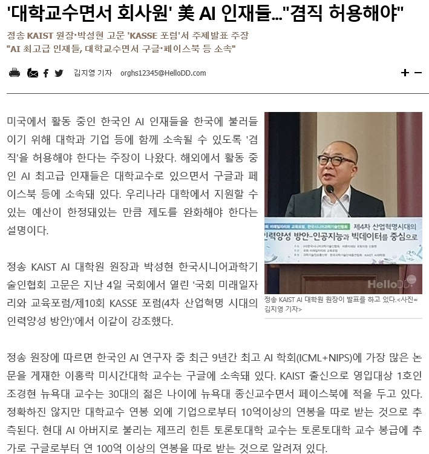

#### 지금까지 대학으로부터 연구년을 받아 두 차례[1998. 1.~1999. 2./2014. 1.~2014. 8.] 미국에 체류했었다. 첫 연구년은 LG 연암재단 지원의 ‘해외 연구교수’로 UCLA에서, 두 번째는 풀브라이트 재단(Fulbright Foundation) 지원의 ‘풀브라이트 학자(Fulbright Scholar)’로 오클라호마 주립대학(Oklahoma State University)에서 각각 황금 같은 연구 기회를 누릴 수 있었다.

#### 

#### 두 곳 모두에서 다수의 교수들과 교유했는데, 그들이 속한 트랙들[tenure track/non-tenure track]에 따라 그들의 심리상태는 두 갈래로 나뉜다는 점을 느꼈다. 말하자면 종신교수(tenured professor)로 승진할 수 있는 테뉴어 트랙 교수와 달리 난테뉴어 트랙 교수는 한시적인 계약 교수들이었다. 우리나라 대학들의 ‘정년직 교수’- ‘비정년직 교수’와 유사해 보이지만, 반드시 그런 것 같지도 않았다. 우리나라 대학들의 정년직 교수는 몇 차례의 심사를 거쳐 정년(65세)이 보장되는 반면 비정년직 교수는 몇 년 단위로 계약을 반복하면서 정년까지 가거나 그 전에 그만 두어야 하는 트랙이다.

#### 아예 정년이 없는 미국의 종신교수는 말 그대로 ‘죽을 때까지’ 할 수 있다. 건강문제가 생기거나 필요 연금액이 충족되는 등 개인적인 여건에 따라 스스로가 물러날 때를 결정하는 만큼 죽을 때까지 하는 사람들은 거의 없는 듯하지만, ‘종신직’이란 말 자체가 매우 매력적으로 들리는 건 사실이다. 그러니 그 나라의 테뉴어 트랙은 우리나라의 ‘정년직’과는 분명 차원이 다르다. 물론 미국의 종신 트랙 교수라 할지라도 조교수의 경우는 매년 심사를 받아 6년째에 부교수로 승진하지 못할 경우 1~2년 뒤 학교를 떠나야 한다. 미국 주요 공립대학들의 경우 대략 49%의 교수가 종신교수이거나 종신직군 교수들이며, 사립대학들의 경우 대략 33% 만이 그런 사람들이라고 한다.

#### 

#### 당시 내가 주로 만난 교수들은 조교수들이었는데, 한 눈 팔 사이 없이 연구에 매진하고 있었다. 늘 무엇엔가 쫓기듯 하는 그들이 안쓰러워 보이기도 했다. 큰 연구에 몰두하는 건 종신교수들도 마찬가지였지만, 상대적으로 그들은 느긋하여, 여행이나 취미활동에도 많은 시간을 할애하는 것 같았다. ‘테뉴어를 받느냐 받지 못하느냐’로 자신에게 부여된 햇수를 헤아리며 초조해 하는 조교수 급 테뉴어 트랙 교수들은 애처로워 보이기까지 했다. 나는 그 어려움을 현지에서 직접 목격하면서 미국 교수들의 애환을 알게 되었다.

\*\*\*

#### 뉴욕대 컴퓨터과학과의 조교수로 있는 큰 아이[조경현]가 영주권과 테뉴어 심사를 동시에 받게 된다는 말을 올해 초에 누군가가 말해 주었으나, 귓전으로 흘려 들은 나였다. 2015년 9월 대학에 부임하면서 미국생활이 시작되었으니 영주권은 물론 테뉴어를 그렇게 일찍 줄 리 만무하다고 생각해온 터여서, 크게 주목하지 않았던 것이 사실이다. 그러나 5월이 되자 영주권이 발급되었고, 대학으로부터는 9월 1일부터 부교수로서 종신교수직이 시작된다는 소식이 들려왔다. 말하자면 영주권은 미국 입국 3년 반 만에, 종신교수직은 뉴욕대 교수 취임 4년 만에 받게 된 것이었다. 뉴욕을 다녀 온 아내의 말에 의하면, ‘Outstanding Scholar’라는 말이 통지서에 쓰여 있었다고 하는데, 그것이 영주권과 종신교수직 조기 부여의 사유인 모양이었다. 아버지로서 자식 자랑인 것 같아 좀 뭣하지만, 큰 아이가 전공인 AI(인공지능) 분야에서 괄목할만한 연구 성과를 올리고 있는 만큼, 영주권과 종신교수직을 일찍 부여함으로써 녀석을 잡아두려는 미국 정부와 대학의 정책적 메커니즘이 작동한 것으로 판단할 수 있었다.

#### 

#### 어쨌든 그는 그 어렵게 생각되는 종신교수직을 매우 이른 나이에 받았다. 그의 나이 서른넷이니, 서른여덟에 겨우 정교수(정년보장)에 오른 내 경우를 생각하면 매우 빠른 것이 사실이다. 그로 인해 혹시 그가 나태하거나 자만에 빠질 지도 모른다는 걱정이 문득 들었으나, 종신교수가 되고나서도 연구와 발표에 정신없이 뛰어다니는 그의 모습을 보며, 일단 안심하기로 한다. 서울대, 카이스트 등 국내 대학들에서 스카웃하려는 여러 제의들도 고사한 채 학문적 성취만을 바라보며 매진하는 그가 대견스럽다.

<https://m.youtube.com/watch?v=hJbXEd5gyMk&feature=youtu.be>

#### 오늘 포탈을 검색하다가 우연히 녀석이 언급된 기사를 보게 되었는데, 그가 현재 뉴욕대 종신교수와 페이스북의 연구원을 겸하고 있는 것은 사실이나, ‘연봉이 10억’이라는 언급은 오보임이 분명하다. 그 스스로 트위터에서 ‘Not at all’이라 답한 것을 보았기 때문이다. 지금 돈보다는 연구 과제들의 의미 있는 마무리와 발전만이 그의 유일한 관심사인 듯하다. 돈을 헤아리기 시작하면, 연구는 그 순간 정지될 수밖에 없다. 한국의 시니어 학자인 내 입장에서 미국 유수 대학의 종신교수가 된 그의 연구도정이 새로운 차원으로 도약하길 기대할 뿐이다.

공유하기

게시글 관리

**백규서옥\_Blog ver.**