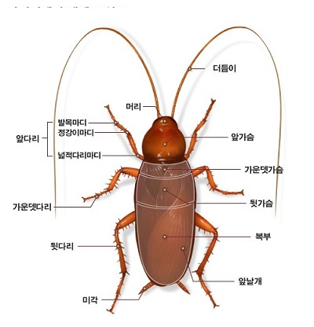

바퀴벌레-네이버 지식사전

            백규

   어릴 적, 내가 자라던 초가집은 안방과 건넌방, 대청, 대청건넌방, 작업실 등으로 구성되어 있었다. 작업실은 주로 밤 시간에 부모님과 내가 짚으로 가마니를 짜던 작은 방이었다. 하루 밤에 가마니 두세 장씩 만들면 5일장 날에 맞추어 10~20장씩 내다 팔 수 있었고, 나머지는 곡물 보관용 등으로 사용하기도 했다.

   언젠가 아버지께서 병환으로 병원에 가시고, 한동안 작업을 쉬게 되었다. 자연히 그 방에 출입할 이유도 없었다. 한참 만에 무언가를 찾으러 어두컴컴한 그 방엘 들어갔다. 작은 플래시로 구석의 메꾸리 근처를 비추자 끔찍한 광경이 벌어졌다. 나중에 그것들이 바퀴벌레와 쥐며느리인 줄 알았지만, 손톱만한 벌레들이 ‘나 살려라!’ 하면서 사방으로 기어 나와 달아나는 게 아닌가. 깜짝 놀라 메꾸리를 들추고 그 안에 불을 비췄다. 아, 그곳엔 상당히 오래 전에 죽은 채 썩어가고 있는 쥐 한 마리가 있었다. 음습한 그 곳에서 썩은 쥐 고기를 맛있게 파먹던 바퀴벌레들이 난데없는 불빛에 모습을 드러내는 순간이었다.

  그렇다. 끔찍한 바퀴벌레들이었다. ‘절지동물 문>곤충류>바퀴목’으로 분류되며 전 세계 4천여 종이 있다는 그 놈들. 우리나라에도 10종[독일바퀴, 산바퀴, 줄바퀴, 경도바퀴, 일본바퀴, 미국바퀴, 호주바퀴, 먹바퀴, 갑옷바퀴, 가시바퀴]이나 서식하고 있다 한다. 그 생식력 또한 엄청나서 죽으면서까지 몸에 싣고 있던 알들을 퍼뜨린다고 하지 않는가.

\*\*\*

  요즘 난데없이 서울 도심에 바퀴벌레들이 준동하고 있다는 언론들의 보도가 요란하다. 대명천지 21세기에 바퀴벌레들을 떼거지로 목격하다니 참으로 어이가 없긴 하지만, 생김새나 생태적 습성으로 보아 내가 어릴 적 보던 그 바퀴들과 다를 바가 전혀 없다. 그 바퀴들이 기어 나온 근원을 파보면, 분명 내 어릴 적 그 메꾸리를 들어 올렸을 때처럼 ‘썩어가는 쥐 한 마리’가 들어 있을 것이다.

   바퀴벌레가 더 모여들어 번식하기 전에 그 ‘썩어가는 쥐 한 마리’를 바짝 태워 버리고, 그곳에 효과 좋은 소독약을 뿜어야 하리라. 그래야 온갖 해충들도 전염병도 예방할 수 있을 것이다.

완성되어가고 있는 가마니-네이버 이미지

공유하기

게시글 관리

**백규서옥\_Blog ver.**