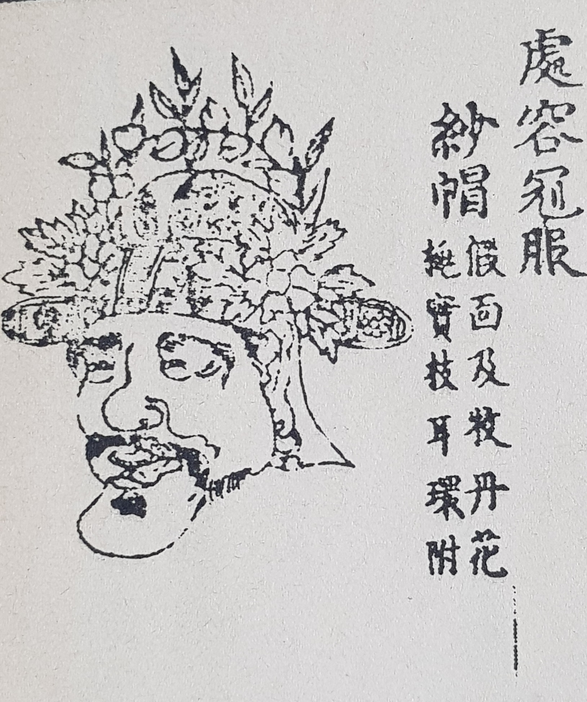

처용의 얼굴[<<악학궤범>>]

                                                                                                                              조규익

하나. 간음(姦淫) 혹은 관음(觀淫)

결혼한 남녀가 배우자 이외의 다른 사람과 육체적인 관계를 맺는 것을 간음 혹은 불륜이라 하며, 요즘은 정서적인 관계로까지 폭을 넓히기도 한다. 육체적 간음과 함께 음욕을 품는 것조차 간음이라 한 성서[마태복음 5장 27~29절]의 규정을 적극적으로 수용한 결과라 할 것이다. 소돔과 고모라의 사람들, 계모 빌하와 간음한 르우벤, 며느리 다말과 간음한 유다, 요셉을 유혹한 보디발의 아내 등 많은 사례들이 예로부터 있었으니, 동서양을 막론하고 실제 기록되지 아니한 옛날의 사례들은 헤아릴 수 없이 많을 것이다.

우리나라도 마찬가지다. 일부다처 혹은 일처다부의 집단혼을 거쳐 중세 이후 일부일처가 정착되면서 간음은 법과 제도의 징치(懲治)를 받게 되었다. 현재 우리나라 민법에서 부정행위로 간주하는 간음은 ‘배우자가 살아있는 사람이 상대방에게 알리지 않고 배우자의 의사에 반하여 배우자 이외의 자와 간통 등의 성적 행위나 친밀관계를 맺는 일’을 말하며, 얼마 전까지 형사상의 처벌을 받아왔으나, 현재는 민사상 손해배상의 책임만 지는 것으로 바뀌었다. 사람 사는 곳이면 어디나 간음이 있다고 할 만큼 간음은 끊임없이 저질러져 왔고, 법에 의해 처벌되기도 하지만, 유야무야 되는 경우도 흔했다. 불문(不文)의 도덕률이 삼엄하던 전통시대에도 간음이 자행되었고, 그런 사회의 양반 사대부들은 물론 평민들의 세계에서도 간음 사건은 늘 있었다.

우리 고전시가사에서 노래에 반영된 간음의 역사는 매우 길다. 대부분 민요들이어서 기록으로 남은 노래들이 거의 없을 뿐 실제로는 매우 많았으리라 본다. 간음의 당사자들이나 목격자들이 부른 노래들은 조선조 후기의 기록으로 남아 있는 ‘만횡청류(蔓橫淸類)’를 제외하곤 거의 없다. 신라시대의 <처용가>와 조선조 후기의 기록[<<진본 청구영언>>, No. 576]에 남아있는 <간부가(姦婦歌)>[\*필자 명명]가 눈에 띄는데, 정확히 말하면 이것들은 ‘간음 고발의 노래들’이다. 두 노래들 가운데 <간부가>는 이론의 여지없이 ‘간음 고발의 노래’이다. 고발은 목격(目擊)을 전제로 하며, 목격은 의도치 않게 관음자(觀淫者)의 시선이나 행위를 내포한다. 사실 간음을 저지르는 자들이나 그 현장을 훔쳐보는 자들은 양심의 가책보다는 떨리는 희열을 맛보는 데 집중했을 것이다. 그 상황을 묘사하고 있는 노래들 대부분이 불륜의 긴장된 환희를 암시하기 때문이다. 그러나 <처용가>를 ‘간음 고발의 노래’로 말하기 위해서는 <처용가>에 대한 기존의 견해들을 넘어서는 통찰이 필요하다. <처용가>와 후대의 <간부가>를 연결하여 거론하는 이 자리에서 <처용가>를 좀 더 길게 말할 수밖에 없는 것은 <처용가>에 대한 기존 인식의 틀을 넘어서야 하기 때문이다. 천여 년의 시차를 두고 모습을 드러낸 <처용가>와 <간부가>. 그 같고 다른 점을 살펴보자.

둘. 처용과 <처용가> 제대로 읽기

‘처용은 동해용의 아들로서 헌강왕을 따라 서울로 돌아온 뒤 임금으로부터 벼슬을 받고 미모의 여인을 아내로 삼게 되었다. 어느 날 밤늦도록 밖에서 놀다가 귀가하여 침실로 들어가니 아내는 누군가와 동침 중이었다. 그 모습을 본 처용이 노래 부르고 춤추며 물러나오자 역신은 사람의 모습을 한 채 처용 앞에 무릎 꿇고 잘못을 빌며 용서를 구했다. 처용의 형상이 문에 붙어 있기만 해도 그 집에 들어가지 않겠노라 맹세도 했다. 그로부터 백성들은 처용의 형상을 문에 붙여 벽사진경하게 되었다’는 것이 <처용가>의 배경설화이다.

현실적이고 합리적인 사고로 이해할 수 없는 것이 처용설화와 <처용가>의 표층이다. 따라서 이 설화와 노래는 상징이나 은유의 수사학적 외피를 둘러쓴 당대의 실제 이야기라고 보는 것이 타당하다. 헌강왕대 신라의 상황을 어떻게 보든, 역사적 상상에 많이 기댈 수밖에 없는 현재로서는 발상의 전환이 절실하다.

그 발상의 전환에 성공한 학자가 박일용[｢역신의 상징적 의미와 <처용가>의 감동 기제｣, <<고전문학연구>> 49, 한국고전문학회, 2016]이다. 처용은 자신과 처를 부부로 맺어준 헌강왕이 처를 범간하는 현장에서 <처용가>를 부르며 춤을 추고 물러났다는 것, 자기의 처를 ‘처의 다리’라는 제유적 대상으로 환원시켜 헌강왕과 처의 간통장면을 그려냄으로써 헌강왕으로 하여금 자기가 저지른 죄가 어떤 의미를 지닌 것인가 되돌아보게 하는 자기 성찰적 계기로 작용했다는 것, 헌강왕의 패륜을 역신의 행위로 상징했다는 것 등이 그의 설명이다. 그의 논리 전부를 수용할 수는 없지만, 최소한 ‘역신=헌강왕’으로 규정한 그의 생각을 반박하기는 어렵다. 그래서 <처용가>는 후대의 <간부가>와 함께 ‘간음 고발의 노래’로 볼 수 있는 것이다.

처용설화의 등장인물은 ‘처용-처용아내-헌강왕’이고, <처용가>의 등장인물은 ‘처용-처용아내-역신’이다. ‘헌강왕조’의 기록인 만큼 설화의 핵심인물은 헌강왕이고, 노래 속의 핵심인물은 목격자[혹은 관음자]로서의 처용이다. 노래와 설화가 불가분의 관계로 맺어지는 것은 향가 일반의 속성이고, <처용가>는 더욱 그렇다. 그렇다면, 해석의 키를 쥐고 있는 헌강왕은 어떤 인물인가. 49대 헌강왕(재위 875~886년)은 48대 경문왕(재위 861∼875)의 맏아들 정(晸)이고, 제50대 정강왕, 제51대 진성여왕은 그의 동생들이다. 정비 의명부인과의 사이에서 제53대 신덕왕(재위 912~917)의 비인 의성왕후 김씨와 제56대 경순왕(재위 927~935)의 모후 계아태후(桂娥太后) 김씨 등이 나왔고, 김씨 여인과의 사이에서 나온 서자 김요(金嶢)는 제52대 효공왕이다. 따라서 마지막 왕인 경순왕까지 형제들 혹은 친손・외손 등 헌강왕의 혈통이 대부분을 차지한다.

그런데 헌강왕은 여성편력이 화려한 임금이었다. 정비 의명왕후 외에 후비(後妃) 권씨, 서자 김요[뒷날의 효공왕]를 낳은 김씨 등이 기록에 등장한다. 특히 김씨는 헌강왕이 사냥을 나갔다가 미모에 반해 막사에서 관계한 여인이었다. 말하자면 정식 혼인 절차를 밟지 않은 일종의 야합(野合)이었다. 김씨와 야합으로 나온 김요는 나중에 헌강왕의 동생인 진성여왕에 의해 태자로 봉해지고, 결국 효공왕에 오르게 된다. 말하자면 ‘사냥 나갔다가 미모의 여인을 발견하여 현장에서 야합하여 아들을 낳고, 그가 왕위에 올랐다’는 헌강왕의 사연은 당시 왕족이나 귀족들의 남녀관계가 문란하다고 할 정도로 자유스러웠음을 암시한다. 특히 <<화랑세기>>에 등장하는 많은 이야기들에 신라 당대 성적 일탈의 사실들이 적지 않게 반영되어 있다.

두 가지 사례만 들면 다음과 같다. 첫째는 미실의 경우. 풍월주 미진부는 법흥대왕의 외손으로 궁중에서 후궁인 묘도부인과 사통하다가 눈치를 챈 태후의 허락으로 결혼하여 미실과 미생을 낳았고, 미실은 성장 후 왕족 및 귀족 출신 남성들의 복잡한 정분 관계를 통해 권력을 독점해가며 사회적 영향력을 유지했다. 그녀는 진흥왕의 이복동생 세종의 여인이 되었다가 궁에서 축출된 후 5대 풍월주 사다함을 만났고, 세종과 재결합했다. 그 후 진흥왕의 후궁이 되었다가 진흥왕 사후 즉위한 진지왕을 폐위시키고 이어 즉위한 진평왕과도 관계를 맺었다.

다음은 진지왕과 도화녀의 관계. 진흥왕의 둘째 아들로서 자신의 형인 동륜 태자가 일찍 죽자 즉위한 사람이 진지왕이다. 그러나 그는 왕이 된지 4년 만에 ‘정치가 어지럽고 황음하다’는 이유로 왕좌에서 축출되어 비참하게 죽었다. 진지왕의 비극을 가져온 결정적 사건은 도화녀와의 만남이다. 사량부 여자 도화녀가 아름답다는 말을 들은 왕이 어느 날 그녀를 궁중으로 불러 관계를 맺으려 했다. 죽음을 무릅쓰고 항거하는 그녀는 “남편이 없으면 되겠느냐?”는 왕의 물음에 “그렇다”고 대답했다. 그 해 왕은 폐위되어 죽었고, 그녀의 남편도 3년 뒤에 죽었다. 남편 사망 열흘 뒤 밤중에 왕이 찾아와 여자를 만났다. 왕이 7일 동안 머물다 사라진 뒤 그녀에게 태기가 있어 한 남자아이를 낳았고, 이름을 비형(鼻荊)이라 불렀다. 말하자면 ‘왕의 귀신과 통정한 도화녀’가 비범한 아이 비형을 낳은 것이다. 학계에서는 이 이야기를 도화녀와 비형랑이 신앙의 대상으로 좌정한 이야기로 해석하기도 하고, 진지왕의 후손들과 진지왕을 폐위시킨 진평왕 후손들 간의 왕권을 둘러싼 갈등이 반영된 이야기로 해석하기도 한다. 그런데 그 비형이 바로 김용춘으로서 진평왕의 딸 천명부인과 결혼해 김춘추를 낳았으며, 김춘추는 무열왕이 된다. <<화랑세기>>의 기술에는 천명이 원래 용춘의 형 용수와 결혼했으나, 처음부터 용춘을 마음에 두고 있었다고 했다. 결혼 뒤 용춘에게 사랑을 고백하고 용수가 양보함으로써 용춘은 결국 천명과 맺어지게 되었다는 것이다. 이처럼 성적으로 자유로운 수준을 넘어 문란한 지경에까지 이른 것이 <<화랑세기>>를 비롯한 몇몇 기록들에 나타나는 이 시대 왕족, 귀족, 화랑들의 실상이었다.

‘귀신이 된 진지왕’이 평소에 사모하던 도화녀를 찾아와 동침한 이야기를 바로 앞에서 성적으로 문란하던 당대 실상의 예로 들었다. 그렇다면 다시 처용 이야기로 돌아가 보자. ‘처용 처와 역신의 동침’은 ‘도화녀와 귀신(진지왕)의 동침’과 어떤 구조적 유사성을 보여준다고 할 수 있을까. <<삼국유사>> 권2 기이(紀異) ｢처용랑 망해사｣의 기록은 ‘처용설화’와 ‘헌강왕 설화’ 등 크게 두 부분으로 나뉜다. 전자는 <처용가>의 출현과 처용이 문신(門神)으로 좌정하게 된 연유를 적은 부분이고, 후자는 헌강왕의 신이한 행적들을 적은 부분이다. ‘헌강왕은 귀신이거나 귀신과 통하는 능력을 갖고 있었다/헌강왕은 춤을 좋아했고, 잘 추었다’는 것이 이 설화에 반복적으로 등장하는 핵심내용들이다.

그렇다면 <처용가>의 처용은 어떤가. 그는 아내와 동침하고 있는 역신을 보았고, 춤과 노래로 자신의 마음을 표현하여 그에게 전하고자 했다. 역신에 대한 메시지를 신들의 언어인 노래와 춤으로 표출하여 전한 것이다. 그렇다면 역신은 누구였을까. 헌강왕의 은유적 존재가 바로 역신임은 자명하다. 처용의 아내는 헌강왕이 직접 내려준 미모의 여인이었다. 현재 헌강왕의 여인으로 기록에 남아 있는 존재들만 셋이다. 정비 의명왕후, 후비 권씨, 사냥 나갔다가 미모에 반해 야합한 김 씨 등이 그들이다. 그러니 기록에 오르지 않은 여인들도 매우 많았을 것이다. 춤을 잘 추었으니 노래도 잘 불렀을 것이고, 지존(至尊)으로서 가무에도 능했으니, 흠모하는 여인들은 얼마나 많았으랴. 툭하면 나서던 지방 순시 행차는 ‘민정시찰’의 명분보다는 탐승(探勝)과 탐화(探花)의 욕망 때문이었을 가능성이 더 크다. 탐락(耽樂)에 빠진 왕, 그로 인한 국정의 문란을 ‘태평시절’의 징표로 오인한 백성들의 무분별이 결국 나라를 멸망으로 이끌었다는 비판과 교훈을 말미에 달아놓게 된 것이다.

추정하자면, 헌강왕으로서는 ‘동해 용왕’으로 은유된 지방 호족의 협조와 도움이 필요하여 그의 아들 하나를 데리고 돌아왔을 것이다. 그의 환심을 사기 위해 벼슬도 내리고, 자신이 거느리고 있던 미희(美姬)들 가운데 하나를 처용에게 ‘하사’했을 가능성이 크다. 그러나 처용이 가무와 유락에 탐닉하면서 그녀를 소외시키는 사이 왕은 ‘잊지 못할’ 그녀를 찾아온 것으로 보인다. 처용이 바로 그 간음의 현장을 목격하게 된 것이다. 아내가 저지르는 불륜의 상대가 왕이기에 감히 어쩌지 못한 채, 체념의 상태에서 역신을 은유의 보조관념으로 끌어와 노래 부르고 춤추며 그 자리를 물러나온 것이다. 그런 난처한 상황을 마주한 헌강왕은 왕 이전에 한 남자로서 처용에게 사과를 할 수밖에 없었으리라. 그 노래와 함께 노래에 맞추어 윤색된 배경적 사건이 사람들에게 퍼지다가 기록에까지 오르게 되었고, ‘역신 퇴치’ 모티프는 액면 그대로 민간에 수용, 결국 속신(俗信)으로 정착하게 되었다는 것이 보다 합당한 추론이다. 그 노래를 현대어로 풀면 다음과 같다.

서울 밝은 달 아래

밤늦도록 노니다가

들어와 잠자리 보니

다리가 넷이로구나

둘은 내 것인데

둘은 뉘 것인고

본디 내 것이었다만

빼앗는 걸 어찌 하리오.

처용설화는 <처용가>의 콘텍스트로서, 서사적 맥락이 정연하다. 주역(主役)은 처용이지만, 인과(因果)의 측면에서 조역으로 등장하는 헌강왕과 역신의 비중은 주역을 능가한다. ‘① 놀기 좋아하는 헌강왕의 개운포 나들이/② 헌강왕과 줄을 대려는 동해용의 작간/③ 동해용을 위해 절을 지으라는 헌강왕의 명령/④ 동해용과 헌강왕의 만남-헌강왕과 처용의 만남/⑤ 헌강왕이 처용의 뜻을 사로잡기 위해 벼슬을 내리고 미녀를 아내로 삼게 함/⑥ 아내의 미모를 흠모한 역신과 아내의 간음/⑦ 역신과 아내의 동침 현장을 발견한 처용이 노래 부르고 춤추며 물러남/⑧ 사람의 형상으로 모습을 드러낸 역신이 처용 앞에 무릎 꿇고 사죄하며 처용의 형상 있는 곳엔 들어가지 않기로 맹세함/⑨ 나라 사람들이 처용의 모습을 문에 붙여 벽사진경하고자 함’ 등이 그 줄거리이다.

이 개별 사건들은 <처용가>의 출현과 <처용가>가 지닌 ‘벽사진경의 주능(呪能)’을 설명하기 위해 비교적 치밀하게 짜여 있다. 물론 사건과 사건 사이, 혹은 사건 내부에 합리적으로 설명할 수 없는 요인들이 잠재되어 있고, 그에 대한 설명이나 해석 작업이 지금까지 이루어져 온 <처용가> 연구의 핵심 작업들인 것은 사실이다. 현실적이거나 합리적인 사고로 이해할 수 없는 것이 이 설화의 표층이다. 따라서 이 설화는 상징이나 은유의 수사학적 외피를 둘러쓴 실제 이야기라고 보는 것이 타당하다. 헌강왕대 신라의 상황을 어떻게 보든, 역사적 상상에 많이 기댈 수밖에 없는 현재로서는 발상의 전환이 절실하다.

‘역신의 탈을 쓴 헌강왕과 처용 처의 동침’ 사건은 ‘귀신의 탈을 쓴 진지왕과 도화녀의 동침’ 사건과 구조적으로 일치한다. 아무리 남편의 입장이라 해도 자신의 아내와 간음을 저지르는 현장에서 왕을 공격할 수는 없었을 것이고 사실 그대로 고발할 수도 없었을 것이다. 따라서 <처용가>는 사실을 은유적으로 고발하는 노래의 전형적인 사례다.

사실을 함축하면서도 범행의 엄연한 당사자를 은폐하려는 의도가 농후한 점에서 완전하다고 볼 수는 없지만, 자신의 아내와 불륜을 저지르는 왕을 징치할 만한 수단이 없었던 것이 사실이다. 아내와 간음하는 외간남자를 보고 처용이 그냥 물러나올 수밖에 없었던 것은 그 외간남자가 압도적인 힘을 가진 존재였기 때문이었다.

압도적인 힘이란 무엇일까. 현실적으로 처용을 압도할만한 힘의 소유자는 왕을 빼고 생각할 수 없다. 당연히 노래에서 왕을 ‘불륜남’으로 지칭할 수는 없었으니, 당대인들이 무서워하던 역질(疫疾)을 떠올리게 되었고 그 위력을 구사하던 역신(疫神)을 왕의 가면[mask]으로 사용했을 것이다. 왕이나 왕족을 포함한 상류층에 간음이 공공연하게 자행되던 당대의 실상은 <<화랑세기>>에서 쉽사리 확인하게 되는데, 처용의 집에서 일어난 간음의 상간남 또한 그 범주에 속하던 남성으로서 헌강왕을 가장 유력한 혐의자로 볼 수 있다. 신화적 상상력에 바탕을 둔 상징과 은유로 점철되어 있는 것이 원시의 신화들이고, 그것들로부터 파생되었거나 변질된 것들이 고대의 설화들이다. 고대의 설화들에도 여전히 상징과 은유가 큰 비중으로 들어 있고, 그것들의 원관념은 현실 속의 인간이나 인간의 행동들이다. 그러니 ‘간음’은 당시 흔히 볼 수 있던 인간들의 현실적 행위이었고, 역신은 ‘위력을 지닌 존재’를 상징하거나 은유하던 보조관념이었다. ‘위력을 지닌 존재’로서 왕 이외에 누구를 상정할 수 있겠으며, 그 시대의 ‘(역신과 같은) 위력을 지닌 존재’로서 헌강왕 이외에 또 누구를 상정할 수 있겠는가. 그러니 자신의 아내와 간통하던 헌강왕을 ‘역신’으로 바꾸어 노래한 것은 처용이 택할 수 있던 유일한 고발 방법이었다.

‘도화녀와 통정한 진지왕’이나 ‘처용 처와 통정한 헌강왕’은 신라 시대 성적 일탈의 일부 사례들이며, 그것을 귀신[진지왕]이나 역신[헌강왕]으로 은유할 수밖에 없었던 것은 불평등한 왕조시대의 불가피한 표현법이었다. 그리고 헌강왕의 존재를 역신으로 처리한 처용의 지혜는 ‘역신 퇴치의 주술’로 오래도록 살아남아 지배계층과 피지배계층 모두에게 애호되어 온 것이다. 이런 인식의 전환을 통해 <처용가>가 발휘한 장수의 비결이 해명될 수 있다고 본다.

셋. <간부가>와 <처용가>

일러나 보자 일러나 보자

내 아니 이르리 네 남편한테.

거짓으로 물 긷는 척

물통은 내려 우물전에 놓고

또아리는 벗어 통조지에 걸고

건넌 집 작은 김 서방을 불러내

두 손목 마주 덥석 쥐고

수군수군 말하다가

삼밭으로 들어가서 무슨 일 하는지

잔삼은 쓰러지고 굵은 삼대 끝만 남아

우줄우줄 하더라고

내 꼭 이를 거야, 네 남편한테.

저 아이, 입이 부드러워

거짓말 말아라.

우리는 마을 지어미라

실삼 조금 캤더니라.

-[<간부가>/<<진본 청구영언>>, No. 576]

이 노래는 목격자와 간부의 대화로 이루어져 있다. 전반부인 ‘일러나 보자 일러나 보자~내 꼭 이를 거야, 네 남편한테’가 목격자의 말, 후반부인 ‘저 아이, 입이 부드러워~실삼 조금 캤더니라’가 간부의 말이다. 당연히 목격자의 말 속에 간통의 실상이 묘사되어 있다. 그 상황은 시간에 따라 세 장면으로 이루어진다. ‘물 길러 온 척 우물에 나와 내려놓은 물통에 또아리를 벗어 거는 행위→건넌 집 작은 김 서방을 불러내 수군수군 대화를 나누는 행위→함께 삼밭으로 들어가 벌이는 행위’ 등이 그것들로서, 전통사회에서 만들어졌음직한 전형적인 간음 서사이다. ‘잔삼은 쓰러지고 굵은 삼대 끝만 남아/우줄우줄 하더라고’는 ‘삼밭 속의 성행위’를 거칠게 고발한 노래임에도 표현만은 절묘하다. 이처럼 밀회 현장을 목격한 아이와 간부 사이의 긴장 넘치는 대화를 통해 ‘간음 고발’의 의도를 강하게 피력한 것이 이 노래인데, 대부분의 표현이 남녀의 만남과 성행위를 직∙간접적으로 묘사하는 것들이다. 간부의 변명으로 끝맺음되고 있긴 하나, 그것은 고발에 대한 합리적 변명이라기보다는 전편에 넘치는 긴장감을 뒷받침해주는 ‘작은 언술’일 뿐이다.

간음이 이루어지던 당시의 상황을 다시 떠올려 보자. 노래의 무대는 전통시대 성추문의 현장으로 등장하곤 하던 동네 우물가 삼밭이다. 간부가 간통의 상대인 ‘건넌 집 작은 김 서방’을 불러내 삼밭으로 들어갔고, 삼밭 속에서 무슨 일이 벌어지고 있는지 알 수는 없으나 ‘잔 삼은 쓰러지고 굵은 삼대 끝만 남아 우줄우줄 하더라’고 했다. ‘잔 삼이 쓰러지고 굵은 삼대 끝만 남아 우줄우줄한다’는 것은 동네 아낙이 젊은 남자를 만나 삼밭에서 섹스하는 상황의 간접적인 표현임은 물론이다. 박일용이 “처용은 자기의 처를 ‘처의 다리’라는 제유적 대상으로 환원시켜 헌강왕과 처의 간통 장면을 그려냈다”고 했는데, <간부가>에서 고발자인 아이는 ‘잔 삼은 쓰러지고 굵은 삼대 끝만 남아 우줄우줄 하더라’는 간접적 사물의 묘사로 간통 사실을 그려내 사람들의 상상을 불러일으키는 데 성공한 것이다.

전통사회 추문(醜聞)의 현장으로 등장하던 ‘동네 우물가 삼밭’은 오늘날의 러브호텔에 맞먹는 공간으로, 그 공간의 ‘쓰러지는 잔 삼과 끝만 남아 우쭐거리는 굵은 삼’은 두 사람의 행위를 상징적으로 보여주는 보조도구들이다. 이거야 말로 ‘다리가 넷인데, 둘은 내 것이나 다른 둘은 누구 것인가’라는 처용의 물음과 상통하는 고발성 언술(言述) 아닌가.

이 추문이 간부 남편의 귀에 들어갈 경우 엄청난 일이 벌어질 것은 자명하다. 그래서 간부는 목격자에게 ‘자신은 다만 마을 지어미로서 가는 삼을 조금 캤을 뿐’이라고 변명하고 있는 것이다. 이런 변명에는 고려 간음 노래 <쌍화점>의 한 부분[“두레 우물에 물을 길러 갔더니/우물의 용이 내 손목을 잡으시네요/이 말이 이 우물 밖에 나고 들면/조그마한 두레박아 네 말이라 하리라”]에서 느껴지는 ‘궁색한 변명의 모티프’가 그대로 살아 움직인다. 간음의 고발에 대하여 변명으로 대응한 간부의 태도는 그녀가 간음 사실 자체를 도덕적 결손으로 인정하였음을 보여주는 점이다.

사실 <<진본 청구영언>>을 편찬한 김천택도 이런 유의 노래들을 실어 놓는 데 겁을 먹고 있었던 것은 사실이다. 김천택은 ｢만횡청류 서｣에서 “만횡청류는 노랫말이 음탕하고 지취가 보잘 것 없어 족히 본받을 만하지 못하나 그 유래가 이미 오래 되어 한꺼번에 폐기할 수 없는 까닭에 아래에 들어둔다”고 했다. 이 말만으로도 <간부가>의 뼈대를 이루는 ‘간통의 서사’가 얼마나 광범위하고도 오랫동안 우리의 공동체에서 유전(流傳)되어 내려왔는지 알 수 있다.

그렇다면 <간부가>가 나올 수밖에 없었던 이유는 무엇일까.

그걸 알기 위해서는 전통사회 여성들의 억눌린 삶을 떠올릴 필요가 있다. 절대적인 남성 우위의 사회 구조 속에서 조혼의 풍습은 인간의 본능을 억압할 수밖에 없었고, 그런 삶은 여성들의 내면에 한(恨)을 맺히게 했으며, 그런 한을 풀지 못하면 현세의 삶이 괴로울 뿐 아니라 죽어서도 편치 못하다는 믿음을 갖고 있었다. 이런 노래들을 단순한 ‘의사진술(擬似陳述)’로 볼 수도 있지만, 얼마간은 실제 상황에서 나온 것들로 보는 것이 합리적이다. 사실 답답한 유교 이데올로기의 ‘열 윤리(㤠倫理)’, 그 이면에서 수많은 여성들은 본능과의 치열한 갈등을 벌여 왔으리라.

‘처용 처와 간통한 헌강왕’을 역신으로 은유하여 고발한 것이 불평등한 왕조시대의 불가피한 표현법이었다면, 그 다른 쪽의 평민들 사이에서는 또 다른 방식의 ‘간음 고발’이 노래로 통용되고 있었던 것이다. <처용가>는 제왕이 저지른 불륜을 고발하고 질타한 노래이고, <간부가>는 목격자가 간통하는 남녀들의 성행위 실황을 ‘삼대[잔 삼/굵은 삼]의 움직임’을 통하여 고발한 노래이다. <처용가>가 지존의 간음을 고발한 노래인 반면, <간부가>는 평민 남녀의 간음을 고발한 점에서 다르지만, 결과적으로 요동치는 본능을 억제하지 못하는 인간의 내면은 사회적 지위에 관계없이 똑같다는 점을 두 노래는 보여준 셈이다. 따라서 ‘두 다리는 내 것이나, 다른 두 다리는 누구 것인고?’라고 ‘내 다리/남의 다리’로 성행위를 묘사한 <처용가>와 ‘잔 삼은 쓰러지고 굵은 삼대 끝만 남아 우줄우줄 하더라’는 언술로 성행위를 묘사한 <간부가>의 거리는 사실상 없는 셈이다.

<처용가>는 신라 하대에 생겨난 노래로서 고려시대에 기록되었고, <간부가>는 언제부터 불렸는지 모르되 조선조 후기에 기록된 노래이다. 시대는 달라도 노래 속에 들어 있는 인정의 기미(幾微)는 같다는 점에서 양자는 같은 부류의 노래들이다. 두 노래가 대략 천년 넘는 세월을 격했으면서도 유사한 정서적 기반을 갖고 있는 것은 그렇게 오랜 세월 동안 본능 충족에 대한 인간의 욕망만은 크게 변하지 않았음을 보여주는 점이다. ♣

공유하기

게시글 관리

**백규서옥\_Blog ver.**