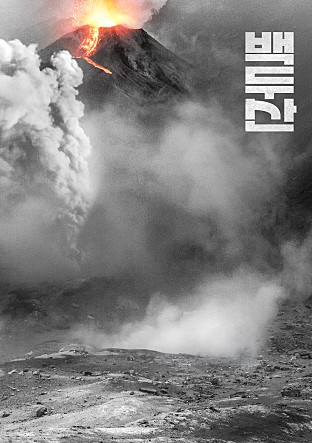

                                                                                                                            

                                                                                                                                                                                                                                                                           백규

2019년 마지막 일요일. 극장을 찾았다. 영화예술인들의 상상력을 통해 오래 전부터 갖고 있던 내 우려의 무게를 확인하고 싶어서였다. 근자 영화 ‘백두산’[감독 이해준]의 계속되는 인기는 어쩌면 나처럼 한국인들 모두가 갖고 있을지도 모르는 그런 집단적 불안의 표출 양상으로 이해해야 할 것이다.

지금까지 나는 세 번 백두산을 찾았다. 모두 중국을 통해서였다. 두 번은 연변대학에서의 학술회의에 참여했을 때, 한 번은 학교의 공식적인 답사일정으로 연변과기대학을 방문했을 때였다. 갈 때마다 날씨가 좋아 백두산의 산세와 천지의 물빛을 생생하게 느낄 수 있었다. 그러나 실제로 나를 소름끼치게 한 것은 백두산 어귀에서 만난 뜨거운 물과 흙 속의 ‘이글거리는 불’이었다. 흡사 장작불에 얇은 흙으로 만든 겉옷을 입혀 놓아 당장이라도 터져 나오려는 듯, 그 불은 살아 있었다. 내 인문학적 상상력의 측면에서는 그 불덩이가 이글거리는 눈초리로 나를 째려보고 있었다고 말하는 것이 정확하리라. 기분 나쁘게 굴면 표토(表土)를 부수고 뛰쳐나가겠다는 무시무시한 협박이었다. 백두산을 대충 훑어보고 돌아서는데, 오금이 마구 저려왔다. 그 사정권에서 빨리 벗어나고 싶다는 불안감이 내면을 어지럽혔다. 첫 번째 방문에서 갖게 된 불안감은 두 번, 세 번을 거치면서 증폭되었다. 그로부터 몇 년이 지나자 언론매체들은 ‘백두산 화산 활동 가능성’의 문제들을 거론하기 시작하였다. 전공학자들의 연구가 소개되고, 그들이 직접 매체에 나와 설명을 하는 경우도 있었다. 세계 각처에서 화산 활동 재개의 소식이 보도될 때마다 백두산 화산 관련 내용이 언급되곤 하였다. 백두산이 불을 내뿜으면 중국의 동북삼성 지역과 핵을 갖고 미쳐 날뛰는 북한은 망할 것이고, 남한도 피해가 막심할 것이라는 것이 공통된 내용이었다.

포스터에 암시된 바와 같이 결국 ‘백두산’의 중심서사는 핵무기를 매개로 ‘남한-북한-미국’이 삼각 축으로 연결된 그것이었다. 여기에 문제의 해결사로 사지(死地)에 파견되는 남쪽의 조인창[하정우 분]과 수용소에 갇혀있던 북측의 이중첩자 리준평[이병헌 분]이 벌이는 극단적 갈등과 화해, 7번 갱도에 핵을 터뜨려 마그마를 분출시킴으로써 마지막 대폭발을 막아야 한다고 주장하여 사건의 단초를 마련한 강봉래[마동석 분]의 열연 등이 그 서사의 줄기를 이루고 있었으며, 조인창과 그의 임신한 부인 사이에 일어나는 이별과 만남, 헤어지고 나서 어렵사리 만난 어린 딸을 조인창에게 부탁한 뒤 장렬하게 폭사하는 리준평 등 휴먼 드라마의 양념들이 겉절이에 고춧가루 뿌려 버무려진 상태인 듯 풋풋한 풍미를 발하고 있었다.

영화를 잘 아는 동료교수 한 사람은 ‘몇몇 배우들의 명품 연기를 빼면 영화의 서사 자체가 졸렬하기 짝이 없는 수준’이라고 혹평을 했지만, 나로서는 그렇게만 볼 수 없었다. 백두산이 폭발함으로써 북한이 초토화되었다는 점은 무엇을 상징하는가. 백두산으로 상징되는 북한 수뇌부의 존립근거[이른바 ‘백두혈통’]가 저절로 파괴되는 역사의 순리를 이 영화는 암시하고 있으며, ‘남한에 대한 최후의 공격수단이자 방어수단으로 생각해오던 핵폭탄을 남한의 군인이 탈취하고 북한의 군인이 비장하게 죽어가며 폭파시킴으로써 한반도를 구한다’는 설정이야말로 한반도의 미래에 대한 영화적 상상력의 압권 아닌가. 비록 군데군데 어설픈 점들이 없지는 않지만, 이 정도면 백두산의 폭발 가능성에 대한 국민들의 불안을 잘 대변했다 할 수 있으며, 무엇보다 백두산 폭발과 함께 꺾이어 나뒹구는 김씨 부자의 동상이 암시하는 통일한국의 비전을 슬쩍 보여줌으로써 한국인 모두에게 카타르시스를 선물한 점도 간과할 수 없으리라.

영화가 단순한 ‘오락예술’일 수 없음은 그것이  인간 행위의 현실적 표본 역할을 수행할 수도 있기 때문이다. 그런 점에서 우리는 영화 ‘백두산’을 곰곰 되씹어 보며 작품 속에 숨겨 놓은 다양한 코드들을 세심하게 찾아내야 할 것이다. 좋은 영화를 만든 감독과 배우들에게 갈채를 보낸다.

공유하기

게시글 관리

**백규서옥\_Blog ver.**