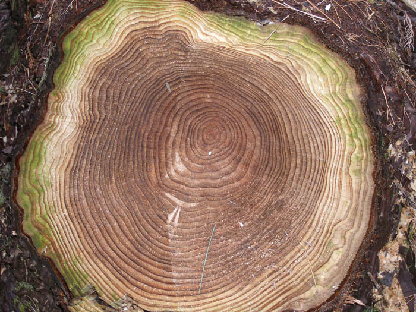
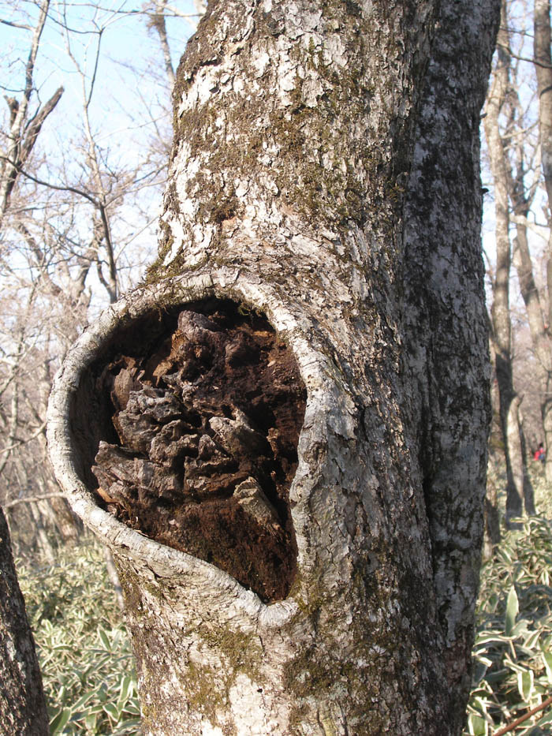

|  |  |
| --- | --- |
| |  | | --- | | ‘나이를 먹는다는 것’의 의미  이번 설날엔 두어 가지 일로 제주에 오게 되었고, 한라산엘 올랐다. 비교적 평탄한 성판악 코스를 산책하듯 오르며 많은 생각을 하게 되었다. 고도에 따라 달라지는 수목대(樹木帶). 그 사이에서 내 눈을 끈 것은 이미 죽었거나 죽어가는 나무들이었다. 삶의 윤기를 잃어버린 채 나신(裸身)으로 서 있는 것들, 줄기에 큰 구멍이 뚫려 껍데기만 간신히 유지하고 있는 것들, 뿌리와 연결된 밑동이 부러져 가로 누운 것들, 다 썩어 문드러져 몽당연필처럼 외로이 서 있는 것들, 중동이 꺾여 옆의 생생한 나무에 기대고 죽은 것들...무수한 나무의 시신들이 그렇게 넉넉한 산을 그득 채우고 있었다. 물론 간간이 나이를 많이 먹은 것 같으면서도 당당한 자태로 서 있는 나무들도 있었다. 그러나 그것들도 이미 밑동부터 중간까지는 ‘주검의 빛’이 이미 침투해 있음을 알 수 있었다. 그냥 삶에 대한 강한 집념과 오기로 버틴다는 인상을 줄 뿐이었다. 버썩 마른 겨울이기 때문일까? 산은 온통 나무들의 시신들로 채워진 것 같고, 간간이 진녹색의 침엽수들이 그 사이에서 외로워 보일 지경이었다. 그런데 죽어가거나 죽은 나무들은 그런 녹색의 젊음이 사랑스러운 듯 그를 옹위하고 서 있거나 벌렁 누워 있기도 했다. 어떤 나무는 슬그머니 젊은 그에게 기대어 있기도 했다. 그런데 갖가지 자태의 노사목(老死木)들은 그들이 그런 상태로 될 수밖에 없었던 사연들을 ‘몸으로’ 말하고 있었다. 오늘 내가 오를 수 있었던 곳까지 7km의 거리를 왕복하면서 그들이 들려주는 ‘추억의 서사시’를 실컷 들을 수 있어서 감동적이었다. ‘핑계 없는 무덤 없다’는 속담이 있다. 나무들의 세계도 그러함을 비로소 깨닫게 되었다. 왜 그런 모습으로 누워 있느냐고 물어볼 필요도 없었다. 그들은 자진하여 그들이 겪은 삶의 신산(辛酸)함을 제게 토로하는 것이었다. 갖가지 사연들이 너무도 진솔하고 서러워 눈물이 나올 지경이었다. 그러나 결론은 한 가지. ‘내 곁에 있는 저 녹색의 젊음을 보시오. 나는 저 친구가 저리도 당당한 모습으로 내 꿈을 나대신 실현시켜 주는 것이 너무도 좋소. 그러니 내가 죽어 저 젊은 친구의 거름이 되는 거야 영광 아니겠소?’ 라고들 말하는 게 아닌가? 그래서 그간 한라산을 여러 차례 오르면서도 만나지 못한 감동을 드디어 올해 설날 만나게 된 것이었다.            \*\*\*          참으로 이상한 것은 올해 따라 유난히 이미 죽었거나 죽어가고 있는 나무들의 모습이 내 가슴에 와 닿는다는 사실이다. 그것들이 푸름의 천지인 산 속에서 참으로 절묘한 위치를 차지하고 있음을 깨닫게 된 것이다. 이제 나도 그런 이치를 이해할 만큼 나이가 들었다는 증거이리라.  오늘 내가 만난 노사목들의 공통점은 욕심이 없다는 사실이었다. 세상을 살면서 터득한 진실(사실은 진리이겠지요)이라면 ‘나이 들면서 욕심을 버려야 한다’는 것이다. 몇 해 전인가? 어느 정치가가 ‘마음을 비웠다’는 말을 우리에게 던진 적이 있다. 그가 진정으로 마음을 비웠는지는 알 수 없지만, 그 말이야말로 속이 텅 빈 채 죽어있는 노사목들이 내게 들려준 삶의 서사시, 그 핵심적 주제였다. 탐욕에 가까운 욕심을 부리다가 추한 모습으로 스러져가는 주변의 선배들이 ‘몸으로 보여주는’ 역설의 가르침 역시 ‘마음을 비워야 한다’는 것이다.  그렇다면 어떻게 해야 마음을 비울 수 있을까? 법정스님의 말씀대로 ‘무소유(無所有)’의 단순명료한 철리(哲理)를 깨치는 것도 그 한 방법일 것이다. 살아오는 동안 생겨난 재물, 지위, 명예 등이 모두 우리 자신을 부자유스럽게 만드는 것이니 그것들을 소유하지 않음으로써 자유로워지자는 것 아닐까? 그러나 나 같은 필부필부들이야 목숨이 붙어있는 한 거추장스런 육신을 건사하기 위해서라도 그런 것들로부터 아주 떠날 순 없을 것이다. 그래서 우리가 할 수 있는 것은 ‘베푸는 일과 물러서는 일’ 정도이리라. 후배들을 위해 기꺼이 지갑을 여는 일, 후배들의 말을 들어줄 뿐 가급적 입을 열지 않는 일, 알량한 이해관계를 놓고 후배들과 다투지 않는 일, 노후를 대비하여 꼼수를 부리지 않는 일, 후배들을 믿고 모든 걸 맡기며 넌지시 도와주는 일 등등. 회갑이 되어서도, 칠순 팔순이 되어서도 세속적 욕망의 속박으로부터 자유롭지 못하다면 그보다 더 불쌍한 경우가 또 있을까?             \*\*\*  나는 언젠가 ‘나무처럼 살고 싶다’는 글을 쓴 적이 있다. 그 때는 나무들의 푸르름만 눈에 들어왔었다. ‘거침없는 힘’과 무지갯빛 희망에 들썩이던 시절이었다. 그러나 이제 노사목들이 비로소 눈에 들어오기 시작한 것이다. 더 이상 추해지지 않기 위해 ‘마음을 비우는’ 연습에 돌입할 때가 된 것이다. ‘더 이상 망설이며 시간을 끌지 말라’는 한라산 노사목들의 다그침이 이 깊은 밤 아직도 내 귓가를 맴돌고 있다.   정해년 정월 초하룻날 밤  제주 애월읍 바닷가에서 | |

|  |
| --- |
|  |

공유하기

게시글 관리

**백규서옥\_Blog ver.**