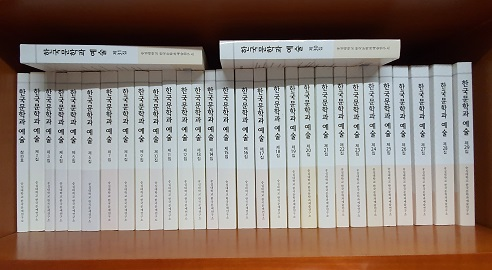

[한국문학과예술32집(추모호) 해당부분 발췌.pdf

0.65MB](https://blog.kakaocdn.net/dna/btMNgH/btqBikXXGiN/AAAAAAAAAAAAAAAAAAAAAO1N1jv_xxRahgSwL39l-d0SgQ2AgCAATBOKs_LhSb_P/%ED%95%9C%EA%B5%AD%EB%AC%B8%ED%95%99%EA%B3%BC%EC%98%88%EC%88%A032%EC%A7%91(%EC%B6%94%EB%AA%A8%ED%98%B8)%20%ED%95%B4%EB%8B%B9%EB%B6%80%EB%B6%84%20%EB%B0%9C%EC%B7%8C.pdf?credential=yqXZFxpELC7KVnFOS48ylbz2pIh7yKj8&expires=1769871599&allow_ip=&allow_referer=&signature=%2Bm0AYRDRcKMoMgl3MA3FvT1fnbA%3D&attach=1&knm=tfile.pdf)

<<한국문학과 예술>> 1집~31집

벌써 새해의 첫 달도 반이 넘게 지났습니다.

그간 건강들 하셨는지요?

바로 어제 <<한국문학과 예술>> 32집이 발간되었다는 보고의 말씀과 함께 논문집 파일을 이메일로 보내 드렸는데, 받으셨는지 모르겠습니다. 특히 이번 32집은 조촐하게나마 숭실대학교 국어국문학과 명예교수로서 한국문학과예술연구소 고문을 맡고 계시던 고 소재영 선생님의 추모호로 만들었습니다. 고 소재영 선생님의 학덕이야 여러분께서 더 잘 아시겠지만, 저희는 아직도 선생님께서 불의에 떠나신 일이 사실 같지 않습니다. 거듭 여러분과 함께 고 소재영 선생님의 명복을 빌어드립니다. 소재영 선생님께서는 1998년 정년을 하신 이후에도 계속 저를 성원해 주시다가 2006년 연구소가 설립되면서 고문의 역할까지 맡아 주셨습니다. 틈틈이 학술발표회에서 논문도 발표해주시고 어려움이 생길 경우 지혜도 주시는 등 늘 제 뒤에서 도와 주셨습니다.

비록 사무실 한 칸 없는 우리 연구소이지만, 다른 어느 연구소 못지않은 활동들을 펼쳐 왔습니다. 1년에 네 차례 전국 규모의 학술회의를 열어왔고, 1년에 네 번 학술지[<<한국문학과 예술>>]를 발간해 왔습니다. 그리고 틈틈이 소규모 발표∙토론회와 강독 모임 등도 가져 왔습니다. 지금까지 발간한 60여권이 넘는 학술총서∙자료총서∙문예총서 등은 우리 연구소가 기여한 업적들 가운데 가장 빛나는 부분이라 할 것입니다. 이번에 32집으로 발간한 학술지는 몇 해 전 한국연구재단으로부터 ‘등재지’로 지정되었고, 작년에는 우수한 점수로 ‘등재 자격 유지’의 판정을 받은 바도 있습니다. 학술지를 만드는 일, 만든 학술지를 한국연구재단의 등재지로 승격시키는 일 등이 요즘 학회들이나 연구소들의 최대 난제라는 점은 모두 아시리라 생각합니다. 하나의 학술지가 등재지로 되기 위해서는 ‘일반학술지’로 출발하여 ‘등재후보’의 단계를 거쳐야 하는데, 모두 쉽지 않은 과정들입니다. 학술지를 내는 데 가장 어려운 일은 ‘자격을 갖춘’ 논문들의 조달(調達)입니다. 연구자들의 입장에서 힘들게 쓴 논문을 점수 한 점 받지 못하는 일반학술지에 투고할 이유는 전혀 없습니다. 이젠 등재후보 학술지조차 인정해 주지 않는 학교나 기관들도 많아졌습니다. 등재학술지와 국제학술지에 실린 논문만 인정해주는 것이 새로운 추세로 바뀌면서 등재학술지까지 가는 길은 더욱 험난해진 것입니다. 지인들로부터 서운하다는 불평을 적지 않게 듣는 등 어려움도 많았습니다만, 우리 연구소가 비교적 ‘깐깐하게’ 투고논문들의 질을 관리해 온 덕에 ‘등재 학술지’로서의 권위를 확보할 수 있었다고 봅니다. 머지 않아 국제학술지로 도약해야 하는 큰 과제를 안고 있긴 합니다만. 지금까지 걸어 온 노선을 이탈하지 않고 미래 지향적 비전을 놓아버리지만 않는다면, 언젠간 그 과제도 달성할 수 있지 않을까 생각하고 있습니다.

‘인문학 분야의 좋은 연구소 하나 만들어 놓고 떠나는 것’이 제 꿈들 가운데 하나였습니다. 그러나 만들기는 쉬워도, 그것을 정상(正常) 궤도에 올리는 일은 결코 쉽지 않다는 점을 지난 몇 년 사이에 절감하게 되었습니다. 문제의 핵심은 돈과 주변의 관심입니다. 제 느낌으로 ‘대학 부설 연구소란 있으면 좋고, 없어도 그만’인 것이 오늘날 대학 운영자들의 인식인 듯합니다. 연구소가 대학 발전을 견인하는 선진국 대학들의 사례는 우리가 반드시 배워야 할 점입니다. 우리나라의 앞서가는 몇 대학들도 연구소를 훌륭하게 키워 왔고, 그것들이 대학이나 학문 발전의 동력으로 자리 잡았다는 점을 후발 대학들은 반드시 유념해야 하리라 봅니다.

\*\*\*

이번에도 우리 연구소 학술지에는 기라성 같은 학자들의 좋은 논문들이 실렸습니다. 그 제목들은 다음과 같습니다.

**특집논문: 고전문예의 본질과 미학**

1. 김동건, 「감동의 전통적 이해를 위한 서설」

2. 강기화, 「『중용』의 치중화 사상을 통해 본 동래학춤 비약태의 생명미」

3. 유순영, 「사군자화훼수목병풍을 통해 본 석정 이정직의 회화」

4. 이상욱, 「K-pop을 활용한 외국인 유학생 전용 고전문학 전공 수업사례 연구-황진이 시조 <동짓달 기나긴 밤을>을 중심으로」

**일반논문**

5. Jin, Yongzhen, 「朝鮮時期登科試券及科文硏究動態考述」

6. 김성훈, 「최현 문학 연구의 현황과 전망」

7. 김지현, 「최현의 『조천일록』 속 유산기(遊山記) 연구」

8. 윤세형, 「17세기 초 최현의 사행기록으로 본 요동 정세」

9. 이은선, 「한-베 수교 이후 한국 소설에 나타난 베트남 심상지리와 전쟁-관광 연구」

10. 주춘홍, 「한국 전쟁기에 중국어로 번역된 이기영의 작품 연구」

11. 엄경희, 「백석ㆍ이용악 시에 나타난 노스탤지어의 양상과 ‘고향’의 헤테로토피아」

**서평**

1. 박은미, 「백석(白石)으로 읽는 백석(白石)」

2. 김지현, 「사치로 바라본 명말 사대부의 문화사」

**자료해제**

1. 정영문, 「하회지역 여성들의 놀이현장을 기록한 <화류가>」

앞으로도 우리 연구소와 학술지에 많은 조언과 격려 보내 주시고, 좋은 논문들 많이 투고해 주시면 고맙겠습니다.

2020. 1. 18.

한국문학과예술연구소 소장 조규익 드림

공유하기

게시글 관리

**백규서옥\_Blog ver.**