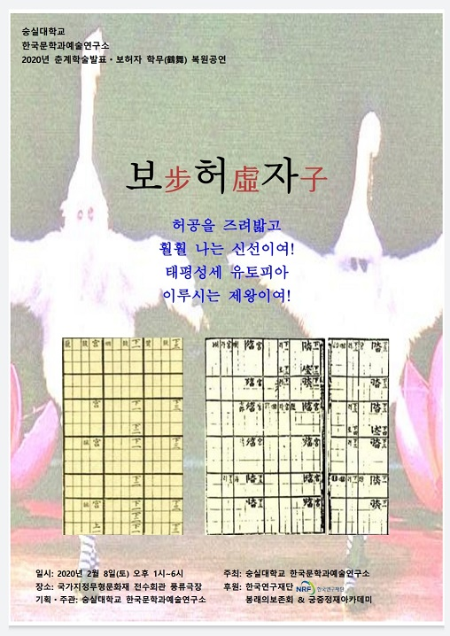

<모시는 글>

## 신선의 음악과 춤, 노래 속에 멋진 ‘시간여행’을...

                                                                                    조규익(한국문학과예술연구소 소장)

 

언제부턴가 우리에게는 별난 꿈이 있었습니다.

예술인들과 학인들이 가슴 가득 담고 있었으되 펼쳐 보이지 못한, 작지만 울림이 큰 꿈입니다. 악사들의 반주로 가공(歌工)과 무용수가 하나로 어우러지는 무대. 그 무대 주변에 둘러앉은 학인들이 예인(藝人)들의 몸놀림과 또 다른 하나가 되는 경험을 통해 비로소 이지(理智)의 샘을 열고 도란도란 그들의 미학을 담론하는 자리. 세상 어디에 그보다 더 아름답고 성대한 공간이 있을까요. 지금까지 우리는 두 번의 멋진 무대를 만들었고, 이것들을 두 권의 책으로 엮어 낸 바 있습니다.

<지난 무대들>

“봉래의(鳳來儀): 세종의 꿈, 봉황의 춤사위 타고 하늘로 오르다!”[2013. 11. 21./국립국악원 우면당]

“동동(動動): 시간이 흘러도 변함없는 사랑의 염원이여!”[2018. 12. 1/국가지정문화재 전수회관 풍류극장]

<새 무대>

“보허자(步虛子): 허공을 즈려밟고 훨훨 나는 신선이여! 태평성세 유토피아 이루시는 제왕이여!”[2020. 2. 8./국가지정문화재 전수회관 풍류극장]

우리는 그동안 가꾸어 온 ‘꿈의 무대’를 이렇게 펼쳐 보여 왔고, 이번에도 그렇게 하고자 합니다. 여러분이 앉으실 폭신한 좌석은 여러분을 모시고 그 옛날 고려∙조선시대의 궁중으로 날아갈 타임머신입니다. 좌석에 앉아 음악에 따라 춤을 추고 노래를 부르며 임금의 장수를 축원한 보허(步虛)의 예술에 잠시 마음의 주파수를 맞추시면, 여러분은 그 옛날 진사왕(陳思王) 조식(曹植)이 어산(魚山)의 동아(東阿)에서 만난 ‘신선 예술’의 경지를 경험하시게 될 것입니다. 맑고 심원하며 굳세고 밝은 그 소리와 춤사위를 통해 허공을 날아다니는 신선들을 만나시게 될 것입니다. 그들과의 그런 짧은 만남을 뒤로하고 되돌아온 현실의 공간에서 우리는 다시 씩씩하고 치밀한 논조로 새롭고 아름다운 경험들을 담론하게 될 것입니다.

원래 보허성(步虛聲)이나 보허자(步虛子)는 중국에서 발생한 도교음악이었고, 그 음악에 맞추어 춤을 추며 보허사(步虛詞)를 불렀습니다. 그러나 우리는 그것을 유교적 패러다임으로 변용했고, 중세적 보편성의 바탕으로 녹여내는 지혜를 발휘할 수 있었습니다. 옛날 사람들은 임금이 앉아있는 궁중을 현실 속에 자리 잡은 ‘선계(仙界)’라 여겼습니다. ‘상선(上仙)’인 임금의 불로장생은 당위(當爲)에 속하는 일이었지만, ‘보허 예술’에 담아낸 만백성의 염원으로 그것은 더욱 확실해질 수 있다고 믿었던 것입니다.

이 자리에 모시는 여러분이 바로 임금님들이십니다. 우리 예술의 헌상 대상이 바로 임금이신 여러분들입니다. 여러 가지로 바쁘시겠지만, 잠시 이곳에 오셔서 저희와 함께 멋진 ‘시간여행자’가 되어보실 생각은 없으신지요?

            2020. 02. 08.

공유하기

게시글 관리

**백규서옥\_Blog ver.**